# roa-libraries

## Table of Contents
- [Automation Testing Libraries - Module Index](#automation-testing-libraries---module-index)
- [Modules Overview](#modules-overview)
- [Real Usage Examples](#real-usage-examples)
- [Core Architecture & Execution Flows](#core-architecture--execution-flows)
  - [API Request Execution](#api-request-execution)
  - [Database Query Execution](#database-query-execution)
  - [UI Component Interaction](#ui-component-interaction)
  - [Quest Orchestration](#quest-orchestration)
  - [Shared Assertion Validation Engine](#shared-assertion-validation-engine)
- [Author](#author)

## Automation Testing Libraries - Module Index

> Jump straight to a module:
- [API Interactor](./api-interactor/README.md)
- [API Interactor Test Framework Adapter](./api-interactor-test-framework-adapter/README.md)
- [DB Interactor](./db-interactor/README.md)
- [DB Interactor Test Framework Adapter](./db-interactor-test-framework-adapter/README.md)
- [UI Interactor](./ui-interactor/README.md)
- [UI Interactor Test Framework Adapter](./ui-interactor-test-framework-adapter/README.md)
- [Assertions](./assertions/README.md)
- [Test Framework](./test-framework/README.md)
- [ROA Parent POM](./roa-parent/README.md)    

---

## Modules Overview

| Module | Description | Docs |
|---|---|---|
| **api-interactor** | Foundation for **declarative REST API testing** on Java 17. Model endpoints as code (`Endpoint<T>`), compose requests immutably (`ParametrizedEndpoint`), execute via pluggable `RestClient`, orchestrate with `RestService`, validate with `RestResponseValidator`. | [README](./api-interactor/README.md) |
| **api-interactor-test-framework-adapter** | Fluent adapter layer that integrates **api-interactor** with your higher-level test DSL, providing expressive `request` / `requestAndValidate` chains. | [README](./api-interactor-test-framework-adapter/README.md) |
| **db-interactor** | Database interaction/testing toolkit (schemas, connections, query builders, validation helpers) designed to parallel the API interactor’s style. | [README](./db-interactor/README.md) |
| **db-interactor-test-framework-adapter** | Adapter that wires **db-interactor** into the fluent test framework for readable database test flows. | [README](./db-interactor-test-framework-adapter/README.md) |
| **ui-interactor** | Web UI automation layer (page/element abstractions, actions, waits) meant to be framework-agnostic and composable, analogous to the API/DB interactors. | [README](./ui-interactor/README.md) |
| **ui-interactor-test-framework-adapter** | Fluent adapter for **ui-interactor**, exposing high-level UI actions/assertions in the same DSL used across modules. | [README](./ui-interactor-test-framework-adapter/README.md) |
| **assertions** | Core **assertion/validation** library (assertion types, targets, builders, result model) used by API/DB/UI interactors. | [README](./assertions/README.md) |
| **test-framework** | Test orchestration primitives (runners, lifecycles, DSL entry points) that the adapters plug into to provide fluent scenarios. | [README](./test-framework/README.md) |
| **roa-parent** | Maven parent POM providing centralized dependency management, plugin configuration, and default properties for all ROA-based testing frameworks. | [README](./roa-parent/README.md) |

---

## Real Usage Examples

Looking for a complete, end-to-end reference that shows how these modules work together in real tests (API, DB, and UI), including project setup, dependency wiring, and fluent test flows?

Explore runnable example projects that exercise the libraries: [ROA Example Projects](https://github.com/CyborgCodeSyndicate/roa-example-projects/blob/main/README.md)

---
    
## Core Architecture & Execution Flows

### API Request Execution

### Database Query Execution

### UI Component Interaction

### Quest Orchestration

```mermaid
sequenceDiagram
  autonumber
  participant J as JUnit 5
  participant Q as Quest
  participant R as FluentService Ring

  J->>Q: inject Quest (ring registry)
  Q->>Q: use(RingClass) → resolve ring
  Q-->>R: FluentService instance
  R->>R: chain operations (login, request, validate, ...)
  Q->>Q: complete() → finalize, clear state, run soft assertions
```

### Shared Assertion Validation Engine

## Author
**Cyborg Code Syndicate 💍👨💻**