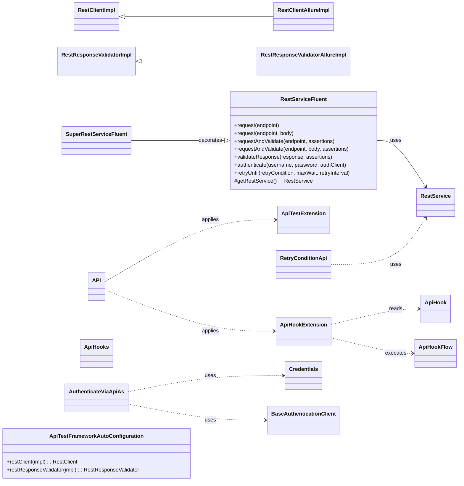
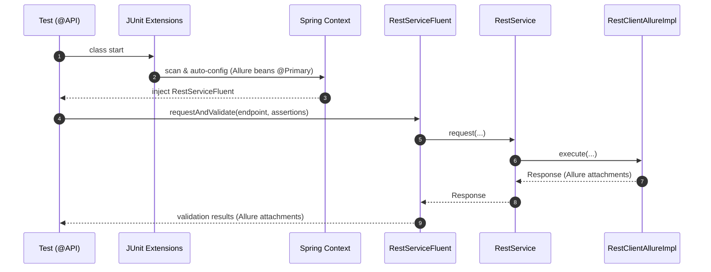

# api-interactor-test-framework-adapter

<!-- Quick jump -->
**Start here:** [Usage — Quick Start (step-by-step)](#usage)

## Table of Contents
- [Overview](#overview)
- [Features](#features)
- [Structure](#structure)
- [Architecture](#architecture)
    - [Class Diagram](#class-diagram)
    - [Execution Flow](#execution-flow)
      - [Adapter Runtime Flow](#adapter-runtime-flow)
      - [Test Bootstrap & JUnit Integration](#test-bootstrap--junit-integration)
      - [Fluent Request & Storage](#fluent-request--storage)
      - [Allure Reporting Integration](#allure-reporting-integration)
      - [Authentication Handling](#authentication-handling)
      - [Hook Processing (BEFORE/AFTER)](#hook-processing-beforeafter)
      - [Retry for Eventual Consistency](#retry-for-eventual-consistency)
- [Usage](#usage)
    - [Step 1 — Add dependency](#step-1--add-dependency)
    - [Step 2 — Configure environment](#step-2--configure-environment)
    - [Step 3 — Enable adapter](#step-3--enable-the-adapter-on-tests)
    - [Step 4 — Call the fluent API](#step-4--call-the-fluent-api)
    - [Step 5 — (Optional) Authenticate a method](#step-5--optional-authenticate-a-method)
    - [Step 6 — (Optional) Retry until a condition](#step-6--optional-retry-until-a-condition)
- [Annotations & Hooks](#annotations--hooks)
- [Retry Helpers](#retry-helpers)
- [Allure Reporting](#allure-reporting)
- [Adapter Configuration](#adapter-configuration)
- [Dependencies](#dependencies)
- [Author](#author)

---

## Overview
The **api-interactor-test-framework-adapter** layers **test-facing ergonomics** on top of `api-interactor`. It provides a fluent API (`RestServiceFluent`) for chaining `request`, `request(body)`, `requestAndValidate`, `validateResponse`, `authenticate`, and `retryUntil`. It also ships **JUnit 5 enablement** via the `@API` annotation and extensions, **Allure bridges** that attach detailed request/response and validation data (`RestClientAllureImpl`, `RestResponseValidatorAllureImpl`), **hook** processing (`@ApiHook`, `ApiHookExtension`), **retry** utilities (`RetryConditionApi`), and light **storage** helpers. Spring **auto-configuration** wires the Allure-enabled beans so API tests become **declarative, observable, and resilient**.

### Module metadata
- **name:** Ring of Automation Api Test Framework
- **artifactId:** api-interactor-test-framework-adapter
- **direct dependencies:**
  - io.cyborgcode.roa:test-framework
  - io.cyborgcode.roa:api-interactor

## Features
- **Fluent chaining:** `RestServiceFluent` → `request`, `request(body)`, `requestAndValidate`, `validateResponse`, `authenticate`, `retryUntil`; `SuperRestServiceFluent` for decorator/extension use-cases.
- **Allure integration:**
    - `RestClientAllureImpl` (extends `RestClientImpl`) — attaches method, URL, query params, headers, body, status, response time.
    - `RestResponseValidatorAllureImpl` (extends `RestResponseValidatorImpl`) — attaches validation targets and extracted data.
- **JUnit 5 bootstrap:** `@API` applies `ApiTestExtension` and `ApiHookExtension`; scans `io.cyborgcode.roa.api`.
- **Authentication annotation:** `@AuthenticateViaApi(credentials, type, cacheCredentials)` + `Credentials` interface.
- **Hooks:** `@ApiHook` / `@ApiHooks` + `ApiHookFlow` executed **BEFORE/AFTER** test class.
- **Retry helpers:** `RetryConditionApi` (status equals, JSON field equals/non-null) to combine with `retryUntil(...)`.
- **Spring auto-config:** `ApiTestFrameworkAutoConfiguration` marks Allure implementations as `@Primary` beans.

## Structure
- `allure` — `RestClientAllureImpl`, `RestResponseValidatorAllureImpl`
- `annotations` — `API`, `ApiHook`, `ApiHooks`, `AuthenticateViaApiAs`
- `authentication` — `Credentials`
- `config` — `ApiTestFrameworkAutoConfiguration`
- `extensions` — `ApiHookExtension`, `ApiTestExtension`
- `hooks` — `ApiHookFlow`
- `retry` — `RetryConditionApi`
- `service.fluent` — `RestServiceFluent`, `SuperRestServiceFluent`
- `storage` — `DataExtractorsApi`, `StorageKeysApi`

## Architecture

### Class Diagram


### Execution Flow
#### Adapter Runtime Flow


#### Test Bootstrap & JUnit Integration
- **@API annotation** registers JUnit 5 extensions: `ApiTestExtension`, `ApiHookExtension`.
- **ApiTestFrameworkAutoConfiguration** marks Allure beans as `@Primary` and scans `io.cyborgcode.roa.api`.
- **ApiTestExtension.beforeTestExecution()** detects `@AuthenticateViaApi` on a test method and triggers authentication handling.

#### Fluent Request & Storage
- **RestServiceFluent.request(endpoint):** delegates to `RestService.request`, stores `Response` in quest storage under `StorageKeysApi.API` keyed by `endpoint.enumImpl()`.
- **requestAndValidate(endpoint, assertions):** executes request and validates in one chain.
- **validateResponse(response, assertions):** delegates to `RestService.validate` and feeds results to the fluent validation handler.

#### Allure Reporting Integration
- **RestClientAllureImpl:**
  - Intercepts `printRequest/printResponse` to create Allure steps.
  - Attaches method, URL, query params, headers, request/response body, status, and response time.
- **RestResponseValidatorAllureImpl:** attaches the validation target data map for traceability.

#### Authentication Handling
- **@AuthenticateViaApi(credentials, type, cacheCredentials):**
  - `ApiTestExtension` instantiates provided `Credentials`.
  - Stores `USERNAME`/`PASSWORD` in quest storage and decorates `RestServiceFluent`.
  - Calls `restService.authenticate(...)` with an implementation of `BaseAuthenticationClient`.

#### Hook Processing (BEFORE/AFTER)
- **@ApiHook / @ApiHooks** on a test class declare setup/cleanup flows.
- **ApiHookExtension** filters by `when`, sorts by `order`, resolves an `ApiHookFlow` implementation via reflection and executes `flow().accept(RestService, hooksStorage, args)`.
- `ApiHookExtension` lazily creates `RestService` with Allure implementations when needed.

#### Retry for Eventual Consistency
- **RetryConditionApi** provides ready-made conditions such as `statusEquals`, `responseFieldEqualsTo`, and `responseFieldNonNull` to be used with `RestServiceFluent.retryUntil(...)`.

## Usage

> Follow these steps in your **app-specific test module**. Examples avoid external DSLs; only the adapter and `api-interactor` are required.

### Step 1 — Add dependency
```xml
<dependency>
  <groupId>io.cyborgcode.roa</groupId>
  <artifactId>api-interactor-test-framework-adapter</artifactId>
  <version>${revision}</version>
  <scope>test</scope>
</dependency>
```

### Step 2 — Configure environment
This adapter does not introduce new Owner keys. 
It reuses `ApiConfig` from `api-interactor` and primarily needs your project package for reflection 
(e.g., to locate `ApiHookFlow` enums):

**Load order:** system properties + `classpath:${api.config.file}.properties`

```properties
# src/test/resources/config.properties
api.base.url=https://test/api
api.restassured.logging.enabled=true
api.restassured.logging.level=ALL
log.full.body=false
shorten.body=800
```
Run tests with:
```
-Dapi.config.file=api-config
```

### Step 3 — Enable the Adapter on Tests
Annotate your JUnit test class with `@API` to activate extensions and scanning.

```java
@API
class UsersRestTests {
  // your tests...
}
```

### Step 4 — Call the fluent API
<pre><code>
  .requestAndValidate(
          POST_CREATE_USER,
          userLeader,
          Assertion.builder().target(STATUS).type(IS).expected(SC_CREATED).build(),
          Assertion.builder().target(BODY).key(CREATE_USER_NAME_RESPONSE.getJsonPath()).type(IS).expected(USER_LEADER_NAME).soft(true).build(),
          Assertion.builder().target(BODY).key(CREATE_USER_JOB_RESPONSE.getJsonPath()).type(IS).expected(USER_LEADER_JOB).soft(true).build()
  );
}
</code></pre>

### Step 5 — (Optional) Authenticate a method
```java
@AuthenticateViaApiAs(
  credentials = MyCreds.class,
  type = MyAuthClient.class,
  cacheCredentials = true
)
@Test
void me_endpoint_is_authenticated() {
  api.requestAndValidate(MyEndpoints.ME);
}
```

### Step 6 — (Optional) Retry until a condition
<pre><code>
  .retryUntil(statusEquals(CREATE_PET, 200),
                  Duration.ofSeconds(5), Duration.ofSeconds(1))

        .retryUntil(responseFieldEqualsTo(CREATE_PET, "$.status", "FINISH"),
                  Duration.ofSeconds(5), Duration.ofSeconds(1))
</code></pre>

## Annotations & Hooks
- `@API` — applies JUnit 5 extensions and scans `io.cyborgcode.roa.api`.
  - `@AuthenticateViaApi(credentials, type, cacheCredentials)` — authenticates via your `BaseAuthenticationClient` using a `Credentials` provider.
  - `@ApiHook(type, when, arguments, order)` / `@ApiHooks` — run **BEFORE/AFTER** class hook flows; implement the `ApiHookFlow` interface to add custom flows.

## Retry Helpers
`RetryConditionApi` exposes ready-made `RetryCondition`s for polling with `RestServiceFluent.retryUntil(...)`:
- `statusEquals(endpoint, expectedStatus)` (+ overload with body)
  - `responseFieldEqualsTo(endpoint, jsonPath, expected)` (+ overload with body)
  - `responseFieldNonNull(endpoint, jsonPath)` (+ overload with body)

## Allure Reporting
- **Requests/Responses:** `RestClientAllureImpl` attaches method, URL, query params, headers, (pretty) body, status, response time.
  - **Validations:** `RestResponseValidatorAllureImpl` attaches the **data map** being validated for traceability.

## Adapter Configuration
```java
@Configuration
@ComponentScan(basePackages = "io.cyborgcode.roa.api")
public class ApiTestFrameworkAutoConfiguration {
  @Bean 
  @Primary
  RestClient restClient(RestClientAllureImpl impl) { 
      return impl; 
  }

  @Bean 
  @Primary
  RestResponseValidator restResponseValidator(RestResponseValidatorAllureImpl impl) { 
      return impl; 
  }
}
```

## Dependencies

- `io.cyborgcode:api-interactor` *(required)*
- `io.qameta.allure:allure-java-commons` *(optional – Allure attachments)*
- `io.qameta.allure:allure-junit5` *(optional – Allure + JUnit 5 bridge)*
- `org.springframework:spring-context` *(required if using Spring DI / auto-config)*
- `org.springframework:spring-test` *(tests – JUnit5 + SpringExtension)*
- `org.junit.jupiter:junit-jupiter` *(tests)*
- `org.assertj:assertj-core` *(tests – used by `SoftAssertions`)*
- `org.projectlombok:lombok` *(optional)*
- `io.restassured:rest-assured` *(usually transitive via api-interactor; add explicitly if needed)*
- `org.aeonbits.owner:owner` *(transitive via api-interactor; add explicitly if your BOM doesn’t manage it)*


## Author
**Cyborg Code Syndicate 💍👨💻**
