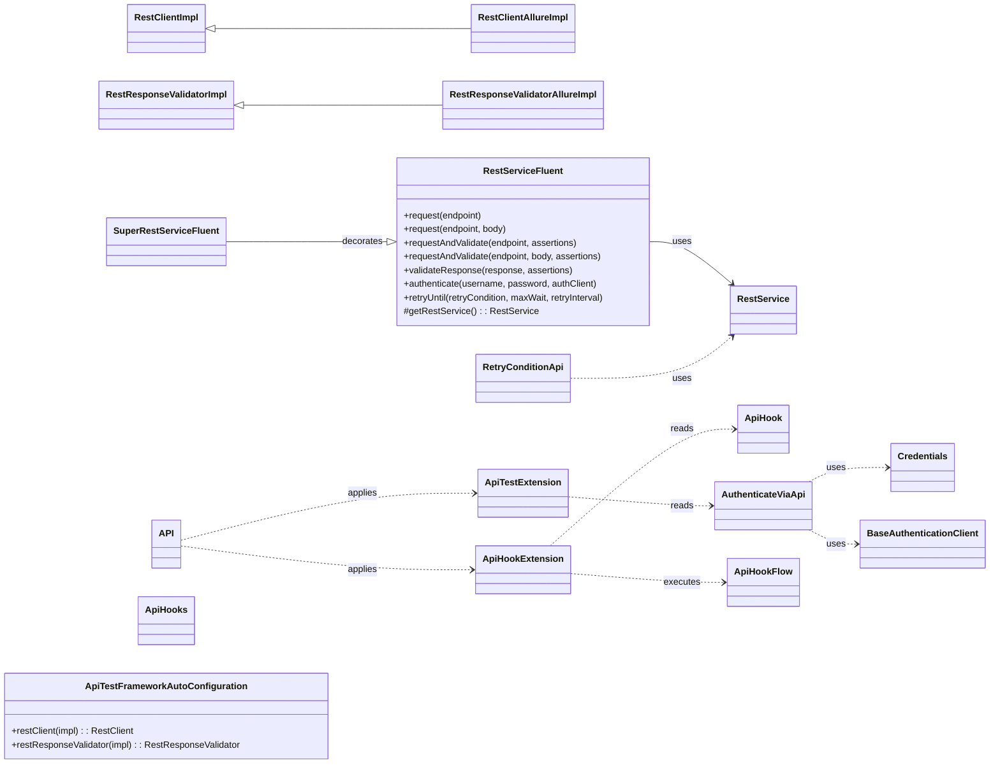
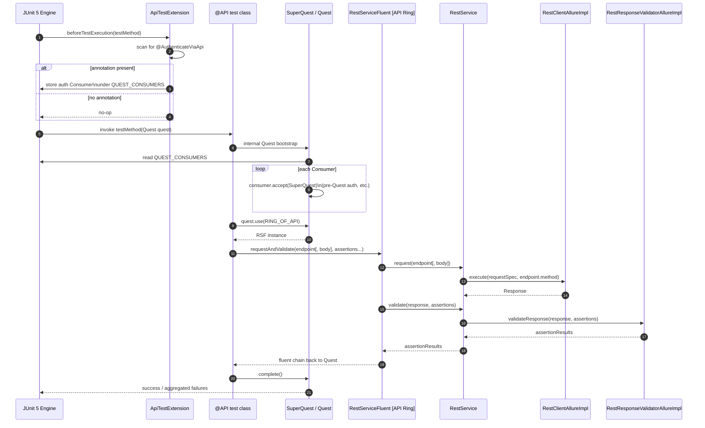
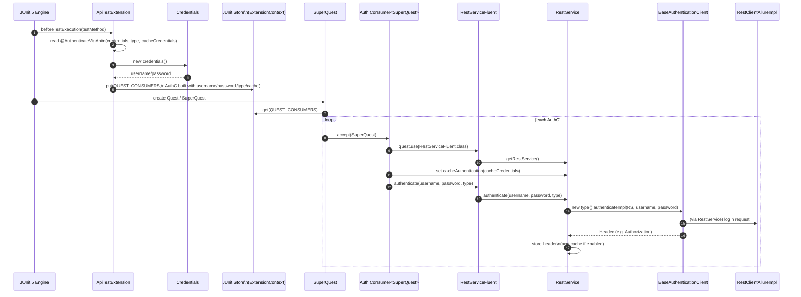

# api-interactor-test-framework-adapter

<!-- Quick jump -->
> Quick jump: if you are already familiar with ROA and just want to run the sample API tests, go to:
> [Usage](#usage).


## Table of Contents

- [Overview](#overview)
- [Module metadata](#module-metadata)
- [Features](#features)
- [Structure](#structure)
- [Architecture](#architecture)
    - [Class Diagram](#class-diagram)
    - [Execution Flow](#execution-flow)
        - [Adapter Runtime Flow](#adapter-runtime-flow)
        - [Authentication Handling](#authentication-handling)
        - [Test Bootstrap & JUnit Integration](#test-bootstrap--junit-integration)
        - [Fluent Request & Storage](#fluent-request--storage)
        - [Allure Reporting Integration](#allure-reporting-integration)
        - [Hook Processing (BEFORE/AFTER)](#hook-processing-beforeafter)
        - [Retry for Eventual Consistency](#retry-for-eventual-consistency)
- [Usage](#usage)
    - [Step 1: Add the adapter dependency](#step-1-add-the-adapter-dependency)
      - [1.1. Standard Maven dependency](#11-standard-maven-dependency)
    - [Step 2: Configure the API environment (`ApiConfig` / Owner properties)](#step-2-configure-the-api-environment-apiconfig--owner-properties)
      - [2.1. Create the `ApiConfig` properties file](#21-create-the-apiconfig-properties-file)
      - [2.2. Select the config file at runtime](#22-select-the-config-file-at-runtime)
      - [2.3. Configuration precedence](#23-configuration-precedence)
    - [Step 3: Enable the API adapter and expose the API ring (@API + RING_OF_API)](#step-3-enable-the-api-adapter-and-expose-the-api-ring-api--ring_of_api)
      - [3.1. Annotate your test class](#31-annotate-your-test-class)
      - [3.2. Define your API ring in the test module](#32-define-your-api-ring-in-the-test-module)
    - [Step 4: Perform basic API requests with `RestServiceFluent`](#step-4-perform-basic-api-requests-with-restservicefluent)
      - [4.1 Define your endpoints (typical enum-based usage)](#41-define-your-endpoints-typical-enum-based-usage)
      - [4.2 Minimal GET with status check](#42-minimal-get-with-status-check)
      - [4.3 GET with query parameters](#43-get-with-query-parameters)
      - [4.4 GET with path parameters](#44-get-with-path-parameters)
      - [4.5 POST with a request body](#45-post-with-a-request-body)
    - [Step 5: Validate API responses using the assertions module](#step-5-validate-api-responses-using-the-assertions-module)
      - [5.1. Assertion basics](#51-assertion-basics)
      - [5.2. Status + header validation](#52-status--header-validation)
      - [5.3. Body field validation with JSONPath](#53-body-field-validation-with-jsonpath)
    - [Step 6: Authenticate API tests with `@AuthenticateViaApi`](#step-6-authenticate-api-tests-with-authenticateviaapi)
      - [6.1. What `@AuthenticateViaApi` actually does](#61-what-authenticateviaapi-actually-does)
      - [6.2. Define a `Credentials` class](#62-define-a-credentials-class)
      - [6.3. Implement an authentication client (`BaseAuthenticationClient`)](#63-implement-an-authentication-client-baseauthenticationclient)
      - [6.4. Use `@AuthenticateViaApi` in tests](#64-use-authenticateviaapi-in-tests)
      - [6.5. Caching behaviour (`cacheCredentials`)](#65-caching-behaviour-cachecredentials)
    - [Step 7: Run BEFORE/AFTER API hooks with `@ApiHook`](#step-7-run-beforeafter-api-hooks-with-apihook)
      - [7.1. Define a simple hook enum](#71-define-a-simple-hook-enum)
      - [7.2. Use the hook in a test class](#72-use-the-hook-in-a-test-class)
    - [Step 8: Retry until conditions are met (`RetryConditionApi` + `retryUntil`)](#step-8-retry-until-conditions-are-met-retryconditionapi--retryuntil)
      - [8.1. Import the retry helpers](#81-import-the-retry-helpers)
      - [8.2. Basic example: wait until status code matches](#82-basic-example-wait-until-status-code-matches)
      - [8.3. Body-based example: wait until a JSON field changes](#83-body-based-example-wait-until-a-json-field-changes)
      - [8.4. Variants with request body and null checks](#84-variants-with-request-body-and-null-checks)
      - [8.5. When to use `retryUntil`](#85-when-to-use-retryuntil)
    - [Step 9: Extract and store response data with `DataExtractorsApi`](#step-9-extract-and-store-response-data-with-dataextractorsapi)
      - [9.1. Concept: `responseBodyExtraction` and `statusExtraction`](#91-concept-responsebodyextraction-and-statusextraction)
      - [9.2. Inline usage: extract a field from the last response](#92-inline-usage-extract-a-field-from-the-last-response)
      - [9.3. Using a small extractor registry (optional, but handy)](#93-using-a-small-extractor-registry-optional-but-handy)
      - [9.4. Extracting the status code with `statusExtraction`](#94-extracting-the-status-code-with-statusextraction)
    - [Step 10: Compose with ROA lifecycle annotations (`@Craft`, `@Journey`, `@Ripper`)](#step-10-compose-with-roa-lifecycle-annotations-craft-journey-ripper)
      - [10.1. `@Craft` – inject API DTOs (including “late” / dynamic data)](#101-craft--inject-api-dtos-including-late--dynamic-data)
      - [10.2. `@Journey` – reusable pre-test flows with `Preconditions` (and `journeyData` actually used)](#102-journey--reusable-pre-test-flows-with-preconditions-and-journeydata-actually-used)
      - [10.3. `@Ripper` – centralized API cleanup via `DataCleaner`](#103-ripper--centralized-api-cleanup-via-datacleaner)
- [Troubleshooting](#troubleshooting)
- [Dependencies](#dependencies)
- [Author](#author)

---

## Overview

The **api-interactor-test-framework-adapter** is the **test-facing layer** on top of `api-interactor` inside the Ring of
Automation stack.  
Where `api-interactor` focuses on **low-level HTTP orchestration** (`RestService`, `RestClient`,
`RestResponseValidator`), this module turns it into a **fluent, Quest-ready API testing experience**.

It exposes `RestServiceFluent` as a `@Ring("API")`-annotated `FluentService`, so tests interact with APIs through the
Quest DSL (e.g. `quest.use(RestServiceFluent.class)`) instead of manually wiring `RestService`. On top of that, it
provides JUnit 5 integration via the `@API` annotation and extensions, making authentication, hooks, and pre-test wiring
**declarative** instead of boilerplate.

The adapter also ships **Allure-aware implementations** (`RestClientAllureImpl`, `RestResponseValidatorAllureImpl`) that
decorate the core client and validator with rich reporting: HTTP method, URL, query params, headers, body, status,
duration, and validation targets are all attached as Allure steps and attachments. Spring auto-configuration (
`ApiTestFrameworkAutoConfiguration`) registers these Allure-enabled beans as `@Primary`, so you get enhanced
observability **without changing your test code**.

Finally, the module adds **test ergonomics utilities** around the core library:

- A fluent API for chaining `request`, `request(body)`, `requestAndValidate`, `validateResponse`, `authenticate`, and
  `retryUntil`.
- JUnit 5 extensions for **method-level authentication** (`@AuthenticateViaApi`) and **class-level hooks** (`@ApiHook`,
  `ApiHookExtension`).
- **Retry helpers** (`RetryConditionApi`) for eventual consistency scenarios.
- **Storage helpers** (`StorageKeysApi`, `DataExtractorsApi`) to move data between Quest storage and API responses.

Together, these pieces make API tests **declarative, observable, and tightly integrated** with the RoA
Quest/test-framework layer, while still relying on `api-interactor` for the core HTTP and validation engine.

### Module metadata

- **name:** Ring of Automation API Test Framework
- **artifactId:** api-interactor-test-framework-adapter
- **direct dependencies (from pom.xml):**
    - io.cyborgcode.roa:test-framework
    - io.cyborgcode.roa:api-interactor

---

## Features

- **Fluent chaining (RoA Quest-friendly):**  
  `RestServiceFluent` → `request`, `request(body)`, `requestAndValidate`, `validateResponse`, `authenticate`,
  `retryUntil`, plus `validate(Runnable)` / `validate(Consumer<SoftAssertions>)`.  
  `SuperRestServiceFluent` is used for decorator/extension use-cases (via `DecoratorsFactory`).

- **Quest & Ring integration (from `test-framework`):**  
  `RestServiceFluent` is a `@Ring("API")` `FluentService`, so in RoA tests you obtain it via the Quest DSL, e.g.
  `quest.use(RestServiceFluent.class)` or a named constant like `RING_OF_API`.

- **Allure integration:**
    - `RestClientAllureImpl` (extends `RestClientImpl`) – attaches HTTP method, URL, query params, headers, request
      body, response time, status code, response headers, and response body to Allure.
    - `RestResponseValidatorAllureImpl` (extends `RestResponseValidatorImpl`) – attaches the validation target map and
      key fields (status, headers, body) as Allure attachments.

- **JUnit 5 bootstrap:**  
  `@API` applies `ApiTestExtension` and `ApiHookExtension` and activates the RoA API adapter (via
  `@FrameworkAdapter(basePackages = "io.cyborgcode.roa.api")`).

- **Authentication annotation:**  
  `@AuthenticateViaApi(credentials, type, cacheCredentials)` + `Credentials` interface – declarative per-test method
  authentication wired into `ApiTestExtension` and `BaseAuthenticationClient`.

- **Hooks:**  
  `@ApiHook` / `@ApiHooks` + `ApiHookFlow` executed **BEFORE/AFTER** the test class via `ApiHookExtension`, with
  ordering (`order`) and shared parameters map stored under `StoreKeys.HOOKS_PARAMS`.

- **Retry helpers:**  
  `RetryConditionApi` exposes ready-made `RetryCondition`s (status equals, JSON field equals / non-null, with and
  without request body) to combine with `RestServiceFluent.retryUntil(...)` for eventual consistency scenarios.

- **Quest storage helpers:**  
  `DataExtractorsApi` + `StorageKeysApi` provide reusable `DataExtractor` implementations for storing response body
  fields and HTTP status codes into RoA Storage under the `API` namespace.

- **Spring auto-config:**  
  `ApiTestFrameworkAutoConfiguration` scans `io.cyborgcode.roa.api` and marks the Allure-enabled implementations as
  `@Primary` beans:
    - `RestClientAllureImpl` as the primary `RestClient`
    - `RestResponseValidatorAllureImpl` as the primary `RestResponseValidator`.

---

## Structure

### Key Classes

| Class                               | Responsibility                                                                                                            | Key methods / members                                                                                                                                                                                                                                                                             | Used by                                                                                                                |
|-------------------------------------|---------------------------------------------------------------------------------------------------------------------------|---------------------------------------------------------------------------------------------------------------------------------------------------------------------------------------------------------------------------------------------------------------------------------------------------|------------------------------------------------------------------------------------------------------------------------|
| `RestServiceFluent`                 | Fluent RoA **API ring** built on top of `RestService`; exposes request/validate/auth/retry in a Quest-friendly style.     | `request(endpoint)`, `request(endpoint, body)`, `requestAndValidate(endpoint, assertions)`, `requestAndValidate(endpoint, body, assertions)`, `validateResponse(...)`, `authenticate(...)`, `validate(Runnable)`, `validate(Consumer<SoftAssertions>)`, `<T> retryUntil(...)`, `getRestService()` | RoA Quest tests via `quest.use(...)`, `DecoratorsFactory` (through `SuperRestServiceFluent`), `ApiTestExtension`       |
| `SuperRestServiceFluent`            | Wrapper/decorator around `RestServiceFluent` to allow extra behaviour via `DecoratorsFactory` while keeping the same API. | `SuperRestServiceFluent(RestServiceFluent original)`, `getRestService()` (overridden), `@Delegate RestServiceFluent original`                                                                                                                                                                     | `DecoratorsFactory`, `ApiTestExtension` (for pre-quest authentication wiring)                                          |
| `RestClientAllureImpl`              | Allure-enabled `RestClientImpl` that attaches detailed request/response metadata as Allure steps and attachments.         | `printRequest(methodName, finalUrl, body, headers)` (overridden), `printResponse(methodName, finalUrl, response, duration)` (overridden), `logRequestDetails(...)`, `logResponseDetails(...)`                                                                                                     | `RestService` (via Spring `RestClient` bean), `ApiTestFrameworkAutoConfiguration`, `ApiHookExtension` (for hook flows) |
| `RestResponseValidatorAllureImpl`   | Allure-enabled `RestResponseValidatorImpl` that attaches validation targets and extracted data to Allure.                 | `printAssertionTarget(Map<String, Object> data)` (overridden)                                                                                                                                                                                                                                     | `RestService` (via Spring `RestResponseValidator` bean), `ApiTestFrameworkAutoConfiguration`                           |
| `API`                               | Top-level annotation that marks a test class as an **API test** and activates this adapter’s JUnit + framework wiring.    | Meta-annotations: `@FrameworkAdapter(basePackages = "io.cyborgcode.roa.api")`, `@ExtendWith({ApiTestExtension.class, ApiHookExtension.class})`                                                                                                                                                    | Test classes in app-specific test modules                                                                              |
| `AuthenticateViaApi`                | Method-level annotation that declares how to authenticate a test via `BaseAuthenticationClient`.                          | `Class<? extends Credentials> credentials()`, `Class<? extends BaseAuthenticationClient> type()`, `boolean cacheCredentials()`                                                                                                                                                                    | `ApiTestExtension`, test methods that require authentication                                                           |
| `ApiHook` / `ApiHooks`              | Class-level annotations defining BEFORE/AFTER hook flows for a test class.                                                | `String type()`, `HookExecution when()`, `String[] arguments()`, `int order()`, container `ApiHook[] value()`                                                                                                                                                                                     | `ApiHookExtension`, test classes declaring custom API hooks                                                            |
| `ApiHookExtension`                  | JUnit 5 extension that discovers and executes `@ApiHook` flows BEFORE/AFTER all tests in a class.                         | `beforeAll(context)`, `afterAll(context)`, `executeHook(ApiHook, Map<Object,Object>)`, `restService()`                                                                                                                                                                                            | Applied by `@API`, invoked by JUnit engine                                                                             |
| `ApiTestExtension`                  | JUnit 5 extension that processes `@AuthenticateViaApi` and wires pre-Quest authentication into RoA’s `SuperQuest`.        | `beforeTestExecution(context)`, `handleAuthentication(...)`, `createQuestConsumer(...)`, `addConsumerToStore(...)`                                                                                                                                                                                | Applied by `@API`, JUnit engine, `SuperQuest`, `DecoratorsFactory`                                                     |
| `ApiHookFlow<T extends Enum<T>>`    | Contract for hook implementations that can be resolved reflectively and executed via `ApiHookExtension`.                  | `TriConsumer<RestService, Map<Object,Object>, String[]> flow()`, `T enumImpl()`                                                                                                                                                                                                                   | App-defined enums implementing hook flows, `ApiHookExtension`                                                          |
| `RetryConditionApi`                 | Factory for **API-centric `RetryCondition`** helpers used with `RestServiceFluent.retryUntil(...)`.                       | `statusEquals(endpoint, status)`, `statusEquals(endpoint, body, status)`, `responseFieldEqualsTo(endpoint, jsonPath, obj)`, `responseFieldEqualsTo(endpoint, body, jsonPath, obj)`, `responseFieldNonNull(endpoint, jsonPath)`, `responseFieldNonNull(endpoint, body, jsonPath)`                  | Tests using eventual consistency/polling patterns with the API ring                                                    |
| `DataExtractorsApi`                 | Ready-made `DataExtractor` builders for storing API response fields and status codes into RoA Storage.                    | `<T> responseBodyExtraction(Enum<?> key, String jsonPath)`, `statusExtraction(Enum<?> key)`                                                                                                                                                                                                       | RoA quests/tests that extract response data into storage                                                               |
| `StorageKeysApi`                    | Storage keys for API-related data (namespace + username/password) inside RoA Storage.                                     | Enum constants: `API`, `USERNAME`, `PASSWORD`                                                                                                                                                                                                                                                     | `RestServiceFluent`, `DataExtractorsApi`, `ApiTestExtension`, app-specific quest code                                  |
| `ApiTestFrameworkAutoConfiguration` | Spring auto-configuration that exposes Allure-enabled beans as primary `RestClient`/`RestResponseValidator`.              | `@Bean @Primary RestClient restClient(RestClientAllureImpl)`, `@Bean @Primary RestResponseValidator restResponseValidator(RestResponseValidatorAllureImpl)`                                                                                                                                       | Spring test contexts in app test modules                                                                               |
| `Credentials`                       | Minimal contract describing username/password used for `@AuthenticateViaApi` flows.                                       | `String username()`, `String password()`                                                                                                                                                                                                                                                          | Test-side credential classes, `ApiTestExtension`                                                                       |

---

### Package: `io.cyborgcode.roa.api.allure`

| Class                             | Responsibility                                                                                                 | Key methods / members                                                                                                          | Used by                                        |
|-----------------------------------|----------------------------------------------------------------------------------------------------------------|--------------------------------------------------------------------------------------------------------------------------------|------------------------------------------------|
| `RestClientAllureImpl`            | Extends `RestClientImpl` to wrap request/response logging into Allure steps and attachments.                   | Overrides `printRequest(...)`, `printResponse(...)`; uses internal `logRequestDetails(...)`, `logResponseDetails(...)` helpers | `RestService` (via Spring), `ApiHookExtension` |
| `RestResponseValidatorAllureImpl` | Extends `RestResponseValidatorImpl` to add Allure attachments for validation targets and key expectation data. | Overrides `printAssertionTarget(Map<String,Object>)`                                                                           | `RestService` (via Spring)                     |

---

### Package: `io.cyborgcode.roa.api.annotations`

| Class                | Responsibility                                                                                             | Key members / attributes                                                                                                         | Used by                          |
|----------------------|------------------------------------------------------------------------------------------------------------|----------------------------------------------------------------------------------------------------------------------------------|----------------------------------|
| `API`                | Marks a test class as an API test, activates this adapter, and registers the JUnit extensions and adapter. | Meta-annotations: `@FrameworkAdapter(basePackages = "io.cyborgcode.roa.api")`, `@ExtendWith(ApiTestExtension, ApiHookExtension)` | Test classes in app test modules |
| `ApiHook`            | Declares a single hook flow to run BEFORE or AFTER all tests in a class.                                   | `String type()`, `HookExecution when()`, `String[] arguments()`, `int order()`                                                   | `ApiHookExtension`               |
| `ApiHooks`           | Container annotation to allow multiple `@ApiHook` on the same class.                                       | `ApiHook[] value()`                                                                                                              | Used implicitly by `@ApiHook`    |
| `AuthenticateViaApi` | Declares authentication strategy per test method (credentials provider + auth client + caching flag).      | `Class<? extends Credentials> credentials()`, `Class<? extends BaseAuthenticationClient> type()`, `boolean cacheCredentials()`   | `ApiTestExtension`               |

---

### Package: `io.cyborgcode.roa.api.authentication`

| Class         | Responsibility                                           | Key methods                | Used by                                  |
|---------------|----------------------------------------------------------|----------------------------|------------------------------------------|
| `Credentials` | Provides username/password for API authentication flows. | `username()`, `password()` | `AuthenticateViaApi`, `ApiTestExtension` |

---

### Package: `io.cyborgcode.roa.api.config`

| Class                               | Responsibility                                                                                             | Key methods / members                                                                                                       | Used by             |
|-------------------------------------|------------------------------------------------------------------------------------------------------------|-----------------------------------------------------------------------------------------------------------------------------|---------------------|
| `ApiTestFrameworkAutoConfiguration` | Spring configuration that scans `io.cyborgcode.roa.api` and exposes Allure-enabled beans as primary types. | `@Configuration`, `@ComponentScan(basePackages = "io.cyborgcode.roa.api")`, `restClient(...)`, `restResponseValidator(...)` | Spring test context |

---

### Package: `io.cyborgcode.roa.api.extensions`

| Class              | Responsibility                                                                                                                                              | Key methods / members                                                                                              | Used by            |
|--------------------|-------------------------------------------------------------------------------------------------------------------------------------------------------------|--------------------------------------------------------------------------------------------------------------------|--------------------|
| `ApiHookExtension` | JUnit 5 extension that discovers and executes `@ApiHook` definitions BEFORE/AFTER all tests and stores hook results into the global JUnit Store.            | `beforeAll(context)`, `afterAll(context)`, `executeHook(ApiHook, Map<Object,Object>)`, `restService()`             | Applied via `@API` |
| `ApiTestExtension` | JUnit 5 extension that processes `@AuthenticateViaApi`, prepares a `Consumer<SuperQuest>` to perform auth, and stores it under `StoreKeys.QUEST_CONSUMERS`. | `beforeTestExecution(context)`, `handleAuthentication(...)`, `createQuestConsumer(...)`, `addConsumerToStore(...)` | Applied via `@API` |

---

### Package: `io.cyborgcode.roa.api.hooks`

| Class         | Responsibility                                                                                                       | Key methods / members                                                           | Used by                                    |
|---------------|----------------------------------------------------------------------------------------------------------------------|---------------------------------------------------------------------------------|--------------------------------------------|
| `ApiHookFlow` | Contract for hook implementations (typically enums) that can be resolved by name and executed with a shared context. | `TriConsumer<RestService, Map<Object,Object>, String[]> flow()`, `T enumImpl()` | `ApiHookExtension`, app-defined hook enums |

---

### Package: `io.cyborgcode.roa.api.retry`

| Class               | Responsibility                                                                                                | Key methods / members                                                                                                                                                                                           | Used by                                         |
|---------------------|---------------------------------------------------------------------------------------------------------------|-----------------------------------------------------------------------------------------------------------------------------------------------------------------------------------------------------------------|-------------------------------------------------|
| `RetryConditionApi` | Provides ready-made `RetryCondition` factories for API responses (status and JSON fields, with/without body). | `statusEquals(endpoint, status)`, `statusEquals(endpoint, body, status)`, `responseFieldEqualsTo(endpoint, jsonPath, obj)`, `responseFieldEqualsTo(endpoint, body, jsonPath, obj)`, `responseFieldNonNull(...)` | Tests using `RestServiceFluent.retryUntil(...)` |

---

### Package: `io.cyborgcode.roa.api.service.fluent`

| Class                    | Responsibility                                                                                                                 | Key methods / members                                                                                                                                                                                                                                  | Used by                                 |
|--------------------------|--------------------------------------------------------------------------------------------------------------------------------|--------------------------------------------------------------------------------------------------------------------------------------------------------------------------------------------------------------------------------------------------------|-----------------------------------------|
| `RestServiceFluent`      | Fluent RoA API service (`@Ring("API")`) built on top of `RestService`, adding Quest storage integration and retry helpers.     | `request(endpoint)`, `request(endpoint, body)`, `requestAndValidate(endpoint, assertions)`, `requestAndValidate(endpoint, body, assertions)`, `validateResponse(...)`, `authenticate(...)`, `validate(...)`, `<T> retryUntil(...)`, `getRestService()` | RoA Quest tests, decorators, hooks      |
| `SuperRestServiceFluent` | Decorator wrapper for `RestServiceFluent` used by `DecoratorsFactory` to add cross-cutting behaviour while preserving the API. | `SuperRestServiceFluent(RestServiceFluent original)`, `@Delegate RestServiceFluent original`, overridden `getRestService()`                                                                                                                            | `DecoratorsFactory`, `ApiTestExtension` |

---

### Package: `io.cyborgcode.roa.api.storage`

| Class               | Responsibility                                                                                         | Key methods / members                                                                       | Used by                                                      |
|---------------------|--------------------------------------------------------------------------------------------------------|---------------------------------------------------------------------------------------------|--------------------------------------------------------------|
| `DataExtractorsApi` | Helper factory for `DataExtractor` instances that extract data from RestAssured `Response` objects.    | `<T> responseBodyExtraction(Enum<?> key, String jsonPath)`, `statusExtraction(Enum<?> key)` | RoA quests/tests that populate Storage from API              |
| `StorageKeysApi`    | Enum of storage keys for API-related data (namespace + auth fields) used across the adapter and tests. | `API`, `USERNAME`, `PASSWORD`                                                               | `RestServiceFluent`, `DataExtractorsApi`, `ApiTestExtension` |

---

## Architecture

> This section dives deep into how requests, hooks, and retries are wired internally.
> If you only care about writing tests, you can skip this section and go straight to [Usage](#usage). 

### Class Diagram



### Execution Flow

#### Adapter Runtime Flow



#### Authentication Handling



* **`@AuthenticateViaApi(credentials, type, cacheCredentials)`** on a test method:

    * `ApiTestExtension`:

        * Instantiates the provided `Credentials` class via a no-arg constructor.
        * Resolves `DecoratorsFactory` from the Spring `ApplicationContext`.
        * Builds a `Consumer<SuperQuest>` that:

            * Writes `USERNAME` and `PASSWORD` into Quest storage under `StorageKeysApi.API`.
            * Logs the update via `LogApi.extended(...)`.
            * Obtains `RestServiceFluent` from the Quest (`quest.use(RestServiceFluent.class)`).
            * Decorates it to `SuperRestServiceFluent` via `DecoratorsFactory`.
            * Sets `cacheAuthentication` on the underlying `RestService` according to `cacheCredentials`.
            * Calls `restServiceFluent.authenticate(username, password, clientType)` (where `clientType` extends
              `BaseAuthenticationClient`).
            * Wraps the whole thing in a named Allure step (`PERFORMING_PRE_QUEST_AUTHENTICATION`).
        * Appends that consumer to the shared `StoreKeys.QUEST_CONSUMERS` list in the JUnit `ExtensionContext`.
    * At Quest startup time (from `test-framework`), all attached `Consumer<SuperQuest>` entries are executed, so
      authentication happens **before** test logic runs.

#### Test Bootstrap & JUnit Integration

* **`@API` annotation** registers the JUnit 5 extensions `ApiTestExtension` and `ApiHookExtension`.
* **`ApiTestFrameworkAutoConfiguration`** is picked up by Spring and:

    * Scans `io.cyborgcode.roa.api` for components.
    * Marks `RestClientAllureImpl` and `RestResponseValidatorAllureImpl` as `@Primary` beans, so they are injected
      wherever `RestClient` / `RestResponseValidator` are required.
* **`ApiTestExtension.beforeTestExecution(...)`**:

    * Looks for `@AuthenticateViaApi` on the test method.
    * If present, prepares a `Consumer<SuperQuest>` that performs pre-Quest authentication and stores it under
      `StoreKeys.QUEST_CONSUMERS` in the JUnit `ExtensionContext` (GLOBAL namespace).

#### Fluent Request & Storage

* **`RestServiceFluent.request(endpoint)`**:

    * Delegates to `RestService.request(endpoint)`.
    * Stores the resulting `Response` in Quest storage under `StorageKeysApi.API`, keyed by `endpoint.enumImpl()`.
* **`RestServiceFluent.request(endpoint, body)`**:

    * Same as above, but passes a request body to `RestService.request(endpoint, body)`.
* **`requestAndValidate(endpoint, assertions)`**:

    * Calls `RestService.request(endpoint)`, stores the `Response` in storage, then delegates to
      `validateResponse(...)`.
* **`requestAndValidate(endpoint, body, assertions)`**:

    * Same, but with a body. Annotated with `@Step("Request and validations for endpoint: {endpoint}")` for Allure.
* **`validateResponse(response, assertions)`**:

    * Delegates to `RestService.validate(response, assertions)` and feeds the results into the fluent validation handler
      from the `test-framework` module.

#### Allure Reporting Integration

* **`RestClientAllureImpl`** (extends `RestClientImpl`):

    * Overrides `printRequest(...)`:

        * Calls `super.printRequest(...)` to keep the core logging behaviour.
        * Wraps the request in an `Allure.step("Sending request to endpoint ...")` and attaches:

            * **HTTP Method**
            * **URL**
            * **Query Parameters** (parsed from the URL if present)
            * **Headers**
            * **Request Body** (truncated to `MAX_BODY_LENGTH` = 10,000 chars if necessary)
    * Overrides `printResponse(...)`:

        * Calls `super.printResponse(...)`.
        * Wraps the response in an `Allure.step(...)` whose title is:

            * `"✅ Response: {status} from {METHOD}-{URL} in {duration}ms."` for 2xx–3xx
            * `"❌ Error Response: {status} from {METHOD}-{URL} in {duration}ms."` for 4xx–5xx
        * Attaches:

            * **HTTP Method**
            * **URL**
            * **Response Time (ms)**
            * **Status Code**
            * **Response Headers** (safely handles `null`)
            * **Response Body** (pretty-printed; truncated if too long)

* **`RestResponseValidatorAllureImpl`** (extends `RestResponseValidatorImpl`):

    * Overrides `printAssertionTarget(Map<String, Object> data)`:

        * Wraps the parent behaviour in an `Allure.step("Validating response with {n} assertion(s)", ...)`.
        * Calls `super.printAssertionTarget(data)` to keep core logging/printing.
        * Attaches:

            * `"Data to be validated"` – full `data.toString()`.
            * `"Expected Status Code"` if `data` contains `"statusCode"`.
            * `"Expected Headers"` if `data` contains `"headers"`.
            * `"Expected Response Body"` if `data` contains `"body"`.

This keeps **all low-level behaviour** from `api-interactor` but makes every request, response, and validation fully
visible in Allure.

#### Hook Processing (BEFORE/AFTER)

* **`@ApiHook` / `@ApiHooks`** annotations on the test class declare setup/cleanup flows.
* **`ApiHookExtension`**:

    * On `beforeAll(...)`:

        * Finds all `@ApiHook` annotations on the test class.
        * Filters those with `when() == HookExecution.BEFORE`.
        * Sorts them by `order()`.
        * For each, resolves an `ApiHookFlow<?>` implementation via
          `ReflectionUtil.findEnumImplementationsOfInterface(...)` using:

            * The `type()` from the annotation.
            * The `projectPackages()` from `ApiConfig` (via `ApiConfigHolder`).
        * Lazily constructs a `RestService` using `RestClientAllureImpl` and `RestResponseValidatorAllureImpl`.
        * Calls `hookFlow.flow().accept(restService, hooksStorage, apiHook.arguments())`.
        * Stores the resulting `hooksStorage` map under `StoreKeys.HOOKS_PARAMS` in the GLOBAL namespace of
          `ExtensionContext`.
    * On `afterAll(...)`:

        * Repeats the same process, but filters `when() == HookExecution.AFTER`.

This allows you to implement reusable “before suite” and “after suite” API flows as enums implementing `ApiHookFlow`.

#### Retry for Eventual Consistency

* **`RetryConditionApi`** provides ready-made `RetryCondition` factories to combine with
  `RestServiceFluent.retryUntil(...)`:

    * `statusEquals(endpoint, expectedStatus)`
    * `statusEquals(endpoint, body, expectedStatus)`
    * `responseFieldEqualsTo(endpoint, jsonPath, expected)`
    * `responseFieldEqualsTo(endpoint, body, jsonPath, expected)`
    * `responseFieldNonNull(endpoint, jsonPath)`
    * `responseFieldNonNull(endpoint, body, jsonPath)`
* Internally each method:

    * Calls `restService.request(endpoint[, body])`.
    * Extracts either the **status code** or a **JsonPath field** from the `Response`.
    * Applies the provided predicate (`== status`, `.equals(obj)`, `Objects::nonNull`).
* `RestServiceFluent.retryUntil(...)` delegates to the generic retry mechanism in the `test-framework` module, passing
  in:

    * The `RetryCondition<T>` produced by `RetryConditionApi`.
    * A `maxWait` timeout.
    * A `retryInterval`.
    * The `RestService` instance to be used by the condition.

---

## Usage

> Follow these steps in your **app-specific test module**. In a typical setup this module is part of the Ring of
> Automation (RoA) stack, so the examples below show the **usual usage** via the RoA Quest DSL
> (`BaseQuest`, `Quest`, `Rings.RING_OF_API`).

### Step 1: Add the adapter dependency

To use **`api-interactor-test-framework-adapter`** in your project, you first need to add it as a Maven dependency.

In most setups, this adapter is consumed from your **test module** (for example `my-app-test`), where you keep your
automated tests.

---

#### 1.1. Standard Maven dependency

Add the following snippet to the `dependencies` section of your test module’s `pom.xml`:

```xml
<dependency>
    <groupId>io.cyborgcode.roa</groupId>
    <artifactId>api-interactor-test-framework-adapter</artifactId>
    <version>${roa.version}</version>
</dependency>
```

This single dependency brings in both **`test-framework`** and **`api-interactor`** transitively, so you typically do **not**
need to declare them separately in your app-specific test module.

---

### Step 2: Configure the API environment (`ApiConfig` / Owner properties)

The adapter uses an Owner configuration interface called `ApiConfig` to know:

* which packages to scan for endpoints, hooks, etc. (`project.packages`), and
* how to talk to your API (`api.base.url`, logging flags, body shortening, …).

You configure this via a standard `.properties` file on the **test classpath** and a single system property.

---

#### 2.1. Create the `ApiConfig` properties file

Create a file on the **test classpath** (for example):

```text
src/test/resources/api-config.properties
```

or

```text
src/main/resources/api-config.properties
```

Minimal example:

```properties
# Which packages should be scanned for endpoints, hooks, etc.
project.packages=io.cyborgcode.mytests;io.cyborgcode.myhooks
# Base URL for all API calls
api.base.url=https://test/api
# RestAssured logging configuration
api.restassured.logging.enabled=true
api.restassured.logging.level=ALL
# Optional: control how much of the body is logged
log.full.body=false
shorten.body=800
```

Key points:

* `project.packages` is **semicolon-separated** and should include:

    * your test package(s) (where endpoints, hooks, etc. live),
    * any additional packages that contain `ApiHookFlow` enums or other API-related components.
* `api.base.url` is the root URL for all endpoints (e.g. `https://test/api` or `http://localhost:8080/api`).

---

#### 2.2. Select the config file at runtime

At test runtime, `ApiConfig` resolves the file via the system property `api.config.file`:

```bash
  mvn -q test -Dapi.config.file=api-config
```

This tells Owner to load:

```text
classpath:api-config.properties
```

You can keep multiple env-specific files and switch between them with the same flag. For example, place:

```text
src/test/resources/api-config-dev.properties
src/test/resources/api-config-staging.properties
src/test/resources/api-config-prod.properties
```

or the same files under `src/main/resources`.

Run with:

```bash
# dev
mvn -q test -Dapi.config.file=api-config-dev

# staging
mvn -q test -Dapi.config.file=api-config-staging

# prod
mvn -q test -Dapi.config.file=api-config-prod
```

---

#### 2.3. Configuration precedence

Effective values are resolved in this order:

1. `-D` **system properties** (e.g. `-Dapi.base.url=...`)
2. The properties file selected by `-Dapi.config.file=...` (e.g. `api-config.properties`)

As long as `ApiConfig` can read `project.packages` and `api.base.url`, the adapter has everything it needs to:

* resolve your endpoints and hooks reflectively, and
* send HTTP requests to the correct API host.

---

### Step 3: Enable the API adapter and expose the API ring (@API + RING_OF_API)

To actually *use* the adapter in your tests, you mark the test class with the `@API` annotation.

`@API` is the entry point that:

* **activates the API adapter** for that test class,
* **registers the JUnit 5 extensions** (`ApiTestExtension`, `ApiHookExtension`), and
* **tells the RoA test framework** that this class will use the API ring (so you can call `quest.use(...)` with your API ring class).

> `@API` comes from the adapter:
> `io.cyborgcode.roa.api.annotations.API`
> and is designed to be used together with the RoA test-framework (`BaseQuest`, `Quest`, rings, storage, etc.).

---

#### 3.1. Annotate your test class

A typical API test class looks like this:

```java
import io.cyborgcode.roa.api.annotations.API;
import io.cyborgcode.roa.framework.base.BaseQuest;
import io.cyborgcode.roa.framework.quest.Quest;
import org.junit.jupiter.api.Test;

@API
class UsersRestTests extends BaseQuest {

   @Test
   void basic_get(Quest quest) {
      // You will call quest.use(RING_OF_API) here in later steps…
   }
}
```

Key points:

* The class is annotated with `@API`.
* The class **extends `BaseQuest`** (or `BaseQuestSequential`) from the RoA test-framework.
* Each test method receives a `Quest quest` parameter, which you’ll use to obtain the API ring and build fluent chains.

More details about `BaseQuest`, `Quest`, and rings can be found in the **test-framework** README.

---

#### 3.2. Define your API ring in the test module

The adapter provides the fluent service class `RestServiceFluent`.
In your app-specific test module, you normally expose it as a **ring constant** that you pass to `quest.use(...)`.

A common pattern is to keep all rings in a central `Rings` utility class and define something like:

```java
import io.cyborgcode.roa.api.service.fluent.RestServiceFluent;
import io.cyborgcode.roa.framework.quest.Quest;
import lombok.experimental.UtilityClass;

/**
 * Central registry for ROA "rings" used in the example test suite.
 */
@UtilityClass
public class Rings {

   public static final Class<RestServiceFluent> RING_OF_API = RestServiceFluent.class;

}
```

Then, in your tests, you use the ring like this:

```java
import static io.cyborgcode.api.test.framework.base.Rings.RING_OF_API;

import io.cyborgcode.roa.api.annotations.API;
import io.cyborgcode.roa.framework.base.BaseQuest;
import io.cyborgcode.roa.framework.quest.Quest;
import org.junit.jupiter.api.Test;

@API
class UsersRestTests extends BaseQuest {

   @Test
   void basic_get(Quest quest) {
      quest
            .use(RING_OF_API)
            // .requestAndValidate(...), etc.
            .complete();
   }
}
```

This pattern is consistent with the rest of RoA:

* **The adapter** gives you concrete fluent services (like `RestServiceFluent`).
* **Your test module** exposes them as named rings (`RING_OF_API`, `RING_OF_CUSTOM`, `RING_OF_EVOLUTION`, …) that you use via `quest.use(...)`.

---

### Step 4: Perform basic API requests with `RestServiceFluent`

Once:

* the adapter dependency is added,
* `ApiConfig` is configured, and
* your test class is annotated with `@API` and extends `BaseQuest`,

you can start calling your API through the fluent service `RestServiceFluent`.

---

#### 4.1 Define your endpoints (typical enum-based usage)

The adapter uses the `Endpoint<?>` interface (from **`api-interactor`**) to describe endpoints.
You are **not forced** to use enums – classes are also possible – but the **typical and recommended** approach is an enum that implements `Endpoint`.

A generic example in your **app-specific test module**:

```java
package com.example.tests.api;

import io.cyborgcode.roa.api.core.Endpoint;
import io.restassured.http.ContentType;
import io.restassured.http.Method;
import io.restassured.specification.RequestSpecification;

/**
 * Example enum-based endpoints.
 *
 * Each constant specifies the HTTP method and relative URL for a given operation
 * and implements {@link Endpoint} so it can be used with RestServiceFluent.
 */
public enum ExampleEndpoints implements Endpoint<ExampleEndpoints> {

   SIMPLE_GET(Method.GET, "/resource"),
   GET_BY_ID(Method.GET, "/resource/{id}"),
   CREATE_RESOURCE(Method.POST, "/resource");

   private final Method method;
   private final String url;

   ExampleEndpoints(Method method, String url) {
      this.method = method;
      this.url = url;
   }

   @Override
   public Method method() {
      return method;
   }

   @Override
   public String url() {
      return url;
   }

   @Override
   public ExampleEndpoints enumImpl() {
      return this;
   }

   @Override
   public RequestSpecification defaultConfiguration() {
      RequestSpecification spec = Endpoint.super.defaultConfiguration();
      spec.contentType(ContentType.JSON);
      // Example of a common header; customize for your app
      // spec.header("X-Correlation-Id", "some-static-or-generated-value");
      return spec;
   }
}
```

Key points:

* Each enum constant is **one endpoint** (HTTP method + relative URL).
* `enumImpl()` returns `this` so the framework can use the enum value as a stable key (e.g. for Storage).
* `defaultConfiguration()` centralizes things like JSON content type and common headers for *all* endpoints.

> If you prefer classes instead of enums, you can implement `Endpoint` on a class type instead – the adapter only cares that it receives an `Endpoint<?>` instance. Enums are just a convenient, discoverable way to register all endpoints.

Path parameters (like `/resource/{id}`) and query parameters are typically handled via helper methods defined on `Endpoint` (for example methods that return a modified `Endpoint` instance with bound params). You don’t need to change the enum itself to call `/resource/123` or `/resource?page=2`; you create a **per-call variant** using those helpers.

---

#### 4.2 Minimal GET with status check

With `@API` enabled and your ring constant defined (for example in a `Rings` utility):

```java
package com.example.tests.base;

import io.cyborgcode.roa.api.service.fluent.RestServiceFluent;
import io.cyborgcode.roa.framework.quest.Quest;
import lombok.experimental.UtilityClass;

@UtilityClass
public class Rings {

   public static final Class<RestServiceFluent> RING_OF_API = RestServiceFluent.class;
}
```

A minimal “hello world” GET looks like this:

```java
import com.example.tests.api.ExampleEndpoints;
import com.example.tests.base.Rings;
import io.cyborgcode.roa.api.annotations.API;
import io.cyborgcode.roa.framework.base.BaseQuest;
import io.cyborgcode.roa.framework.quest.Quest;
import io.cyborgcode.roa.validator.core.Assertion;
import org.junit.jupiter.api.Test;

import static io.cyborgcode.roa.api.validator.RestAssertionTarget.STATUS;
import static io.cyborgcode.roa.validator.core.AssertionTypes.IS;
import static org.apache.http.HttpStatus.SC_OK;

@API
class BasicApiTests extends BaseQuest {

   @Test
   void simpleGet_returns200(Quest quest) {
      quest
            .use(Rings.RING_OF_API)
            .requestAndValidate(
                  ExampleEndpoints.SIMPLE_GET,
                  Assertion.builder()
                           .target(STATUS)
                           .type(IS)
                           .expected(SC_OK)
                           .build()
            )
            .complete();
   }
}
```

What happens here:

* `quest.use(Rings.RING_OF_API)` → obtains a `RestServiceFluent` instance from the Quest.
* `requestAndValidate(endpoint, assertions...)` → sends the request and validates it using the assertions module.
* `complete()` → flushes any soft assertions and finalizes the chain.

We’ll go deeper into assertion targets/types in Step 5 – Validate API responses using the assertions module.

---

#### 4.3 GET with query parameters

If your endpoint supports query parameters (for example `GET /resource?page=2`), your `Endpoint` implementation will usually offer a helper to add query parameters. The exact method name depends on your implementation (e.g. `withQueryParam`, `withQueryParams`, etc.).

Conceptually:

```java
import com.example.tests.api.ExampleEndpoints;
import com.example.tests.base.Rings;
import io.cyborgcode.roa.api.annotations.API;
import io.cyborgcode.roa.framework.base.BaseQuest;
import io.cyborgcode.roa.framework.quest.Quest;
import io.cyborgcode.roa.validator.core.Assertion;
import org.junit.jupiter.api.Test;

import static io.cyborgcode.roa.api.validator.RestAssertionTarget.STATUS;
import static io.cyborgcode.roa.api.validator.RestAssertionTarget.HEADER;
import static io.cyborgcode.roa.validator.core.AssertionTypes.IS;
import static io.cyborgcode.roa.validator.core.AssertionTypes.CONTAINS;
import static org.apache.http.HttpStatus.SC_OK;
import static org.apache.http.entity.ContentType.APPLICATION_JSON;

@API
class QueryParamExamples extends BaseQuest {

   @Test
   void getWithQueryParam_minimalAssertions(Quest quest) {
      quest
            .use(Rings.RING_OF_API)
            .requestAndValidate(
                  // Replace with your actual helper name for query parameters
                  ExampleEndpoints.SIMPLE_GET.withQueryParam("page", "2"),
                  Assertion.builder()
                        .target(STATUS)
                        .type(IS)
                        .expected(SC_OK)
                        .build(),
                  Assertion.builder()
                        .target(HEADER)
                        .key("Content-Type")
                        .type(CONTAINS)
                        .expected(APPLICATION_JSON.getMimeType())
                        .build()
            )
            .complete();
   }
}
```

Important idea:

* The enum definition stays simple (`"/resource"`).
* For each call, you derive a specialized variant using whatever helper your `Endpoint` interface exposes for query parameters.

---

#### 4.4 GET with path parameters

For endpoints like `/resource/{id}`, you again bind the actual value at call time using a helper method on `Endpoint`. You still define the template once (`"/resource/{id}"`) in the enum.

Conceptual example:

```java
import com.example.tests.api.ExampleEndpoints;
import com.example.tests.base.Rings;
import io.cyborgcode.roa.api.annotations.API;
import io.cyborgcode.roa.framework.base.BaseQuest;
import io.cyborgcode.roa.framework.quest.Quest;
import io.cyborgcode.roa.validator.core.Assertion;
import org.junit.jupiter.api.Test;

import static io.cyborgcode.roa.api.validator.RestAssertionTarget.STATUS;
import static io.cyborgcode.roa.validator.core.AssertionTypes.IS;
import static org.apache.http.HttpStatus.SC_OK;

@API
class PathParamExamples extends BaseQuest {

   @Test
   void getById_returns200(Quest quest) {
      quest
            .use(Rings.RING_OF_API)
            .requestAndValidate(
                  // Replace with your actual helper name for path variables
                  ExampleEndpoints.GET_BY_ID.withPathParam("id", 5),
                  Assertion.builder()
                        .target(STATUS)
                        .type(IS)
                        .expected(SC_OK)
                        .build()
            )
            .complete();
   }
}
```

> Use whatever helper your `Endpoint` interface provides for binding path variables (for example a method that accepts a key/value and returns a new, bound `Endpoint`). The core pattern is: **template in the enum**, **binding per request**.

---

#### 4.5 POST with a request body

For create/update operations, use the overload that accepts a body object. The body is typically a DTO defined in your test module.

```java
import com.example.tests.api.ExampleEndpoints;
import com.example.tests.base.Rings;
import io.cyborgcode.roa.api.annotations.API;
import io.cyborgcode.roa.framework.base.BaseQuest;
import io.cyborgcode.roa.framework.quest.Quest;
import io.cyborgcode.roa.validator.core.Assertion;
import org.junit.jupiter.api.Test;

import static io.cyborgcode.roa.api.validator.RestAssertionTarget.STATUS;
import static io.cyborgcode.roa.api.validator.RestAssertionTarget.BODY;
import static io.cyborgcode.roa.validator.core.AssertionTypes.IS;
import static org.apache.http.HttpStatus.SC_CREATED;

@API
class CreateResourceExamples extends BaseQuest {

   static class CreateResourceRequest {
      private final String name;
      private final String type;

      CreateResourceRequest(String name, String type) {
         this.name = name;
         this.type = type;
      }

      // getters, or use Lombok @Data
   }

   @Test
   void createResource_withDtoAndBodyAssertions(Quest quest) {
      var request = new CreateResourceRequest("ExampleName", "ExampleType");

      quest
            .use(Rings.RING_OF_API)
            .requestAndValidate(
                  ExampleEndpoints.CREATE_RESOURCE,
                  request,
                  Assertion.builder()
                        .target(STATUS)
                        .type(IS)
                        .expected(SC_CREATED)
                        .build(),
                  Assertion.builder()
                        .target(BODY)
                        .key("$.name")
                        .type(IS)
                        .expected("ExampleName")
                        .build(),
                  Assertion.builder()
                        .target(BODY)
                        .key("$.type")
                        .type(IS)
                        .expected("ExampleType")
                        .build()
            )
            .complete();
   }
}
```

Notes:

* `request` is any serializable DTO (Jackson, etc.).
* `BODY` + `key("$.name")` uses JSONPath to target fields in the response body.
* You can freely mix status, header, and body assertions in a single `requestAndValidate` call.

In most day-to-day API tests you will use:

* `requestAndValidate(endpoint, assertions...)` for simple GETs, and
* `requestAndValidate(endpoint, body, assertions...)` for POST/PUT flows.

---

### Step 5: Validate API responses using the assertions module

`RestServiceFluent` doesn’t assert anything by itself – it forwards the `Response` into the **ROA assertions module**, where you describe what should hold true for:

* the **status code**
* specific **headers**
* specific **body fields** (usually via JSONPath)

You do this with the `Assertion` builder plus assertion targets and types.

---

#### 5.1. Assertion basics

A single assertion looks like this:

```java
import io.cyborgcode.roa.validator.core.Assertion;

import static io.cyborgcode.roa.api.validator.RestAssertionTarget.*;
import static io.cyborgcode.roa.validator.core.AssertionTypes.*;
import static org.apache.http.HttpStatus.SC_OK;

Assertion statusIsOk = Assertion.builder()
      .target(STATUS)       // what part of the response we’re checking
      .type(IS)             // how we compare
      .expected(SC_OK)      // value we expect
      .build();
```

Key pieces:

* `target(...)` – where to look:

    * `STATUS` – HTTP status code
    * `HEADER` – HTTP header value
    * `BODY` – body value (usually via JSONPath key)

* `key(...)` – which field to inspect:

    * For `STATUS` → not needed
    * For `HEADER` → header name (`"Content-Type"`, etc.)
    * For `BODY` → JSONPath (`"$.data.id"`, `"$[0].email"`, etc.)

* `type(...)` – how to compare:

    * common types: `IS`, `IS_NOT`, `CONTAINS`, `DOES_NOT_CONTAIN`, `GREATER_THAN`, etc.

* `expected(...)` – the value to compare with.

Optionally, you can mark an assertion as **soft**:

```java
Assertion softStatusCheck = Assertion.builder()
      .target(STATUS)
      .type(IS)
      .expected(SC_OK)
      .soft(true)             // collect failure but don’t fail immediately
      .build();
```

Soft assertions are aggregated and raised at `.complete()` time.

---

#### 5.2. Status + header validation

A typical “basic API test” validates both the status and a header:

```java
import io.cyborgcode.roa.validator.core.Assertion;

import static io.cyborgcode.roa.api.validator.RestAssertionTarget.*;
import static io.cyborgcode.roa.validator.core.AssertionTypes.*;
import static org.apache.http.HttpHeaders.CONTENT_TYPE;
import static org.apache.http.HttpStatus.SC_OK;
import static org.apache.http.entity.ContentType.APPLICATION_JSON;

@API
class BasicApiTests extends BaseQuest {

   @Test
   void listItems_returnsOkAndJson(Quest quest) {
      quest
            .use(Rings.RING_OF_API)
            .requestAndValidate(
                  ExampleEndpoints.LIST_ITEMS,
                  Assertion.builder()
                        .target(STATUS)
                        .type(IS)
                        .expected(SC_OK)
                        .build(),
                  Assertion.builder()
                        .target(HEADER)
                        .key(CONTENT_TYPE)
                        .type(CONTAINS)
                        .expected(APPLICATION_JSON.getMimeType())
                        .build()
            )
            .complete();
   }
}
```

What happens:

* `requestAndValidate(...)` sends the request, gets a `Response`, then:

    * checks `STATUS == 200`
    * checks `"Content-Type"` contains `"application/json"`.

---

#### 5.3. Body field validation with JSONPath

Body assertions target `BODY` and use `key(...)` for a JSONPath expression.
You can hardcode the JSONPath or centralize them in an enum (recommended).

Example with a **JSONPath registry enum**:

```java
public enum ApiResponsesJsonPaths {
   USER_ID("$.id"),
   USER_NAME("$.name"),
   USER_ROLE("$.role");

   private final String jsonPath;

   ApiResponsesJsonPaths(String jsonPath) {
      this.jsonPath = jsonPath;
   }

   public String getJsonPath() {
      return jsonPath;
   }
}
```

And then use it in assertions:

```java
import io.cyborgcode.roa.validator.core.Assertion;

import static io.cyborgcode.roa.api.validator.RestAssertionTarget.*;
import static io.cyborgcode.roa.validator.core.AssertionTypes.*;
import static org.apache.http.HttpStatus.SC_CREATED;
import static my.app.api.ApiResponsesJsonPaths.*;

@API
class CreateUserTests extends BaseQuest {

   @Test
   void createUser_validatesBodyFields(Quest quest) {
      CreateUserRequest request = new CreateUserRequest("Alice", "admin");

      quest
            .use(Rings.RING_OF_API)
            .requestAndValidate(
                  ExampleEndpoints.CREATE_USER,
                  request,
                  Assertion.builder()
                        .target(STATUS)
                        .type(IS)
                        .expected(SC_CREATED)
                        .build(),
                  Assertion.builder()
                        .target(BODY)
                        .key(USER_NAME.getJsonPath())
                        .type(IS)
                        .expected("Alice")
                        .build(),
                  Assertion.builder()
                        .target(BODY)
                        .key(USER_ROLE.getJsonPath())
                        .type(IS)
                        .expected("admin")
                        .build()
            )
            .complete();
   }
}
```

Here you get:

* status verification (`201 Created`)
* body verification:

    * `$.name == "Alice"`
    * `$.role == "admin"`

More advanced patterns—like mapping the stored response to a DTO and asserting on it from storage—are covered later when we introduce **Quest storage** and `DataExtractorsApi`.


---

### Step 6: Authenticate API tests with `@AuthenticateViaApi`

`@AuthenticateViaApi` lets you declare **per-test API authentication** in a single line.
The adapter then:

* calls your **authentication client**,
* performs the login via `RestService`,
* applies the resulting header (token/cookie) to all subsequent requests,
* optionally **caches** the authenticated session.

---

#### 6.1. What `@AuthenticateViaApi` actually does

On a test method in an `@API` class:

* `ApiTestExtension` runs **before** the test body.
* It:

    * resolves `Credentials`,
    * obtains `RestServiceFluent` / `RestService`,
    * calls your `BaseAuthenticationClient` implementation,
    * updates the underlying `RestService` with the returned header (e.g. `Authorization`),
    * optionally caches the authenticated state when `cacheCredentials = true`.

From the test’s point of view, you just write an authenticated test – no manual login code.

---

#### 6.2. Define a `Credentials` class

First, implement the adapter’s `Credentials` interface:

```java
import io.cyborgcode.roa.api.authentication.Credentials;

public class AdminCredentials implements Credentials {

   @Override
   public String username() {
      // In real projects, delegate to config or test-data utilities
      return "admin@example.com";
   }

   @Override
   public String password() {
      return "super-secret";
   }
}
```

In practice you would usually read these from Owner config, environment variables, or a test data provider.

---

#### 6.3. Implement an authentication client (`BaseAuthenticationClient`)

Next, implement the actual login logic by extending `BaseAuthenticationClient`.
The adapter will call your `authenticateImpl(...)` hook once it’s time to authenticate.

A minimal, concrete example:

```java
// DTO used as login request body
public class LoginRequest {
   private final String username;
   private final String password;

   public LoginRequest(String username, String password) {
      this.username = username;
      this.password = password;
   }

   public String getUsername() { return username; }
   public String getPassword() { return password; }
}
```

```java
import static io.cyborgcode.example.api.ExampleEndpoints.LOGIN;  // your Endpoint enum

public class ApiLoginClient extends BaseAuthenticationClient {

   /**
    * Called by the adapter when it needs to authenticate.
    *
    * @param restService RestService instance used to send HTTP requests
    * @param username    username resolved from Credentials
    * @param password    password resolved from Credentials
    * @return a Header (e.g. Authorization) that will be applied to subsequent requests
    */
   @Override
   protected Header authenticateImpl(RestService restService, String username, String password) {

      // 1) Build login request body
      LoginRequest body = new LoginRequest(username, password);

      // 2) Call the login endpoint via RestService
      var response = restService.request(LOGIN, body);

      // 3) Extract token from the JSON response
      String token = response
            .getBody()
            .jsonPath()
            .getString("$.token"); // or a constant like TOKEN_JSON_PATH

      // 4) Return the header that should be attached to every subsequent request
      return new BasicHeader("Authorization", "Bearer " + token);
   }
}
```

Key points:

* `BaseAuthenticationClient` gives you a single override point: `authenticateImpl(...)`.
* You can call any endpoint you want inside it (login, refresh, multi-step auth, etc.).
* Whatever `Header` you return is applied to the underlying `RestService` and reused by `RestServiceFluent`.

---

#### 6.4. Use `@AuthenticateViaApi` in tests

With `AdminCredentials` and `ApiLoginClient` in place, you can write authenticated tests like this:

```java
import io.cyborgcode.roa.api.annotations.API;
import io.cyborgcode.roa.api.annotations.AuthenticateViaApi;
import io.cyborgcode.roa.framework.base.BaseQuest;
import io.cyborgcode.roa.framework.quest.Quest;
import org.junit.jupiter.api.Test;

import static io.cyborgcode.example.api.ExampleEndpoints.ME;
import static io.cyborgcode.roa.api.validator.RestAssertionTarget.STATUS;
import static io.cyborgcode.roa.validator.core.AssertionTypes.IS;
import static io.cyborgcode.roa.validator.core.Assertion.builder;
import static org.apache.http.HttpStatus.SC_OK;

@API
class SecuredApiTests extends BaseQuest {

   @Test
   @AuthenticateViaApi(
         credentials = AdminCredentials.class,
         type = ApiLoginClient.class,
         cacheCredentials = true
   )
   void me_endpoint_returnsUserProfile(Quest quest) {

      quest
            .use(Rings.RING_OF_API)   // RestServiceFluent behind the ring
            .requestAndValidate(
                  ME,
                  builder()
                        .target(STATUS)
                        .type(IS)
                        .expected(SC_OK)
                        .build()
            )
            .complete();
   }
}
```

What happens behind the scenes:

1. `@API` wires the API adapter + JUnit extensions.
2. `@AuthenticateViaApi(...)` tells `ApiTestExtension`:

    * which `Credentials` class to use (`AdminCredentials`),
    * which `BaseAuthenticationClient` to call (`ApiLoginClient`),
    * whether to cache the session (`cacheCredentials = true`).
3. Before the test body runs, the adapter:

    * calls `authenticateImpl(restService, username, password)`,
    * gets back an `Authorization` header,
    * applies it to the shared `RestService`.
4. Your test then uses `quest.use(RING_OF_API)` as usual; all calls go out with the correct auth header.

---

#### 6.5. Caching behaviour (`cacheCredentials`)

* `cacheCredentials = false`

    * Authentication runs **for each test method** using the annotation.
    * Good for stricter or short-lived tokens, or when you want isolation per test.

* `cacheCredentials = true`

    * The first test for a given `(credentials, type)` pair performs the full login.
    * Subsequent tests **reuse** the same authenticated context where possible.
    * Great for large suites that use the same account – big runtime savings.

You can mix and match:

* Use cached admin sessions for most tests.
* Use non-cached auth for scenarios that explicitly require a fresh login or token.

> For a deeper, under-the-hood view of how `@AuthenticateViaApi` is executed, see [Authentication Handling](#authentication-handling) in the Architecture section.

---

### Step 7: Run BEFORE/AFTER API hooks with `@ApiHook`

`@ApiHook` lets you run **one-time API flows** *before* and/or *after* all tests in a class.

Typical use cases:

* Prepare API state before the suite (e.g. reset DB, seed reference data).
* Clean up state after the suite.

> Hooks use the **low-level** `RestService` from `api-interactor`
> (`io.cyborgcode.roa.api.service.RestService`), which is available because this adapter depends on `api-interactor` in its `pom.xml`.

You only need two things:

1. A **simple enum** that implements `ApiHookFlow`.
2. A test class annotated with `@ApiHook` (and `@API`).

If you want to see how this is executed under the hood, check
[Hook Processing (BEFORE/AFTER)](#hook-processing-beforeafter) in the Architecture section.

---

#### 7.1. Define a simple hook enum

Create an enum in your **test module**, in a package that is listed in `project.packages` (from Step 2).
This is the *minimal* example: one hook that calls a “reset state” endpoint before tests.

```java
import io.cyborgcode.roa.api.service.RestService;
import io.cyborgcode.roa.api.hooks.ApiHookFlow;
import org.apache.logging.log4j.util.TriConsumer;

import java.util.Map;

/**
 * Simple API hooks for the test suite.
 */
public enum SimpleApiHooks implements ApiHookFlow<SimpleApiHooks> {

   RESET_API_STATE; // name used from @ApiHook(type = "RESET_API_STATE")

   @Override
   public SimpleApiHooks enumImpl() {
      return this;
   }

   @Override
   public TriConsumer<RestService, Map<Object, Object>, String[]> flow() {
      // You can ignore hooksStorage and args if you don't need them
      return (restService, hooksStorage, args) -> {
         // Call any endpoint you want to prepare state
         restService.request(TestApiEndpoints.RESET_STATE);
      };
   }
}
```

Notes:

* The **enum constant name** (`RESET_API_STATE`) is what you will put into `@ApiHook(type = "RESET_API_STATE")`.
* `flow(...)` receives:

    * `restService` – the low-level HTTP client from **api-interactor**.
    * `hooksStorage` – shared map for this test class (optional; can be ignored).
    * `args` – the `arguments` from the annotation (optional; can be ignored here).
* `TestApiEndpoints` is just an example `enum` implementing `Endpoint` (see Step 4). You will point this to your own endpoints.

---

#### 7.2. Use the hook in a test class

Now annotate your test class so the hook runs **once before all tests** in this class:

```java
import io.cyborgcode.roa.api.annotations.API;
import io.cyborgcode.roa.api.annotations.ApiHook;
import io.cyborgcode.roa.framework.hooks.HookExecution;
import io.cyborgcode.roa.framework.base.BaseQuest;
import io.cyborgcode.roa.framework.quest.Quest;
import org.junit.jupiter.api.Test;

@API
@ApiHook(
      type = "RESET_API_STATE",      // must match SimpleApiHooks.RESET_API_STATE
      when = HookExecution.BEFORE,   // run once before all tests in this class
      order = 1                      // execution order if you have multiple hooks
)
class ApiWithHooksTests extends BaseQuest {

   @Test
   void exampleTest(Quest quest) {
      quest
            .use(Rings.RING_OF_API)
            // your normal API test logic here
            .complete();
   }
}
```

What happens:

* `@API` activates the adapter’s JUnit extensions (`ApiTestExtension`, `ApiHookExtension`).
* Before any test in `ApiWithHooksTests` runs:

    * `ApiHookExtension` finds `@ApiHook(type = "RESET_API_STATE", when = BEFORE, ...)`.
    * It locates `SimpleApiHooks.RESET_API_STATE`.
    * It executes the `flow(...)` lambda, which calls `TestApiEndpoints.RESET_STATE` via **`RestService` from `api-interactor`**.
* Then your tests run against a clean / prepared API state.

If you later need more hooks:

* Add more constants to `SimpleApiHooks` (e.g. `SEED_REFERENCE_DATA`).
* Attach them on the class with additional `@ApiHook` annotations or with `@ApiHooks({ ... })`.
* Use `when = HookExecution.AFTER` for teardown hooks that should run once after all tests.

---

### Step 8: Retry until conditions are met (`RetryConditionApi` + `retryUntil`)

Some APIs are **eventually consistent** – a resource might not be ready immediately after you create it.
The adapter provides a small retry DSL so you don’t have to hand-roll loops and sleeps.

You combine:

* static helpers from `RetryConditionApi`, and
* the `retryUntil(...)` method on `RestServiceFluent`.

The lower-level mechanics of this are described in
[Retry for Eventual Consistency](#retry-for-eventual-consistency).

---

#### 8.1. Import the retry helpers

In your test class:

```java
import static io.cyborgcode.roa.api.retry.RetryConditionApi.responseFieldEqualsTo;
import static io.cyborgcode.roa.api.retry.RetryConditionApi.statusEquals;

import java.time.Duration;
```

You can also statically import other helpers as needed:

```java
// Also available:
import static io.cyborgcode.roa.api.retry.RetryConditionApi.responseFieldNonNull;
```

---

#### 8.2. Basic example: wait until status code matches

Example test that polls an endpoint until it returns `201 Created` (or times out):

```java
@API
class AsyncStatusTests extends BaseQuest {

   @Test
   void waitsUntilCreateJobReturns201(Quest quest) {
      quest
            .use(RING_OF_API)
            .retryUntil(
                  statusEquals(MyEndpoints.CREATE_JOB, 201),
                  Duration.ofSeconds(10),   // max wait
                  Duration.ofSeconds(1)     // poll interval
            )
            .complete();
   }
}
```

What happens here:

* `statusEquals(MyEndpoints.CREATE_JOB, 201)` builds a **retry condition** that:

    * calls the endpoint on each attempt,
    * reads the HTTP status code from the response,
    * returns `true` when it equals `201`.
* `retryUntil(...)` will:

    * keep evaluating the condition every `retryInterval`,
    * stop as soon as it returns `true`, or
    * fail the test if `maxWait` is exceeded.

You only specify **what** should become true and **how long** you’re willing to wait.

---

#### 8.3. Body-based example: wait until a JSON field changes

You can also wait for a specific JSON field in the response body to reach a value:

```java
@API
class AsyncBodyTests extends BaseQuest {

   @Test
   void waitsUntilJobIsFinished(Quest quest) {
      quest
            .use(RING_OF_API)
            .retryUntil(
                  responseFieldEqualsTo(
                        MyEndpoints.GET_JOB_STATUS,
                        "$.status",
                        "FINISHED"
                  ),
                  Duration.ofSeconds(30),
                  Duration.ofSeconds(2)
            )
            .complete();
   }
}
```

How this condition behaves:

* On each attempt it:

    * calls `GET_JOB_STATUS`,
    * evaluates the JsonPath `$.status` against the response body,
    * compares it to `"FINISHED"` using `.equals(...)`.
* The chain succeeds as soon as the status becomes `"FINISHED"`; otherwise it times out.

---

#### 8.4. Variants with request body and null checks

`RetryConditionApi` also provides overloads that:

* **Include a request body** (for polling endpoints that require a payload):

  ```java
  statusEquals(MyEndpoints.CHECK_TASK, taskRequestBody, 200);
  responseFieldEqualsTo(MyEndpoints.CHECK_TASK, taskRequestBody, "$.progress", 100);
  ```

* **Check only for non-null fields** (useful when you don’t care about the exact value yet):

  ```java
  responseFieldNonNull(MyEndpoints.GET_REPORT, "$.downloadUrl");
  responseFieldNonNull(MyEndpoints.GET_REPORT, reportRequestBody, "$.downloadUrl");
  ```

All of these are used in the same way:

```java
quest
      .use(RING_OF_API)
      .retryUntil(
            responseFieldNonNull(MyEndpoints.GET_REPORT, "$.downloadUrl"),
            Duration.ofSeconds(20),
            Duration.ofSeconds(1)
      )
      .complete();
```

---

#### 8.5. When to use `retryUntil`

Use `retryUntil(...)` when:

* your API performs **async work** (jobs, reports, long-running operations),
* the API writes to a **slow backend** (eventual consistency, indexing, queues),
* you want to avoid fragile `Thread.sleep(...)` loops scattered through tests.

The adapter takes care of:

* calling the endpoint repeatedly,
* evaluating the condition,
* respecting `maxWait` / `retryInterval`,
* and failing cleanly if the condition is never satisfied.

---

### Step 9: Extract and store response data with `DataExtractorsApi`

Sometimes you don’t just want to assert the response — you want to **reuse parts of it later** in the same test (or in
another ring). The internal mechanics of how responses are stored are described in
[Fluent Request & Storage](#fluent-request--storage). This step focuses on how to *consume* that data via `DataExtractorsApi`.

Behind the scenes, every call like:

```java
quest
      .use(RING_OF_API)
      .request(MyEndpoints.CREATE_USER, body)
      // or requestAndValidate(...)
```

stores the last `Response` for that endpoint in RoA Storage under the API namespace (`StorageKeysApi.API`).
`DataExtractorsApi` lets you **pull specific values out of that stored response** using JsonPath.

---

#### 9.1. Concept: `responseBodyExtraction` and `statusExtraction`

`DataExtractorsApi` exposes two helpers:

```java
DataExtractor<T> responseBodyExtraction(Enum<?> key, String jsonPath);
DataExtractor<Integer> statusExtraction(Enum<?> key);
```

* `key` – usually your endpoint enum constant (e.g. `MyEndpoints.CREATE_USER`).
* `jsonPath` – a JsonPath expression evaluated against the stored response body.
* The returned `DataExtractor<?>` is then used together with the storage helper (for example `retrieve(...)` from the `test-framework` module).

High-level flow:

1. You call `request(...)` / `requestAndValidate(...)` on `RestServiceFluent`.
2. The adapter stores the `Response` for that endpoint in Storage (`StorageKeysApi.API`).
3. Later, you call `retrieve(responseBodyExtraction(...), TargetType.class)` to lazily extract a value from that response.

---

#### 9.2. Inline usage: extract a field from the last response

Example: create a user, then read its `id` field from the response and assert on it.

```java
import io.cyborgcode.roa.validator.core.AssertionTypes;
import io.cyborgcode.roa.validator.core.Assertion;

import static io.cyborgcode.roa.api.storage.DataExtractorsApi.responseBodyExtraction;

@API
class ExtractResponseDataTests extends BaseQuest {

   @Test
   void createUserAndReuseId(Quest quest) {
      quest
            .use(RING_OF_API)
            .requestAndValidate(
                  MyEndpoints.CREATE_USER,
                  new CreateUserDto("Alice", "Tester"),
                  Assertion.builder()
                        .target(RestAssertionTarget.STATUS)
                        .type(AssertionTypes.IS)
                        .expected(201)
                        .build()
            )
            .validate(() -> {
               // Lazily extract the "id" field from the CREATE_USER response
               String userId = retrieve(
                     responseBodyExtraction(MyEndpoints.CREATE_USER, "$.id"),
                     String.class
               );

               // Do whatever you need with it
               Assertions.assertNotNull(userId, "User id should be present in the create response");
            })
            .complete();
   }
}
```

Notes:

* `responseBodyExtraction(MyEndpoints.CREATE_USER, "$.id")` tells the framework:

    * “Take the last response stored for `CREATE_USER` in the API namespace,
      then run JsonPath `$.id` on its body.”
* `retrieve(...)` is the storage helper from the `test-framework` module (see its README for import details and more patterns).

You can use any JsonPath that RestAssured supports, for example:

* `$.data[0].id`
* `$..token`
* `$[?(@.name == 'Alice')].id`

---

#### 9.3. Using a small extractor registry (optional, but handy)

For larger suites, you may want to centralize common extractors in an enum:

```java
import io.cyborgcode.roa.framework.storage.DataExtractor;
import static io.cyborgcode.roa.api.storage.DataExtractorsApi.responseBodyExtraction;

public enum ApiResponseExtractors {

   CREATED_USER_ID(responseBodyExtraction(MyEndpoints.CREATE_USER, "$.id")),
   CREATED_USER_NAME(responseBodyExtraction(MyEndpoints.CREATE_USER, "$.name"));

   private final DataExtractor<?> extractor;

   ApiResponseExtractors(DataExtractor<?> extractor) {
      this.extractor = extractor;
   }

   @SuppressWarnings("unchecked")
   public <T> DataExtractor<T> extractor() {
      return (DataExtractor<T>) extractor;
   }
}
```

Usage in a test:

```java
String userId = retrieve(ApiResponseExtractors.CREATED_USER_ID.extractor(), String.class);
```

This keeps JsonPaths centralized and discoverable, similar to how you centralize endpoints.

---

#### 9.4. Extracting the status code with `statusExtraction`

If you want to reuse the **status code** from a previous call (for logging, branching logic, or additional checks), use `statusExtraction`:

```java
import static io.cyborgcode.roa.api.storage.DataExtractorsApi.statusExtraction;

@API
class StatusExtractionTests extends BaseQuest {

   @Test
   void reuseStatusCodeFromLastCall(Quest quest) {
      quest
            .use(RING_OF_API)
            .request(MyEndpoints.GET_USER_DETAILS)
            .validate(() -> {
               Integer status = retrieve(
                     statusExtraction(MyEndpoints.GET_USER_DETAILS),
                     Integer.class
               );

               Assertions.assertTrue(status >= 200 && status < 300,
                     "Expected 2xx/3xx status but got " + status);
            })
            .complete();
   }
}
```

Again, the pattern is the same:

1. Call the endpoint with `RestServiceFluent` (stores the `Response` in Storage).
2. Use `statusExtraction(endpoint)` + `retrieve(...)` to pull out the status code.

---

In short, `DataExtractorsApi` gives you a **clean, reusable way** to:

* target a specific endpoint + response,
* describe *what* you want from its body or status,
* and read that value later via the storage helpers from the `test-framework` module,
  without passing `Response` objects around manually.

---

### Step 10: Compose with ROA lifecycle annotations (`@Craft`, `@Journey`, `@Ripper`)

The API adapter gives you the `RestServiceFluent` API ring.
The **ROA lifecycle annotations** come from the `test-framework` module (pulled transitively) and let you build a richer test flow on top of it.

You wire them via **registries that you define in your own test module**:

* `@Craft` – inject DTOs and other models from a **data registry enum you define**, typically `DataCreator`.
* `@Journey` – run reusable preconditions before a test via a **preconditions registry enum you define**, typically `Preconditions`.
* `@Ripper` – run cleanup routines after a test via a **cleanup registry enum you define**, typically `DataCleaner`.

The framework provides the annotation mechanics and interfaces (`DataForge`, `PreQuestJourney`, `DataRipper`, `Late`, …);
**you** decide which enums exist and what they do.

---

#### 10.1. `@Craft` – inject API DTOs (including “late” / dynamic data)

`@Craft` removes DTO construction from your tests.
You define a `DataCreator` enum (implementing `DataForge<DataCreator>`) and delegate the actual object creation to `DataCreatorFunctions`.

The enum lives in your test module:

```java
public enum DataCreator implements DataForge<DataCreator> {

   USER_STATIC(DataCreatorFunctions::staticUser),
   USER_LATE_DYNAMIC(DataCreatorFunctions::dynamicUser);

   public static final class Data {

      private Data() { }

      public static final String USER_STATIC       = "USER_STATIC";
      public static final String USER_LATE_DYNAMIC = "USER_LATE_DYNAMIC";
   }

   private final Late<Object> createDataFunction;

   DataCreator(final Late<Object> createDataFunction) {
      this.createDataFunction = createDataFunction;
   }

   @Override
   public Late<Object> dataCreator() {
      return createDataFunction;
   }

   @Override
   public DataCreator enumImpl() {
      return this;
   }
}
```

> **Note:** You don’t manually implement `Late` here.
> The method references (`DataCreatorFunctions::staticUser`) are adapted by the framework.

The corresponding factory methods are **plain functions returning DTOs** – even for “late/dynamic” cases:

```java
public final class DataCreatorFunctions {

   private DataCreatorFunctions() { }

   // Simple, static user – always the same
   public static CreateUserRequestDto staticUser() {
      return CreateUserRequestDto.builder()
            .name("Static User")
            .job("API Tester")
            .build();
   }

   // Simple demo of "late" / dynamic data – still just returns a DTO
   public static CreateUserRequestDto dynamicUser() {
      String suffix = String.valueOf(System.currentTimeMillis());
      return CreateUserRequestDto.builder()
            .name("Dynamic User " + suffix)
            .job("Time-based job")
            .build();
   }
}
```

* `staticUser()` is a fixed model.
* `dynamicUser()` is a trivial “late/dynamic” example (based on timestamp) – no complex storage/Quest logic needed to illustrate the concept.

**How “late” vs “eager” works in tests**

At the **test parameter** level you decide:

* inject the **concrete DTO** ⇒ factory is called before the test body;
* inject a **`Late<T>`** ⇒ you get a wrapper and decide *when* to call `create()`.

```java
@API
class CreateUserTests extends BaseQuest {

   @Test
   void creates_user_from_static_crafted_model(
         Quest quest,
         @Craft(model = DataCreator.Data.USER_STATIC) CreateUserRequestDto user) {

      quest
            .use(Rings.RING_OF_API)
            .requestAndValidate(
                  AppEndpoints.POST_CREATE_USER,
                  user,
                  Assertion.builder().target(STATUS).type(IS).expected(SC_CREATED).build()
            )
            .complete();
   }

   @Test
   void creates_user_from_late_dynamic_model(
         Quest quest,
         @Craft(model = DataCreator.Data.USER_LATE_DYNAMIC) Late<CreateUserRequestDto> lateUser) {

      // Decide *when* to build the DTO
      CreateUserRequestDto dynamicUser = lateUser.create();

      quest
            .use(Rings.RING_OF_API)
            .requestAndValidate(
                  AppEndpoints.POST_CREATE_USER,
                  dynamicUser,
                  Assertion.builder().target(STATUS).type(IS).expected(SC_CREATED).build()
            )
            .complete();
   }
}
```

Pattern recap:

* You define `DataCreator` + `DataCreatorFunctions` in your own test module.
* Factory methods are **normal DTO builders**.
* The framework wraps them in `Late` internally; your test chooses whether to inject `T` or `Late<T>`.

---

#### 10.2. `@Journey` – reusable pre-test flows with `Preconditions` (and `journeyData` actually used)

`@Journey` lets you centralize preconditions in a `Preconditions` enum that you own.
Each entry points to a method in `PreconditionFunctions` that receives the active `SuperQuest` and any **journey data** (e.g. a crafted user).

Registry (your code):

```java
public enum Preconditions implements PreQuestJourney<Preconditions> {

   CREATE_USER(PreconditionFunctions::createUser);

   public static final class Data {

      private Data() { }

      public static final String CREATE_USER = "CREATE_USER";
   }

   private final BiConsumer<SuperQuest, Object[]> function;

   Preconditions(final BiConsumer<SuperQuest, Object[]> function) {
      this.function = function;
   }

   @Override
   public BiConsumer<SuperQuest, Object[]> journey() {
      return function;
   }

   @Override
   public Preconditions enumImpl() {
      return this;
   }
}
```

Precondition implementation that **actually uses the `journeyData`**:

```java
public final class PreconditionFunctions {

   private PreconditionFunctions() { }

   public static void createUser(SuperQuest quest, Object... args) {
      // args[0] comes from journeyData (e.g. DataCreator.Data.USER_STATIC)
      CreateUserRequestDto user = (CreateUserRequestDto) args[0];

      quest.use(Rings.RING_OF_API)
           .requestAndValidate(
                 AppEndpoints.POST_CREATE_USER,
                 user,
                 Assertion.builder().target(STATUS).type(IS).expected(SC_CREATED).build()
           );
   }
}
```

Usage in a test, combining `@Journey` and `@Craft`:

```java
@API
class JourneyExampleTests extends BaseQuest {

   @Journey(
         value = Preconditions.Data.CREATE_USER,
         journeyData = {@JourneyData(DataCreator.Data.USER_STATIC)},
         order = 1
   )
   @Test
   void uses_data_prepared_by_journey(
         Quest quest,
         @Craft(model = DataCreator.Data.USER_STATIC) CreateUserRequestDto user) {

      // At this point the journey has already created the user using the same model.
      // The test can now verify behaviour that assumes this user exists.
      quest
            .use(Rings.RING_OF_API)
            .requestAndValidate(
                  AppEndpoints.GET_ALL_USERS,
                  Assertion.builder().target(STATUS).type(IS).expected(SC_OK).build()
            )
            .complete();
   }
}
```

Key points:

* `journeyData = {@JourneyData(DataCreator.Data.USER_STATIC)}` tells the framework:

  > “Before the test, craft `USER_STATIC` and pass it as the first argument into `PreconditionFunctions.createUser`.”
* `createUser(...)` **uses that crafted DTO**: `CreateUserRequestDto user = (CreateUserRequestDto) args[0];`

So the `journeyData` created is explicitly used inside the journey implementation – not just declared and forgotten.

---

#### 10.3. `@Ripper` – centralized API cleanup via `DataCleaner`

`@Ripper` delegates teardown to a `DataCleaner` enum that you define in your test module.
Each entry is backed by a function in `DataCleanerFunctions` that receives the active `SuperQuest`.

Cleanup registry:

```java
public enum DataCleaner implements DataRipper<DataCleaner> {

   DELETE_TEMP_USER(DataCleanerFunctions::deleteTempUser);

   public static final class Data {

      private Data() { }

      public static final String DELETE_TEMP_USER = "DELETE_TEMP_USER";
   }

   private final Consumer<SuperQuest> cleanUpFunction;

   DataCleaner(final Consumer<SuperQuest> cleanUpFunction) {
      this.cleanUpFunction = cleanUpFunction;
   }

   @Override
   public Consumer<SuperQuest> eliminate() {
      return cleanUpFunction;
   }

   @Override
   public DataCleaner enumImpl() {
      return this;
   }
}
```

Cleanup implementation (simple, focused):

```java
public final class DataCleanerFunctions {

   private DataCleanerFunctions() { }

   public static void deleteTempUser(SuperQuest quest) {
      quest.use(Rings.RING_OF_API)
           .requestAndValidate(
                 AppEndpoints.DELETE_USER.withPathParam("id", "TEMP_ID"),
                 Assertion.builder().target(STATUS).type(IS).expected(SC_NO_CONTENT).build()
           );
   }
}
```

Usage in a test:

```java
@API
class CleanupExampleTests extends BaseQuest {

   @Ripper(targets = {DataCleaner.Data.DELETE_TEMP_USER})
   @Test
   void test_that_creates_temp_user_and_relies_on_cleanup(
         Quest quest,
         @Craft(model = DataCreator.Data.USER_STATIC) CreateUserRequestDto user) {

      quest
            .use(Rings.RING_OF_API)
            .requestAndValidate(
                  AppEndpoints.POST_CREATE_USER,
                  user,
                  Assertion.builder().target(STATUS).type(IS).expected(SC_CREATED).build()
            )
            .complete();
      // After the test, DELETE_TEMP_USER runs automatically.
   }
}
```

Pattern recap:

* `DataCleaner` + `DataCleanerFunctions` are **your** code.
* `@Ripper` references string keys from `DataCleaner.Data`.
* Cleanup is centralized and reusable, not scattered across tests.

---

## Troubleshooting

**Issue: Quest / RestServiceFluent not injected**
- Ensure the test class is annotated with `@API` (this applies `ApiTestExtension` and `ApiHookExtension`).
- Use JUnit 5 (Jupiter) – Vintage/JUnit 4 runners are not supported.
- Either extend your base Quest test (`BaseQuest`) or declare a `Quest quest` parameter in the test method signature.

**Issue: RING_OF_API (API ring) not available or `IllegalStateException` when calling `.use(...)`**
- Verify that `test-framework` and `api-interactor-test-framework-adapter` share the same `${revision}`.
- Call `quest.use(RING_OF_API)` once per test before using your API façade (`restService()`, `api()`, `AppApiService`, etc.).
- If you provide a custom Spring test configuration, ensure `ApiTestFrameworkAutoConfiguration` is imported or that its beans are not overridden incorrectly.

**Issue: Authentication via @AuthenticateViaApi not applied**
- Check that `@AuthenticateViaApi` is placed on the test method (or class) that receives the `Quest`.
- Make sure the `credentials` class and the `BaseAuthenticationClient` implementation are in packages under `project.packages` so they can be discovered via reflection.
- Confirm your authentication client returns a non-null `Header` from `authenticateImpl(...)` (for example, an `Authorization` header) and that caching (`cacheCredentials`) is enabled if you expect reuse.

**Issue: API hooks (@ApiHook) never fire**
- Ensure your hook enums implementing `ApiHookFlow` (and any related hook code) are under the base packages defined by `project.packages` in the ApiConfig properties file (the one selected via `-Dapi.config.file=...`).
- Do not make hook-related methods `private`; they must be visible for reflection to invoke them.
- Verify that the hook’s `when()` value matches the execution point you expect (e.g. `HookExecution.BEFORE` vs `HookExecution.AFTER`).
- Use logging/Allure messages inside hooks to confirm they are being invoked.

**Issue: Retry conditions never trigger or requests do not retry**
- Confirm that the API call uses a method that accepts retry configuration (e.g. `retryUntil(...)` using `RetryConditionApi`).
- Check that `maxWait` and `retryInterval` are non-zero and that their `Duration` values are what you expect (for example, not accidentally `PT0S`).
- Ensure that the status / JSON path you use in the retry condition can actually change between attempts; otherwise, all retries will evaluate the same outcome.

**Issue: DataExtractorsApi / StorageKeysApi return null or wrong type**
- Make sure you invoke a method that actually stores data into Storage before calling `retrieve(...)`.
- Use enums from `StorageKeysApi` consistently; avoid hardcoded string keys.
- Verify the expected type in `retrieve(key, Type.class)` matches what was stored (e.g. `Map`, `List`, `String`).
- If you rely on JSONPath, validate the expression separately (e.g. against a sample response) to ensure it resolves to the expected node.

**Issue: Allure steps or attachments are missing**
- Check that Allure JUnit 5 integration is enabled in your test project (`allure-junit5` + the listener configuration).
- Ensure you go through `RestServiceFluent` / the API façade provided by this adapter; direct use of raw `RestService` may bypass the Allure decorators.
- If you use a custom `RestService` bean, verify that the Allure decorators (`RestClientAllureImpl`, `RestResponseValidatorAllureImpl`) are still registered or marked as `@Primary`.

---

## Dependencies

This module (`api-interactor-test-framework-adapter`) has two direct dependencies:

- `io.cyborgcode.roa:test-framework` – ROA Quest DSL, lifecycle annotations, storage, hooks, etc.
- `io.cyborgcode.roa:api-interactor` – core REST client and assertion integration.

From the point of view of your **app-specific test module**, you normally just declare the adapter:

```xml
<dependency>
  <groupId>io.cyborgcode.roa</groupId>
  <artifactId>api-interactor-test-framework-adapter</artifactId>
  <version>${roa.version}</version>
</dependency>
```

---

## Author

**Cyborg Code Syndicate 💍👨💻**
