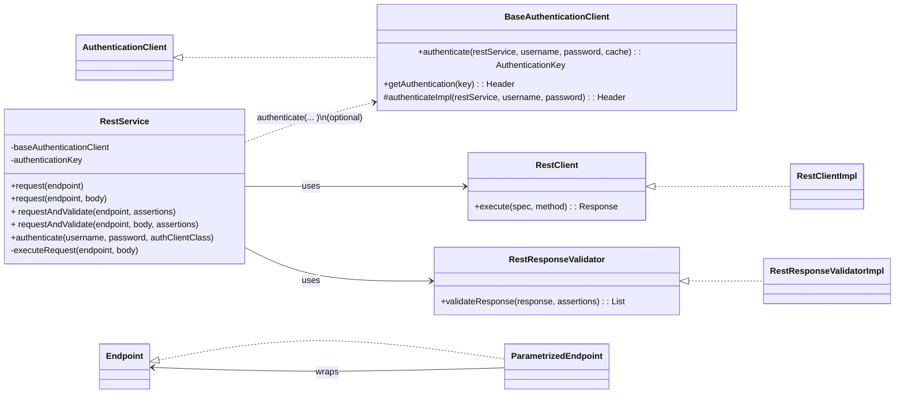
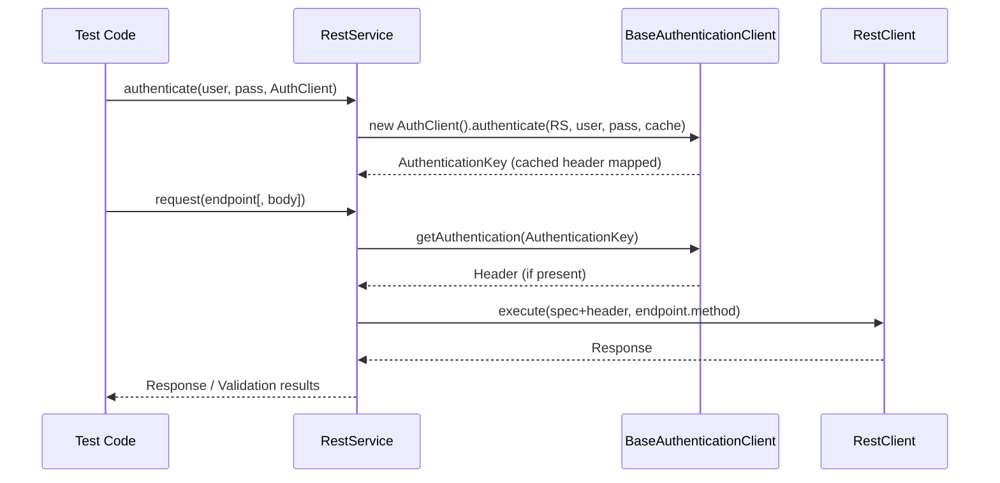
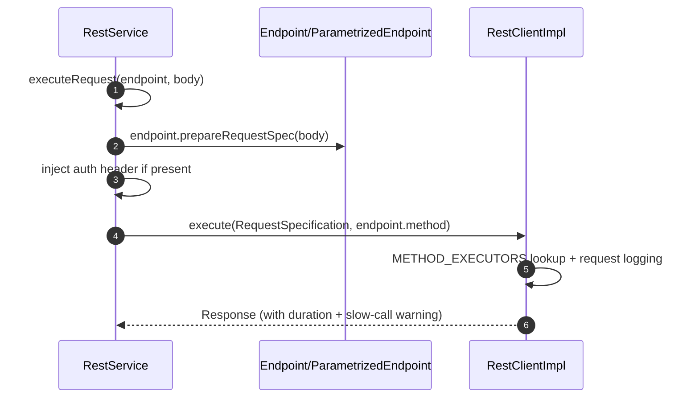
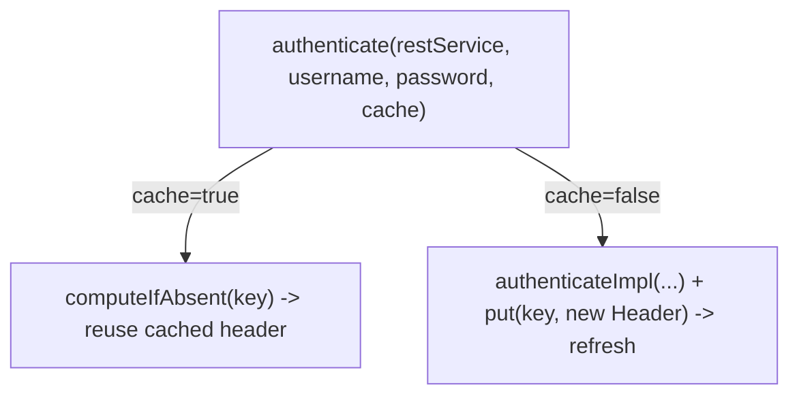

# api-interactor

<!-- Quick jump -->
**Start here:** [Usage — Quick Start (step-by-step)](#usage)

## Table of Contents
- [Overview](#overview)
- [Features](#features)
- [Structure](#structure)
- [Architecture](#architecture)
    - [Class Diagram](#class-diagram)
  - [Execution Flow](#execution-flow)
    - [Core Request Flow](#core-request-flow)
    - [Detailed Request Execution](#detailed-request-execution)
    - [Response Validation Flow](#response-validation-flow)
    - [Authentication Cache Semantics](#authentication-cache-semantics)
- [Usage](#usage)
    - [Step 1 — Install dependency](#step-1--install-dependency)
    - [Step 2 — Configure environment](#step-2--configure-environment)
    - [Step 3 — Define app endpoints](#step-3--define-app-endpoints)
    - [Step 4 — Create a small test-facing service with validation assertions](#step-4--create-a-small-test-facing-service-with-validation-assertions)
    - [Step 5 — (Optional) Plug an auth strategy](#step-5--optional-plug-an-auth-strategy)
- [Dependencies](#dependencies)
- [Author](#author)

## Overview
The **api-interactor** module is a purpose-built foundation for declarative REST API testing on Java 17. It lets you model endpoints as code (typically enums implementing Endpoint<T>) and then compose requests immutably at runtime via ParametrizedEndpoint—adding path, query, and header parameters without mutating the original definition. Execution is handled by a pluggable HTTP SPI (RestClient), with a production-ready default (RestClientImpl on Rest Assured). The RestService orchestrates the flow end-to-end: it builds the RequestSpecification, applies optional authentication through BaseAuthenticationClient (with per-user header caching via AuthenticationKey), calls the client, and delegates response checks to RestResponseValidator using RestAssertionTarget (status, headers, body/JsonPath).

Configuration is standardized through the Owner library (ApiConfig / ApiConfigHolder) so base URLs, logging levels, and body truncation are consistent across environments. Structured logging via LogApi surfaces steps, request/response details (pretty-printed when possible), and highlights slow calls, making test runs observable and debuggable. The library is test-framework agnostic and can be wired plain or with Spring (DI annotations are provided but not required), which makes it easy to embed in existing suites or layer a fluent test adapter on top in a separate module.

### Module metadata
- **name:** Ring of Automation Api Library
- **artifactId:** api-interactor
- **direct dependencies (from pom.xml):**
  - org.springframework.boot:spring-boot-starter
  - org.projectlombok:lombok
  - io.rest-assured:rest-assured
  - io.cyborgcode.roa:assertions
  - io.cyborgcode.utilities:commons
  - org.aeonbits.owner:owner
  - org.mockito:mockito-core
  - org.junit.jupiter:junit-jupiter-api (test)
  - org.mockito:mockito-junit-jupiter
  - org.junit.jupiter:junit-jupiter-params (test)

## Features
- **Endpoint-as-code** via `Endpoint<T>` with a fluent decorator `ParametrizedEndpoint<T>` (path/query/headers)
- **HTTP execution** through `RestClient` (default `RestClientImpl` using Rest Assured)
- **Service orchestration** with `RestService` (request, optional auth, validation)
- **Response validation** via `RestResponseValidator` + `RestAssertionTarget`
- **Owner-based configuration** (`ApiConfig` & `ApiConfigHolder`)
- **Structured logging** (`LogApi`) and slow-call warning
- **Auth template** (`BaseAuthenticationClient`) with cached `Header` per `AuthenticationKey`

## Structure
- `authentication` — `AuthenticationClient`, `BaseAuthenticationClient`, `AuthenticationKey`  
- `client` — `RestClient`, `RestClientImpl`  
- `config` — `ApiConfig`, `ApiConfigHolder`  
- `core` — `Endpoint<T>`, `ParametrizedEndpoint<T>`  
- `exceptions` — `RestServiceException`  
- `log` — `LogApi`  
- `service` — `RestService`  
- `validator` — `RestAssertionTarget`, `RestResponseValidator`, `RestResponseValidatorImpl`

## Architecture

### Class Diagram


### Execution Flow
#### Core Request Flow


#### Detailed Request Execution


#### Response Validation Flow
- **RestService.validate(response, assertions):** delegates to `RestResponseValidatorImpl`.
- **Targets:**
  - `STATUS` — handled by `handleStatusAssertion(...)`.
  - `BODY` — `handleBodyAssertion(...)` with JsonPath extraction.
  - `HEADER` — `handleHeaderAssertion(...)`.
- Final validation via `AssertionUtil.validate(...)`.

#### Authentication Cache Semantics


## Usage

### Step 1 — Install dependency
Add the module to your build and depend on it from test modules:
```xml
<dependency>
  <groupId>io.cyborgcode.roa</groupId>
  <artifactId>api-interactor</artifactId>
  <version>${revision}</version>
  <scope>test</scope>
</dependency>
```
If publishing to an internal registry, keep the same coordinates. Otherwise install locally with:
```
mvn -pl api-interactor -am install
```

### Step 2 — Configure environment
Configuration is provided via **Owner** (`ApiConfig`) and loaded with `ApiConfigHolder`.

| Key                                  | Type    | Default | Description                                  |
|--------------------------------------|---------|:-------:|----------------------------------------------|
| `project.package`                    | String  |   —     | Base package for scanning                     |
| `api.base.url`                       | String  |   —     | Base URL for endpoints                        |
| `api.restassured.logging.enabled`    | boolean | `true`  | Toggle Rest Assured logging                   |
| `api.restassured.logging.level`      | String  | `ALL`   | One of `ALL`, `BASIC`, `NONE`                 |
| `log.full.body`                      | boolean | `true`  | Log entire response body                      |
| `shorten.body`                       | int     | `1000`  | Truncation when `log.full.body=false`         |

**Load order:** system properties + `classpath:${api.config.file}.properties` (run with `-Dapi.config.file=api-config`).

**Example**
```properties
project.package=io.cyborgcode
api.base.url=https://api.example.com
api.restassured.logging.enabled=true
api.restassured.logging.level=ALL
log.full.body=false
shorten.body=800
```

### Step 3 — Define app endpoints
```java
public enum Endpoints implements Endpoint {
  GET_ALL_USERS(Method.GET, "/users?{page}"),
  POST_LOGIN_USER(Method.POST, "/users");

  private final Method method;
  private final String url;

  Endpoints(final Method method, final String url) {
    this.method = method;
    this.url = url;
  }

  @Override
  public Method method() {
    return method;
  }

  @Override
  public String url() {
    return url;
  }

  @Override
  public Enum<?> enumImpl() {
    return this;
  }

  @Override
  public RequestSpecification defaultConfiguration() {
    RequestSpecification spec = Endpoint.super.defaultConfiguration();
    spec.contentType(ContentType.JSON);
    spec.header(API_KEY_HEADER, API_KEY_VALUE);
    return spec;
  }
}
```

### Step 4 — Create a small test-facing service with validation assertions
```java
public class TestAppService {

  private final RestService rest = new RestService(new RestClientImpl(), new RestResponseValidatorImpl());

  /** POST /login, then GET /users/{id} with a dynamic header from login response */
  public Response loginAndGetUser(String email, String password, int userId) {
    Response login = rest.request(POST_LOGIN_USER, Map.of("email", email, "password", password));
    String token = login.jsonPath().getString("token");

    return rest.request(
            GET_USER.withPathParam("id", userId)
                    .withHeader("X-Specific-Header", token)
    );
  }

  /** GET /users?page=2 + assertions */
  public List<AssertionResult<?>> requestAndValidateGetAllUsersPage2() {
    var assertions = new Assertion[] {
            Assertion.builder().target(STATUS).type(IS).expected(SC_OK).build(),
            Assertion.builder().target(HEADER).key(CONTENT_TYPE).type(CONTAINS).expected(ContentType.JSON.toString()).build(),
            Assertion.builder().target(BODY).key("total_pages").type(GREATER_THAN).expected(1).build(),
            Assertion.builder().target(BODY).key("per_page").type(LESS_THAN).expected(10).build(),
            Assertion.builder().target(BODY).key("support.url").type(CONTAINS).expected("test").build(),
            Assertion.builder().target(BODY).key("data[0].avatar").type(ENDS_WITH).expected(".jpg").build()
    };
    return rest.requestAndValidate(GET_ALL_USERS.withQueryParam("page", 2), assertions);
  }
}
```

### Step 5 — (Optional) Plug an auth strategy
```java
public class TestAppAuthentication extends BaseAuthenticationClient {

    @Override
    protected Header authenticateImpl(final RestService restService, final String username, final String password) {
        String token = restService
                .request(POST_LOGIN_USER, new LoginUser(username, password))
                .getBody()
                .jsonPath()
                .getString(TOKEN.getJsonPath());
        return new Header(AUTHORIZATION_HEADER_KEY, AUTHORIZATION_HEADER_VALUE + token);
    }
}
```

## Dependencies
- `org.springframework.boot:spring-boot-starter`
- `org.projectlombok:lombok`
- `io.rest-assured:rest-assured`
- `io.cyborgcode.roa:assertions`
- `io.cyborgcode.utilities:commons`
- `org.aeonbits.owner:owner`
- `org.mockito:mockito-core`
- `org.junit.jupiter:junit-jupiter-api` *(test)*
- `org.mockito:mockito-junit-jupiter`
- `org.junit.jupiter:junit-jupiter-params` *(test)*

## Author
**Cyborg Code Syndicate 💍👨💻**

