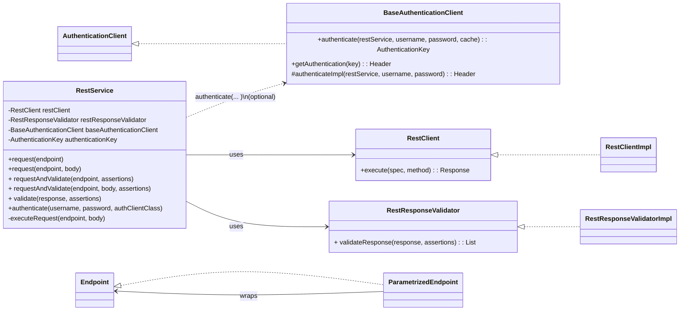
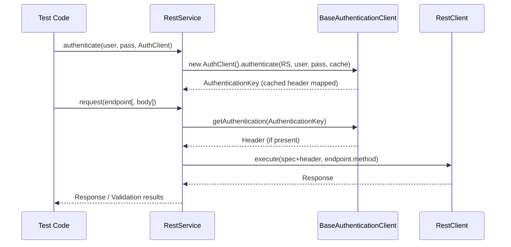
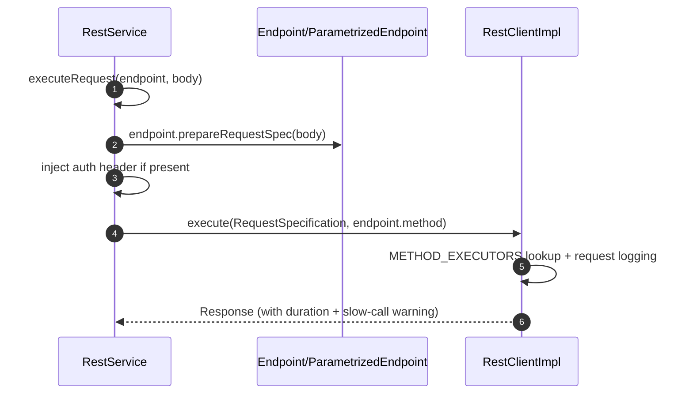
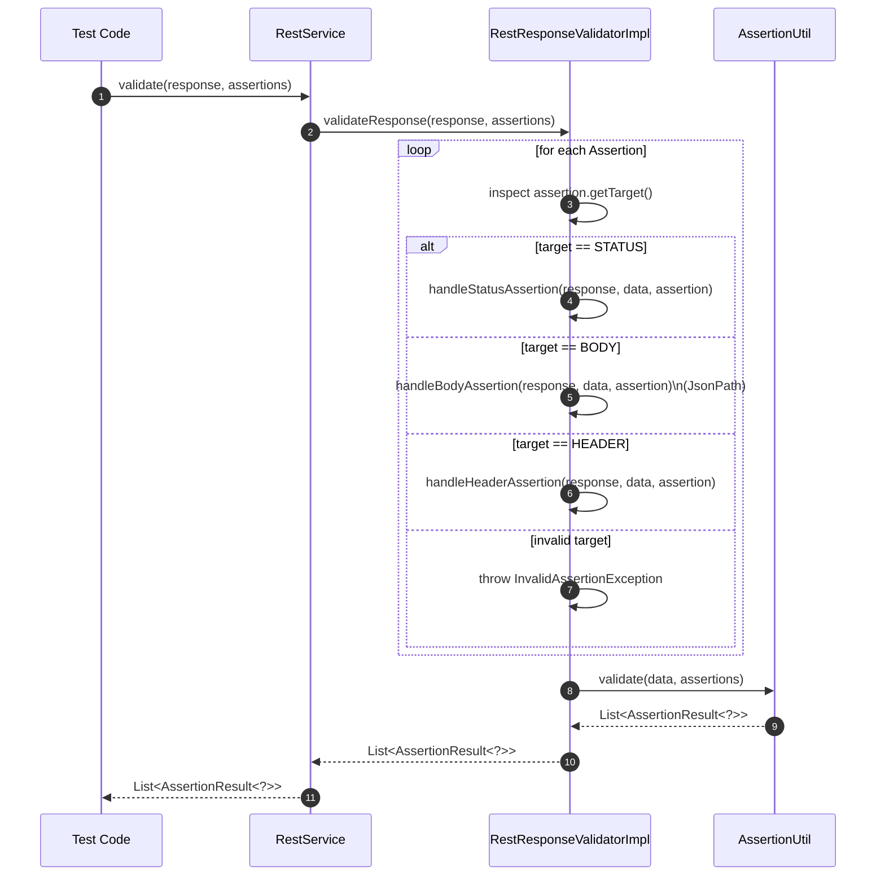
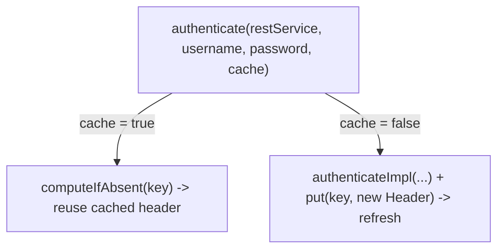

# api-interactor

<!-- Quick jump -->
**Start here:** [Usage - Quick Start (step-by-step)](#usage)

## Table of Contents

- [Overview](#overview)
- [Module metadata](#module-metadata)
- [Features](#features)
- [Structure](#structure)
- [Architecture](#architecture)
    - [Class Diagram](#class-diagram)
    - [Execution Flow](#execution-flow)
        - [Core Request Flow](#core-request-flow)
        - [Detailed Request Execution](#detailed-request-execution)
        - [Response Validation Flow](#response-validation-flow)
        - [Authentication Cache Semantics](#authentication-cache-semantics)
- [Usage](#usage)
    - [Step 1: Add dependency](#step-1-add-dependency)
      - [1.1. Standard Maven dependency](#11-standard-maven-dependency)
    - [Step 2: Configure ApiConfig](#step-2-configure-apiconfig)
      - [2.1 Configuration source](#21-configuration-source)
      - [2.2 Minimal configuration example](#22-minimal-configuration-example)
      - [2.3 Behaviour & priorities](#23-behaviour--priorities)
    - [Step 3: Define endpoints (`Endpoint<T>`)](#step-3-define-endpoints-endpointt)
      - [3.1 Basic endpoint Enum](#31-basic-endpoint-enum)
    - [Step 4: Create `RestService`](#step-4-create-restservice)
      - [4.1 What RestService does](#41-what-restservice-does)
      - [4.2 Plain Java / test setup](#42-plain-java--test-setup)
    - [Step 5: Basic usage (simple GET/POST)](#step-5-basic-usage-simple-getpost)
      - [5.1 Simple GET request](#51-simple-get-request)
      - [5.2 GET with path/query parameters](#52-get-with-pathquery-parameters)
      - [5.3 Simple POST with body](#53-simple-post-with-body)
      - [5.4 Using requestAndValidate for one-shot checks](#54-using-requestandvalidate-for-one-shot-checks)
    - [Step 6: Validation with assertions](#step-6-validation-with-assertions)
      - [6.1 Assertion model basics](#61-assertion-model-basics)
      - [6.2 Status-only validation](#62-status-only-validation)
      - [6.3 Body & header validation](#63-body--header-validation)
      - [6.4 When to use validate(...) directly](#64-when-to-use-validate-directly)
      - [6.5 Soft assertions (soft(true))](#65-soft-assertions-softtrue)
    - [Step 7: Authentication (`BaseAuthenticationClient`)](#step-7-authentication-baseauthenticationclient)
      - [7.1 How authentication is wired](#71-how-authentication-is-wired)
      - [7.2 Implementing a concrete BaseAuthenticationClient](#72-implementing-a-concrete-baseauthenticationclient)
      - [7.3 Using authentication in tests](#73-using-authentication-in-tests)
      - [7.4 Caching vs. re-login](#74-caching-vs-re-login)
- [Dependencies](#dependencies)
- [Author](#author)

## Overview

The **api-interactor** module is a purpose-built foundation for declarative REST API testing on Java 17. It lets you
model endpoints as code (typically enums implementing `Endpoint<T>`) and then compose requests immutably at runtime via
`ParametrizedEndpoint<T>`—adding path, query, and header parameters without mutating the original definition.
Execution is handled by a pluggable HTTP SPI (`RestClient`), with a production-ready default (`RestClientImpl` on
Rest Assured). `RestService` orchestrates the flow end-to-end: it builds the `RequestSpecification`, applies optional
authentication through `BaseAuthenticationClient` (with per-user header caching via `AuthenticationKey`), calls the
client, and delegates response checks to `RestResponseValidator` using `RestAssertionTarget` (status, headers,
body/JsonPath).

Configuration is standardized through the Owner library (`ApiConfig` / `ApiConfigHolder`) so base URLs, logging levels,
and body truncation are consistent across environments. Structured logging via `LogApi` surfaces steps and
request/response details (pretty-printed when possible), and highlights slow calls, making test runs observable and
debuggable. The library is test-framework agnostic and can be wired either with plain Java or via Spring
(DI annotations are provided but not required), which makes it easy to embed in existing suites or to build your own
fluent test adapter on top in a separate module.

### Module metadata

- **name:** Ring of Automation Api Library
- **artifactId:** api-interactor
- **direct dependencies (from pom.xml):**
    - org.springframework.boot:spring-boot-starter
    - org.projectlombok:lombok
    - io.rest-assured:rest-assured
    - io.cyborgcode.roa:assertions
    - io.cyborgcode.utilities:commons
    - org.aeonbits.owner:owner
    - org.mockito:mockito-core
    - org.junit.jupiter:junit-jupiter-api (test)
    - org.mockito:mockito-junit-jupiter
    - org.junit.jupiter:junit-jupiter-params (test)

## Features

- **Endpoint-as-code** via `Endpoint<T>` with a fluent decorator `ParametrizedEndpoint<T>` (path/query/headers)
- **HTTP execution** through `RestClient` (default `RestClientImpl` using Rest Assured)
- **Service orchestration** with `RestService` (request, optional auth, validation)
- **Response validation** via `RestResponseValidator` + `RestAssertionTarget`
- **Owner-based configuration** (`ApiConfig` & `ApiConfigHolder`)
- **Structured logging** (`LogApi`) and slow-call warning
- **Auth template** (`BaseAuthenticationClient`) with cached `Header` per `AuthenticationKey`
- **Error handling** via `RestServiceException` wrapping low-level failures

## Structure

### Key Classes

| Class                       | Responsibility                                                                                                  | Key methods                                                                                                                              | Used by                                                   |
|-----------------------------|-----------------------------------------------------------------------------------------------------------------|------------------------------------------------------------------------------------------------------------------------------------------|-----------------------------------------------------------|
| `Endpoint<T>`               | Models an API endpoint as code (HTTP method, relative URL, base config).                                        | `method()`, `url()`, `enumImpl()`, `baseUrl()`, `defaultConfiguration()`, `withQueryParam(...)`, `withPathParam(...)`, `withHeader(...)` | App endpoint enums, `ParametrizedEndpoint`, `RestService` |
| `ParametrizedEndpoint<T>`   | Immutable wrapper that adds path/query/header parameters on top of an existing `Endpoint`.                      | `withQueryParam(...)`, `withPathParam(...)`, `withHeader(...)`, `prepareRequestSpec(...)`, `headers()`                                   | Test code, higher-level services, `RestService`           |
| `RestService`               | Orchestrates API request execution, optional authentication, and response validation.                           | `request(endpoint)`, `request(endpoint, body)`, `<T> requestAndValidate(...)`, `<T> validate(...)`, `authenticate(...)`                  | Tests, app services, adapters                             |
| `RestClient`                | HTTP SPI used by `RestService` to execute requests.                                                             | `execute(RequestSpecification, Method)`                                                                                                  | `RestService`, custom client implementations              |
| `RestClientImpl`            | Default RestAssured-based `RestClient` with structured request/response logging and slow-call detection.        | `execute(...)`, `printRequest(...)`, `printResponse(...)`, `tryPrettyPrintJson(...)`, `currentTimeNanos()`                               | `RestService`                                             |
| `RestResponseValidator`     | Abstraction for validating a `Response` against a set of assertions.                                            | `<T> validateResponse(Response, Assertion...)`                                                                                           | `RestService`, custom validators                          |
| `RestResponseValidatorImpl` | Default validator using `RestAssertionTarget` and `AssertionUtil`.                                              | `validateResponse(...)`, `printAssertionTarget(...)`                                                                                     | `RestService`                                             |
| `RestAssertionTarget`       | Enum describing which part of the response to assert (`STATUS`, `BODY`, `HEADER`).                              | `target()`                                                                                                                               | `RestResponseValidatorImpl`, assertion builders           |
| `BaseAuthenticationClient`  | Template for authentication flows that produce an auth `Header`, with optional caching via `AuthenticationKey`. | `authenticate(RestService, username, password, cache)`, `getAuthentication(AuthenticationKey)`, `authenticateImpl(...)`                  | Test code, app/auth services, `RestService`               |
| `AuthenticationKey`         | Value object used as a cache key for per-user / per-context authentication headers.                             | standard value-type API (fields, `equals`/`hashCode`)                                                                                    | `BaseAuthenticationClient`, `RestService`                 |
| `ApiConfig`                 | Owner-based configuration interface for API settings and logging behavior.                                      | `baseUrl()`, `restAssuredLoggingEnabled()`, `restAssuredLoggingLevel()`, `logFullBody()`, `shortenBody()`                                | `Endpoint`, `RestClientImpl`, `ApiConfigHolder`           |
| `ApiConfigHolder`           | Singleton accessor for `ApiConfig`.                                                                             | `getApiConfig()`                                                                                                                         | `Endpoint`, `RestClientImpl`                              |
| `LogApi`                    | Centralized logger for API interactions (steps, validation, extended details).                                  | `info(...)`, `warn(...)`, `error(...)`, `debug(...)`, `trace(...)`, `step(...)`, `validation(...)`, `extended(...)`                      | All module classes                                        |
| `RestServiceException`      | Runtime exception wrapping errors during endpoint execution or authentication.                                  | constructors taking `message`, `cause`                                                                                                   | `RestService`                                             |

---

### Package: `io.cyborgcode.roa.api.core`

| Class                  | Responsibility                                                                                           | Key methods                                                                                                                                                         | Used by                                                                                                                            |
|------------------------|----------------------------------------------------------------------------------------------------------|---------------------------------------------------------------------------------------------------------------------------------------------------------------------|------------------------------------------------------------------------------------------------------------------------------------|
| `Endpoint`             | Core endpoint contract: HTTP method, relative URL, base config, and fluent parameterization entrypoints. | `method()`, `url()`, `enumImpl()`, `baseUrl()`, `defaultConfiguration()`, `prepareRequestSpec(...)`, `withQueryParam(...)`, `withPathParam(...)`, `withHeader(...)` | Typically implemented by enum- or class-based endpoint definitions in app code, also used by `ParametrizedEndpoint`, `RestService` |
| `ParametrizedEndpoint` | Immutable endpoint wrapper with accumulated path/query/headers on top of an `Endpoint`.                  | `withQueryParam(...)`, `withPathParam(...)`, `withHeader(...)`, `prepareRequestSpec(...)`, `headers()`                                                              | Tests, app services, `RestService`                                                                                                 |

---

### Package: `io.cyborgcode.roa.api.client`

| Class            | Responsibility                                                                                          | Key methods                                                                                                | Used by       |
|------------------|---------------------------------------------------------------------------------------------------------|------------------------------------------------------------------------------------------------------------|---------------|
| `RestClient`     | SPI abstraction for executing HTTP calls for a prepared RestAssured `RequestSpecification`.             | `execute(RequestSpecification, Method)`                                                                    | `RestService` |
| `RestClientImpl` | Default implementation backed by RestAssured, with structured logging and slow-request threshold check. | `execute(...)`, `printRequest(...)`, `printResponse(...)`, `tryPrettyPrintJson(...)`, `currentTimeNanos()` | `RestService` |

---

### Package: `io.cyborgcode.roa.api.service`

| Class         | Responsibility                                                                                                                                                          | Key methods                                                                                                                                                          | Used by                                |
|---------------|-------------------------------------------------------------------------------------------------------------------------------------------------------------------------|----------------------------------------------------------------------------------------------------------------------------------------------------------------------|----------------------------------------|
| `RestService` | High-level service that prepares the request spec from an `Endpoint`, injects auth if configured, executes via `RestClient`, and validates via `RestResponseValidator`. | `request(Endpoint<?>)`, `request(Endpoint<?>, Object body)`, `<T> requestAndValidate(...)`, `<T> validate(...)`, `authenticate(username, password, authClientClass)` | Test code, app-level helpers, adapters |

---

### Package: `io.cyborgcode.roa.api.authentication`

| Class                      | Responsibility                                                                         | Key methods                                                                                                                                   | Used by                                    |
|----------------------------|----------------------------------------------------------------------------------------|-----------------------------------------------------------------------------------------------------------------------------------------------|--------------------------------------------|
| `AuthenticationClient`     | Marker/contract for authentication clients that can produce headers.                   | (depends on implementation; typically authenticate-style methods)                                                                             | `BaseAuthenticationClient` subclasses      |
| `BaseAuthenticationClient` | Base template that coordinates login, caching and retrieval of authentication headers. | `authenticate(RestService, String, String, boolean)`, `getAuthentication(AuthenticationKey)`, `authenticateImpl(RestService, String, String)` | Custom auth implementations, `RestService` |
| `AuthenticationKey`        | Encapsulates the key under which an auth header is cached (e.g. username + tenant).    | value-type fields and equality                                                                                                                | `BaseAuthenticationClient`                 |

---

### Package: `io.cyborgcode.roa.api.validator`

| Class                       | Responsibility                                                                                                        | Key methods                                          | Used by                                         |
|-----------------------------|-----------------------------------------------------------------------------------------------------------------------|------------------------------------------------------|-------------------------------------------------|
| `RestAssertionTarget`       | Declares which part of the response is being asserted: `STATUS`, `BODY`, or `HEADER`.                                 | `target()`                                           | Assertion builders, `RestResponseValidatorImpl` |
| `RestResponseValidator`     | SPI for validating a `Response` against a list of assertions.                                                         | `<T> validateResponse(Response, Assertion...)`       | `RestService`                                   |
| `RestResponseValidatorImpl` | Default implementation that extracts values (status, headers, JsonPath body fields) and delegates to `AssertionUtil`. | `validateResponse(...)`, `printAssertionTarget(...)` | `RestService`                                   |

---

### Package: `io.cyborgcode.roa.api.config`

| Class             | Responsibility                                                                               | Key methods                                                                                               | Used by                      |
|-------------------|----------------------------------------------------------------------------------------------|-----------------------------------------------------------------------------------------------------------|------------------------------|
| `ApiConfig`       | Owner configuration interface for API base URL, RestAssured logging, and body logging rules. | `baseUrl()`, `restAssuredLoggingEnabled()`, `restAssuredLoggingLevel()`, `logFullBody()`, `shortenBody()` | `Endpoint`, `RestClientImpl` |
| `ApiConfigHolder` | Static holder that lazily loads and exposes `ApiConfig`.                                     | `getApiConfig()`                                                                                          | `Endpoint`, `RestClientImpl` |

---

### Package: `io.cyborgcode.roa.api.log`

| Class    | Responsibility                                                               | Key methods                                                                                                                        | Used by                         |
|----------|------------------------------------------------------------------------------|------------------------------------------------------------------------------------------------------------------------------------|---------------------------------|
| `LogApi` | API-scoped logging façade on top of `LogCore` with an `"ROA.API"` namespace. | `info(...)`, `warn(...)`, `error(...)`, `debug(...)`, `trace(...)`, `step(...)`, `validation(...)`, `extended(...)`, `extend(...)` | All classes in `api-interactor` |

---

### Package: `io.cyborgcode.roa.api.exceptions`

| Class                  | Responsibility                                                                                              | Key methods                                        | Used by       |
|------------------------|-------------------------------------------------------------------------------------------------------------|----------------------------------------------------|---------------|
| `RestServiceException` | Runtime exception representing failures during endpoint execution or auth client usage, with extra context. | constructors taking `String`, `String + Throwable` | `RestService` |

---
## Architecture

### Class Diagram



### Execution Flow

#### Core Request Flow



#### Detailed Request Execution



#### Response Validation Flow

- **RestService.validate(response, assertions):** delegates to `RestResponseValidatorImpl`.
- **Targets:**
    - `STATUS` – handled by `handleStatusAssertion(...)`.
    - `BODY` – `handleBodyAssertion(...)` with JsonPath extraction.
    - `HEADER` – `handleHeaderAssertion(...)`.
- Final validation via `AssertionUtil.validate(...)`.



#### Authentication Cache Semantics


---
## Usage

### Step 1: Add dependency

To use **`api-interactor`** in your project, you first need to add it as a Maven dependency.

In most setups, **`api-interactor`** is consumed from your **test module** (e.g. `my-app-test`), where you keep your
automated tests.

#### 1.1. Standard Maven dependency

Add the following snippet to the `dependencies` section of your test module’s `pom.xml`:

```xml

<dependency>
    <groupId>io.cyborgcode.roa</groupId>
    <artifactId>api-interactor</artifactId>
    <version>${roa.version}</version>
</dependency>

```
---
### Step 2: Configure ApiConfig

Before using *`api-interactor`*, you need to provide base configuration via `ApiConfig` (backed by **Owner**) and load
it through `ApiConfigHolder`.

#### 2.1 Configuration source

`ApiConfig` is resolved from:

- JVM system properties
- A `.properties` file on the classpath whose **base name** is given by `api.config.file`

Typical setup:

1. Create `api-config.properties` under `src/test/resources` or `src/main/resources`.
2. Run tests with:

```bash
  -Dapi.config.file=api-config
```

`api-interactor` will then load `classpath:api-config.properties` plus any system properties.

#### 2.2 Minimal configuration example

```properties
# Required: packages to scan (your app + test support)
project.packages=your.project.package;your.project.tests
# Required: base URL for all endpoints
api.base.url=https://api.example.com
# Optional: Rest Assured logging
api.restassured.logging.enabled=true
api.restassured.logging.level=ALL   # ALL, BASIC, NONE
# Optional: response body logging behaviour
log.full.body=false                 # if false, body is truncated
shorten.body=800                    # max chars when truncated
```

#### 2.3 Behaviour & priorities

- **System properties override** values from the properties file:

```bash
  -Dapi.base.url=https://staging.example.com
```

- `project.packages` is used for internal classpath scanning; multiple packages are separated with `;`:

```properties
project.packages=your.project.package;your.project.tests
```

- Treat `project.packages` and `api.base.url` as **required** – without them, endpoint resolution and request execution will not behave correctly.
- Logging keys (`api.restassured.logging.*`, `log.full.body`, `shorten.body`) are optional and have safe defaults; adjust them per environment (local vs CI) as needed.
- If you ever need direct access, you can obtain the configuration via:

```java
import io.cyborgcode.roa.api.config.ApiConfigHolder;
import io.cyborgcode.roa.api.config.ApiConfig;

ApiConfig apiConfig = ApiConfigHolder.getApiConfig();
```
---
### Step 3: Define endpoints (`Endpoint<T>`)

The **core idea** of `api-interactor` is:

> *“Describe your endpoints once, as code, then parameterize them at runtime.”*

You do this by implementing the `Endpoint<T>` interface – most commonly as an `enum`.
The enum gives you a fixed, type-safe list of endpoints (e.g. `GET_USER`, `CREATE_ORDER`), while `ParametrizedEndpoint<T>` lets you add path/query/headers without mutating the original definition.

> 📝 **Note**
> Enums are the *recommended* style, but not mandatory. Any class or record can implement `Endpoint<T>` – `api-interactor` does not enforce enums.

---

#### 3.1 Basic endpoint enum

Keep the URL as a **clean path** (no base URL, no query params).
Use `withPathParam(...)`, `withQueryParam(...)` and `withHeader(...)` at call time.

```java
import io.cyborgcode.roa.api.core.Endpoint;
import io.restassured.http.Method;
import io.restassured.specification.RequestSpecification;
import io.restassured.http.ContentType;

public enum ApiEndpoints implements Endpoint<ApiEndpoints> {

    // Examples – in your project use descriptive names like GET_USER, CREATE_ORDER, etc.
    GET_SAMPLE(Method.GET, "/samples"),
    GET_SAMPLE_BY_ID(Method.GET, "/samples/{id}"),
    CREATE_SAMPLE(Method.POST, "/samples");

    private static final String API_KEY_HEADER = "X-API-Key";
    private static final String API_KEY_VALUE  = "your-api-key-here";

    private final Method method;
    private final String url;

    ApiEndpoints(final Method method, final String url) {
        this.method = method;
        this.url = url;
    }

    @Override
    public Method method() {
        return method;
    }

    @Override
    public String url() {
        // Relative path only – base URL comes from ApiConfig.baseUrl()
        return url;
    }

    /**
     * Self-type used by ParametrizedEndpoint<T>.
     * Just return this for enums.
     */
    @Override
    public ApiEndpoints enumImpl() {
        return this;
    }

    /**
     * Optional: customize default RequestSpecification per endpoint group.
     * You can add common headers, content type, etc.
     * Base URL and logging are handled by api-interactor itself.
     */
    @Override
    public RequestSpecification defaultConfiguration() {
        RequestSpecification spec = Endpoint.super.defaultConfiguration();
        spec.contentType(ContentType.JSON);
        spec.header(API_KEY_HEADER, API_KEY_VALUE);
        return spec;
    }
}
```

Key points:

* **`method()`** – HTTP verb (`GET`, `POST`, etc.), usually `io.restassured.http.Method`.
* **`url()`** – **relative path only**, e.g. `"/samples/{id}"`.
  Base URL comes from `ApiConfig.baseUrl()`.
* **`enumImpl()`** – “self type” used internally; for enums it should simply return `this`.
* **`defaultConfiguration()`** (optional) – lets you:

    * Set a default `contentType` (e.g. JSON),
    * Attach static headers (e.g. API keys, tenant IDs),
    * Keep shared settings in one place.

At runtime you never change the enum itself – instead you build a **`ParametrizedEndpoint<ApiEndpoints>`**:

```java
// Examples – these are not executed here, just showing how endpoints are meant to be used:
ApiEndpoints.GET_SAMPLE_BY_ID
    .withPathParam("id", 123);

ApiEndpoints.GET_SAMPLE
    .withQueryParam("page", 2)
    .withQueryParam("size", 20);

ApiEndpoints.CREATE_SAMPLE
    .withHeader("X-Correlation-Id", "123-abc");
```
---
### Step 4: Create `RestService`

Once you have endpoints, you need a single entry point that:

* Builds the **full** Rest Assured `RequestSpecification` (base URL + endpoint defaults)
* Delegates the HTTP call to a client (`RestClientImpl`)
* Runs **assertions** via `RestResponseValidator`

That entry point is `RestService`.

---

#### 4.1 What `RestService` does

`RestService` is the orchestration layer for HTTP calls and validation. It:

- Accepts your **`Endpoint<T>` / `ParametrizedEndpoint<T>`** and an optional **request body** (POJO, `Map`, etc.)
- Delegates to the endpoint’s `prepareRequestSpec(body)` to build the full Rest Assured `RequestSpecification`  
  (base URL, logging, and other defaults are typically applied there via `ApiConfig`)
- Optionally injects an **authentication header** provided by a `BaseAuthenticationClient`
- Delegates HTTP execution to a `RestClient` (default implementation: `RestClientImpl` using Rest Assured)
- Exposes convenience methods for **response validation** via `RestResponseValidator`:
    - `validate(response, assertions...)`
    - `requestAndValidate(endpoint, assertions...)`
    - `requestAndValidate(endpoint, body, assertions...)`
---

#### 4.2 Plain Java / test setup

In a simple test project, you can instantiate `RestService` directly:

```java
import io.cyborgcode.roa.api.client.RestClientImpl;
import io.cyborgcode.roa.api.service.RestService;
import io.cyborgcode.roa.api.validator.RestResponseValidatorImpl;

public class ApiTestSupport {

    // Reusable RestService instance for your tests
    private static final RestService REST_SERVICE =
        new RestService(
            new RestClientImpl(),           // HTTP execution (Rest Assured under the hood)
            new RestResponseValidatorImpl() // Assertion engine (status/body/headers)
        );

    public static RestService rest() {
        return REST_SERVICE;
    }
}
```

You can then use this helper from your tests:

```java
import io.restassured.response.Response;
import org.junit.jupiter.api.Test;

import static your.project.api.ApiEndpoints.*; // e.g. GET_SAMPLE, CREATE_SAMPLE
import static your.project.test.ApiTestSupport.rest;

class SampleApiTests {

    @Test
    void should_get_samples() {
        Response response = rest().request(GET_SAMPLE);
        // assertions will be shown in the next steps
    }

    @Test
    void should_create_sample() {
        var body = Map.of("name", "Example", "type", "BASIC");
        Response response = rest().request(CREATE_SAMPLE, body);
    }
}
```

> 📝 **Note**
> `rest().request(...)` accepts both "raw" `Endpoint<T>` values (like `GET_SAMPLE`) and parameterized ones (like `GET_SAMPLE_BY_ID.withPathParam("id", 123)`).
> In the next steps we’ll show how to parameterize endpoints and validate responses using `RestService`.
---
### Step 5: Basic usage (simple GET/POST)

This section shows how to use `RestService` and your `Endpoint<T>` definitions to perform
simple GET/POST calls. We’ll start without validation and then show how to plug in
`requestAndValidate(...)`.

For the examples below, assume:

* You defined your endpoints as in **Step 3**, e.g.:

```java
import io.cyborgcode.roa.api.core.Endpoint;
import io.restassured.http.ContentType;
import io.restassured.http.Method;
import io.restassured.specification.RequestSpecification;

public enum SampleApiEndpoint implements Endpoint<SampleApiEndpoint> {

    GET_SAMPLE(Method.GET, "/samples"),
    GET_SAMPLE_BY_ID(Method.GET, "/samples/{id}"),
    CREATE_SAMPLE(Method.POST, "/samples");

    private final Method method;
    private final String url;

    SampleApiEndpoint(Method method, String url) {
        this.method = method;
        this.url = url;
    }

    @Override
    public Method method() {
        return method;
    }

    @Override
    public String url() {
        return url;
    }

    @Override
    public SampleApiEndpoint enumImpl() {
        return this;
    }

    @Override
    public RequestSpecification defaultConfiguration() {
        RequestSpecification spec = Endpoint.super.defaultConfiguration();
        spec.contentType(ContentType.JSON);
        return spec;
    }
}
```

* You have a small helper that exposes a shared `RestService` instance (from **Step 4**):

```java
import io.cyborgcode.roa.api.client.RestClientImpl;
import io.cyborgcode.roa.api.service.RestService;
import io.cyborgcode.roa.api.validator.RestResponseValidatorImpl;

public class ApiTestSupport {

    private static final RestService REST_SERVICE =
        new RestService(
            new RestClientImpl(),
            new RestResponseValidatorImpl()
        );

    public static RestService rest() {
        return REST_SERVICE;
    }
}
```

We’ll use these in the examples below.

---

#### 5.1 Simple GET request

The simplest usage is a GET request without a body, using a plain `Endpoint<T>` constant.

```java
import io.restassured.response.Response;
import org.junit.jupiter.api.Test;

import static org.junit.jupiter.api.Assertions.assertEquals;
import static org.junit.jupiter.api.Assertions.assertTrue;
import static your.project.api.SampleApiEndpoint.*; // GET_SAMPLE, etc.
import static your.project.test.ApiTestSupport.rest;

class SimpleGetTests {

    @Test
    void should_get_samples() {
        // GET_SAMPLE is an Endpoint<T> defined in your enum (Step 3)
        Response response = rest().request(GET_SAMPLE);

        // You can assert directly on the Rest Assured Response if you want:
        assertEquals(200, response.getStatusCode());
        assertTrue(response.getBody().asString().contains("items"));
    }
}
```

What happens internally:

* `RestService` calls `GET_SAMPLE.prepareRequestSpec(null)`.
* The `Endpoint` builds a `RequestSpecification` using:

    * `api.base.url` from `ApiConfig`
    * the endpoint’s `url()` and `method()`
    * any default headers/content type from `defaultConfiguration()`
* `RestClientImpl` executes the request via Rest Assured and returns a `Response`.

---

#### 5.2 GET with path/query parameters

To call dynamic URLs or filtered resources, you use `ParametrizedEndpoint<T>` via the
fluent methods on your endpoint:

```java
import io.restassured.response.Response;
import org.junit.jupiter.api.Test;

import static org.junit.jupiter.api.Assertions.assertEquals;
import static your.project.api.SampleApiEndpoint.*;
import static your.project.test.ApiTestSupport.rest;

class ParameterizedGetTests {

    @Test
    void should_get_single_sample_by_id() {
        // GET_SAMPLE_BY_ID might be defined as: /samples/{id}
        var endpoint = GET_SAMPLE_BY_ID
            .withPathParam("id", 123);  // /samples/123

        Response response = rest().request(endpoint);

        assertEquals(200, response.getStatusCode());
    }

    @Test
    void should_get_paginated_samples() {
        // GET_SAMPLE may be defined as: /samples
        var endpoint = GET_SAMPLE
            .withQueryParam("page", 2)
            .withQueryParam("size", 20); // /samples?page=2&size=20

        Response response = rest().request(endpoint);

        assertEquals(200, response.getStatusCode());
    }
}
```

Key points:

* `withPathParam(...)` and `withQueryParam(...)` **do not mutate** the original enum value –
  they return a `ParametrizedEndpoint<T>` wrapper.
* You can chain multiple parameter calls as needed.
* `RestService.request(...)` accepts both `Endpoint<T>` and `ParametrizedEndpoint<T>`.

---

#### 5.3 Simple POST with body

For POST/PUT/PATCH calls, pass the request body as a second argument. The body can be
a `Map`, a POJO, or any object supported by Rest Assured serialization.

```java
import io.restassured.response.Response;
import org.junit.jupiter.api.Test;

import java.util.Map;

import static org.junit.jupiter.api.Assertions.assertEquals;
import static org.junit.jupiter.api.Assertions.assertNotNull;
import static your.project.api.SampleApiEndpoint.*;
import static your.project.test.ApiTestSupport.rest;

class SimplePostTests {

    @Test
    void should_create_sample_with_map_body() {
        var body = Map.of(
            "name", "Example name",
            "type", "BASIC"
        );

        Response response = rest().request(CREATE_SAMPLE, body);

        assertEquals(201, response.getStatusCode());
        assertNotNull(response.jsonPath().getString("id"));
    }

    @Test
    void should_create_sample_with_pojo_body() {
        var request = new CreateSampleRequest("Example name", "BASIC");

        Response response = rest().request(CREATE_SAMPLE, request);

        assertEquals(201, response.getStatusCode());
    }

    // Example request model – lives in your project, not in api-interactor
    static class CreateSampleRequest {
        private final String name;
        private final String type;

        public CreateSampleRequest(String name, String type) {
            this.name = name;
            this.type = type;
        }

        public String getName() { return name; }
        public String getType() { return type; }
    }
}
```

---

#### 5.4 Using requestAndValidate for one-shot checks

Instead of manually asserting on `Response`, you can use `requestAndValidate(...)`
and the shared assertion layer from `io.cyborgcode.roa:assertions`.

```java
import io.cyborgcode.roa.api.validator.RestAssertionTarget;
import io.cyborgcode.roa.validator.core.Assertion;
import io.cyborgcode.roa.validator.core.AssertionResult;
import io.cyborgcode.roa.validator.core.AssertionTypes;
import org.junit.jupiter.api.Test;

import java.util.List;
import java.util.stream.Collectors;

import static org.junit.jupiter.api.Assertions.assertTrue;
import static your.project.api.SampleApiEndpoint.*;
import static your.project.test.ApiTestSupport.rest;
import static org.apache.http.HttpStatus.SC_OK; // or use 200 directly

class RequestAndValidateTests {

    @Test
    void should_get_samples_and_validate() {
       List<AssertionResult<?>> results = rest()
             .requestAndValidate(
                   GET_SAMPLE,
                   Assertion.builder()
                         .target(RestAssertionTarget.STATUS)
                         .type(AssertionTypes.IS)
                         .expected(SC_OK)
                         .build(),
                   Assertion.builder()
                         .target(RestAssertionTarget.BODY)
                         .key("items.size()")
                         .type(AssertionTypes.GREATER_THAN)
                         .expected(0)
                         .build()
             );

       assertAllApiAssertionsPassed(results);
    }

   /**
    * Asserts that all AssertionResult entries passed and, if not,
    * prints only the failed ones as a readable message.
    */
   private void assertAllApiAssertionsPassed(List<AssertionResult<?>> results) {
      List<AssertionResult<?>> failed = results.stream()
            .filter(r -> !r.isPassed())
            .toList();

      String failureMessage = failed.isEmpty()
            ? "All API assertions passed"
            : "Some API assertions failed:\n" +
            failed.stream()
                  .map(Object::toString)   // AssertionResult.toString() should be descriptive
                  .collect(Collectors.joining("\n"));

      assertTrue(failed.isEmpty(), failureMessage);
   }
}
```

Here:

* `RestService.requestAndValidate(...)` internally calls:

    * `request(endpoint, body)`
    * then `RestResponseValidator.validateResponse(response, assertions)`.
* Targets like `STATUS`, `BODY`, and `HEADER` are resolved by `RestResponseValidatorImpl`.

---


### Step 6: Validation with assertions

`api-interactor` does **not** hard-fail inside the library.  
Instead, it returns a list of `AssertionResult<?>` objects from:

- `RestService.validate(Response, Assertion...)`
- `RestService.requestAndValidate(Endpoint<?>, Assertion...)`
- `RestService.requestAndValidate(Endpoint<?>, Object body, Assertion...)`

You decide in your tests **how** to fail (hard vs soft, custom messages, additional logging, etc.).

---

#### 6.1 Assertion model basics

Assertions are defined using the fluent `Assertion.builder()` API from the `assertions` module.

```java
import io.cyborgcode.roa.api.validator.RestAssertionTarget;
import io.cyborgcode.roa.validator.core.Assertion;
import io.cyborgcode.roa.validator.core.AssertionTypes;

Assertion statusOk = Assertion.builder()
    .target(RestAssertionTarget.STATUS)
    .type(AssertionTypes.IS)
    .expected(200)
    .build();
```

The key pieces are:

* **`target`** – which part of the response to assert (from `RestAssertionTarget`):

    * `RestAssertionTarget.STATUS` – HTTP status code
    * `RestAssertionTarget.BODY` – JSON body via JsonPath
    * `RestAssertionTarget.HEADER` – HTTP headers
* **`type`** – how to compare (from `AssertionTypes`), e.g.:

    * `IS`, `NOT`, `GREATER_THAN`, `LESS_THAN`,
      `CONTAINS`, `ENDS_WITH`, `EQUALS_IGNORE_CASE`, etc.
* **`expected`** – the expected value (status code, string, number, etc.)
* **`key`** *(optional, required for BODY/HEADER)* – path or name inside the target:

    * For `BODY` – JsonPath (e.g. `"data[0].id"`, `"items.size()"`, `"user.email"`)
    * For `HEADER` – header name (e.g. `"Content-Type"`)

At runtime:

* `RestResponseValidatorImpl` loops over all assertions
* Uses `RestAssertionTarget` to decide **what** to extract (status/body/header)
* Extracts values from `Response` (status code, headers, `jsonPath().get(key)`)
* Delegates comparison to `AssertionUtil.validate(...)`
* Returns a `List<AssertionResult<?>>` (one result per assertion)

---

#### 6.2 Status-only validation

A common pattern is to assert only the HTTP status code:

```java
import io.cyborgcode.roa.api.validator.RestAssertionTarget;
import io.cyborgcode.roa.validator.core.Assertion;
import io.cyborgcode.roa.validator.core.AssertionResult;
import io.cyborgcode.roa.validator.core.AssertionTypes;
import org.junit.jupiter.api.Test;

import java.util.List;

import static org.apache.http.HttpStatus.SC_OK;
import static org.junit.jupiter.api.Assertions.assertTrue;
import static your.project.api.SampleApiEndpoint.GET_SAMPLE;
import static your.project.test.ApiTestSupport.rest;

class StatusValidationTests {

    @Test
    void should_return_200_for_sample_endpoint() {
        List<AssertionResult<?>> results = rest()
            .requestAndValidate(
                GET_SAMPLE,
                Assertion.builder()
                    .target(RestAssertionTarget.STATUS)
                    .type(AssertionTypes.IS)
                    .expected(SC_OK)
                    .build()
            );

        assertTrue(
            results.stream().allMatch(AssertionResult::isPassed),
            "API call should return HTTP 200"
        );
    }
}
```

---

#### 6.3 Body & header validation

You can combine multiple assertions for **status**, **headers**, and **JSON body** in a single call:

```java
import io.cyborgcode.roa.api.validator.RestAssertionTarget;
import io.cyborgcode.roa.validator.core.Assertion;
import io.cyborgcode.roa.validator.core.AssertionResult;
import io.cyborgcode.roa.validator.core.AssertionTypes;
import org.junit.jupiter.api.Test;

import java.util.List;
import java.util.stream.Collectors;

import static org.apache.http.HttpStatus.SC_OK;
import static org.junit.jupiter.api.Assertions.assertTrue;
import static your.project.api.SampleApiEndpoint.GET_SAMPLE;
import static your.project.test.ApiTestSupport.rest;

class HeaderAndBodyValidationTests {

    @Test
    void should_return_json_with_non_empty_items_array() {
        List<AssertionResult<?>> results = rest()
            .requestAndValidate(
                GET_SAMPLE,
                // Status = 200
                Assertion.builder()
                    .target(RestAssertionTarget.STATUS)
                    .type(AssertionTypes.IS)
                    .expected(SC_OK)
                    .build(),
                // Content-Type contains "application/json"
                Assertion.builder()
                    .target(RestAssertionTarget.HEADER)
                    .key("Content-Type")
                    .type(AssertionTypes.CONTAINS)
                    .expected("application/json")
                    .build(),
                // items.size() > 0
                Assertion.builder()
                    .target(RestAssertionTarget.BODY)
                    .key("items.size()")          // JsonPath
                    .type(AssertionTypes.GREATER_THAN)
                    .expected(0)
                    .build()
            );

        assertAllApiAssertionsPassed(results);
    }

    /**
     * Asserts that all AssertionResult entries passed and, if not,
     * prints only the failed ones as a readable message.
     */
    private void assertAllApiAssertionsPassed(List<AssertionResult<?>> results) {
        List<AssertionResult<?>> failed = results.stream()
            .filter(r -> !r.isPassed())
            .collect(Collectors.toList());

        String failureMessage = failed.isEmpty()
            ? "All API assertions passed"
            : "Some API assertions failed:\n" +
              failed.stream()
                    .map(Object::toString)   // AssertionResult.toString() is descriptive (✔ / ✘)
                    .collect(Collectors.joining("\n"));

        assertTrue(failed.isEmpty(), failureMessage);
    }
}
```
Key points:

* **Body keys** such as `"items.size()"`, `"data[0].id"`, `"user.email"` are **JsonPath expressions** evaluated against the response body.
* **Header keys** are plain header names (`"Content-Type"`, `"X-Request-Id"`, …).
* Multiple assertions can be combined in a single `requestAndValidate(...)` call; each one produces its own `AssertionResult<?>`.

---

#### 6.4 When to use `validate(...)` directly

If you already have a `Response` (e.g. you want to do manual checks first or reuse the same response multiple times), you can use `validate(...)` directly:

```java
import io.cyborgcode.roa.api.validator.RestAssertionTarget;
import io.cyborgcode.roa.validator.core.Assertion;
import io.cyborgcode.roa.validator.core.AssertionResult;
import io.cyborgcode.roa.validator.core.AssertionTypes;
import io.restassured.response.Response;

import java.util.List;

import static your.project.api.SampleApiEndpoint.GET_SAMPLE;
import static your.project.test.ApiTestSupport.rest;

class SeparateValidateExample {

    void validate_later() {
        // First, just perform the request
        Response response = rest().request(GET_SAMPLE);

        // Then, validate when/where you need it
        List<AssertionResult<?>> results = rest().validate(
            response,
            Assertion.builder()
                .target(RestAssertionTarget.STATUS)
                .type(AssertionTypes.IS)
                .expected(200)
                .build()
        );

        // Reuse the same helper
        assertAllApiAssertionsPassed(results);
    }

    // Same helper as before
    private void assertAllApiAssertionsPassed(List<AssertionResult<?>> results) {
        List<AssertionResult<?>> failed = results.stream()
            .filter(r -> !r.isPassed())
            .toList();

        String failureMessage = failed.isEmpty()
            ? "All API assertions passed"
            : "Some API assertions failed:\n" +
              failed.stream()
                    .map(Object::toString)
                    .collect(java.util.stream.Collectors.joining("\n"));

        assertTrue(failed.isEmpty(), failureMessage);
    }
}
```

Use `validate(...)` when you need **more control** over when/how you assert
(e.g. logging, conditional assertions, or multiple validation passes on the same response).

---

#### 6.5 Soft assertions (`soft(true)`)

The `Assertion` model also supports a `soft` flag:

```java
import static io.cyborgcode.roa.api.validator.RestAssertionTarget.BODY;
import static io.cyborgcode.roa.validator.core.AssertionTypes.IS;

List<AssertionResult<?>> results = rest()
    .requestAndValidate(
        GET_SAMPLE,
        Assertion.builder()
            .target(BODY)
            .key("data[0].name")   // JsonPath
            .type(IS)
            .expected("Leader Name")
            .soft(true)            // mark this assertion as soft
            .build()
    );
```

At **api-interactor level**:

* `soft(true)` is stored in `Assertion` and propagated into `AssertionResult`
* `RestResponseValidatorImpl` does **not** treat soft assertions differently – it just returns the results

How you *interpret* soft vs hard is up to your test layer or higher-level framework (e.g. your adapter/test-framework can:

* Fail immediately on hard assertions
* Collect and only log soft assertion failures
* Or apply any other policy

By default, the plain examples above treat **all** failed assertions (soft or not) as test failures.

---

### Step 7: Authentication (`BaseAuthenticationClient`)

If your API requires login (e.g. username/password → token → `Authorization` header), you can plug that logic into `api-interactor` via `BaseAuthenticationClient`.
If your API is **public** or you handle auth in some other way (e.g. static header in `Endpoint.defaultConfiguration()`), you can simply skip this step.

---

#### 7.1 How authentication is wired

`RestService` exposes:

```java
public void authenticate(String username,
                         String password,
                         Class<? extends BaseAuthenticationClient> authenticationClientClass)
```

Internally it:

1. Instantiates your `BaseAuthenticationClient` subclass via a **no-arg constructor**.
2. Calls `baseAuthenticationClient.authenticate(this, username, password, cacheAuthentication)` → returns an `AuthenticationKey`.
3. Stores that `AuthenticationKey` for future calls.
4. On every `request(...)` / `requestAndValidate(...)`:

    * If `baseAuthenticationClient` + `authenticationKey` are set, it calls
      `baseAuthenticationClient.getAuthentication(authenticationKey)` to obtain a `Header`.
    * If the header is non-null, it is added to the `RequestSpecification` before the call is executed.

So **all you need to provide** is: *How do we log in and build the header?* — the rest is handled by `RestService` and `BaseAuthenticationClient` (including header caching when enabled).

---

#### 7.2 Implementing a concrete `BaseAuthenticationClient`

Below is a typical “login-once, reuse token” implementation.
Assume you have a `LOGIN` endpoint (defined in your `Endpoint<T>` enum) that returns JSON with a `"token"` field.

```java
package your.project.api.auth;

import io.cyborgcode.roa.api.authentication.BaseAuthenticationClient;
import io.cyborgcode.roa.api.service.RestService;
import io.restassured.http.Header;

import java.util.Map;

import static your.project.api.SampleApiEndpoint.LOGIN;

public class SampleAuthClient extends BaseAuthenticationClient {

    private static final String AUTH_HEADER_NAME   = "Authorization";
    private static final String AUTH_HEADER_PREFIX = "Bearer ";

    @Override
    protected Header authenticateImpl(RestService restService,
                                      String username,
                                      String password) {
        // 1) Call your login endpoint
        var response = restService.request(
            LOGIN,
            Map.of(
                "username", username,
                "password", password
            )
        );

        // 2) Extract token (adjust JsonPath to your API)
        String token = response.jsonPath().getString("token");

        // 3) Build the header that will be attached to every request
        return new Header(AUTH_HEADER_NAME, AUTH_HEADER_PREFIX + token);
    }
}
```

Key points:

* Your class **must have a public no-arg constructor** (so `RestService` can instantiate it via reflection).
* `authenticateImpl(...)` should:

    * Call the login endpoint using the provided `RestService`.
    * Extract whatever credential you need (token, session ID, etc.).
    * Return a `Header` to be re-used (`Authorization`, `X-Api-Key`, etc.).
* Caching behavior (reuse vs re-login) is controlled via `RestService.cacheAuthentication`.

---

#### 7.3 Using authentication in tests

You normally authenticate once per test class / suite and then call protected endpoints as usual.

```java
package your.project.tests;

import io.cyborgcode.roa.api.service.RestService;
import io.cyborgcode.roa.validator.core.Assertion;
import io.cyborgcode.roa.validator.core.AssertionResult;
import io.cyborgcode.roa.api.validator.RestAssertionTarget;
import io.cyborgcode.roa.validator.core.AssertionTypes;
import your.project.api.auth.SampleAuthClient;
import io.restassured.response.Response;
import org.junit.jupiter.api.BeforeAll;
import org.junit.jupiter.api.Test;

import java.util.List;

import static org.apache.http.HttpStatus.SC_OK;
import static org.junit.jupiter.api.Assertions.assertTrue;
import static your.project.api.SampleApiEndpoint.GET_SAMPLE;
import static your.project.api.SampleApiEndpoint.LOGIN; // defined in your enum
import static your.project.test.ApiTestSupport.rest;

class AuthenticatedApiTests {

    @BeforeAll
    static void authenticate_once() {
        // Optional, but typical for login + token reuse
        rest().setCacheAuthentication(true);

        rest().authenticate(
            "demo-user",
            "demo-password",
            SampleAuthClient.class
        );
    }

    @Test
    void should_call_protected_endpoint() {
        List<AssertionResult<?>> results = rest()
            .requestAndValidate(
                GET_SAMPLE,
                Assertion.builder()
                    .target(RestAssertionTarget.STATUS)
                    .type(AssertionTypes.IS)
                    .expected(SC_OK)
                    .build()
            );

        assertTrue(
            results.stream().allMatch(AssertionResult::isPassed),
            "Protected endpoint should return HTTP 200"
        );
    }
}
```

What happens here:

1. `authenticate_once()`:

    * Enables caching via `setCacheAuthentication(true)`.
    * Calls `authenticate(...)` with your `SampleAuthClient` class.
    * `SampleAuthClient.authenticateImpl(...)` calls `LOGIN`, extracts a token, returns an `Authorization` header.
    * `RestService` stores an `AuthenticationKey` so the header can be reused.

2. Every subsequent `rest().request(...)` / `rest().requestAndValidate(...)`:

    * Calls `getAuthentication(authenticationKey)` on your `SampleAuthClient`.
    * Attaches the returned header to the request before executing it.

If your API does **not** require authentication, simply skip the `authenticate(...)` call and everything works without any auth header.

---

#### 7.4 Caching vs. re-login

`RestService` exposes a `cacheAuthentication` flag:

```java
RestService rest = new RestService(new RestClientImpl(), new RestResponseValidatorImpl());
// or via your ApiTestSupport helper
rest.setCacheAuthentication(true); // or false
```

* **`cacheAuthentication = true`** (typical):

    * Your `BaseAuthenticationClient` will reuse previously computed header(s) for a given `AuthenticationKey`.
    * Good for “login once, reuse token across many requests”.

* **`cacheAuthentication = false`**:

    * `authenticate(...)` can compute a fresh header each time (or per call).
    * Useful when tokens expire quickly or you explicitly want to re-login for certain scenarios.

If in doubt, start with `cacheAuthentication = true` and **authenticate once** per test class/fixture.

---

## Dependencies

- `org.springframework.boot:spring-boot-starter`
- `org.projectlombok:lombok`
- `io.rest-assured:rest-assured`
- `io.cyborgcode.roa:assertions`
- `io.cyborgcode.utilities:commons`
- `org.aeonbits.owner:owner`
- `org.mockito:mockito-core`
- `org.junit.jupiter:junit-jupiter-api` *(test)*
- `org.mockito:mockito-junit-jupiter`
- `org.junit.jupiter:junit-jupiter-params` *(test)*

---

## Author

**Cyborg Code Syndicate 💍👨💻**

