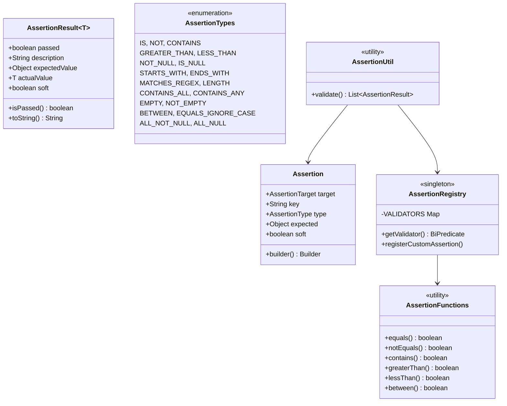
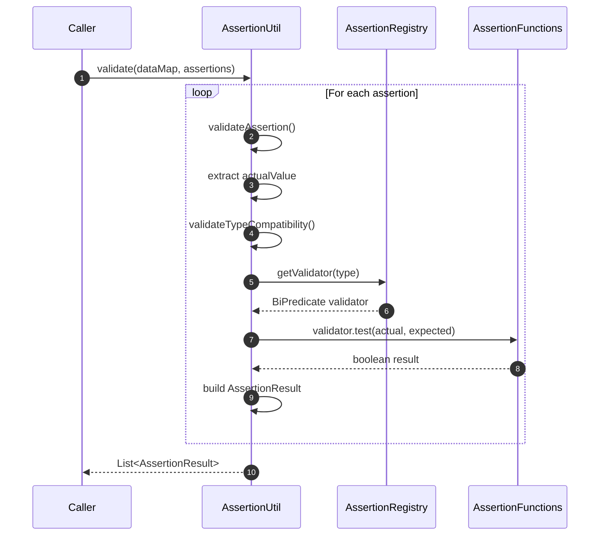

# assertions

<!-- Quick jump -->
**Start here:** [Usage — Quick Start](#usage)

## Table of Contents
- [Overview](#overview)
- [Module metadata](#module-metadata)
- [Features](#features)
- [Structure](#structure)
- [Architecture](#architecture)
  - [Class Diagram](#class-diagram)
  - [Execution Flow](#execution-flow)
    - [Core Validation Engine](#core-validation-engine)
    - [API Response Validation Integration](#api-response-validation-integration)
    - [Database Query Validation Integration](#database-query-validation-integration)
    - [UI Table Validation Integration](#ui-table-validation-integration)
- [Usage](#usage)
- [Assertion Types Reference](#assertion-types-reference)
- [Integration Examples](#integration-examples)
- [Custom Assertion Types](#custom-assertion-types)
- [Dependencies](#dependencies)
- [Author](#author)

---

## Overview
The **assertions** module is a domain-agnostic, pluggable validation engine for the Ring of Automation (ROA) framework. It provides a **strongly-typed validation language** that can be applied across various domains: API responses, database records, UI states, and more.

The module is **framework-independent** and designed to be extended or reused across adapters (`api-interactor`, `db-interactor`, `ui-interactor`).

### Module metadata
- **name:** Ring of Automation Assertion Library
- **artifactId:** assertions
- **direct dependencies (from pom.xml):**
  - org.projectlombok:lombok
  - org.junit.jupiter:junit-jupiter (test)

**Core Principles:**
- **Domain-agnostic:** Works with any data source (API, DB, UI, files, etc.)
- **Type-safe:** Compile-time and runtime type checking
- **Extensible:** Register custom assertion types at runtime
- **Declarative:** Build assertions with fluent API
- **Functional:** Pure validation functions without side effects
- **Observable:** Detailed result objects with actual vs. expected values

## Features
- **Fluent Builder API:** Create assertions with `Assertion.builder()` pattern
- **19 built-in assertion types:** Comprehensive coverage for common scenarios
- **Soft vs. Hard assertions:** Control test execution flow
- **Type compatibility validation:** Ensures assertion types match data types
- **Registry-based extensibility:** Add custom validators via `AssertionRegistry`
- **Detailed result objects:** `AssertionResult<T>` with pass/fail, actual/expected values
- **Concurrent-safe registry:** Thread-safe validator storage with `ConcurrentHashMap`

## Structure

**Package Organization:**
- `core` — Core validation types (`Assertion`, `AssertionResult`, `AssertionType`, `AssertionTypes`, `AssertionTarget`)
- `functions` — Pure validation functions (`AssertionFunctions`)
- `registry` — Validator registry (`AssertionRegistry`)
- `util` — Validation executor (`AssertionUtil`)
- `exceptions` — Custom exceptions (`InvalidAssertionException`)

**Key Classes:**

| Class | Responsibility | Key Methods |
|---|---|---|
| `Assertion` | Validation rule contract | `builder()`, getters for target, key, type, expected, soft |
| `AssertionResult<T>` | Validation outcome | `isPassed()`, `getActualValue()`, `getExpectedValue()`, `toString()` |
| `AssertionType<T>` | Assertion type marker interface | `type()`, `getSupportedType()` |
| `AssertionTypes` | 19 built-in assertion types | Enum constants with supported types |
| `AssertionTarget<T>` | Validation scope marker | `target()` |
| `AssertionFunctions` | Pure validation functions | 19 static validators |
| `AssertionRegistry` | Validator registry | `getValidator()`, `registerCustomAssertion()` |
| `AssertionUtil` | Validation executor | `validate(data, assertions)` |
| `InvalidAssertionException` | Invalid assertion error | Constructor with message |

## Architecture

### Class Diagram


### Execution Flow


#### Core Validation Engine
- **Entry point:** `AssertionUtil.validate(data, assertions)` processes a batch via stream mapping.
- **Registry lookup:** `AssertionRegistry.getValidator(type)` retrieves a `BiPredicate` from the concurrent map (pre-registered + custom).
- **Execution:** Validator `test(actual, expected)` returns boolean; results are wrapped as `AssertionResult` including soft/hard metadata.
- **Extensibility:** `AssertionRegistry.registerCustomAssertion(type, validator)` adds new validators at runtime.

#### API Response Validation Integration
- Adapter uses `RestResponseValidatorImpl.validateResponse(response, assertions)`.
- For each assertion:
  - Routes by `RestAssertionTarget` → STATUS/BODY/HEADER handlers.
  - BODY: extract value via JsonPath and `data.put(key, value)`.
  - Delegates to core `AssertionUtil.validate(data, assertions)`.

#### Database Query Validation Integration
- Adapter uses `QueryResponseValidatorImpl.validateQueryResponse(queryResponse, assertions)`.
- For each assertion:
  - Routes by `DbAssertionTarget` → NUMBER_ROWS/QUERY_RESULT/COLUMNS.
  - QUERY_RESULT: uses `JsonPathExtractor.extract(...)` to obtain value.
  - Delegates to core `AssertionUtil.validate(data, assertions)`.

#### UI Table Validation Integration
- UI adapter registers custom validators on startup via `AssertionRegistry.registerCustomAssertion(...)`.
- `UiTableValidatorImpl.validateTable(object, assertions)`:
  - Switches on `UiTablesAssertionTarget` (e.g., ROW_VALUES).
  - Extracts row values via `TableReflectionUtil` and maps into `data`.
  - Delegates to `AssertionUtil.validate(data, assertions)`.

## Usage

### Step 1 — Add dependency
```xml
<dependency>
  <groupId>io.cyborgcode.roa</groupId>
  <artifactId>assertions</artifactId>
  <version>${revision}</version>
</dependency>
```

### Step 2 — Create Assertions
```java
import io.cyborgcode.roa.validator.core.Assertion;
import static io.cyborgcode.roa.validator.core.AssertionTypes.*;

// Define target enum (domain-specific)
public enum MyTarget implements AssertionTarget<MyTarget> {
    BODY, HEADER;
    @Override
    public MyTarget target() { return this; }
}

// Equality assertion
Assertion assertion1 = Assertion.builder()
    .target(MyTarget.BODY)
    .key("user.name")
    .type(IS)
    .expected("John Doe")
    .soft(false)
    .build();

// Numeric comparison
Assertion assertion2 = Assertion.builder()
    .target(MyTarget.BODY)
    .key("user.age")
    .type(GREATER_THAN)
    .expected(18)
    .soft(false)
    .build();

// String validation
Assertion assertion3 = Assertion.builder()
    .target(MyTarget.BODY)
    .key("user.email")
    .type(CONTAINS)
    .expected("@example.com")
    .soft(true)  // Soft - continues validation
    .build();

// Collection validation
Assertion assertion4 = Assertion.builder()
    .target(MyTarget.BODY)
    .key("roles")
    .type(CONTAINS_ALL)
    .expected(List.of("admin", "user"))
    .soft(false)
    .build();
```

### Step 3 — Validate Data
```java
import io.cyborgcode.roa.validator.util.AssertionUtil;

// Prepare data map
Map<String, Object> dataMap = Map.of(
    "user.name", "John Doe",
    "user.age", 25,
    "user.email", "john@example.com",
    "roles", List.of("admin", "user", "moderator")
);

// Execute validation
List<AssertionResult<Object>> results = AssertionUtil.validate(
    dataMap,
    List.of(assertion1, assertion2, assertion3, assertion4)
);
```

### Step 4 — Process Results
```
// Check if all passed
boolean allPassed = results.stream().allMatch(AssertionResult::isPassed);

// Get failures
List<AssertionResult<Object>> failures = results.stream()
    .filter(r -> !r.isPassed())
    .toList();

// Log failures
failures.forEach(result -> {
    System.err.println("Expected: " + result.getExpectedValue());
    System.err.println("Actual: " + result.getActualValue());
    System.err.println(result.toString());
});

// Separate hard vs soft
List<AssertionResult<Object>> hardFailures = results.stream()
    .filter(r -> !r.isPassed() && !r.isSoft())
    .toList();

// Throw on hard failures
if (!hardFailures.isEmpty()) {
    throw new AssertionError("Assertions failed: " + hardFailures.size());
}
```

### Step 5 — Custom Assertions
```
import io.cyborgcode.roa.validator.registry.AssertionRegistry;

// Define custom type
public enum CustomTypes implements AssertionType<CustomTypes> {
    IS_VALID_EMAIL(String.class);
    
    private final Class<?> supportedType;
    CustomTypes(Class<?> type) { this.supportedType = type; }
    
    @Override
    public CustomTypes type() { return this; }
    
    @Override
    public Class<?> getSupportedType() { return supportedType; }
}

// Register validator
AssertionRegistry.registerCustomAssertion(
    CustomTypes.IS_VALID_EMAIL,
    (actual, expected) -> actual.toString().matches("[a-zA-Z0-9._%+-]+@[a-zA-Z0-9.-]+\\.[a-zA-Z]{2,}")
);

// Use custom assertion
Assertion custom = Assertion.builder()
    .target(MyTarget.BODY)
    .key("email")
    .type(CustomTypes.IS_VALID_EMAIL)
    .expected(true)
    .build();
```

## Assertion Types Reference

### Equality Assertions
- **`IS`** — Exact equality (`Objects.equals()`)
  - Supported: `Object.class`
  - Example: `.type(IS).expected("value")`
  
- **`NOT`** — Not equal
  - Supported: `Object.class`
  - Example: `.type(NOT).expected("other")`
  
- **`EQUALS_IGNORE_CASE`** — Case-insensitive string equality
  - Supported: `String.class`
  - Example: `.type(EQUALS_IGNORE_CASE).expected("VALUE")`

### Comparison Assertions
- **`GREATER_THAN`** — Numeric > comparison
  - Supported: `Number.class`
  - Example: `.type(GREATER_THAN).expected(18)`
  
- **`LESS_THAN`** — Numeric < comparison
  - Supported: `Number.class`
  - Example: `.type(LESS_THAN).expected(100)`
  
- **`BETWEEN`** — Inclusive range check
  - Supported: `Number.class`
  - Example: `.type(BETWEEN).expected(List.of(0, 100))`

### String Assertions
- **`CONTAINS`** — Substring match
  - Supported: `String.class`
  - Example: `.type(CONTAINS).expected("substring")`
  
- **`STARTS_WITH`** — Prefix match
  - Supported: `String.class`
  - Example: `.type(STARTS_WITH).expected("http://")`
  
- **`ENDS_WITH`** — Suffix match
  - Supported: `String.class`
  - Example: `.type(ENDS_WITH).expected(".com")`
  
- **`MATCHES_REGEX`** — Regex pattern match
  - Supported: `String.class`
  - Example: `.type(MATCHES_REGEX).expected("\\d{3}-\\d{4}")`
  
- **`LENGTH`** — String or collection length
  - Supported: `Object.class`
  - Example: `.type(LENGTH).expected(10)`

### Collection Assertions
- **`CONTAINS_ALL`** — All elements present
  - Supported: `Collection.class`
  - Example: `.type(CONTAINS_ALL).expected(List.of("a", "b"))`
  
- **`CONTAINS_ANY`** — At least one element present
  - Supported: `Collection.class`
  - Example: `.type(CONTAINS_ANY).expected(List.of("a", "b"))`
  
- **`EMPTY`** — Collection is empty
  - Supported: `Collection.class`
  - Example: `.type(EMPTY).expected(true)`
  
- **`NOT_EMPTY`** — Collection is not empty
  - Supported: `Collection.class`
  - Example: `.type(NOT_EMPTY).expected(true)`

### Null Assertions
- **`NOT_NULL`** — Value is not null
  - Supported: `Object.class`
  - Example: `.type(NOT_NULL).expected(true)`
  
- **`IS_NULL`** — Value is null
  - Supported: `Object.class`
  - Example: `.type(IS_NULL).expected(true)`
  
- **`ALL_NOT_NULL`** — All collection items not null
  - Supported: `Collection.class`
  - Example: `.type(ALL_NOT_NULL).expected(true)`
  
- **`ALL_NULL`** — All collection items null
  - Supported: `Collection.class`
  - Example: `.type(ALL_NULL).expected(true)`

## Integration Examples

### API Response Validation
```java
public class RestResponseValidatorImpl {
    
    public List<AssertionResult<Object>> validate(Response response, Assertion... assertions) {
        Map<String, Object> dataMap = new HashMap<>();
        
        for (Assertion assertion : assertions) {
            String key = assertion.getKey();
            dataMap.put(key, JsonPath.read(response.body(), "$." + key));
        }
        
        return AssertionUtil.validate(dataMap, List.of(assertions));
    }
}

// Usage
Assertion[] apiAssertions = {
    Assertion.builder().target(BODY).key("user.id").type(NOT_NULL).expected(true).build(),
    Assertion.builder().target(BODY).key("user.email").type(CONTAINS).expected("@").build()
};
```

### Database Query Validation
```java
public class QueryResponseValidatorImpl {
    
    public List<AssertionResult<Object>> validate(QueryResponse response, Assertion... assertions) {
        Map<String, Object> dataMap = new HashMap<>();
        
        for (Assertion assertion : assertions) {
            dataMap.put(assertion.getKey(), response.getValue(assertion.getKey()));
        }
        
        return AssertionUtil.validate(dataMap, List.of(assertions));
    }
}
```

### UI Element Validation
```java
public class UiValidatorImpl {
    
    public List<AssertionResult<Object>> validate(SmartWebElement element, Assertion... assertions) {
        Map<String, Object> dataMap = Map.of(
            "text", element.getText(),
            "isEnabled", element.isEnabled(),
            "isDisplayed", element.isDisplayed()
        );
        
        return AssertionUtil.validate(dataMap, List.of(assertions));
    }
}
```

## Custom Assertion Types

### Example: API-Specific Assertions
```
// Define custom types
public enum ApiAssertionTypes implements AssertionType<ApiAssertionTypes> {
    JSON_SCHEMA_VALID(String.class),
    RESPONSE_TIME_UNDER(Number.class);
    
    private final Class<?> supportedType;
    ApiAssertionTypes(Class<?> type) { this.supportedType = type; }
    
    @Override
    public ApiAssertionTypes type() { return this; }
    
    @Override
    public Class<?> getSupportedType() { return supportedType; }
}

// Register validators
AssertionRegistry.registerCustomAssertion(
    ApiAssertionTypes.JSON_SCHEMA_VALID,
    (actual, expected) -> JsonSchemaValidator.validate(actual.toString(), expected.toString())
);

AssertionRegistry.registerCustomAssertion(
    ApiAssertionTypes.RESPONSE_TIME_UNDER,
    (actual, expected) -> ((Number) actual).longValue() < ((Number) expected).longValue()
);

// Use in tests
Assertion assertion = Assertion.builder()
    .target(MyTarget.BODY)
    .key("responseTime")
    .type(ApiAssertionTypes.RESPONSE_TIME_UNDER)
    .expected(1000)
    .build();
```

## Dependencies
- `org.projectlombok:lombok` — Boilerplate reduction
- `org.junit.jupiter:junit-jupiter` — Testing (test scope)

## Author
**Cyborg Code Syndicate 💍👨💻**
