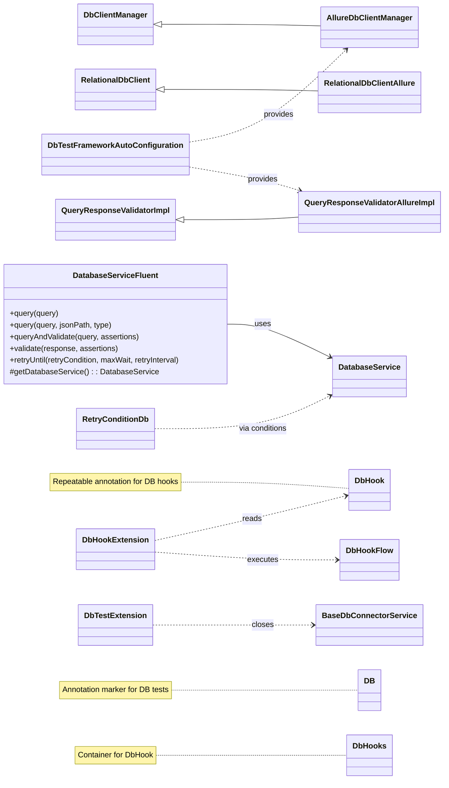
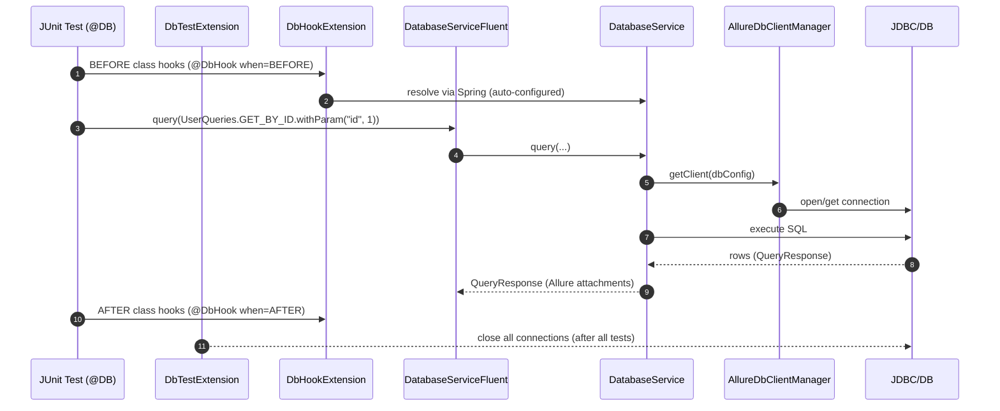

# db-interactor-test-framework-adapter

<!-- Quick jump -->
**Start here:** [Usage - Quick Start (step-by-step)](#usage)

## Table of Contents
- [Overview](#overview)
- [Module metadata](#module-metadata)
- [Features](#features)
- [Structure](#structure)
- [Architecture](#architecture)
    - [Class Diagram](#class-diagram)
    - [Execution Flow](#execution-flow)
        - [Adapter Runtime Flow](#adapter-runtime-flow)
        - [Test Bootstrap & JUnit Integration](#test-bootstrap--junit-integration)
        - [Fluent Query & Storage](#fluent-query--storage)
        - [Allure Reporting Integration](#allure-reporting-integration)
        - [Hook Processing (BEFORE/AFTER)](#hook-processing-beforeafter)
        - [Retry for Eventual Consistency](#retry-for-eventual-consistency)
- [Usage](#usage)
    - [Step 1 - Add dependency](#step-1---add-dependency)
    - [Step 2 - Configure environment](#step-2---configure-environment)
    - [Step 3 - Enable the adapter on tests](#step-3---enable-the-adapter-on-tests)
    - [Step 4 - Call the fluent API](#step-4---call-the-fluent-api)
    - [Step 5 - Execute queries with validation](#step-5---execute-queries-with-validation)
    - [Step 6 - Retry until data appears](#step-6---retry-until-data-appears)
    - [Step 7 - Use hooks for setup/cleanup](#step-7---use-hooks-for-setupcleanup)
- [Annotations & Hooks](#annotations--hooks)
- [Retry Helpers](#retry-helpers)
- [Allure Reporting](#allure-reporting)
- [Adapter Configuration](#adapter-configuration)
- [Dependencies](#dependencies)
- [Author](#author)

---

## Overview
The **db-interactor-test-framework-adapter** layers **test-facing ergonomics** on top of `db-interactor`. It provides a fluent API (`DatabaseServiceFluent`) for chaining `query`, `query(jsonPath, type)`, `queryAndValidate`, `validate`, and `retryUntil`. It also ships **JUnit 5 enablement** via the `@DB` annotation and extensions, **Allure bridges** that attach executed SQL, duration, and validation data (`AllureDbClientManager`, `RelationalDbClientAllure`, `QueryResponseValidatorAllureImpl`), **hook** processing (`@DbHook`, `DbHookExtension`), **retry** utilities (`RetryConditionDb`), and light **storage** helpers. Spring **auto-configuration** wires the Allure-enabled beans so database tests become **declarative, observable, and resilient**.

### Module metadata
- **name:** Ring of Automation Database Test Framework
- **artifactId:** db-interactor-test-framework-adapter
- **direct dependencies:**
    - io.cyborgcode.roa:test-framework
    - io.cyborgcode.roa:db-interactor

## Features
- **Fluent chaining:** `DatabaseServiceFluent` -> `query`, `query(jsonPath, type)`, `queryAndValidate`, `validate`, `retryUntil`.
- **Allure integration:**
    - `AllureDbClientManager` (creates `RelationalDbClientAllure`),
    - `RelationalDbClientAllure` (attaches SQL + duration + rows),
    - `QueryResponseValidatorAllureImpl` (attaches validation data).
- **JUnit 5 bootstrap:** `@DB` applies `DbTestExtension` (closes connections) + `DbHookExtension` (runs hooks), scans `.db`.
- **Hooks:** `@DbHook` / `@DbHooks` driving enum-backed `DbHookFlow` implementations.
- **Retry helpers:** `RetryConditionDb` (`queryReturnsRows`, `queryReturnsValueForField`) to combine with `retryUntil(...)`.
- **Spring auto-config:** `DbTestFrameworkAutoConfiguration` exposes @Primary beans for Allure client manager and validator.
- **Storage integration:** results are stored under `StorageKeysDb.DB` keyed by your query enum.

## Structure

### Key Classes

| Class | Responsibility | Key methods | Used by |
|---|---|---|---|
| `DatabaseServiceFluent` | Fluent facade for database operations with quest integration and storage. | `query(DbQuery)`, `query(DbQuery, jsonPath, type)`, `queryAndValidate(...)`, `validate(...)`, `retryUntil(...)`, `getDatabaseService()` | Tests, app services, adapters |
| `AllureDbClientManager` | Client manager that creates Allure-enhanced `RelationalDbClient` instances for reporting. | `initializeDbClient(dbConfig)` | Spring context, `DatabaseService` |
| `RelationalDbClientAllure` | Allure-enhanced DB client that logs SQL, duration, and results as Allure steps/attachments. | `printQuery(String)`, `printResponse(String, QueryResponse, long)`, `addAttachmentIfPresent(...)` | `AllureDbClientManager` |
| `QueryResponseValidatorAllureImpl` | Allure-enhanced validator that attaches validation target data to reports. | `printAssertionTarget(Map)` | `DatabaseService` |
| `RetryConditionDb` | Factory for database-specific retry conditions (eventual consistency scenarios). | `queryReturnsRows(query)`, `queryReturnsValueForField(query, jsonPath, value)` | Test code, `DatabaseServiceFluent` |
| `DbHookFlow<T>` | Contract for database hook implementations (BEFORE/AFTER class execution). | `flow()`, `enumImpl()` | Custom hook enums, `DbHookExtension` |
| `DbTestExtension` | JUnit 5 extension that closes all database connections after all tests. | `afterAll(ExtensionContext)` | `@DB` annotation |
| `DbHookExtension` | JUnit 5 extension that processes `@DbHook` annotations and executes hook flows. | `beforeAll(ExtensionContext)`, `afterAll(ExtensionContext)` | `@DB` annotation |
| `StorageKeysDb` | Enum defining storage keys for database query responses within the quest storage system. | `DB` | `DatabaseServiceFluent`, test code |
| `DbTestFrameworkAutoConfiguration` | Spring auto-configuration that wires Allure-enhanced beans as primary implementations. | `dbClientManager(...)`, `queryResponseValidator(...)` | Spring Boot applications |

---

### Package: `io.cyborgcode.roa.db.service.fluent`

| Class | Responsibility | Key methods | Used by |
|---|---|---|---|
| `DatabaseServiceFluent` | Fluent service extending `FluentService` with database-specific operations and quest storage integration. | `query(DbQuery)`, `query(DbQuery, jsonPath, type)`, `queryAndValidate(DbQuery, assertions)`, `validate(QueryResponse, assertions)`, `validate(Runnable)`, `validate(Consumer<SoftAssertions>)`, `retryUntil(...)`, `getDatabaseService()` | Tests, `@Ring` injection, quest chains |

---

### Package: `io.cyborgcode.roa.db.allure`

| Class | Responsibility | Key methods | Used by |
|---|---|---|---|
| `AllureDbClientManager` | Extends `DbClientManager` to create Allure-enhanced database clients. | `initializeDbClient(DatabaseConfiguration)` | `DatabaseService`, Spring DI |
| `RelationalDbClientAllure` | Extends `RelationalDbClient` with Allure step logging and attachments for SQL execution. | `printQuery(String query)`, `printResponse(String query, QueryResponse response, long duration)`, `addAttachmentIfPresent(String name, String content)` | `AllureDbClientManager` |
| `QueryResponseValidatorAllureImpl` | Extends `QueryResponseValidatorImpl` with Allure logging for validation targets. | `printAssertionTarget(Map<String, Object> data)` | `DatabaseService` |

---

### Package: `io.cyborgcode.roa.db.annotations`

| Class | Responsibility | Key methods | Used by |
|---|---|---|---|
| `@DB` | Class-level annotation marking database tests, applies `DbTestExtension` and `DbHookExtension`, scans adapter packages. | N/A (annotation) | Test classes |
| `@DbHook` | Repeatable annotation defining database hooks (BEFORE/AFTER) with type, arguments, and order. | `when()`, `type()`, `arguments()`, `order()` | Test classes, `DbHookExtension` |
| `@DbHooks` | Container annotation for multiple `@DbHook` declarations. | `value()` | Test classes |

---

### Package: `io.cyborgcode.roa.db.extensions`

| Class | Responsibility | Key methods | Used by |
|---|---|---|---|
| `DbTestExtension` | JUnit 5 `AfterAllCallback` that closes all database connections after test class execution. | `afterAll(ExtensionContext)` | `@DB` annotation |
| `DbHookExtension` | JUnit 5 extension (`BeforeAllCallback`, `AfterAllCallback`) that discovers and executes `@DbHook` flows. | `beforeAll(ExtensionContext)`, `afterAll(ExtensionContext)` | `@DB` annotation |

---

### Package: `io.cyborgcode.roa.db.hooks`

| Class | Responsibility | Key methods | Used by |
|---|---|---|---|
| `DbHookFlow<T>` | Interface for database hook implementations returning a `TriConsumer` for execution logic. | `flow()`, `enumImpl()` | App hook enums, `DbHookExtension` |

---

### Package: `io.cyborgcode.roa.db.retry`

| Class | Responsibility | Key methods | Used by |
|---|---|---|---|
| `RetryConditionDb` | Static factory for database-specific `RetryCondition` instances. | `queryReturnsRows(DbQuery)`, `queryReturnsValueForField(DbQuery, jsonPath, value)` | Test code, `DatabaseServiceFluent.retryUntil(...)` |

---

### Package: `io.cyborgcode.roa.db.storage`

| Class | Responsibility | Key methods | Used by |
|---|---|---|---|
| `StorageKeysDb` | Enum with storage key `DB` for sub-storage of query responses in quest context. | `DB` | `DatabaseServiceFluent`, test code |

---

### Package: `io.cyborgcode.roa.db.config`

| Class | Responsibility | Key methods | Used by |
|---|---|---|---|
| `DbTestFrameworkAutoConfiguration` | Spring `@Configuration` that registers Allure-enhanced beans as `@Primary` implementations. | `dbClientManager(AllureDbClientManager)`, `queryResponseValidator(QueryResponseValidatorAllureImpl)` | Spring Boot test context |

---

> **Depends on:** all types from **db-interactor** (`DatabaseService`, `DbQuery`, `QueryResponse`, `DatabaseConfiguration`, `BaseDbConnectorService`, etc.) and **test-framework** (`FluentService`, `Quest`, `RetryCondition`, `@Ring`, etc.).

## Architecture

### Class Diagram
<details>
<summary>Class Diagram (Mermaid)</summary>



</details>

### Execution Flow
#### Adapter Runtime Flow
<details>
<summary>Adapter Runtime Flow (Mermaid)</summary>



</details>

#### Test Bootstrap & JUnit Integration
- **@DB annotation** registers JUnit 5 extensions: `DbTestExtension`, `DbHookExtension`.
- **DbTestFrameworkAutoConfiguration** marks Allure beans as `@Primary` and scans `io.cyborgcode.roa.db`.
- **DbTestExtension.afterAll()** retrieves `BaseDbConnectorService` from Spring context and closes all DB connections after the test class execution completes.
- **DbHookExtension.beforeAll()/afterAll()** discovers `@DbHook` annotations on the test class, resolves enum-based `DbHookFlow` implementations via reflection, and executes them based on `when` (BEFORE/AFTER) and `order` attributes.

#### Fluent Query & Storage
- **DatabaseServiceFluent.query(query):** delegates to `DatabaseService.query`, stores `QueryResponse` in quest storage under `StorageKeysDb.DB` sub-storage keyed by `query.enumImpl()`.
- **query(query, jsonPath, type):** executes query, extracts value via JSONPath, stores extracted value in `StorageKeysDb.DB` sub-storage.
- **queryAndValidate(query, assertions):** executes query, stores response, immediately validates and returns results.
- **validate(response, assertions)** delegates to `databaseService.validate(response, assertions)` and processes assertion results through fluent validation handler.

#### Allure Reporting Integration
- **DbTestFrameworkAutoConfiguration:** exposes `@Primary` beans so Allure-enhanced components are used by default in Spring context.
- **AllureDbClientManager:** extends `DbClientManager` and overrides `initializeDbClient(...)` to create `RelationalDbClientAllure` instances.
- **RelationalDbClientAllure:**
    - Intercepts `printQuery(...)` to create Allure steps for SQL execution.
    - Intercepts `printResponse(...)` to attach executed SQL, duration (ms), and result rows as Allure attachments.
- **QueryResponseValidatorAllureImpl:** intercepts `printAssertionTarget(...)` to attach validation target data map to Allure for traceability.

#### Hook Processing (BEFORE/AFTER)
- **@DbHook / @DbHooks** on a test class declare setup/cleanup flows with `type`, `when`, `arguments`, and `order` attributes.
- **DbHookExtension** filters hooks by `when` (BEFORE/AFTER), sorts by `order` (ascending), resolves `DbHookFlow` enum implementation via reflection from `project.packages`, and executes `flow().accept(DatabaseService, hooksStorage, arguments)`.
- Hooks share a mutable `Map<Object, Object>` across all hook executions within the test class lifecycle, enabling data passing between hooks.

#### Retry for Eventual Consistency
- **RetryConditionDb** provides ready-made conditions such as `queryReturnsRows(query)` and `queryReturnsValueForField(query, jsonPath, expected)` to be used with `DatabaseServiceFluent.retryUntil(...)`.
- **queryReturnsRows(query):** creates a `RetryCondition<Boolean>` that evaluates to true when the query returns at least one row.
- **queryReturnsValueForField(query, jsonPath, expected):** creates a `RetryCondition<Object>` that polls until extracted field equals expected value.

---

## Usage

> Follow these steps in your **app-specific test module**. This module is part of the Ring of Automation (ROA) stack, so the examples below show the **typical usage** via the ROA Quest DSL (`BaseQuest`, `Quest`, `Rings.RING_OF_DB`).

### Step 1 - Add dependency
<details>
<summary>Maven dependency</summary>

```xml
<dependency>
  <groupId>io.cyborgcode.roa</groupId>
  <artifactId>db-interactor-test-framework-adapter</artifactId>
  <version>${revision}</version>
</dependency>
```

</details>

### Step 2 - Configure environment
This adapter does not introduce new Owner keys.  
It reuses `DbConfig` from `db-interactor` and primarily needs your project packages for reflection  
(e.g., to locate `DbHookFlow` enums and `DbType` implementations).

**Load order:** system properties + `classpath:${db.config.file}.properties`

<details>
<summary>Properties example</summary>

```properties
# src/test/resources/db-config.properties
project.packages=io.cyborgcode.mytests;io.cyborgcode.myhooks
db.default.type=POSTGRES
db.default.host=localhost
db.default.port=5432
db.default.name=appdb
db.default.username=app_user
db.default.password=secret

# Optional: Full JDBC URL (overrides host/port/name)
# db.full.connection.string=jdbc:postgresql://localhost:5432/appdb?ssl=true

# For H2 in-memory testing:
# db.default.type=H2
# db.full.connection.string=jdbc:h2:mem:testdb;DB_CLOSE_DELAY=-1;MODE=PostgreSQL
# db.default.username=sa
# db.default.password=
```

</details>
Run tests with:
<details>
<summary>Run with system property</summary>

```
-Ddb.config.file=db-config
```

</details>

### Step 3 - Enable the adapter on tests
Annotate your JUnit test class with `@DB` to activate extensions and scanning.

<details>
<summary>Java example</summary>

```java
@DB
class DataBaseTest extends BaseQuest {
  // your tests...
}
```

</details>

### Step 4 - Call the fluent API

In ROA-based test suites you usually don't call `DatabaseServiceFluent` directly.  
Instead, you obtain it through the Quest DSL by using a **ring**.  
In the example project, the "DB ring" is defined like this:

<details>
<summary>Java snippet</summary>

```java
public static final Class<DatabaseServiceFluent> RING_OF_DB = DatabaseServiceFluent.class;
```

</details>

and then used in tests as shown below:

<details>
<summary>Java snippet</summary>

```java
quest
      .use(RING_OF_DB)
      .query(QUERY_ORDER.withParam("id", 1))
      .complete();
```

</details>

**How it works:**
- `quest.use(RING_OF_DB)` retrieves the registered `DatabaseServiceFluent` instance from the quest's ring registry.
- All subsequent database operations are chained on this fluent service.
- Results are automatically stored in quest storage under `StorageKeysDb.DB` keyed by query enum.

### Step 5 - Execute queries with validation

The adapter provides multiple ways to execute and validate database queries:

#### 5.1 Simple query execution
Execute a query and store the result in quest storage:
<details>
<summary>Java snippet</summary>

```java
quest
      .use(RING_OF_DB)
      .query(QUERY_ORDER.withParam("id", 1))
      .complete();
```

</details>
The `QueryResponse` is stored in `StorageKeysDb.DB` sub-storage keyed by `QUERY_ORDER` enum.

#### 5.2 Query with JSONPath extraction
Execute a query, extract a specific value, and store it:
<details>
<summary>Java snippet</summary>

```java
quest
      .use(RING_OF_DB)
      .query(QUERY_ORDER.withParam("id", 1), "$.product", String.class)
      .complete();
```

</details>
The extracted `String` value is stored instead of the full `QueryResponse`.

#### 5.3 Query and validate in one step
Execute a query and immediately validate the response:
<details>
<summary>Java snippet</summary>

```java
quest
      .use(RING_OF_DB)
      .queryAndValidate(
            QUERY_ORDER.withParam("id", 1),
            Assertion.builder()
                  .target(NUMBER_ROWS)
                  .type(IS)
                  .expected(1)
                  .soft(true)
                  .build()
      )
      .complete();
```

</details>

#### 5.4 Validate stored query response
Retrieve a previously executed query response from storage and validate it:
<details>
<summary>Java snippet</summary>

```java
quest
      .use(RING_OF_DB)
      .query(QUERY_ORDER.withParam("id", 1))
      .validate(retrieve(StorageKeysDb.DB, QUERY_ORDER, QueryResponse.class),
            Assertion.builder()
                  .target(QUERY_RESULT)
                  .key("$[0].product")
                  .type(EQUALS_IGNORE_CASE)
                  .expected("Bread")
                  .soft(true)
                  .build()
      )
      .complete();
```

</details>

#### 5.5 Complete example from real test
This example demonstrates database validation within a test execution flow:
<details>
<summary>JUnit example</summary>

```java
@Test
void orderDatabaseValidation(Quest quest) {
   quest
         .use(RING_OF_DB)
         .query(QUERY_ORDER.withParam("id", 1))
         .validate(retrieve(StorageKeysDb.DB, QUERY_ORDER, QueryResponse.class),
               Assertion.builder()
                     .target(QUERY_RESULT)
                     .key(DbResponsesJsonPaths.PRODUCT_BY_ID.getJsonPath(1))
                     .type(CONTAINS_ALL)
                     .expected(List.of("Bread", "Bun"))
                     .soft(true)
                     .build(),
               Assertion.builder()
                     .target(QUERY_RESULT)
                     .key(DbResponsesJsonPaths.LOCATION_BY_ID.getJsonPath(1))
                     .type(CONTAINS_ALL)
                     .expected(List.of("Bakery", "Store"))
                     .soft(true)
                     .build()
         )
         .complete();
}
```

</details>

**Note:** In your project, you can create a helper class like `DbResponsesJsonPaths` (an enum with JSONPath expressions) to make your database assertions more readable and maintainable. This class encapsulates JSONPath strings with formatting support, allowing you to write `DbResponsesJsonPaths.PRODUCT_BY_ID.getJsonPath(1)` instead of raw strings like `"$[?(@.ID == 1)].PRODUCT"`.

<details>
<summary>Example: DbResponsesJsonPaths helper enum</summary>

```java
public enum DbResponsesJsonPaths {
   PRODUCT("$[%d].PRODUCT"),
   PRODUCT_BY_ID("$[?(@.ID == %d)].PRODUCT"),
   LOCATION("$[%d].LOCATION"),
   LOCATION_BY_ID("$[?(@.ID == %d)].LOCATION");

   private final String jsonPath;

   DbResponsesJsonPaths(String jsonPath) {
      this.jsonPath = jsonPath;
   }

   public String getJsonPath(Object... args) {
      return args.length > 0 ? String.format(jsonPath, args) : jsonPath;
   }
}
```

</details>

**Key points:**
- `retrieve(StorageKeysDb.DB, QUERY_ORDER, QueryResponse.class)` fetches the stored query response.
- Multiple assertions can be chained in a single `validate(...)` call.
- `QUERY_RESULT` target uses JSONPath expressions to extract values from result rows.
- `DbResponsesJsonPaths` is a project-specific helper enum that centralizes JSONPath expressions for better maintainability.
- `soft(true)` allows test to continue even if assertion fails (collected at `complete()`).

### Step 6 - Retry until data appears

The adapter provides `RetryConditionDb` for eventual consistency scenarios where data may not be immediately available.

#### 6.1 Wait until query returns rows
<details>
<summary>Java snippet</summary>

```java
quest
      .use(RING_OF_DB)
      .retryUntil(
            queryReturnsRows(USER_QUERIES.GET_BY_ID.withParam("id", 42)),
            Duration.ofSeconds(30),
            Duration.ofSeconds(2)
      )
      .complete();
```

</details>

#### 6.2 Wait until specific field value matches
<details>
<summary>Java snippet</summary>

```java
quest
      .use(RING_OF_DB)
      .retryUntil(
            queryReturnsValueForField(
                  ORDER_STATUS.withParam("orderId", orderId),
                  "$[0].status",
                  "COMPLETED"
            ),
            Duration.ofSeconds(30),
            Duration.ofSeconds(2)
      )
      .complete();
```

</details>

**How it works:**
- The condition is evaluated repeatedly with the specified interval.
- If the condition is met before timeout, execution continues.
- If timeout is reached, the retry mechanism throws an exception.
- All query executions during retry are logged and attached to Allure.

### Step 7 - Use hooks for setup/cleanup

Hooks allow you to run database setup or cleanup logic once per test class, before or after all tests execute.

#### 7.1 Define hook flow enum
Create an enum implementing `DbHookFlow<T>`:

<details>
<summary>Example: DbHookFlow enum (hook flows)</summary>

```java
public enum DbHookFlows implements DbHookFlow<DbHookFlows> {
    
    INITIALIZE_H2 {
        @Override
        public TriConsumer<DatabaseService, Map<Object, Object>, String[]> flow() {
            return (databaseService, storage, args) -> {
                // Create schema
                databaseService.query(CREATE_SCHEMA);
                // Insert seed data
                databaseService.query(INSERT_SEED_DATA);
            };
        }
    },
    
    CLEANUP_TEST_DATA {
        @Override
        public TriConsumer<DatabaseService, Map<Object, Object>, String[]> flow() {
            return (databaseService, storage, args) -> {
                databaseService.query(DELETE_ALL_ORDERS);
                databaseService.query(DELETE_ALL_USERS);
            };
        }
    };

    @Override
    public DbHookFlows enumImpl() {
        return this;
    }
    
    public static final class Data {
        public static final String INITIALIZE_H2 = "INITIALIZE_H2";
        public static final String CLEANUP_TEST_DATA = "CLEANUP_TEST_DATA";
    }
}
```

</details>

#### 7.2 Apply hooks to test class
<details>
<summary>JUnit example</summary>

```java
@DB
@DbHook(when = BEFORE, type = DbHookFlows.Data.INITIALIZE_H2)
@DbHook(when = AFTER, type = DbHookFlows.Data.CLEANUP_TEST_DATA)
class DataBaseTest extends BaseQuest {
    
    @Test
    void myDatabaseTest(Quest quest) {
        // INITIALIZE_H2 hook ran before this
        quest
              .use(RING_OF_DB)
              .query(SELECT_ALL_USERS)
              .complete();
        // CLEANUP_TEST_DATA hook will run after all tests
    }
}
```

</details>

#### 7.3 Hooks with arguments and order
<details>
<summary>Java example</summary>

```java
@DbHook(when = BEFORE, type = "SEED_USERS", arguments = {"admin", "user"}, order = 1)
@DbHook(when = BEFORE, type = "SEED_ORDERS", order = 2)
@DbHook(when = AFTER, type = "CLEANUP", order = 1)
class OrderTests extends BaseQuest {
    // Hooks execute in order: SEED_USERS (1) -> SEED_ORDERS (2) -> tests -> CLEANUP (1)
}
```

</details>

**Hook execution details:**
- Hooks with `when = BEFORE` run once before any test in the class.
- Hooks with `when = AFTER` run once after all tests in the class.
- Multiple hooks with the same `when` value are sorted by `order` (ascending).
- Hooks share a `Map<Object, Object>` storage for passing data between hook executions.
- Hook resolution uses reflection to find enum constants from `project.packages`.

## Annotations & Hooks
- `@DB` — applies JUnit 5 extensions for DB tests and scans the adapter packages (`io.cyborgcode.roa.db`).
- `@DbHook(when, type, arguments, order)` / `@DbHooks` — run **BEFORE/AFTER** class hook flows; implement `DbHookFlow` to register custom database hook logic (executed with a shared `Map<Object,Object>` and a `DatabaseService`).

## Retry Helpers
`RetryConditionDb` provides ready-made `RetryCondition`s to use with `DatabaseServiceFluent.retryUntil(...)`:
- `queryReturnsRows(query)` — polls until the query returns at least one row.
- `queryReturnsValueForField(query, jsonPath, expected)` — polls until the extracted field (via JSONPath) equals `expected`.

## Allure Reporting
The adapter provides comprehensive Allure integration through three enhanced components:

### Query Execution Reporting
**RelationalDbClientAllure** (extends `RelationalDbClient`):
- Creates an Allure step for each SQL query execution with format: `"Executing SQL query: [SQL]"`
- Attaches the following data to Allure reports:
    - **Executed SQL** - the full SQL statement sent to the database
    - **Duration (ms)** - query execution time in milliseconds
    - **Result Rows** - formatted result set (if rows are returned)
- Automatically highlights slow queries in logs (inherited from `RelationalDbClient`)

### Validation Reporting
**QueryResponseValidatorAllureImpl** (extends `QueryResponseValidatorImpl`):
- Creates Allure step for validation: `"Validating query response with [N] assertion(s)"`
- Attaches **Data to be validated** - the extracted validation target map showing:
    - Row counts for `NUMBER_ROWS` assertions
    - Extracted JSONPath values for `QUERY_RESULT` assertions
    - Column names for `COLUMNS` assertions
- Makes debugging assertion failures easier by showing exactly what was validated

### Client Management
**AllureDbClientManager** (extends `DbClientManager`):
- Ensures all database clients are Allure-enhanced by default
- Maintains client caching per database configuration
- Automatically wired as `@Primary` bean via `DbTestFrameworkAutoConfiguration`

### Example Allure Output
When you run:
<details>
<summary>Java snippet</summary>

```java
quest.use(RING_OF_DB)
     .query(QUERY_ORDER.withParam("id", 1))
     .validate(retrieve(StorageKeysDb.DB, QUERY_ORDER, QueryResponse.class),
           Assertion.builder()
                 .target(QUERY_RESULT)
                 .key("$[0].product")
                 .type(EQUALS_IGNORE_CASE)
                 .expected("Bread")
                 .build()
     )
     .complete();
```

</details>

Allure report will show:
1. **Step:** "Executing SQL query: SELECT * FROM orders WHERE id = 1"
2. **Attachments:**
    - Executed SQL: `SELECT * FROM orders WHERE id = 1`
    - Duration (ms): `45`
    - Result Rows: `[{id=1, product=Bread, location=Store, ...}]`
3. **Step:** "Validating query response with 1 assertion(s)"
4. **Attachment:**
    - Data to be validated: `{$[0].product=Bread}`

## Adapter Configuration
The adapter uses Spring auto-configuration to wire Allure-enhanced beans automatically:

<details>
<summary>Example: Adapter Spring auto-configuration</summary>

```java
@Configuration
@ComponentScan(basePackages = {"io.cyborgcode.roa.db"})
public class DbTestFrameworkAutoConfiguration {

  /**
   * Provides the primary database client manager.
   * Uses AllureDbClientManager to enable database interactions
   * with enhanced logging and reporting for Allure.
   */
  @Bean
  @Primary
  public DbClientManager dbClientManager(AllureDbClientManager allureDbClientManager) {
    return allureDbClientManager;
  }

  /**
   * Provides the primary query response validator.
   * Uses QueryResponseValidatorAllureImpl to enhance query validation
   * with Allure reporting capabilities.
   */
  @Bean
  @Primary
  public QueryResponseValidator queryResponseValidator(QueryResponseValidatorAllureImpl impl) {
    return impl;
  }
}
```

</details>

**Key points:**
- `@ComponentScan` automatically discovers all adapter components in `io.cyborgcode.roa.db` package.
- `@Primary` beans ensure Allure-enhanced implementations are used instead of standard ones from `db-interactor`.
- No additional configuration is needed - just add `@DB` annotation to your test class.
- Works seamlessly with Spring Boot test context.

**Overriding beans:** If you need custom implementations, define your own beans without `@Primary`:
<details>
<summary>JUnit example</summary>

```java
@TestConfiguration
public class CustomDbTestConfig {
  
  @Bean
  public DbClientManager customDbClientManager() {
    // Your custom implementation
    return new MyCustomDbClientManager();
  }
}
```

</details>

---

## Dependencies

### Required Dependencies
- **io.cyborgcode.roa:db-interactor** *(required)* - Core database interaction library
- **io.cyborgcode.roa:test-framework** *(required)* - Core test framework with `FluentService`, `Quest`, `@Ring`
- **org.junit.jupiter:junit-jupiter** *(required)* - JUnit 5 for `@Test`, extensions

### Optional Dependencies (Allure)
- **io.qameta.allure:allure-java-commons** *(optional)* - Base Allure attachments and steps
- **io.qameta.allure:allure-junit5** *(optional)* - Allure + JUnit 5 integration

*If Allure is not on classpath, the adapter still works but without enhanced reporting.*

### Spring Dependencies
- **org.springframework:spring-context** *(optional)* - DI and auto-configuration
- **org.springframework.boot:spring-boot-starter** *(optional)* - Spring Boot integration
- **org.springframework:spring-test** *(optional)* - JUnit 5 SpringExtension for test context

### Transitive Dependencies (from db-interactor)
- **com.fasterxml.jackson.core:jackson-databind** - JSON processing for query responses
- **com.jayway.jsonpath:json-path** - JSONPath extraction from query results
- **io.cyborgcode.roa:assertions** - Assertion framework with `Assertion`, `AssertionResult`
- **org.aeonbits.owner:owner** - Configuration management
- **io.cyborgcode.utilities:commons** - Common utilities

### JDBC Drivers
Add the JDBC driver for your database:

<details>
<summary>Maven dependency</summary>

```xml
<!-- PostgreSQL -->
<dependency>
  <groupId>org.postgresql</groupId>
  <artifactId>postgresql</artifactId>
  <version>42.7.1</version>
</dependency>

<!-- H2 (for testing) -->
<dependency>
  <groupId>com.h2database</groupId>
  <artifactId>h2</artifactId>
  <version>2.2.224</version>
  <scope>test</scope>
</dependency>

<!-- MySQL -->
<dependency>
  <groupId>com.mysql</groupId>
  <artifactId>mysql-connector-j</artifactId>
  <version>8.2.0</version>
</dependency>
```

</details>

### Test Dependencies
- **org.assertj:assertj-core** *(tests)* - Fluent assertions used by `SoftAssertions`
- **org.mockito:mockito-core** *(tests)* - Mocking framework
- **org.projectlombok:lombok** *(optional)* - Code generation for reduced boilerplate

---

## Author
**Cyborg Code Syndicate 💍👨💻**
