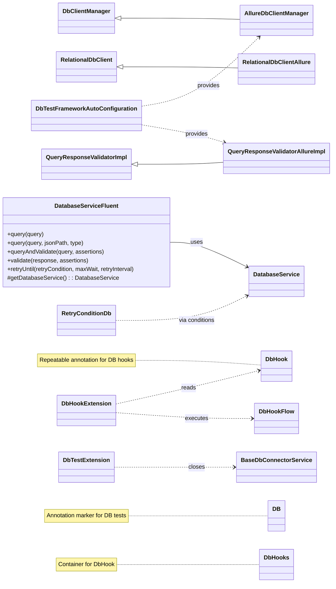
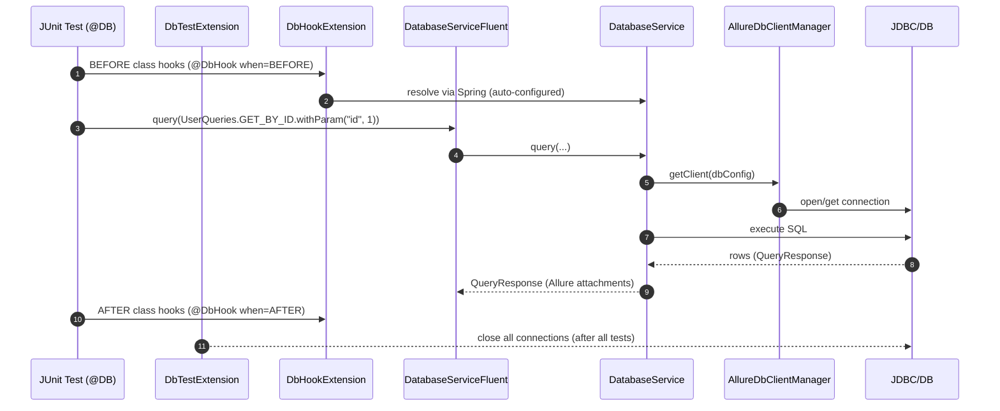

# db-interactor-test-framework-adapter

<!-- Quick jump -->
**Start here:** [Usage - Quick Start (step-by-step)](#usage)

## Table of Contents
- [Overview](#overview)
- [Module metadata](#module-metadata)
- [Features](#features)
- [Structure](#structure)
- [Architecture](#architecture)
    - [Class Diagram](#class-diagram)
    - [Execution Flow](#execution-flow)
      - [Adapter Runtime Flow](#adapter-runtime-flow)
      - [Test Bootstrap & Extensions](#test-bootstrap--extensions)
      - [Fluent Query & Storage](#fluent-query--storage)
      - [Allure Reporting Integration](#allure-reporting-integration)
      - [Hook Execution (BEFORE/AFTER)](#hook-execution-beforeafter)
      - [Retry for Eventual Consistency](#retry-for-eventual-consistency)
- [Usage](#usage)
    - [Step 1 - Install](#step-1--install)
    - [Step 2 - Configure environment](#step-2--configure-environment)
    - [Step 3 - Enable the Adapter on Tests](#step-3--enable-the-adapter-on-tests)
    - [Step 4 - Run Queries Fluently](#step-4--run-queries-fluently)
    - [Step 5 - Validate Query Responses](#step-5--validate-query-responses)
    - [Step 6 - Wait/Retry Until Data Appears](#step-6--waitretry-until-data-appears)
    - [Step 7 - Use Hooks (optional)](#step-7--use-hooks-optional)
- [Annotations & Hooks](#annotations--hooks)
- [Retry Helpers](#retry-helpers)
- [Allure Reporting](#allure-reporting)
- [Adapter Configuration](#adapter-configuration)
- [Dependencies](#dependencies)
- [Author](#author)

---

## Overview
The **db-interactor-test-framework-adapter** layers **test-facing ergonomics** on top of the core
**db-interactor** module. It introduces:

- a fluent service (`DatabaseServiceFluent`) for chaining `query`, `query(jsonPath)`, `queryAndValidate`, `validate`, and `retryUntil`,
- Allure bridges (`AllureDbClientManager`, `RelationalDbClientAllure`, `QueryResponseValidatorAllureImpl`) that attach executed SQL, timings and validation targets to reports,
- JUnit 5 enablement via the `@DB` annotation and extensions (`DbTestExtension`, `DbHookExtension`),
- hook processing through `@DbHook`/`@DbHooks` -> `DbHookFlow` (BEFORE/AFTER class),
- handy retry helpers (`RetryConditionDb`) for eventual consistency scenarios,
- and Spring auto-configuration to wire the Allure-enabled components by default.

The result is **declarative, traceable, and robust** database automation that integrates cleanly with the ROA (Ring of Automation) quest/service model while staying test-framework agnostic.

### Module metadata
- **name:** Ring of Automation Database Test Framework
- **artifactId:** db-interactor-test-framework-adapter
- **direct dependencies:**
  - io.cyborgcode.roa:test-framework
  - io.cyborgcode.roa:db-interactor

## Features
- **Fluent chaining:** `DatabaseServiceFluent` -> `query`, `query(jsonPath, type)`, `queryAndValidate`, `validate`, `retryUntil`.
- **Allure integration:**
    - `AllureDbClientManager` (creates `RelationalDbClientAllure`),
    - `RelationalDbClientAllure` (attaches SQL + duration + rows),
    - `QueryResponseValidatorAllureImpl` (attaches validation data).
- **JUnit 5 bootstrap:** `@DB` applies `DbTestExtension` (closes connections) + `DbHookExtension` (runs hooks), scans `.db`.
- **Hooks:** `@DbHook` / `@DbHooks` driving enum-backed `DbHookFlow` implementations.
- **Retry helpers:** `RetryConditionDb` (`queryReturnsRows`, `queryReturnsValueForField`) to combine with `retryUntil(...)`.
- **Spring auto-config:** `DbTestFrameworkAutoConfiguration` exposes @Primary beans for Allure client manager and validator.
- **Storage integration:** results are stored under `StorageKeysDb.DB` keyed by your query enum.

## Structure
- `allure` - `AllureDbClientManager`, `RelationalDbClientAllure`, `QueryResponseValidatorAllureImpl`
- `annotations` - `DB`, `DbHook`, `DbHooks`
- `config` - `DbTestFrameworkAutoConfiguration`
- `extensions` - `DbHookExtension`, `DbTestExtension`
- `hooks` - `DbHookFlow<T>`
- `retry` - `RetryConditionDb`
- `service.fluent` - `DatabaseServiceFluent`
- `storage` - `StorageKeysDb`

> **Depends on:** all types from **db-interactor** (`DatabaseService`, `DbQuery`, `QueryResponse`, etc.).

## Architecture

### Class Diagram


### Execution Flow
#### Adapter Runtime Flow


#### Test Bootstrap & Extensions
- **@DB annotation** registers JUnit 5 extensions: `DbTestExtension`, `DbHookExtension`.
- **DbTestExtension.afterAll()** retrieves `BaseDbConnectorService` and closes all DB connections after the test class.
- **DbHookExtension.beforeAll()/afterAll()** discovers `@DbHook` annotations on the test class and executes them based on `when` and `order`.

#### Fluent Query & Storage
- **DatabaseServiceFluent.query(query):** delegates to `DatabaseService.query`, stores `QueryResponse` in test storage under `StorageKeysDb.DB` keyed by `query.enumImpl()`.
- **queryAndValidate(query, assertions):** executes query, stores response, immediately calls `validate(...)`.
- **validate(...)** delegates to `databaseService.validate(...)` using the stored data.

#### Allure Reporting Integration
- **DbTestFrameworkAutoConfiguration:** exposes `@Primary` beans so Allure-enhanced components are used by default.
- **AllureDbClientManager:** creates `RelationalDbClientAllure` instances.
- **RelationalDbClientAllure:**
  - adds Allure step for executing SQL.
  - attaches executed SQL, duration, and result rows.
- **QueryResponseValidatorAllureImpl:** attaches validation target data to Allure.

#### Hook Execution (BEFORE/AFTER)
- **@DbHook / @DbHooks** on a test class declare hooks.
- **DbHookExtension** resolves a `DbHookFlow` implementation by `type` and executes `flow().accept(DatabaseService, storageMap, arguments)`.
- Hooks share a `Map<Object,Object>` across executions within the class lifecycle.

#### Retry for Eventual Consistency
- **RetryConditionDb.queryReturnsRows(query):** evaluates to true when the query returns at least one row; use with `DatabaseServiceFluent.retryUntil(...)`.
- **retryUntil(...)** delegates to the parent fluent service to run the condition until satisfied or timeout.

---

## Usage

### Step 1 - Install
Add the adapter **and** the core module:
```xml
<dependency>
  <groupId>io.cyborgcode.roa</groupId>
  <artifactId>db-interactor-test-framework-adapter</artifactId>
  <version>${revision}</version>
  <scope>test</scope>
</dependency>
```

### Step 2 - Configure environment
The adapter relies on the same **Owner** configuration as `db-interactor`. Create `src/test/resources/config.properties` and run with `-Ddb.config.file=db-config`:

```properties
project.package=com.mycompany.myapp
db.default.type=POSTGRES
db.default.host=localhost
db.default.port=5432
db.default.name=appdb
db.default.username=app
db.default.password=secret
# Optional (overrides host/port/name)
# db.full.connection.string=jdbc:postgresql://localhost:5432/appdb
```

When Spring is present, `DbTestFrameworkAutoConfiguration` will register the Allure-enabled beans automatically.

### Step 3 - Enable the Adapter on Tests
Annotate your JUnit test class with `@DB` to activate extensions and scanning.

```java
@DB
class UsersDbTests {
  // your tests...
}
```

### Step 4 - Run Queries Fluently
<pre><code>
.query(Queries.QUERY_ORDER.withParam("id",
                  retrieve(responseBodyExtraction(ENDPOINT_EXAMPLE, "$.id"), Long.class)))
            .validate(retrieve(Queries.QUERY_ORDER, QueryResponse.class),
                  Assertion.builder().target(NUMBER_ROWS).type(IS).expected(3).soft(true)
                        .build())
</code></pre>

### Step 5 - Validate Query Responses

<pre><code>
 .validate(retrieve(StorageKeysDb.DB, QUERY_ORDER, QueryResponse.class),
                  Assertion.builder()
                        .target(QUERY_RESULT).key(DbResponsesJsonPaths.PRODUCT_BY_ID.getJsonPath(1))
                        .type(CONTAINS_ALL).expected(List.of(order.getProduct())).soft(true)
                        .build(),
                  Assertion.builder()
                        .target(QUERY_RESULT).key(DbResponsesJsonPaths.LOCATION_BY_ID.getJsonPath(1))
                        .type(CONTAINS_ALL).expected(List.of(order.getLocation())).soft(true)
                        .build()
            )
)
</code></pre>

### Step 6 - Wait/Retry Until Data Appears
With the adapter you can combine `RetryConditionDb` and your framework's retry utility.

```java
import java.time.Duration;

// using a generic RetryUtils from your framework:
String ok = RetryUtils.retryUntil(
  Duration.ofSeconds(30),
  Duration.ofSeconds(2),
  () -> db.retryUntil(queryReturnsRows(UserQueries.GET_BY_ID.withParam("id", 42)),
                      Duration.ofSeconds(30),
                      Duration.ofSeconds(2)),
  res -> true // condition already enforced inside
);
```

### Step 7 - Use Hooks (optional)
Run DB setup/cleanup once per class with `@DbHook` and your enum-backed `DbHookFlow` implementations.

```java
@DB
@DbHook(when = HookExecution.BEFORE, type = "SEED_BASELINE")
@DbHook(when = HookExecution.AFTER,  type = "CLEANUP")
class OrdersDbTests { /* ... */ }
```

## Annotations & Hooks
- `@DB` — applies JUnit 5 extensions for DB tests and scans the adapter packages (`io.cyborgcode.roa.db`).
- `@DbHook(when, type, arguments, order)` / `@DbHooks` — run **BEFORE/AFTER** class hook flows; implement `DbHookFlow` to register custom database hook logic (executed with a shared `Map<Object,Object>` and a `DatabaseService`).

## Retry Helpers
`RetryConditionDb` provides ready-made `RetryCondition`s to use with `DatabaseServiceFluent.retryUntil(...)`:
- `queryReturnsRows(query)` — polls until the query returns at least one row.
- `queryReturnsValueForField(query, jsonPath, expected)` — polls until the extracted field (via JSONPath) equals `expected`.

## Allure Reporting
- **Queries:** `RelationalDbClientAllure` (extends `RelationalDbClient`) attaches executed SQL, duration, and result snapshot.
- **Validations:** `QueryResponseValidatorAllureImpl` (extends `QueryResponseValidatorImpl`) attaches the **validation target map** (data extracted for assertions).
- **Client Manager:** `AllureDbClientManager` (extends `DbClientManager`) ensures Allure-enhanced clients are created and reused.

## Adapter Configuration
```java
@Configuration
@ComponentScan(basePackages = "io.cyborgcode.roa.db")
public class DbTestFrameworkAutoConfiguration {

  @Bean
  @Primary
  public DbClientManager dbClientManager(AllureDbClientManager allureDbClientManager) {
    return allureDbClientManager;
  }

  @Bean
  @Primary
  public QueryResponseValidator queryResponseValidator(QueryResponseValidatorAllureImpl impl) {
    return impl;
  }
}
```

---

## Dependencies
- `io.cyborgcode:db-interactor` *(required)*
- `io.qameta.allure:allure-java-commons` *(optional - base Allure attachments)*
- `io.qameta.allure:allure-junit5` *(optional - Allure + JUnit 5 bridge)*
- `org.springframework:spring-context` *(optional - DI / auto-config)*
- `org.springframework:spring-test` *(tests - JUnit 5 SpringExtension)*
- `org.junit.jupiter:junit-jupiter` *(tests)*
- `org.assertj:assertj-core` *(tests - used by SoftAssertions in examples)*
- `com.fasterxml.jackson.core:jackson-databind` *(usually transitive via `db-interactor`; add explicitly if your BOM doesn’t manage it)*
- `com.jayway.jsonpath:json-path` *(usually transitive via `db-interactor`; add explicitly if your BOM doesn’t manage it)*
- `org.projectlombok:lombok` *(optional - codegen)*
- **JDBC driver** for your DB, e.g.:
  - `org.postgresql:postgresql`
  - `mysql:mysql-connector-j`

---

## Author
**Cyborg Code Syndicate**
