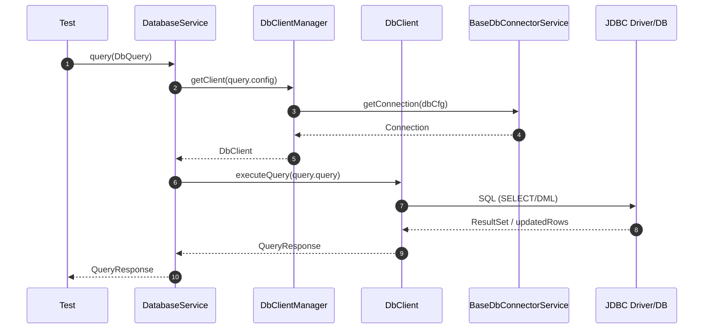

# db-interactor

<!-- Quick jump -->
**Start here:** [Usage - Quick Start (step-by-step)](#usage)

## Table of Contents
- [Overview](#overview)
- [Module metadata](#module-metadata)
- [Features](#features)
- [Structure](#structure)
- [Architecture](#architecture)
    - [Class Diagram](#class-diagram)
    - [Execution Flow](#execution-flow)
        - [Core Request Flow](#core-request-flow)
        - [Parameterized Query Processing](#parameterized-query-processing)
        - [Validation Flow](#validation-flow)
- [Usage](#usage)
    - [Step 1: Add dependency](#step-1-add-dependency)
        - [1.1. Standard Maven dependency](#11-standard-maven-dependency)
    - [Step 2: Database Configuration](#step-2-database-configuration)
        - [2.1 Configuration sources](#21-configuration-sources)
        - [2.2 PostgreSQL configuration example](#22-postgresql-configuration-example)
        - [2.3 H2 (in-memory) configuration example](#23-h2-in-memory-configuration-example)
        - [2.4 Configuration priorities & behaviour](#24-configuration-priorities--behaviour)
    - [Step 3: Implement DbType enum](#step-3-implement-dbtype-enum)
        - [3.1 PostgreSQL DbType implementation](#31-postgresql-dbtype-implementation)
        - [3.2 H2 DbType implementation](#32-h2-dbtype-implementation)
        - [3.3 Multi-database DbType enum](#33-multi-database-dbtype-enum)
    - [Step 4: Declare queries (DbQuery interface)](#step-4-declare-queries-dbquery-interface)
        - [4.1 Basic query enum](#41-basic-query-enum)
        - [4.2 Parameterized queries](#42-parameterized-queries)
    - [Step 5: DatabaseService](#step-5-databaseservice)
        - [5.1 What DatabaseService does](#51-what-databaseservice-does)
        - [5.2 Plain Java / test setup](#52-plain-java--test-setup)
        - [5.3 Spring setup (auto-configuration)](#53-spring-setup-auto-configuration)
    - [Step 6: Basic usage (execute queries)](#step-6-basic-usage-execute-queries)
        - [6.1 Simple SELECT query](#61-simple-select-query)
        - [6.2 Query with parameters](#62-query-with-parameters)
        - [6.3 INSERT/UPDATE/DELETE operations](#63-insertupdatedelete-operations)
        - [6.4 Using queryAndValidate for one-shot checks](#64-using-queryandvalidate-for-one-shot-checks)
    - [Step 7: Extract values with JSONPath](#step-7-extract-values-with-jsonpath)
    - [Step 8: Validation with assertions](#step-8-validation-with-assertions)
        - [8.1 Assertion model basics](#81-assertion-model-basics)
        - [8.2 Row count validation](#82-row-count-validation)
        - [8.3 Query result validation](#83-query-result-validation)
        - [8.4 Column validation](#84-column-validation)
        - [8.5 Soft assertions](#85-soft-assertions)
- [Advanced Topics](#advanced-topics)
    - [Connection pooling and management](#connection-pooling-and-management)
    - [Multiple database configurations](#multiple-database-configurations)
    - [Custom DbClient implementations](#custom-dbclient-implementations)
    - [Slow query detection](#slow-query-detection)
- [Dependencies](#dependencies)
- [Author](#author)

---

## Overview
The **db-interactor** module is the database engine of ROA (Ring of Automation). It offers **structured JDBC execution**, **parameterized query composition**, **client caching & connection reuse**, **JSON-Path extraction from tabular results**, and **assertion-driven validation**. It’s test-framework agnostic and works standalone or with Spring; when Spring is present, **auto-configured beans** (Jackson `ObjectMapper`, `JsonPathExtractor`) are provided for convenience.

### Module metadata
- **name:** Ring of Automation Database Library
- **artifactId:** db-interactor
- **direct dependencies (from pom.xml):**
  - org.projectlombok:lombok
  - com.fasterxml.jackson.core:jackson-databind
  - com.jayway.jsonpath:json-path
  - io.cyborgcode.roa:assertions
  - org.springframework.boot:spring-boot-starter
  - io.cyborgcode.utilities:commons
  - org.aeonbits.owner:owner
  - org.junit.jupiter:junit-jupiter (test)
  - org.mockito:mockito-core
  - com.h2database:h2
  - org.mockito:mockito-junit-jupiter

## Features

- **JDBC core:** `DbClient` + `RelationalDbClient` for `SELECT` and DML (`INSERT`, `UPDATE`, `DELETE`) with timing + slow-query warnings.
- **Client manager & connector:** `DbClientManager` caches clients by connection key; `BaseDbConnectorService` registers JDBC drivers and manages a connection cache.
- **Config model:** `DatabaseConfiguration` (builder), `DbConfig` (Owner), `DbType` (project enum), `DbTypeConverter` (discovers enum via reflection).
- **Parameterized queries:** `DbQuery` + `ParametrizedQuery` with `{name}` placeholder substitution.
- **Results:** `QueryResponse` (immutable list of rows).
- **JSON utilities:** `JsonPathExtractor` (Jayway) with safe defaults (`SUPPRESS_EXCEPTIONS`).
- **Logging:** `LogDb` (info/warn/debug/trace/step/validation/extended).
- **Validation:** `DatabaseService` + `QueryResponseValidatorImpl` support `NUMBER_ROWS`, `QUERY_RESULT` (JsonPath on rows), and `COLUMNS` checks.

## Structure

### Key Classes

| Class | Responsibility | Key methods | Used by |
|---|---|---|---|
| `DbQuery<T>` | Models a database query as code (SQL statement, configuration, immutable parameterization). | `query()`, `config()`, `enumImpl()`, `withParam(...)`, `withConfig(...)` | App query enums, `ParametrizedQuery`, `DatabaseService` |
| `ParametrizedQuery<T>` | Immutable wrapper adding parameter substitution on top of an existing `DbQuery`. | `withParam(...)`, `withConfig(...)`, `query()` | Test code, higher-level services, `DatabaseService` |
| `DatabaseService` | Orchestrates query execution, JSONPath extraction, and assertion-driven validation. | `query(DbQuery)`, `query(DbQuery, jsonPath, type)`, `validate(QueryResponse, assertions)`, `queryAndValidate(...)` | Tests, app services, adapters |
| `DbClient` | JDBC SPI used by `DatabaseService` to execute SQL statements. | `executeQuery(String query)` | `DatabaseService`, `DbClientManager` |
| `RelationalDbClient` | Default JDBC-based `DbClient` with structured logging, slow-query warnings, and `SELECT`/DML support. | `executeQuery(...)`, `executeAndProcessQuery(...)`, `executeSelectQuery(...)`, `executeUpdateQuery(...)`, `printQuery(...)` | `DbClientManager` |
| `DbClientManager` | Manages `DbClient` instances with caching per `DatabaseConfiguration`. | `getClient(DatabaseConfiguration)` | `DatabaseService` |
| `BaseDbConnectorService` | Handles JDBC driver registration and connection caching per database configuration. | `getConnection(DatabaseConfiguration)`, `closeConnections()` | `RelationalDbClient`, test teardown |
| `DatabaseConfiguration` | Fluent builder for database connection details (dbType, host, port, name, credentials). | Builder methods, getters | `DbQuery`, `DbClientManager`, `BaseDbConnectorService` |
| `DbConfig` | Owner-based configuration interface for database settings and package scanning. | `dbDefaultType()`, `dbDefaultHost()`, `dbDefaultPort()`, `dbDefaultName()`, `dbDefaultUsername()`, `dbDefaultPassword()`, `dbFullConnectionString()`, `projectPackages()` | `DbQuery`, `DbTypeConverter`, `DbConfigHolder` |
| `DbType<T>` | Project-specific enum contract defining JDBC driver and protocol per database type. | `driver()`, `protocol()`, `enumImpl()` | App DbType enums, `DbTypeConverter`, `DatabaseConfiguration` |
| `DbTypeConverter` | Discovers and converts string database types to project's `DbType` enum via reflection. | `convert(String value)` | `DbConfig`, configuration loading |
| `QueryResponse` | Immutable container for query results (list of row maps). | `getRows()`, `rows()` | `DatabaseService`, `QueryResponseValidator`, test code |
| `JsonPathExtractor` | Extracts typed values from `QueryResponse` rows using Jayway JSONPath expressions. | `<T> extract(List<Map<String, Object>>, String jsonPath, Class<T> type)` | `DatabaseService` |
| `QueryResponseValidator` | Abstraction for validating a `QueryResponse` against assertions. | `<T> validateQueryResponse(QueryResponse, Assertion...)` | `DatabaseService`, custom validators |
| `QueryResponseValidatorImpl` | Default validator using `DbAssertionTarget` and `AssertionUtil`. | `validateQueryResponse(...)` | `DatabaseService` |
| `DbAssertionTarget` | Enum describing which part of the query result to assert (`NUMBER_ROWS`, `QUERY_RESULT`, `COLUMNS`). | `target()` | `QueryResponseValidatorImpl`, assertion builders |
| `LogDb` | Centralized logger for database interactions (steps, validation, extended details). | `info(...)`, `warn(...)`, `error(...)`, `debug(...)`, `trace(...)`, `step(...)`, `validation(...)`, `extended(...)` | All module classes |
| `DatabaseOperationException` | Runtime exception wrapping errors during query execution. | Constructors taking `message`, `cause` | `RelationalDbClient` |
| `JsonPathExtractionException` | Runtime exception wrapping errors during JSONPath value extraction. | Constructors taking `message`, `cause` | `JsonPathExtractor` |

---

### Package: `io.cyborgcode.roa.db.query`

| Class | Responsibility | Key methods | Used by |
|---|---|---|---|
| `DbQuery` | Core query contract: SQL statement, configuration, and fluent parameterization entrypoints. | `query()`, `config()`, `enumImpl()`, `withParam(...)`, `withConfig(...)` | Typically implemented by enum-based query definitions in app code, also used by `ParametrizedQuery`, `DatabaseService` |
| `ParametrizedQuery` | Immutable query wrapper with accumulated parameter substitutions on top of a `DbQuery`. | `withParam(...)`, `withConfig(...)`, `query()` | Tests, app services, `DatabaseService` |
| `QueryResponse` | Immutable list of result rows from query execution. | `getRows()`, `rows()` | `DatabaseService`, `QueryResponseValidator`, test code |

---

### Package: `io.cyborgcode.roa.db.client`

| Class | Responsibility | Key methods | Used by |
|---|---|---|---|
| `DbClient` | SPI abstraction for executing SQL queries. | `executeQuery(String query)` | `DatabaseService`, `DbClientManager` |
| `RelationalDbClient` | Default JDBC implementation with structured logging and slow-query detection. | `executeQuery(...)`, `executeAndProcessQuery(...)`, `executeSelectQuery(...)`, `executeUpdateQuery(...)`, `printQuery(...)`, `printResponse(...)` | `DbClientManager` |
| `DbClientManager` | Caches `DbClient` instances per `DatabaseConfiguration`. | `getClient(DatabaseConfiguration)` | `DatabaseService` |

---

### Package: `io.cyborgcode.roa.db.config`

| Class | Responsibility | Key methods | Used by |
|---|---|---|---|
| `DatabaseConfiguration` | Builder for database connection details. | Builder methods, getters for host/port/name/credentials | `DbQuery`, `DbClientManager`, `BaseDbConnectorService` |
| `DbConfig` | Owner-based configuration interface. | `dbDefaultType()`, `dbDefaultHost()`, `dbDefaultPort()`, `dbDefaultName()`, `dbDefaultUsername()`, `dbDefaultPassword()`, `dbFullConnectionString()`, `projectPackages()` | `DbQuery`, `DbTypeConverter`, `DbConfigHolder` |
| `DbConfigHolder` | Singleton accessor for `DbConfig`. | `getDbConfig()` | `DbQuery`, `DbTypeConverter` |
| `DbType` | Project enum contract for database driver and protocol. | `driver()`, `protocol()`, `enumImpl()` | App DbType enums, `DbTypeConverter`, `DatabaseConfiguration` |
| `DbTypeConverter` | Converts string to project `DbType` enum via reflection. | `convert(String value)` | `DbConfig` loading |
| `DbInteractionAutoConfiguration` | Spring Boot auto-configuration providing `ObjectMapper` and `JsonPathExtractor` beans. | Bean factory methods | Spring Boot applications |

---

### Package: `io.cyborgcode.roa.db.service`

| Class | Responsibility | Key methods | Used by |
|---|---|---|---|
| `DatabaseService` | High-level service that executes queries, extracts values via JSONPath, and validates responses against assertions. | `query(DbQuery)`, `query(DbQuery, jsonPath, type)`, `validate(QueryResponse, assertions)`, `queryAndValidate(DbQuery, assertions)` | Test code, app-level helpers, adapters |

---

### Package: `io.cyborgcode.roa.db.validator`

| Class | Responsibility | Key methods | Used by |
|---|---|---|---|
| `QueryResponseValidator` | Contract for validating query responses against assertions. | `<T> validateQueryResponse(QueryResponse, Assertion...)` | `DatabaseService`, custom validators |
| `QueryResponseValidatorImpl` | Default implementation using `DbAssertionTarget` and `AssertionUtil` from `assertions` module. | `validateQueryResponse(...)` | `DatabaseService` |
| `DbAssertionTarget` | Enum defining assertion targets (`NUMBER_ROWS`, `QUERY_RESULT`, `COLUMNS`). | `target()` | `QueryResponseValidatorImpl`, assertion builders |

---

### Package: `io.cyborgcode.roa.db.connector`

| Class | Responsibility | Key methods | Used by |
|---|---|---|---|
| `BaseDbConnectorService` | Manages JDBC driver registration and connection caching. | `getConnection(DatabaseConfiguration)`, `closeConnections()` | `RelationalDbClient`, test teardown code |

---

### Package: `io.cyborgcode.roa.db.json`

| Class | Responsibility | Key methods | Used by |
|---|---|---|---|
| `JsonPathExtractor` | Extracts typed values from query result rows using Jayway JSONPath. | `<T> extract(List<Map<String, Object>>, String jsonPath, Class<T> type)` | `DatabaseService` |

---

### Package: `io.cyborgcode.roa.db.log`

| Class | Responsibility | Key methods | Used by |
|---|---|---|---|
| `LogDb` | Centralized logger for database operations. | `info(...)`, `warn(...)`, `error(...)`, `debug(...)`, `trace(...)`, `step(...)`, `validation(...)`, `extended(...)` | All module classes |

---

### Package: `io.cyborgcode.roa.db.exceptions`

| Class | Responsibility | Key methods | Used by |
|---|---|---|---|
| `DatabaseOperationException` | Runtime exception for query execution failures. | Constructors | `RelationalDbClient` |
| `JsonPathExtractionException` | Runtime exception for JSONPath extraction failures. | Constructors | `JsonPathExtractor` |

## Architecture

### Class Diagram


### Execution Flow
#### Core Request Flow


#### Parameterized Query Processing
- **DbQuery.withParam(name, value):** creates a new immutable `ParametrizedQuery` copying existing params and adding the new one.
- **ParametrizedQuery.query():** performs placeholder substitution on the original SQL using the parameters map.
- The final SQL string is then sent through the standard `DatabaseService.query(...)` execution path.

#### Validation Flow
- **DatabaseService.validate(queryResponse, assertions):** delegates to `QueryResponseValidatorImpl`.
- **Targets:**
  - `NUMBER_ROWS` - counts rows in `QueryResponse`.
  - `QUERY_RESULT` - uses `JsonPathExtractor` to extract values from rows by JSONPath.
  - `COLUMNS` - verifies presence of expected columns.
- Returns a list of assertion results for further handling.

---

## Usage

### Step 1: Add dependency

To use **`db-interactor`** in your project, you first need to add it as a Maven dependency.

In most setups, **`db-interactor`** is consumed from your **test module** (e.g. `my-app-test`), where you keep your automated tests, or from your application module for database operations.

#### 1.1. Standard Maven dependency

Add the following snippet to the `dependencies` section of your module's `pom.xml`:

```xml
<dependency>
  <groupId>io.cyborgcode.roa</groupId>
  <artifactId>db-interactor</artifactId>
  <version>${roa.version}</version>
</dependency>
```

**Note:** You'll also need to add the JDBC driver for your database:

```xml
<!-- For PostgreSQL -->
<dependency>
  <groupId>org.postgresql</groupId>
  <artifactId>postgresql</artifactId>
  <version>42.7.1</version>
</dependency>

<!-- For H2 (in-memory testing) -->
<dependency>
  <groupId>com.h2database</groupId>
  <artifactId>h2</artifactId>
  <version>2.2.224</version>
  <scope>test</scope>
</dependency>
```

---

### Step 2: Database Configuration

Before using **`db-interactor`**, you need to provide database configuration via `DbConfig` (backed by **Owner**) and load it through `DbConfigHolder`.

#### 2.1 Configuration sources

`DbConfig` is resolved from:

- JVM system properties
- A `.properties` file on the classpath whose **base name** is given by `db.config.file`

Typical setup:

1. Create `db-config.properties` under `src/test/resources` or `src/main/resources`.
2. Run tests/application with:

```bash
-Ddb.config.file=db-config
```

`db-interactor` will then load `classpath:db-config.properties` plus any system properties.

#### 2.2 PostgreSQL configuration example

Create `db-config.properties`:

```properties
# Required: packages to scan for your DbType enum
project.packages=com.mycompany.myapp

# Database type (resolved via DbTypeConverter)
db.default.type=POSTGRES

# Connection details
db.default.host=localhost
db.default.port=5432
db.default.name=appdb
db.default.username=app_user
db.default.password=secret123

# Optional: Full JDBC URL (overrides host/port/name)
# db.full.connection.string=jdbc:postgresql://localhost:5432/appdb?ssl=true
```

#### 2.3 H2 (in-memory) configuration example

For testing with H2 in-memory database:

```properties
# Required: packages to scan for your DbType enum
project.packages=com.mycompany.myapp.test

# Database type
db.default.type=H2

# H2 in-memory connection (no host/port needed)
# The full connection string is required for H2
db.full.connection.string=jdbc:h2:mem:testdb;DB_CLOSE_DELAY=-1;MODE=PostgreSQL

# Credentials (default for H2)
db.default.username=sa
db.default.password=
```

**H2 connection string options:**
- `mem:testdb` - in-memory database named "testdb"
- `DB_CLOSE_DELAY=-1` - keep database open as long as VM is alive
- `MODE=PostgreSQL` - PostgreSQL compatibility mode (supports MySQL, Oracle, etc.)

#### 2.4 Configuration priorities & behaviour

- **System properties override** values from the properties file:

```bash
-Ddb.default.host=staging-db.example.com
-Ddb.default.password=staging-secret
```

- `project.packages` is used for classpath scanning to find your `DbType` enum implementation; multiple packages are separated with `;`:

```properties
project.packages=com.mycompany.myapp;com.mycompany.shared
```

- Treat `project.packages` and `db.default.type` as **required** – without them, database connection resolution will fail.

- **Full connection string** (`db.full.connection.string`) **overrides** individual host/port/name properties. Use it when:
  - Connecting to H2 in-memory databases
  - Complex JDBC URLs with query parameters (SSL, timeouts, etc.)
  - Non-standard database setups

- If you need direct access to configuration, you can obtain it via:

```java
import io.cyborgcode.roa.db.config.DbConfigHolder;
import io.cyborgcode.roa.db.config.DbConfig;

DbConfig dbConfig = DbConfigHolder.getDbConfig();
```

---

### Step 3: Implement DbType enum

The **core idea** of `db-interactor` is:

> *"Describe your database types once, as enums implementing `DbType<T>`, then use them consistently throughout your code."*

Your `DbType` enum specifies the JDBC driver and protocol for each database you work with.

> 📝 **Note**  
> The enum must be in a package specified by `project.packages` in your configuration so that `DbTypeConverter` can discover it via reflection.

---

#### 3.1 PostgreSQL DbType implementation

A minimal PostgreSQL implementation:

```java
package com.mycompany.myapp.db;

import io.cyborgcode.roa.db.config.DbType;
import org.postgresql.Driver;

public enum MyDbType implements DbType<MyDbType> {
    POSTGRES;

    @Override
    public java.sql.Driver driver() {
        return new Driver();
    }

    @Override
    public String protocol() {
        return "postgresql";
    }

    @Override
    public MyDbType enumImpl() {
        return this;
    }
}
```

**Key points:**
* **`driver()`** – Returns the JDBC driver instance (e.g., `org.postgresql.Driver`)
* **`protocol()`** – JDBC protocol string (e.g., `"postgresql"` for `jdbc:postgresql://...`)
* **`enumImpl()`** – "self type" used internally; for enums it should simply return `this`

#### 3.2 H2 DbType implementation

For H2 in-memory testing:

```java
package com.mycompany.myapp.test.db;

import io.cyborgcode.roa.db.config.DbType;
import org.h2.Driver;

public enum TestDbType implements DbType<TestDbType> {
    H2;

    @Override
    public java.sql.Driver driver() {
        return new Driver();
    }

    @Override
    public String protocol() {
        return "h2";
    }

    @Override
    public TestDbType enumImpl() {
        return this;
    }
}
```

#### 3.3 Multi-database DbType enum

You can support multiple database types in a single enum:

```java
package com.mycompany.myapp.db;

import io.cyborgcode.roa.db.config.DbType;

public enum AppDbType implements DbType<AppDbType> {
    POSTGRES {
        @Override
        public java.sql.Driver driver() {
            return new org.postgresql.Driver();
        }
        
        @Override
        public String protocol() {
            return "postgresql";
        }
    },
    
    H2 {
        @Override
        public java.sql.Driver driver() {
            return new org.h2.Driver();
        }
        
        @Override
        public String protocol() {
            return "h2";
        }
    };

    @Override
    public AppDbType enumImpl() {
        return this;
    }
}
```

Then configure which one to use in `db-config.properties`:

```properties
# Use PostgreSQL in production
db.default.type=POSTGRES

# Override to H2 for tests via system property
# -Ddb.default.type=H2
```

---

### Step 4: Declare queries (DbQuery interface)

Once you have your `DbType` set up, you define your SQL queries by implementing the `DbQuery<T>` interface – most commonly as enums.

The enum gives you a fixed, type-safe list of queries (e.g. `GET_USER_BY_ID`, `INSERT_ORDER`), while `ParametrizedQuery<T>` lets you add parameters at runtime without mutating the original definition.

> 📝 **Note**  
> Enums are the *recommended* style, but not mandatory. Any class can implement `DbQuery<T>` – `db-interactor` does not enforce enums.

---

#### 4.1 Basic query enum

Keep queries as SQL strings. Use `{paramName}` placeholders for parameterization.

```java
package com.mycompany.myapp.db.queries;

import io.cyborgcode.roa.db.query.DbQuery;

public enum UserQueries implements DbQuery<UserQueries> {
    
    // Simple SELECT without parameters
    GET_ALL_USERS {
        @Override
        public String query() {
            return "SELECT id, username, email, created_at FROM users";
        }
    },
    
    // SELECT with parameter placeholder
    GET_BY_ID {
        @Override
        public String query() {
            return "SELECT id, username, email, created_at FROM users WHERE id = {id}";
        }
    },
    
    // COUNT query
    COUNT_ALL {
        @Override
        public String query() {
            return "SELECT COUNT(*) AS total FROM users";
        }
    },
    
    // INSERT query
    INSERT_USER {
        @Override
        public String query() {
            return "INSERT INTO users (username, email, password_hash) " +
                   "VALUES ('{username}', '{email}', '{passwordHash}')";
        }
    },
    
    // UPDATE query
    UPDATE_EMAIL {
        @Override
        public String query() {
            return "UPDATE users SET email = '{email}' WHERE id = {id}";
        }
    },
    
    // DELETE query
    DELETE_BY_ID {
        @Override
        public String query() {
            return "DELETE FROM users WHERE id = {id}";
        }
    };

    @Override
    public UserQueries enumImpl() {
        return this;
    }
}
```

**Key points:**
* Use `{paramName}` for numeric parameters (e.g., `{id}`)
* Use `'{paramName}'` for string parameters (e.g., `'{email}'`) – quotes are included in the query
* `enumImpl()` returns the enum constant itself for type safety

#### 4.2 Parameterized queries

At runtime, add parameters via `withParam(name, value)`:

```java
// Without parameters
DbQuery<UserQueries> countQuery = UserQueries.COUNT_ALL;

// With single parameter
DbQuery<UserQueries> getByIdQuery = UserQueries.GET_BY_ID.withParam("id", 42);

// With multiple parameters (chained)
DbQuery<UserQueries> insertQuery = UserQueries.INSERT_USER
    .withParam("username", "john_doe")
    .withParam("email", "john@example.com")
    .withParam("passwordHash", "hashed_password_123");
```

**Parameter substitution:**
- `withParam("id", 42)` → replaces `{id}` with `42`
- `withParam("email", "test@example.com")` → replaces `'{email}'` with `'test@example.com'`

---

### Step 5: DatabaseService

Once you have queries and configuration, you need an entry point that:

* Manages database client connections
* Executes queries via `DbClient`
* Extracts values using JSONPath
* Runs **assertions** via `QueryResponseValidator`

That entry point is `DatabaseService`.

---

#### 5.1 What DatabaseService does

`DatabaseService` is the orchestration layer for database operations. It:

- Accepts your **`DbQuery<T>`** (or `ParametrizedQuery<T>`) and resolves the database configuration
- Delegates to `DbClientManager` to obtain or create a cached `DbClient` for the connection
- Executes the query via `RelationalDbClient` which:
  - Opens/reuses JDBC connection via `BaseDbConnectorService`
  - Logs query execution with timing
  - Converts `ResultSet` to `QueryResponse` (list of row maps)
- Exposes convenience methods for **value extraction** via `JsonPathExtractor`:
  - `query(dbQuery, jsonPath, type)` - execute and extract in one call
- Exposes convenience methods for **response validation** via `QueryResponseValidator`:
  - `validate(response, assertions...)`
  - `queryAndValidate(dbQuery, assertions...)`

---

#### 5.2 Plain Java / test setup

In a simple test project or standalone application, you can instantiate `DatabaseService` directly:

```java
package com.mycompany.myapp.test.support;

import io.cyborgcode.roa.db.client.DbClientManager;
import io.cyborgcode.roa.db.connector.BaseDbConnectorService;
import io.cyborgcode.roa.db.json.JsonPathExtractor;
import io.cyborgcode.roa.db.service.DatabaseService;
import io.cyborgcode.roa.db.validator.QueryResponseValidatorImpl;

public class DbTestSupport {

    // Reusable DatabaseService instance for your tests
    private static final DatabaseService DATABASE_SERVICE = createDatabaseService();

    private static DatabaseService createDatabaseService() {
        // JSON extractor for parsing query results
        JsonPathExtractor jsonPathExtractor = new JsonPathExtractor();
        
        // Database connector manages connections
        BaseDbConnectorService connectorService = new BaseDbConnectorService();
        
        // Client manager caches and reuses clients
        DbClientManager clientManager = new DbClientManager(connectorService);
        
        // Response validator for assertions
        QueryResponseValidatorImpl responseValidator = new QueryResponseValidatorImpl(jsonPathExtractor);
        
        return new DatabaseService(jsonPathExtractor, clientManager, responseValidator);
    }

    public static DatabaseService db() {
        return DATABASE_SERVICE;
    }
    
    // Cleanup method to close connections after tests
    public static void cleanup() {
        try {
            BaseDbConnectorService connector = new BaseDbConnectorService();
            connector.closeConnections();
        } catch (Exception e) {
            // Log or handle exception
        }
    }
}
```

You can then use this helper from your tests:

```java
import org.junit.jupiter.api.Test;
import org.junit.jupiter.api.AfterAll;
import static com.mycompany.myapp.test.support.DbTestSupport.db;
import static com.mycompany.myapp.db.queries.UserQueries.*;

class UserDatabaseTests {

    @Test
    void should_get_user_count() {
        var response = db().query(COUNT_ALL);
        System.out.println("User count: " + response.rows().size());
    }

    @Test
    void should_get_user_by_id() {
        var response = db().query(GET_BY_ID.withParam("id", 1));
        System.out.println("User: " + response.rows());
    }
    
    @AfterAll
    static void tearDown() {
        DbTestSupport.cleanup();
    }
}
```

#### 5.3 Spring setup (auto-configuration)

When using Spring Boot, **`db-interactor`** provides auto-configuration via `DbInteractionAutoConfiguration`:

```java
package io.cyborgcode.roa.db.config;

import org.springframework.boot.autoconfigure.condition.ConditionalOnMissingBean;
import org.springframework.context.annotation.Bean;
import org.springframework.context.annotation.Configuration;
import com.fasterxml.jackson.databind.ObjectMapper;
import io.cyborgcode.roa.db.json.JsonPathExtractor;

@Configuration
public class DbInteractionAutoConfiguration {
    
    @Bean
    @ConditionalOnMissingBean
    public ObjectMapper objectMapper() {
        return new ObjectMapper();
    }
    
    @Bean
    @ConditionalOnMissingBean
    public JsonPathExtractor jsonPathExtractor() {
        return new JsonPathExtractor();
    }
}
```

**Note:** `DbInteractionAutoConfiguration` provides supporting beans (`ObjectMapper`, `JsonPathExtractor`). `DatabaseService` itself is annotated with `@Service`, so Spring will automatically detect and create it via component scanning if it's in your application's scan path. You'll also need to ensure other dependencies (`DbClientManager`, `BaseDbConnectorService`, `QueryResponseValidatorImpl`) are available as beans or create them manually as shown in section 5.2.

For a typical Spring Boot setup where all ROA components are in the scan path, you can inject `DatabaseService`:

```java
import org.springframework.beans.factory.annotation.Autowired;
import org.springframework.boot.test.context.SpringBootTest;
import org.junit.jupiter.api.Test;
import io.cyborgcode.roa.db.service.DatabaseService;

@SpringBootTest
class UserDatabaseTests {

    @Autowired
    private DatabaseService databaseService;

    @Test
    void should_query_users() {
        var response = databaseService.query(UserQueries.GET_ALL_USERS);
        System.out.println("Found " + response.rows().size() + " users");
    }
}
```

---

### Step 6: Basic usage (execute queries)

This section shows how to use `DatabaseService` and your `DbQuery<T>` definitions to perform database operations.

#### 6.1 Simple SELECT query

Execute a query without parameters:

```java
import io.cyborgcode.roa.db.query.QueryResponse;
import static com.mycompany.myapp.test.support.DbTestSupport.db;
import static com.mycompany.myapp.db.queries.UserQueries.*;

// Execute query
QueryResponse response = db().query(GET_ALL_USERS);

// Access results
System.out.println("Total rows: " + response.rows().size());

// Iterate through rows (each row is a Map<String, Object>)
response.rows().forEach(row -> {
    System.out.println("ID: " + row.get("id"));
    System.out.println("Username: " + row.get("username"));
    System.out.println("Email: " + row.get("email"));
});

// Get first row
if (!response.rows().isEmpty()) {
    Map<String, Object> firstRow = response.rows().get(0);
    String username = (String) firstRow.get("username");
}
```

#### 6.2 Query with parameters

Execute a parameterized query:

```java
// Single parameter
QueryResponse userById = db().query(
    UserQueries.GET_BY_ID.withParam("id", 42)
);

// Multiple parameters
QueryResponse newUser = db().query(
    UserQueries.INSERT_USER
        .withParam("username", "jane_doe")
        .withParam("email", "jane@example.com")
        .withParam("passwordHash", "hashed_pwd_xyz")
);

// Using variables for parameters
int userId = 100;
String newEmail = "updated@example.com";

QueryResponse updated = db().query(
    UserQueries.UPDATE_EMAIL
        .withParam("id", userId)
        .withParam("email", newEmail)
);
```

**Parameter types:**
- Numbers (int, long, etc.) → `{paramName}`
- Strings → `'{paramName}'` (quotes in query)
- Booleans → converted to database-specific representation
- Dates → convert to string format first

#### 6.3 INSERT/UPDATE/DELETE operations

DML operations work the same way:

```java
// INSERT
QueryResponse insertResult = db().query(
    UserQueries.INSERT_USER
        .withParam("username", "new_user")
        .withParam("email", "new@example.com")
        .withParam("passwordHash", "hash123")
);

// For INSERT with RETURNING clause (PostgreSQL)
if (!insertResult.rows().isEmpty()) {
    Object newId = insertResult.rows().get(0).get("id");
    System.out.println("Inserted user ID: " + newId);
}

// UPDATE
QueryResponse updateResult = db().query(
    UserQueries.UPDATE_EMAIL
        .withParam("id", 42)
        .withParam("email", "newemail@example.com")
);
System.out.println("Rows updated: " + updateResult.rows().size());

// DELETE
QueryResponse deleteResult = db().query(
    UserQueries.DELETE_BY_ID.withParam("id", 42)
);
System.out.println("Rows deleted: " + deleteResult.rows().size());
```

#### 6.4 Using queryAndValidate for one-shot checks

Execute and validate in a single call:

```java
import io.cyborgcode.roa.assertions.Assertion;
import static io.cyborgcode.roa.db.validator.DbAssertionTarget.*;
import static io.cyborgcode.roa.assertions.AssertionType.*;

// Query and validate row count
List<AssertionResult<?>> results = db().queryAndValidate(
    UserQueries.COUNT_ALL,
    Assertion.builder()
        .target(NUMBER_ROWS)
        .type(IS)
        .expected(1)
        .soft(false)
        .build()
);

// Query and validate specific field
List<AssertionResult<?>> fieldResults = db().queryAndValidate(
    UserQueries.GET_BY_ID.withParam("id", 42),
    Assertion.builder()
        .target(QUERY_RESULT)
        .key("$[0].username")
        .type(IS)
        .expected("john_doe")
        .soft(true)
        .build()
);

// Check results
boolean allPassed = results.stream().allMatch(AssertionResult::passed);
```

---

### Step 7: Extract values with JSONPath

`DatabaseService` integrates **Jayway JSONPath** to extract specific values from query results without manual map navigation. Use the three-argument `query` method to execute a query and extract a value in one call:

```java
// Extract single field from first row
String username = db().query(
    UserQueries.GET_BY_ID.withParam("id", 42),
    "$[0].username",
    String.class
);

// Extract all values of a field across rows
List<String> allUsernames = db().query(
    UserQueries.GET_ALL_USERS,
    "$[*].username",
    List.class
);
```
**JSONPath with assertions**

```java
// Store JSONPath expressions as constants
public class DbResponseJsonPaths {
    public static String userNameById(int index) {
        return String.format("$[%d].username", index);
    }

    public static String productById(int index) {
        return String.format("$[%d].product", index);
    }
}

// Use JSONPath in validations
db().queryAndValidate(
    UserQueries.GET_BY_ID.withParam("id", 42),
    Assertion.builder()
        .target(QUERY_RESULT)
        .key("$[0].email")
        .type(CONTAINS)
        .expected("@example.com")
        .build()
);
```

**Common JSONPath patterns:**
- `$[0].fieldName` - field from first row
- `$[*].fieldName` - all values of a field
- `$[?(@.status=='active')]` - filter rows by condition

For complete JSONPath syntax, see [Jayway JSONPath documentation](https://github.com/json-path/JsonPath).

---

### Step 8: Validation with assertions

`DatabaseService` provides assertion-driven validation using the **assertions** module from ROA.

#### 8.1 Assertion model basics

Assertions are built with `Assertion.builder()`:

```java
import io.cyborgcode.roa.assertions.Assertion;
import io.cyborgcode.roa.assertions.AssertionType;
import io.cyborgcode.roa.db.validator.DbAssertionTarget;

Assertion assertion = Assertion.builder()
    .target(DbAssertionTarget.NUMBER_ROWS)  // What to validate
    .type(AssertionType.IS)                 // Comparison type
    .expected(5)                            // Expected value
    .soft(false)                            // Hard (throws) or soft
    .build();
```

**Assertion targets** (`DbAssertionTarget`):
- `NUMBER_ROWS` - validates row count
- `QUERY_RESULT` - validates extracted values via JSONPath
- `COLUMNS` - validates column presence

**Assertion types** (`AssertionType`):
- `IS` - equality check
- `CONTAINS` - contains value
- `CONTAINS_ALL` - contains all values
- `GREATER_THAN`, `LESS_THAN` - numeric comparisons
- `NOT_NULL` - null check

#### 8.2 Row count validation

Validate the number of rows returned:

```java
// Validate exact count
QueryResponse response = db().query(UserQueries.GET_ALL_USERS);

List<AssertionResult<?>> results = db().validate(
    response,
    Assertion.builder()
        .target(NUMBER_ROWS)
        .type(IS)
        .expected(10)
        .soft(false)  // Hard assertion - throws on failure
        .build()
);

// Validate minimum count
db().validate(
    response,
    Assertion.builder()
        .target(NUMBER_ROWS)
        .type(GREATER_THAN)
        .expected(0)
        .soft(true)
        .build()
);

// Combined with queryAndValidate
db().queryAndValidate(
    UserQueries.COUNT_ALL,
    Assertion.builder()
        .target(NUMBER_ROWS)
        .type(IS)
        .expected(1)
        .build()
);
```

#### 8.3 Query result validation

Validate extracted values using JSONPath:

```java
// Validate single field
db().queryAndValidate(
    UserQueries.GET_BY_ID.withParam("id", 42),
    Assertion.builder()
        .target(QUERY_RESULT)
        .key("$[0].username")
        .type(IS)
        .expected("john_doe")
        .soft(false)
        .build()
);

// Validate multiple fields
QueryResponse response = db().query(
    UserQueries.GET_BY_ID.withParam("id", 42)
);

db().validate(
    response,
    // Username check
    Assertion.builder()
        .target(QUERY_RESULT)
        .key("$[0].username")
        .type(IS)
        .expected("john_doe")
        .soft(true)
        .build(),
    // Email check
    Assertion.builder()
        .target(QUERY_RESULT)
        .key("$[0].email")
        .type(CONTAINS)
        .expected("@example.com")
        .soft(true)
        .build(),
    // ID check
    Assertion.builder()
        .target(QUERY_RESULT)
        .key("$[0].id")
        .type(IS)
        .expected(42)
        .soft(true)
        .build()
);

// Validate collection contains value
db().queryAndValidate(
    UserQueries.GET_ALL_USERS,
    Assertion.builder()
        .target(QUERY_RESULT)
        .key("$[*].username")
        .type(CONTAINS_ALL)
        .expected(List.of("john_doe", "jane_doe"))
        .soft(false)
        .build()
);
```

#### 8.4 Column validation

Validate that expected columns exist in the result:

```java
QueryResponse response = db().query(UserQueries.GET_ALL_USERS);

db().validate(
    response,
    Assertion.builder()
        .target(COLUMNS)
        .type(CONTAINS_ALL)
        .expected(List.of("id", "username", "email", "created_at"))
        .soft(false)
        .build()
);
```

#### 8.5 Soft assertions

Soft assertions collect failures without throwing, useful for validating multiple conditions:

```java
import io.cyborgcode.roa.db.query.QueryResponse;

QueryResponse response = db().query(
    UserQueries.GET_BY_ID.withParam("id", 42)
);

// All assertions marked as soft
List<AssertionResult<?>> results = db().validate(
    response,
    Assertion.builder()
        .target(NUMBER_ROWS)
        .type(IS)
        .expected(1)
        .soft(true)  // Soft - collects failure
        .build(),
    Assertion.builder()
        .target(QUERY_RESULT)
        .key("$[0].username")
        .type(IS)
        .expected("john_doe")
        .soft(true)  // Soft - collects failure
        .build(),
    Assertion.builder()
        .target(QUERY_RESULT)
        .key("$[0].status")
        .type(IS)
        .expected("active")
        .soft(true)  // Soft - collects failure
        .build()
);

// Check results
long failedCount = results.stream()
    .filter(r -> !r.passed())
    .count();

if (failedCount > 0) {
    System.err.println(failedCount + " assertions failed:");
    results.stream()
        .filter(r -> !r.passed())
        .forEach(r -> System.err.println("  - " + r));
}
```

---

## Advanced Topics

### Connection pooling and management

`db-interactor` manages connections via `BaseDbConnectorService` with built-in connection caching:

```java
// Connections are cached per DatabaseConfiguration
// Same configuration = same connection reused

// Connection cache key is computed from:
// - dbType
// - host
// - port
// - database name
// - username

// Manually close all connections (useful in test teardown)
BaseDbConnectorService connector = new BaseDbConnectorService();
connector.closeConnections();
```

**Connection lifecycle:**

1. First query → new connection created and cached
2. Subsequent queries with same config → reuse cached connection
3. Different config → new connection created
4. Test end / app shutdown → call `closeConnections()`

**Best practices:**

- Use `@AfterAll` in tests to close connections
- For long-running apps, consider connection timeout settings
- Monitor open connections via database admin tools

### Multiple database configurations

Support multiple databases simultaneously:

```java
// Define configuration builder
DatabaseConfiguration prodDb = DatabaseConfiguration.builder()
    .dbType(AppDbType.POSTGRES)
    .host("prod-db.example.com")
    .port(5432)
    .name("prod_db")
    .username("prod_user")
    .password("prod_pass")
    .build();

DatabaseConfiguration testDb = DatabaseConfiguration.builder()
    .dbType(AppDbType.H2)
    .fullConnectionString("jdbc:h2:mem:testdb;DB_CLOSE_DELAY=-1")
    .username("sa")
    .password("")
    .build();

// Queries can specify configuration
public enum MyQueries implements DbQuery<MyQueries> {
    GET_USERS {
        @Override
        public String query() {
            return "SELECT * FROM users";
        }
        
        @Override
        public DatabaseConfiguration config() {
            // Override default configuration
            return prodDb;
        }
    };
    
    @Override
    public MyQueries enumImpl() { return this; }
}

// Or set at runtime
DbQuery<MyQueries> query = MyQueries.GET_USERS.withConfig(testDb);
```

### Custom DbClient implementations

Extend `DbClient` for custom behavior:

```java
import io.cyborgcode.roa.db.client.DbClient;
import io.cyborgcode.roa.db.query.QueryResponse;

public class LoggingDbClient implements DbClient {
    
    private final DbClient delegate;
    private final Logger logger;
    
    public LoggingDbClient(DbClient delegate) {
        this.delegate = delegate;
        this.logger = LoggerFactory.getLogger(LoggingDbClient.class);
    }
    
    @Override
    public QueryResponse executeQuery(String query) {
        logger.info("Executing query: {}", query);
        long start = System.currentTimeMillis();
        
        try {
            QueryResponse response = delegate.executeQuery(query);
            long duration = System.currentTimeMillis() - start;
            
            logger.info("Query completed in {}ms, {} rows returned", 
                       duration, response.rows().size());
            
            return response;
        } catch (Exception e) {
            logger.error("Query failed: {}", e.getMessage());
            throw e;
        }
    }
}
```

### Slow query detection

`RelationalDbClient` automatically warns about slow queries:

- Logged when query execution exceeds threshold (default: 1000ms)
- Example log output:
- WARN [ROA.DB] Query took 1523ms (threshold: 1000ms): SELECT * FROM large_table
- Slow query logs appear in LogDb output
- Monitor these logs to identify performance issues


**Analyzing slow queries:**

1. Check `LogDb` output for warnings
2. Review query execution plans in your database
3. Add indexes to frequently queried columns
4. Consider query optimization or pagination
5. Monitor database server performance

---

## Dependencies

- `org.projectlombok:lombok`
- `com.fasterxml.jackson.core:jackson-databind`
- `com.jayway.jsonpath:json-path`
- `io.cyborgcode.roa:assertions`
- `org.springframework.boot:spring-boot-starter`
- `io.cyborgcode.utilities:commons`
- `org.aeonbits.owner:owner`
- `org.junit.jupiter:junit-jupiter` *(test)*
- `org.mockito:mockito-core`
- `com.h2database:h2`
- `org.mockito:mockito-junit-jupiter`

---

## Author
**Cyborg Code Syndicate 💍👨💻**
