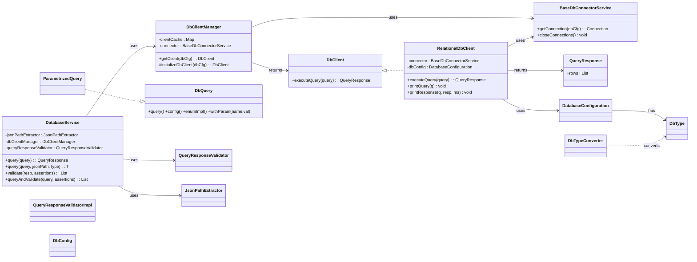
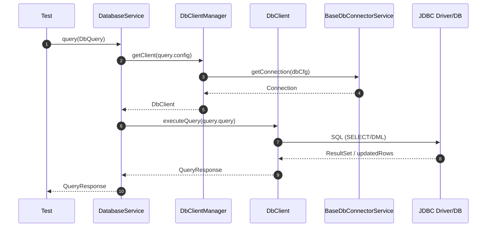

# db-interactor

<!-- Quick jump -->
**Start here:** [Usage — Quick Start (step-by-step)](#usage)


---

## Table of Contents
- [Overview](#overview)
- [Features](#features)
- [Structure](#structure)
- [Architecture](#architecture)
    - [Class Diagram](#class-diagram)
  - [Execution Flow](#execution-flow)
    - [Core Request Flow](#core-request-flow)
- [Usage](#usage)
    - [Step 1 —  Install](#step-1--install-dependency)
    - [Step 2 —  Configure environment](#step-2--configure-environment)
    - [Step 3 —  Provide your projects-dbtype-enum](#step-3--provide-your-projects-dbtype-enum)
    - [Step 4 —  Declare queries (enum implements dbquery)](#step-4--declare-queries-enum-implements-dbquery)
    - [Step 5 —  Execute via databaseservice](#step-5--execute-via-databaseservice)
    - [Step 6 —  Extract values with jsonpath](#step-6--extract-values-with-jsonpath)
    - [Step 7 —  Validate responses (assertion-driven)](#step-7--validate-responses-assertion-driven)
- [Dependencies](#dependencies)
- [Author](#author)

---

## Overview
The **db-interactor** module is the database engine of ROA (Ring of Automation). It offers **structured JDBC execution**, **parameterized query composition**, **client caching & connection reuse**, **JSON-Path extraction from tabular results**, and **assertion-driven validation**. It’s test-framework agnostic and works standalone or with Spring; when Spring is present, **auto-configured beans** (Jackson `ObjectMapper`, `JsonPathExtractor`) are provided for convenience.

## Features

- **JDBC core:** `DbClient` + `RelationalDbClient` for `SELECT` and DML with timing + slow-query warnings.
- **Client manager & connector:** `DbClientManager` caches clients by connection key; `BaseDbConnectorService` registers JDBC drivers and manages a connection cache.
- **Config model:** `DatabaseConfiguration` (builder), `DbConfig` (Owner), `DbType` (project enum), `DbTypeConverter` (discovers enum via reflection).
- **Parameterized queries:** `DbQuery` + `ParametrizedQuery` with `{name}` placeholder substitution.
- **Results:** `QueryResponse` (immutable list of rows).
- **JSON utilities:** `JsonPathExtractor` (Jayway) with safe defaults (`SUPPRESS_EXCEPTIONS`).
- **Logging:** `LogDb` (info/warn/debug/trace/step/validation/extended).
- **Validation:** `DatabaseService` + `QueryResponseValidatorImpl` support `NUMBER_ROWS`, `QUERY_RESULT` (JsonPath on rows), and `COLUMNS` checks.

## Structure
- `client` — `DbClient`, `DbClientManager`, `RelationalDbClient`
- `config` — `DatabaseConfiguration`, `DbConfig`, `DbConfigHolder`, `DbInteractionAutoConfiguration`, `DbType`, `DbTypeConverter`
- `connector` — `BaseDbConnectorService`
- `exceptions` — `DatabaseOperationException`, `JsonPathExtractionException`
- `json` — `JsonPathExtractor`
- `log` — `LogDb`
- `query` — `DbQuery<T>`, `ParametrizedQuery<T>`, `QueryResponse`
- `service` — `DatabaseService`
- `validator` — `DbAssertionTarget`, `QueryResponseValidator`, `QueryResponseValidatorImpl`

## Architecture

### Class Diagram



### Execution Flow
#### Core Request Flow


---

## Usage

### Step 1 — Install dependency
```xml
<dependency>
  <groupId>io.cyborgcode.roa</groupId>
  <artifactId>db-interactor</artifactId>
  <version>${revision}</version>
</dependency>
```

### Step 2 — Configure environment
Configuration is provided via **Owner** (`DbConfig`) and loaded with `DbConfigHolder`.

| Key | Type | Default | Description |
|---|---:|:---:|---|
| `project.package`            | String | —     | Base package scanned for your `DbType` enum. |
| `db.default.type`           | DbType | —     | Resolved via `DbTypeConverter` (e.g., `POSTGRES`). |
| `db.default.host`           | String | —     | DB host. |
| `db.default.port`           | int    | —     | DB port. |
| `db.default.name`           | String | —     | Database/schema name. |
| `db.default.username`       | String | —     | DB user. |
| `db.default.password`       | String | —     | DB password. |
| `db.full.connection.string` | String | `null`| Full JDBC URL (overrides host/port/name). |

**Load order:** system properties + `classpath:${db.config.file}.properties`.
(run with `-Ddb.config.file=db-config`)

**Example**
```properties
project.package=com.mycompany.myapp
db.default.type=POSTGRES
db.default.host=localhost
db.default.port=5432
db.default.name=appdb
db.default.username=app
db.default.password=secret
# Optional (overrides host/port/name)
# db.full.connection.string=jdbc:postgresql://localhost:5432/appdb
```

### Step 3 — Provide your project's DbType enum
```java
public enum MyDbType implements DbType<MyDbType> {
  POSTGRES;
  public java.sql.Driver driver() { return new org.postgresql.Driver(); }
  public String protocol() { return "postgresql"; }
  public MyDbType enumImpl() { return this; }
}
```

### Step 4 — Declare queries (enum implements DbQuery)
```java
public enum UserQueries implements DbQuery<UserQueries> {
  GET_BY_ID         { public String query() { return "SELECT * FROM users WHERE id = {id}"; } },
  COUNT_ALL         { public String query() { return "SELECT COUNT(*) AS cnt FROM users"; } },
  DELETE_OLDER_THAN { public String query() { return "DELETE FROM users WHERE created_at < '{ts}'"; } };
  public UserQueries enumImpl() { return this; }
}
```

### Step 5 — Execute via DatabaseService
```java
DatabaseService db = appContext.getBean(DatabaseService.class);

var resp = db.query(UserQueries.COUNT_ALL);
var byId = db.query(UserQueries.GET_BY_ID.withParam("id", 42));
```

### Step 6 — Extract values with JSONPath
```java
String name = db.query(
  UserQueries.GET_BY_ID.withParam("id", 42),
  "$[0].name",
  String.class
);
```

### Step 7 — Validate responses (assertion-driven)
<pre><code>
validate(
        retrieve(StorageKeysDb.DB, QUERY_ORDER, QueryResponse.class),
      Assertion.builder()
          .target(QUERY_RESULT)
          .key(DbResponsesJsonPaths.PRODUCT_BY_ID.getJsonPath(1))
        .type(CONTAINS_ALL)
          .expected(java.util.List.of(order.getProduct()))
        .soft(true)
          .build(),
      Assertion.builder()
          .target(QUERY_RESULT)
          .key(DbResponsesJsonPaths.LOCATION_BY_ID.getJsonPath(1))
        .type(CONTAINS_ALL)
          .expected(java.util.List.of(order.getLocation()))
        .soft(true)
          .build()
  )
</code></pre>

---

## Dependencies

- `org.aeonbits.owner:owner`
- `com.fasterxml.jackson.core:jackson-databind`
- `com.jayway.jsonpath:json-path`
- `org.springframework:spring-context` *(optional; DI / auto-config)*
- `org.projectlombok:lombok`
- `org.junit.jupiter:junit-jupiter` *(tests)*
- **JDBC driver** for your DB (e.g., `org.postgresql:postgresql`, `mysql:mysql-connector-j`)

---

## Author
**Cyborg Code Syndicate 💍👨💻**
