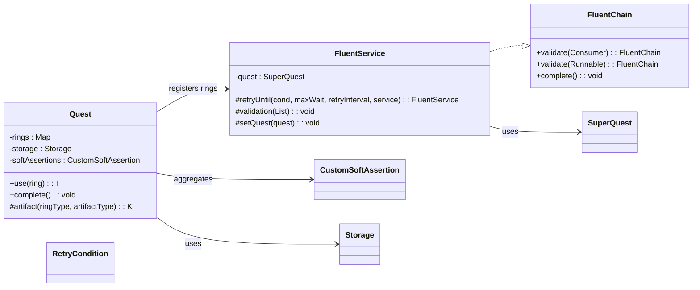
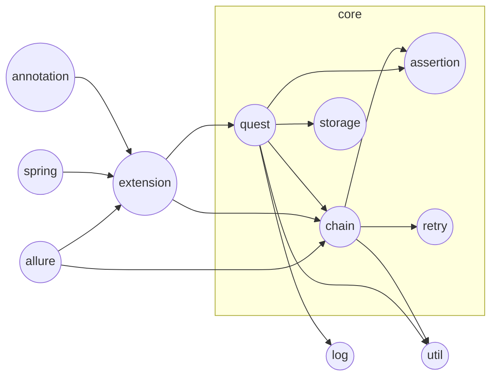
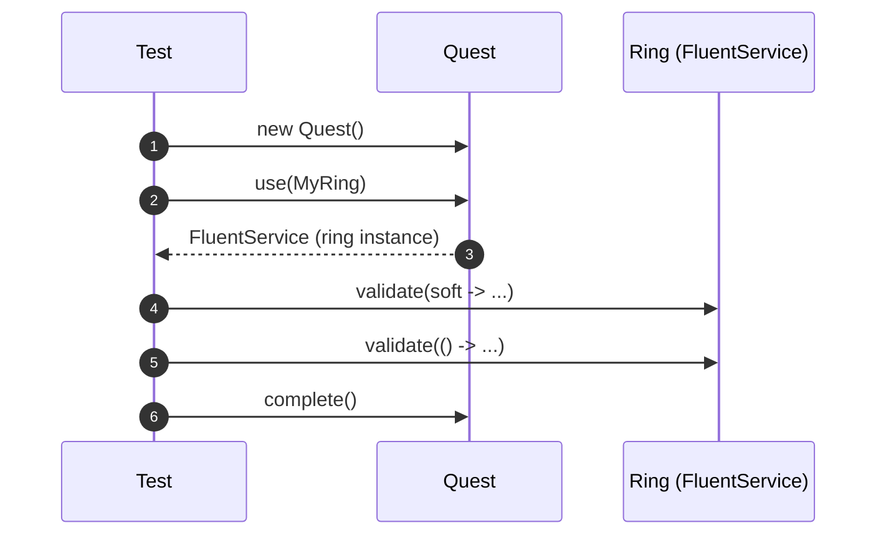
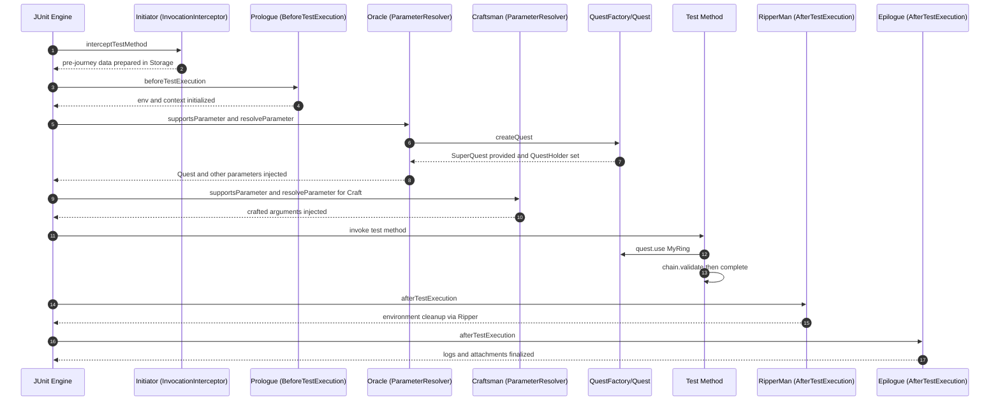

# test-framework

<!-- Quick jump -->
**Start here:** [Usage — Quick Start (step-by-step)](#usage)

## Table of Contents
- [Overview](#overview)
- [Features](#features)
- [Structure](#structure)
- [Architecture](#architecture)
  - [Class Diagram](#class-diagram)
  - [Execution Flow](#execution-flow)
- [Usage](#usage)
  - [Step 1 — Add dependency](#step-1--add-dependency)
  - [Step 2 — Enable the framework on tests](#step-2--enable-the-framework-on-tests)
  - [Step 3 — Compose a fluent chain](#step-3--compose-a-fluent-chain)
  - [Test Example (JUnit 5)](#test-example-junit-5)
- [Configuration](#configuration)
- [Extensibility](#extensibility)
- [Annotations and Parameters](#annotations-and-parameters)
  - [Annotations](#annotations)
  - [Parameters](#parameters)
- [Dependencies](#dependencies)
- [Author](#author)

---

## Overview
The **test-framework** module is the ROA (Ring of Automation) core testing layer. It provides a fluent, test-facing API to orchestrate end-to-end flows as chains, collect soft and hard validations, perform time-bound retries, and attach rich logs/steps for observability. 

At the center sits `Quest`: a lightweight execution context with data storage and assertion aggregation. Test-facing services extend `FluentService` and are registered as “rings” that a `Quest` can use to compose journeys. The framework remains test-framework agnostic while offering JUnit 5 friendly patterns and Allure hooks.

## Features
- **Fluent chain API:** `FluentChain.validate(SoftAssertions)`, `FluentChain.validate(Runnable)`, `FluentChain.complete()`.
- **Execution context:** `Quest` stores rings (services), artifacts, soft assertions, and ephemeral data.
- **Service base class:** `FluentService` with validation helpers and protected `retryUntil(...)` support.
- **Retry utilities:** integrate with `RetryCondition` and `RetryUtils` for eventual consistency.
- **Extensions lifecycle:** init/prologue/epilogue-style helpers (`Initiator`, `Prologue`, `Epilogue`, `Craftsman`, `Oracle`).
- **Logging & steps:** `LogQuest` messages and Allure step attachments for validations.

## Structure
- `allure` — `CustomAllureListener`, `StepType`
- `annotation` — `Ring`, `Journey`, `Odyssey`, `Craft`, `Regression`, `Smoke`, `Ripper`, `PreQuest`, `StaticTestData`, `FrameworkAdapter`
- `assertion` — `CustomSoftAssertion`
- `base` — `BaseQuest`, `BaseQuestSequential`, `ClassLevelHook`, `Services`
- `chain` — `FluentChain`, `FluentService`, `FluentServiceDecorator`
- `config` — framework configuration helpers
- `exceptions` — core exception types
- `extension` — `Initiator`, `Prologue`, `Epilogue`, `Craftsman`, `Oracle`, `RipperMan`
- `hooks` — hook contracts
- `log` — `LogQuest`
- `parameters` — `DataForge`, `DataRipper`, `Late`, `PreQuestJourney`
- `quest` — `Quest`, `SuperQuest`, `QuestFactory`, `QuestHolder`
- `retry` — `RetryCondition`, `RetryConditionImpl`
- `spring` — Spring integration helpers
- `storage` — `Storage`, `StoreKeys`, `DataExtractor`, `DataExtractorImpl`, `StorageKeysTest`, `DataExtractorsTest`
- `util` — `AllureStepHelper`, `ObjectFormatter`, `TestContextManager`, `FrameworkAdapterContextCustomizer`, `FrameworkAdapterContextCustomizerFactory`

### Package Reference (Class tables)

#### allure
| Class | Responsibility | Key methods | Used by |
|---|---|---|---|
| `CustomAllureListener` | Attach structured steps/artifacts to Allure reports. | `step(...)`, helpers via `AllureStepHelper` | Rings and extensions for reporting |
| `StepType` | Enum for classifying Allure steps. | n/a | `CustomAllureListener`, log helpers |

#### annotation
| Class | Responsibility | Key methods | Used by |
|---|---|---|---|
| `Ring` | Names a ring (service) for readable logs. | n/a | `Quest.use(...)` logging |
| `Journey`, `Odyssey`, `Craft`, `Regression`, `Smoke`, `Ripper`, `PreQuest`, `StaticTestData`, `FrameworkAdapter` | Marker/meta annotations for test grouping and data. | n/a | JUnit 5 classes, extensions |

#### assertion
| Class | Responsibility | Key methods | Used by |
|---|---|---|---|
| `CustomSoftAssertion` | Aggregates soft-asserts and defers failure. | `assertAll()` | `Quest.complete()` and validations |

#### base
| Class | Responsibility | Key methods | Used by |
|---|---|---|---|
| `BaseQuest`, `BaseQuestSequential` | Base harnesses for organizing flows. | lifecycle helpers | Rings and test scaffolding |
| `ClassLevelHook` | Hook contract executed at class level. | `execute(...)` | Extensions/Hooks |
| `Services` | Helper to access shared services/artifacts. | getters | Rings and tests |

#### chain
| Class | Responsibility | Key methods | Used by |
|---|---|---|---|
| `FluentChain` | Chain façade for validations and completion. | `validate(...)`, `complete()` | Returned by rings to tests |
| `FluentService` | Base for ring services with retry/validation. | `retryUntil(...)`, `validation(...)`, `drop()` | User-defined rings |
| `FluentServiceDecorator` | Decorate a `FluentService` with extra behavior. | delegation | Cross-cutting extensions |

#### config
| Class | Responsibility | Key methods | Used by |
|---|---|---|---|
| `FrameworkConfig` | Owner-backed framework properties. | getters | Rings/extensions for toggles |
| `FrameworkConfigHolder` | Loads/holds `FrameworkConfig`. | `get()` | Any component needing config |
| `TestConfig` | Test-scope configuration keys. | getters | Test bootstrapping |

#### exceptions
| Class | Responsibility | Key methods | Used by |
|---|---|---|---|
| `HookExecutionException` | Signals hook failures. | constructors | Extensions/hooks |
| `ServiceInitializationException` | Ring/service init problems. | constructors | Quest/rings |
| `StaticTestDataInitializationException` | Static data init failures. | constructors | Data providers/extensions |

#### extension
| Class | Responsibility | Key methods | Used by |
|---|---|---|---|
| `Initiator`, `Prologue`, `Epilogue` | Lifecycle helpers before/after tests. | callbacks | Test classes via annotations |
| `Craftsman`, `Oracle`, `RipperMan` | Utilities for wiring, assertions, teardown. | assorted | Rings/tests/bootstrapping |

#### hooks
| Class | Responsibility | Key methods | Used by |
|---|---|---|---|
| `HookExecution` | Enum for BEFORE/AFTER timing. | n/a | Hook processing logic |

#### log
| Class | Responsibility | Key methods | Used by |
|---|---|---|---|
| `LogQuest` | Structured logging for quests/chains. | `info(...)`, `validation(...)`, `warn(...)` | All components |

#### parameters
| Class | Responsibility | Key methods | Used by |
|---|---|---|---|
| `DataForge`, `DataRipper`, `Late`, `PreQuestJourney` | Parameter assembly utilities for chains. | builders/helpers | Rings/tests |

#### quest
| Class | Responsibility | Key methods | Used by |
|---|---|---|---|
| `Quest` | Execution context, ring registry, storage, soft-asserts. | `use(...)`, `complete()`, `artifact(...)` | All fluent tests |
| `SuperQuest` | Decorator exposing soft-assertions. | accessors | `FluentService`, `FluentChain` |
| `QuestFactory`, `QuestHolder` | Create and hold per-test quest. | factory/accessors | Test lifecycle |

#### retry
| Class | Responsibility | Key methods | Used by |
|---|---|---|---|
| `RetryCondition`, `RetryConditionImpl` | Functional polling conditions. | `function()`, `condition()` | `FluentService.retryUntil(...)` |

#### spring
| Class | Responsibility | Key methods | Used by |
|---|---|---|---|
| `FrameworkAdapterContextCustomizer` | Spring TestContext customization. | Spring hooks | Spring-enabled tests |
| `FrameworkAdapterContextCustomizerFactory` | Factory to register customizer. | Spring hooks | Spring-enabled tests |

#### storage
| Class | Responsibility | Key methods | Used by |
|---|---|---|---|
| `Storage` | In-memory key-value store for test run. | put/get helpers | Rings/tests |
| `StoreKeys` | Key registry for storage. | constants | Tests/rings |
| `DataExtractor`, `DataExtractorImpl` | Helpers to extract/store data. | extract/store | Rings/tests |
| `StorageKeysTest`, `DataExtractorsTest` | Test-named helpers under main. | helpers | Clarify intent despite name |

#### util
| Class | Responsibility | Key methods | Used by |
|---|---|---|---|
| `AllureStepHelper` | Common Allure step formatting. | step helpers | Reporting across rings |
| `ObjectFormatter` | Pretty-print complex objects. | formatters | Logs/attachments |
| `TestContextManager` | Manages per-test context. | lifecycle | Extensions/tests |
| `PropertiesUtil`, `ResourceLoader` | Property/resource loading. | loaders | Config/data fixtures |

## Architecture

### Class Diagram


### Package Diagram


### Execution Flow


## Usage

### Step 1 — Add dependency
```xml
<dependency>
  <groupId>io.cyborgcode.roa</groupId>
  <artifactId>test-framework</artifactId>
  <version>${revision}</version>
  <scope>test</scope>
</dependency>
```

### Step 2 — Enable the framework on tests
This module is test-framework agnostic. You can use it plain, or wire it via your own test bootstrapping (e.g., JUnit 5 extensions, Spring test context). Rings (your test-facing services) must extend `FluentService` and be available for `Quest` to use.

### Step 3 — Compose a fluent chain
- Create a `Quest` for each test method (or per class if you centralize lifecycle).
- Retrieve a ring (your service) with `quest.use(YourRing.class)`.
- Chain validations via `FluentChain.validate(...)` and finalize with `complete()`.

### Test Example (JUnit 5)
```java
import io.cyborgcode.roa.framework.quest.Quest;
import io.cyborgcode.roa.framework.chain.FluentChain;
import io.cyborgcode.roa.framework.chain.FluentService;
import org.assertj.core.api.Assertions;
import org.junit.jupiter.api.Test;

class SampleFluentTest {
  // Example ring (service) from your project that extends FluentService
  static class MyApiRing extends FluentService {
    // your fluent methods calling underlying interactors/adapters
  }

  @Test
  void userJourney_uses_chain_and_validations() {
    Quest quest = new Quest();

    // In your project, bootstrap/register rings so Quest can resolve them.
    // For illustration, we assume MyApiRing is registered and retrievable.
    MyApiRing api = quest.use(MyApiRing.class);

    FluentChain chain = api
        // soft validation — collected and asserted at quest.complete()
        .validate(soft -> soft.assertThat(2 + 2).as("math").isEqualTo(4))
        // hard validation — fails immediately on error
        .validate(() -> Assertions.assertThat("ok").isNotBlank());

    // end the chain and assert all soft validations
    chain.complete();
  }
}
```

> Notes
> - Use your project-specific rings (services) that extend `FluentService` and wrap API/DB adapters.
> - For polling/retries, implement `RetryCondition<T>` and call the protected `retryUntil(...)` inside your ring methods.

#### Registering rings (QuestFactory/Spring)
Centralize ring registration so `quest.use(FooRing.class)` resolves consistently. Example `QuestFactory` wiring with Spring:

```java
@Component
public class QuestFactory {
  private final Map<Class<?>, FluentService> registry = new ConcurrentHashMap<>();
  public QuestFactory(List<FluentService> rings) { rings.forEach(r -> registry.put(r.getClass(), r)); }
  public Quest createQuest() {
    Quest q = new Quest();
    registry.forEach((type, ring) -> q.registerRing((Class) type, ring));
    return q;
  }
}
```

#### Using retryUntil inside a ring
Prefer polling inside `FluentService` methods using `RetryCondition` and `retryUntil(...)`:

```java
public class UserRing extends FluentService {
  public FluentChain waitUntilUserActive(String userId) {
    RetryCondition<Boolean> cond = new RetryConditionImpl<>(
        ignored -> api.getUser(userId).isActive(),
        Boolean::booleanValue);
    retryUntil(cond, Duration.ofSeconds(30), Duration.ofSeconds(2), this);
    return this;
  }
}
```

#### Allure setup (CustomAllureListener)
Register the listener via JUnit Platform ServiceLoader so it’s auto-discovered:

```text
src/test/resources/META-INF/services/org.junit.platform.launcher.TestExecutionListener
```

File contents:

```text
io.cyborgcode.roa.framework.allure.CustomAllureListener
```

## Configuration
| Key | Source (Owner/Spring) | Default | Example |
|---|---|---|---|
| `api.baseUrl` | Owner | `http://localhost:8080` | `-Dapi.baseUrl=https://api.example.com` |
| `api.timeout.ms` | Owner | `5000` | `-Dapi.timeout.ms=15000` |
| `db.url` | Spring/Owner | `jdbc:h2:mem:testdb` | `-Ddb.url=jdbc:postgresql://host/db` |
| `db.user` | Spring/Owner | `sa` | `-Ddb.user=app_user` |
| `allure.results.dir` | Owner | `target/allure-results` | `-Dallure.results.dir=build/allure-results` |
| `retry.maxWait.seconds` | Owner | `30` | `-Dretry.maxWait.seconds=60` |
| `retry.interval.seconds` | Owner | `2` | `-Dretry.interval.seconds=5` |

## Extensibility
- **Create rings:** Extend `FluentService` to expose fluent methods for your domain (e.g., `login()`, `getUser()`, `queryUsers()`), internally delegating to `api-interactor`/`db-interactor` or their adapters.
- **Model journeys:** Use `Quest` to select and compose rings. Aggregate validations with soft/hard checks and end with `complete()`.
- **Lifecycle hooks:** The framework includes extension points (`Initiator`, `Prologue`, `Epilogue`, `Craftsman`, `Oracle`) you can integrate to bootstrap rings, manage context, or attach reporting.
- **Retry strategies:** Provide `RetryCondition` implementations and use `retryUntil(...)` from inside your ring methods to wait for eventual consistency.

### Extensions lifecycle

- **Initiator**. An InvocationInterceptor that preprocesses a test invocation. It reads `@PreQuest`/journey annotations, prepares data via `DataForge`, and enriches `Storage` before the test method is invoked. Use it to standardize preconditions and derive inputs deterministically for the run.

- **Prologue**. A BeforeTestExecutionCallback that runs just before the test body. It initializes the environment and test context metadata (names, tags, categories), sets Allure descriptions, and wires any run-scoped context required by the test. Keep it fast and idempotent.

- **Oracle**. A ParameterResolver that supplies method parameters such as a fresh `Quest`, static test data, or pre-computed artifacts from `Storage`. It is responsible for creating the `Quest` and making it available to downstream helpers via `QuestHolder`.

- **Craftsman**. A ParameterResolver for `@Craft` arguments. It pulls data from `DataForge`/`Storage` to hydrate complex parameters used by the test body or rings. Prefer `Craftsman` for building rich, typed inputs rather than manual object assembly in tests.

- **RipperMan**. An AfterTestExecutionCallback that performs registered teardown via `@Ripper` implementations (e.g., deleting created entities). It runs even when the test fails, helping keep environments clean and deterministic across runs.

- **Epilogue**. An AfterTestExecutionCallback that finalizes reporting. It logs outcomes, attaches filtered logs/HTML/screenshots to Allure, and performs last-mile context cleanup. Avoid heavy I/O here beyond attachments.

#### Sequence: typical test run


## Annotations and Parameters

### Annotations
- **Ring**: Names a `FluentService` for readable logs and selection. Used by `Quest.use(...)` and reporting.
- **Journey / Odyssey**: Semantic markers to group end-to-end flows for reporting and selection.
- **Craft**: Marks a parameter to be resolved by `Craftsman` from `DataForge`/Storage.
- **Regression / Smoke**: Execution grouping tags; useful for CI filters and Allure labels.
- **Ripper**: Marks a teardown routine discovered by `RipperMan` after the test.
- **PreQuest**: Declares preconditions/journeys to run by `Initiator` before test execution.
- **StaticTestData**: Declares static providers to load fixed data into Storage before parameter resolution.
- **FrameworkAdapter**: Enables project-level Spring customization via the framework adapter factory.

### Parameters
- **DataForge<T>**: Builder/assembler for typed test inputs. Produces crafted arguments injected via `@Craft`.
- **DataRipper**: Cleanup strategy invoked by `RipperMan` to remove created/dirty state.
- **Late<T>**: Deferred value supplier; resolved just-in-time and stored under a Storage key.
- **PreQuestJourney**: Descriptor for pre-execution steps used by `Initiator` to prepare inputs.

Example usage

```java
class MyTest {
  @Test
  void user_can_login(@Craft DataForge<LoginRequest> login) {
    Quest q = new Quest();
    q.use(MyApiRing.class)
      .login(login.build())
      .complete();
  }
}
```

Teardown example

```java
@Ripper
public class UserCleanup implements DataRipper {
  public void rip(Storage storage) {
    var id = storage.get(StoreKeys.USER_ID, String.class);
    api.deleteUser(id);
  }
}
```

#### Pitfalls and best practices
- **Register rings centrally**: Prefer registering rings in `QuestFactory` (or your bootstrapping) so `quest.use(...)` resolves immediately. Avoid ad-hoc registration in test methods.
- **Use `retryUntil(...)` inside rings**: Poll within `FluentService` methods for eventual consistency (e.g., async propagation). Keep tests declarative; do not `sleep` in tests.
- **Choose hard vs soft asserts**: Use hard asserts for invariants/preconditions that must stop the flow; use soft validations via `FluentChain.validate(soft -> ...)` to aggregate multiple checks before `quest.complete()`.
- **Keep extensions fast**: `Initiator`/`Prologue` should stay lightweight. Heavy data seeding belongs in project fixtures or pre-run jobs.
- **Storage discipline**: Namespace keys (enums) and prefer `DataExtractor` for typed retrieval to avoid class cast issues.
- **Reporting hygiene**: Only attach necessary logs/screenshots in `Epilogue`; large attachments can slow CI.

## Lifecycle & Thread-safety
- **Quest scope**: Create a new `Quest` per test method (recommended). Avoid sharing across tests.
- **Storage scope**: `Storage` is owned by the `Quest`; treat as per-test, thread-confined data store.
- **Assertions**: `CustomSoftAssertion` is per-quest; call `quest.complete()` once to assert all soft validations.
- **Rings**: Keep ring methods stateless; do not store mutable run-state in fields unless properly synchronized.

## Cross-module links
| Module | Purpose | Where rings typically delegate |
|---|---|---|
| [`../api-interactor/`](../api-interactor/README.md) | Low-level HTTP client and request orchestration | API-backed rings |
| [`../db-interactor/`](../db-interactor/README.md) | Low-level DB interactions and SQL helpers | DB-backed rings |
| [`../api-interactor-test-framework-adapter/`](../api-interactor-test-framework-adapter/README.md) | Glue between API interactor and this framework | API rings wiring |
| [`../db-interactor-test-framework-adapter/`](../db-interactor-test-framework-adapter/README.md) | Glue between DB interactor and this framework | DB rings wiring |

## Glossary
- **Quest**: The execution context per test. Manages rings, `Storage`, and soft assertions; finalize with `complete()`.
- **Ring**: A `FluentService`-based, test-facing service that exposes fluent actions and validations for a domain.
- **Journey**: A higher-level composition of ring actions that models a user or system flow end-to-end.
- **Craft**: Structured, typed test input produced by `DataForge` and injected via `Craftsman`.
- **Ripper**: A teardown routine invoked by `RipperMan` to clean external state created during a test.

## Dependencies
- `org.projectlombok:lombok`
- `io.cyborgcode.utilities:commons`
- `org.springframework.boot:spring-boot-starter`
- `io.cyborgcode.roa:assertions`
- `org.assertj:assertj-core`
- `org.junit.jupiter:junit-jupiter-api`
- `io.qameta.allure:allure-junit5`
- `io.qameta.allure:allure-java-commons`
- `org.aeonbits.owner:owner`
- `org.springframework.boot:spring-boot-starter-test`
- `com.github.spotbugs:spotbugs-annotations`

## Author
**Cyborg Code Syndicate 💍👨💻**
