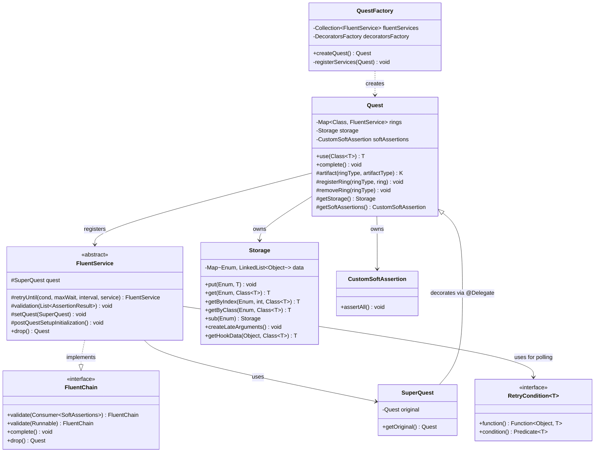
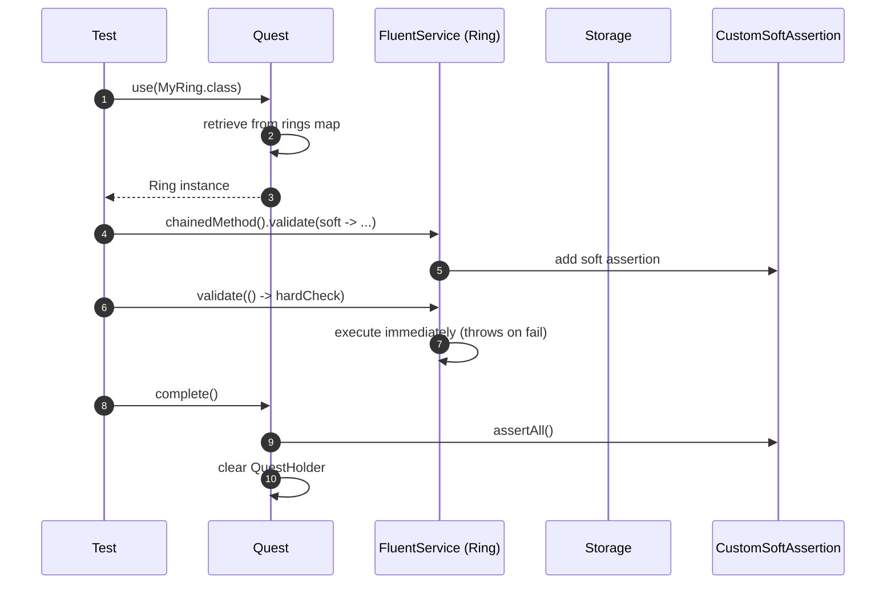
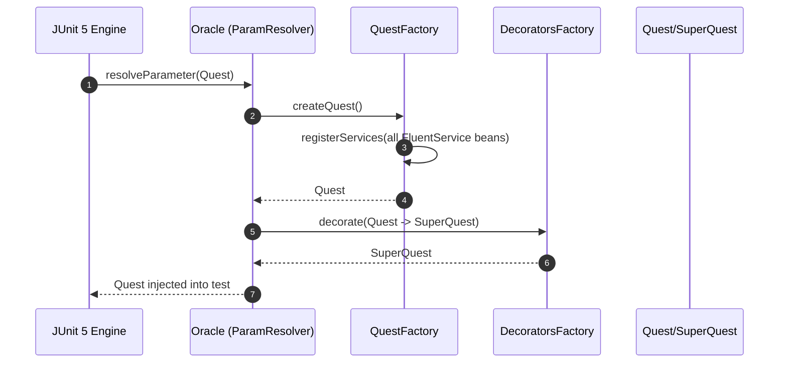
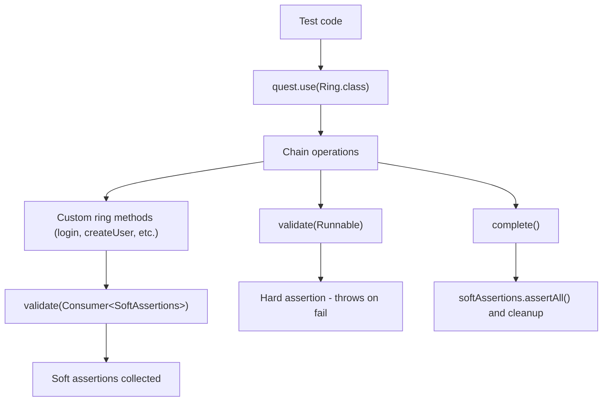
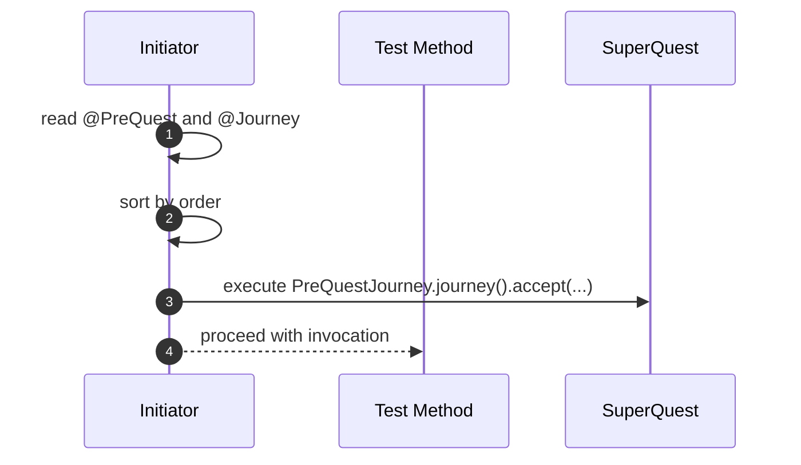
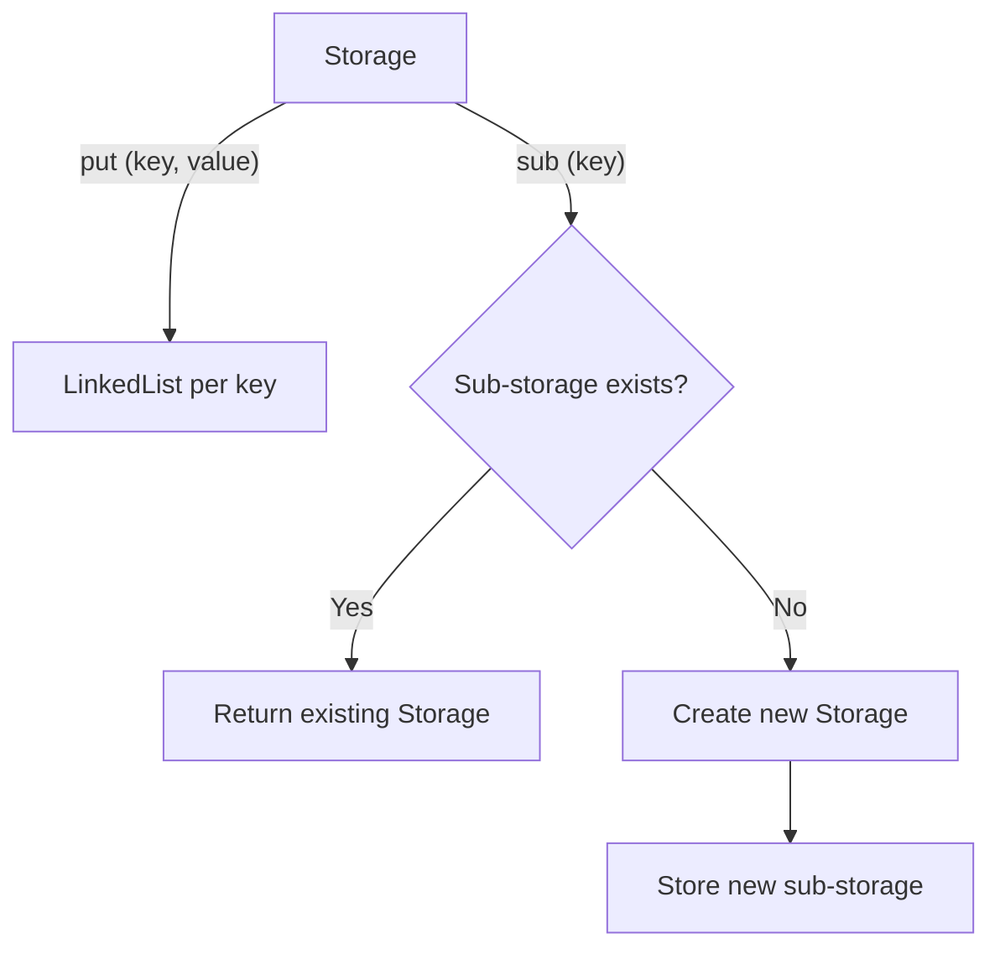
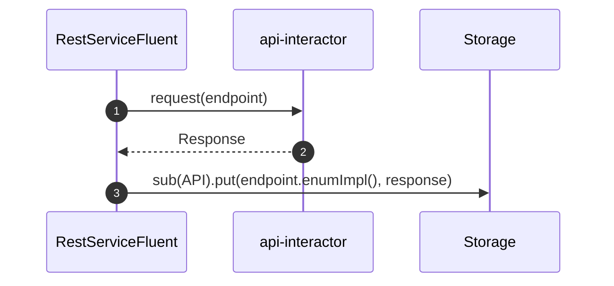
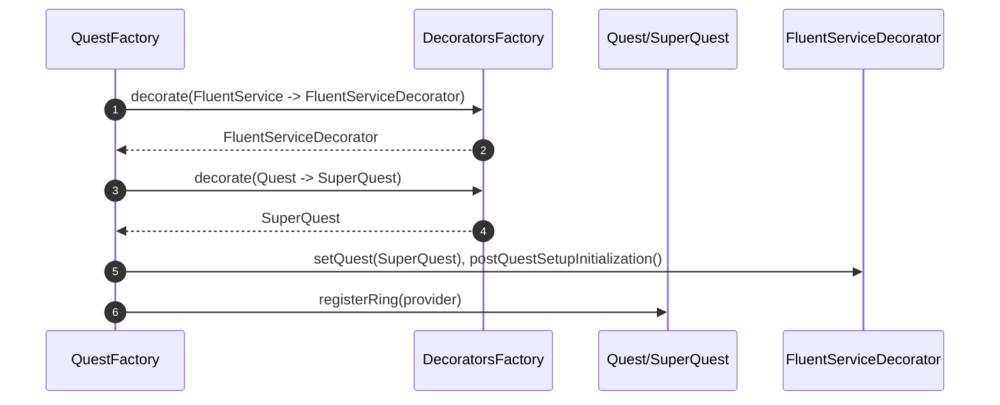
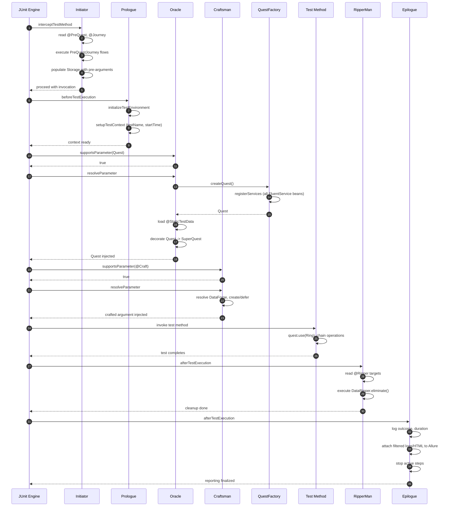

# Ring of Automation Core Test Framework

<!-- Quick jump -->
**Start here:** [Usage - Quick Start (step-by-step)](#usage)

## Table of Contents
- [Overview](#overview)
- [The Big Idea](#the-big-idea)
- [Module metadata](#module-metadata)
- [Features](#features)
- [Structure](#structure)
- [Architecture](#architecture)
    - [Class Diagram](#class-diagram)
    - [Execution Flow](#execution-flow)
    - [Core Execution & Integration Flows](#core-execution--integration-flows)
      - [Test Method Execution via JUnit Extensions](#test-method-execution-via-junit-extensions)
      - [Fluent Chain Execution & Validation](#fluent-chain-execution--validation)
      - [Pre-Quest Journey Processing System](#pre-quest-journey-processing-system)
      - [Storage System & Data Flow](#storage-system--data-flow)
      - [Adapter Service Integration Example](#adapter-service-integration-example)
      - [Service Decoration & Extension](#service-decoration--extension)
      - [Extension Lifecylce Flow](#extension-lifecycle-flow)      
- [Usage](#usage)
    - [Step 1 - Add dependency](#step-1---add-dependency)
    - [Step 2 - Enable the framework](#step-2---enable-the-framework)
    - [Step 3 - Compose a fluent chain](#step-3---compose-a-fluent-chain)
    - [Step 4 - (Optional) Register rings with Spring](#step-4---optional-register-rings-with-spring)
    - [Step 5 - (Optional) Use retry mechanisms](#step-5---optional-use-retry-mechanisms)
    - [Step 6 - (Optional) Configure pre-quest journeys](#step-6---optional-configure-pre-quest-journeys)
- [Core Features & Detailed Usage](#core-features--detailed-usage)
    - [Storage & Data Extractors](#storage--data-extractors)
    - [DataForge, Craft, Late & Dynamic Data Creation](#dataforge-craft-late--dynamic-data-creation)
    - [PreQuest, Journey & JourneyData System](#prequest-journey--journeydata-system)
    - [Ripper, RipperMan & Data Cleanup](#ripper-ripperman--data-cleanup)
    - [Custom Soft Assertion Registration](#custom-soft-assertion-registration)
    - [BaseQuest vs BaseQuestSequential](#basequest-vs-basequestsequential---test-execution-control)
    - [StaticDataProvider](#staticdataprovider---preloading-test-data)
- [Annotations & Hooks](#annotations--hooks)
- [Retry Helpers](#retry-helpers)
- [Allure Reporting](#allure-reporting)
- [Framework Configuration](#framework-configuration)
- [Dependencies](#dependencies)
- [Author](#author)

---

## Overview
The **test-framework** module is the ROA (Ring of Automation) core testing layer. It provides a **fluent, test-facing API** to orchestrate end-to-end flows as chains, collect soft and hard validations, perform time-bound retries, and attach rich logs/steps for observability.

At the center sits `Quest`: a lightweight execution context with data storage (`Storage`) and assertion aggregation (`CustomSoftAssertion`). Test-facing services extend `FluentService` and are registered as "rings" that a `Quest` can use to compose journeys. The framework is built specifically for **JUnit 5** and leverages its extensions (`Oracle`, `Initiator`, `Prologue`, `Epilogue`, `Craftsman`, `RipperMan`) and **Allure hooks** (`CustomAllureListener`) for structured reporting.

## The Big Idea

**Isolated Test Contexts:** Each test method receives its own injected `Quest` object with its own set of service instances (rings). This means **each test method operates in a completely isolated context** with no interference between tests. Services are fresh, storage is clean, and state never leaks across test boundaries.

**Quest vs SuperQuest:** The `Quest` object injected into test methods is actually a `SuperQuest` - a Lombok `@Delegate` decorator that wraps the base `Quest`. This decorator exposes additional convenience methods while hiding internal framework operations from test code, keeping the test API clean and user-friendly. Inside rings and framework internals, the full `SuperQuest` functionality is available.

**Universal Quest Access via QuestHolder:** Anywhere in your code (rings, data creators, utilities), you can access the currently active `Quest` for the running test via `QuestHolder.get()`. This returns the `SuperQuest` instance, giving you access to:
- Storage for retrieving/storing data
- Rings for cross-ring communication
- The complete Quest API

```java
public final class DataCreatorFunctions {
    public static CreateUserDto juniorUser() {
        SuperQuest quest = QuestHolder.get();
        // Access storage from anywhere
        UserData firstUser = quest.getStorage().get(UserKeys.FIRST_USER, UserData.class);
        return CreateUserDto.builder()
            .name(firstUser.getFirstName() + " suffix")
            .job("Junior " + firstUser.getLastName() + " worker")
            .build();
    }
}
```

**Everything Goes to Storage:** All test artifacts, API responses, created data, and journey outputs are stored in the `Storage` system. Storage is organized hierarchically:
- **Root storage** - directly accessible via `quest.getStorage()`
- **Sub-storages** - isolated buckets per module/ring (e.g., `quest.getStorage().sub(StorageKeys.API)`)
- Framework automatically stores data under specific keys:
  - `ARGUMENTS` - @Craft parameters
  - `PRECONDITIONS` - @Journey outputs
  - `STATIC_DATA` - @StaticTestData entries
  - Module-specific sub-storages for API responses, UI elements, etc.

This means you can fetch the **latest state** of any test artifact from anywhere in the code by accessing Storage via `QuestHolder.get().getStorage()`.

**Fluent Chaining is Core:** The framework is designed around fluent method chaining. Tests should compose complex flows by chaining ring methods together without breaking the chain:

```java
quest.use(UserRing.class)
    .createUser(userData)
    .use(AuthRing.class)  // Switch rings mid-chain via drop()
    .login(username, password)
    .use(OrderRing.class)
    .createOrder(orderData)
    .validateOrderCreated()
    .complete();  // Finalize and run soft assertions
```

## Module metadata
- **Name:** Ring of Automation Core Test Framework
- **ArtifactId:** `test-framework`
- **Description:** Core test framework for building fluent, ring-based automation with quest context, hierarchical storage, and assertion aggregation.
- **Dependencies (from pom):**
  - `org.projectlombok:lombok`
  - `io.cyborgcode.utilities:commons:${utilities.version}`
  - `org.springframework.boot:spring-boot-starter`
  - `io.cyborgcode.roa:assertions:${project.version}`
  - `org.assertj:assertj-core`
  - `org.junit.jupiter:junit-jupiter-api`
  - `io.qameta.allure:allure-junit5`
  - `io.qameta.allure:allure-java-commons`
  - `org.aeonbits.owner:owner`
  - `org.springframework.boot:spring-boot-starter-test`
  - `com.github.spotbugs:spotbugs-annotations`

## Features
- **Fluent chain API:** `FluentChain` -> `validate(Consumer<SoftAssertions>)`, `validate(Runnable)`, `complete()`, `drop()`; services implement `FluentChain` for method chaining.
- **Execution context:** `Quest` stores:
    - Rings (services) via `use(Class<T>)` - retrieves registered `FluentService` instances
    - Artifacts via `artifact(ringType, artifactType)` - extracts specific objects from rings
    - Soft assertions via `CustomSoftAssertion` - aggregates soft validations
    - Ephemeral data in `Storage` - thread-safe key-value store with sub-storage support
- **Service base class:** `FluentService` implements `FluentChain` with:
    - `validation(List<AssertionResult>)` - processes assertion results (soft/hard)
    - `retryUntil(retryCondition, maxWait, retryInterval, service)` - polls until condition met
    - `drop()` - returns original `Quest` for ring switching
    - `postQuestSetupInitialization()` - hook for custom setup after quest wiring
- **Retry utilities:** `RetryCondition<T>` / `RetryConditionImpl<T>` combine `Function<Object, T>` and `Predicate<T>` with `RetryUtils.retryUntil(...)` for eventual consistency.
- **JUnit 5 extensions lifecycle:**
    - **`Initiator`** (InvocationInterceptor, Order=MAX) - intercepts test method, processes `@PreQuest` / `@Journey` annotations, executes `PreQuestJourney` flows, populates Storage with pre-arguments via `DataForge`.
    - **`Prologue`** (BeforeTestExecutionCallback, Order=MIN) - initializes test environment via `AllureStepHelper.initializeTestEnvironment()` (writes environment.properties, categories.json) and `setupTestContext()` (stores test name, start time).
    - **`Oracle`** (ParameterResolver) - resolves `Quest` parameter, creates via `QuestFactory`, loads `@StaticTestData`, decorates `Quest` -> `SuperQuest`, stores in `QuestHolder`.
    - **`Craftsman`** (ParameterResolver) - resolves `@Craft` parameters using `DataForge<T>` (immediate via `.dataCreator().create()` or `Late<T>` deferred via `.dataCreator()`).
    - **`RipperMan`** (AfterTestExecutionCallback) - processes `@Ripper` targets, executes `DataRipper.eliminate()` cleanup on Storage.
    - **`Epilogue`** (AfterTestExecutionCallback, Order=MAX) - logs test outcome, calculates duration, attaches filtered logs/HTML to Allure via `AllureStepHelper`, stops active steps.
- **Logging & steps:** 
    - `LogQuest` - singleton structured logger under "ROA.TEST.QUEST" namespace with methods: `info()`, `warn()`, `error()`, `debug()`, `trace()`, `step()`, `validation()`, `extended()`.
    - `CustomAllureListener` - extends `AllureJunit5`, manages thread-local step tracking with `StatusType` enum (DEFAULT, INFO, SUCCESS, WARNING, ERROR), methods: `startStep()`, `stopStep()`, `isStepActive()`.
- **Spring integration:** 
    - `QuestFactory` - creates `Quest` instances, auto-wires `FluentService` collection, registers rings via `registerRing()`, decorates with `DecoratorsFactory`.
    - `FrameworkAdapterContextCustomizer` / `FrameworkAdapterContextCustomizerFactory` - Spring TestContext customization for framework adapter integration.

## Structure
- `allure` - `CustomAllureListener` (step tracking, status types), `StepType` (enum for predefined steps)
- `annotation` - `@Ring`, `@Journey`, `@Odyssey`, `@Craft`, `@Regression`, `@Smoke`, `@Ripper`, `@PreQuest`, `@StaticTestData`, `@FrameworkAdapter`, `@JourneyData`
- `assertion` - `CustomSoftAssertion` (extends AssertJ SoftAssertions, defers failures)
- `base` - `BaseQuest`, `BaseQuestSequential`, `ClassLevelHook`, `Services`
- `chain` - `FluentChain` (interface), `FluentService` (abstract base), `FluentServiceDecorator`
- `config` - `FrameworkConfig` (Owner interface), `FrameworkConfigHolder`, `TestConfig`
- `data` - data model helpers
- `decorators` - `DecoratorsFactory` (decorator pattern support)
- `exceptions` - `HookExecutionException`, `ServiceInitializationException`, `StaticTestDataInitializationException`
- `extension` - `Initiator`, `Prologue`, `Epilogue`, `Craftsman`, `Oracle`, `RipperMan`
- `hooks` - `HookExecution` (enum: BEFORE/AFTER)
- `log` - `LogQuest` (singleton structured logger)
- `parameters` - `DataForge<T>` (data builder interface), `DataRipper<T>` (cleanup interface), `Late<T>` (deferred supplier), `PreQuestJourney<T>` (pre-execution journey interface)
- `quest` - `Quest` (core context), `SuperQuest` (decorator with Lombok @Delegate), `QuestFactory`, `QuestHolder` (ThreadLocal holder)
- `retry` - `RetryCondition<T>` (interface), `RetryConditionImpl<T>` (implementation)
- `spring` - `FrameworkAdapterContextCustomizer`, `FrameworkAdapterContextCustomizerFactory`
- `storage` - `Storage` (concurrent key-value store with sub-storage), `StoreKeys`, `StorageKeysTest`, `DataExtractor<T>`, `DataExtractorImpl<T>`, `DataExtractorsTest`
- `util` - `AllureStepHelper`, `ObjectFormatter`, `TestContextManager`, `PropertiesUtil`, `ResourceLoader`

## Architecture

### Class Diagram


### Execution Flow


### Core Execution & Integration Flows

#### Test Method Execution via JUnit Extensions


#### Fluent Chain Execution & Validation


#### Pre-Quest Journey Processing System


#### Storage System & Data Flow


#### Adapter Service Integration (example)


#### Service Decoration & Extension


#### Extension Lifecycle Flow


## Usage

> Follow these steps in your **test module**. The framework is designed for JUnit 5 with Spring DI support.

### Step 1 - Add dependency
```xml
<dependency>
  <groupId>io.cyborgcode.roa</groupId>
  <artifactId>test-framework</artifactId>
  <version>${revision}</version>
</dependency>
```

### Step 2 - Enable the framework
The framework integrates via JUnit 5 extensions and Spring. Enable it by:
1. Extending `BaseQuest` (per-test instance) or `BaseQuestSequential` (PER_CLASS lifecycle) which already applies `@Odyssey` and `@SpringBootTest`.
2. Alternatively, annotate your test class with `@Odyssey` and your own Spring test configuration so the framework extensions (`Oracle`, `Prologue`, `Initiator`, `Craftsman`, `RipperMan`, `Epilogue`) are registered.
3. Expose your rings as Spring beans via `@Ring` so `QuestFactory` can wire them automatically, then accept a `Quest` parameter in your test method (resolved by the `Oracle` extension).

```java
class UserJourneyTest extends BaseQuest {

  @Test
  void userCanLoginAndViewProfile(Quest quest) {
    // Quest automatically injected, rings registered
    quest.use(AuthRing.class)
        .login("user", "pass")
        .validate(soft -> soft.assertThat(true).isTrue())
        .complete();
  }
}
```

### Step 3 - Compose a fluent chain
Create your rings (services) by extending `FluentService`:

```java
enum AuthArtifacts {
  AUTH_TOKEN
}

@Component
@Ring("Auth Service")
public class AuthRing extends FluentService {

  private final AuthClient authClient;

  public AuthRing(AuthClient authClient) {
    this.authClient = authClient;
  }

  public FluentChain login(String username, String password) {
    Response response = authClient.login(username, password);

    // Store token in Storage for later validations
    quest.getStorage().put(AuthArtifacts.AUTH_TOKEN, response.getToken());

    return this;
  }
}
```

Use the ring in a test:
```java
class AuthJourneyTest extends BaseQuest {

  @Test
  void loginJourney(Quest quest) {
    quest.use(AuthRing.class)
        .login("admin", "password")
        .validate(soft -> {
            String token = QuestHolder.get().getStorage().get(AuthArtifacts.AUTH_TOKEN, String.class);
            soft.assertThat(token).isNotBlank();
        })
        .complete();
  }
}
```

### Step 4 - (Optional) Register rings with Spring
Rings are auto-registered when they are Spring beans. `QuestFactory` collects every `FluentService` bean:

```java
@Component
@Ring("User Service")
public class UserRing extends FluentService {
  // automatically registered by QuestFactory
}
```

If your ring beans live outside the default component scan, add a `@FrameworkAdapter` with the additional packages so Spring picks them up:

```java
@FrameworkAdapter(basePackages = "com.mycompany.test.rings")
public @interface ProjectRings {}
```

Apply the adapter (directly or through your own meta-annotation) on the test class. Manual quest wiring is intentionally not exposed because `QuestFactory` manages ring registration for you.


## Core Features & Detailed Usage

### Storage & Data Extractors

The `Storage` system is a thread-safe, hierarchical key-value store that enables data sharing across rings and test phases.

#### Storage Capabilities

**Basic Operations:**
```java
// Store data
quest.getStorage().put(MyKeys.USER_ID, "12345");
quest.getStorage().put(MyKeys.RESPONSES, response1);
quest.getStorage().put(MyKeys.RESPONSES, response2); // Stored in a LinkedList

// Retrieve data (last inserted)
String userId = quest.getStorage().get(MyKeys.USER_ID, String.class);

// Retrieve by index (0-based from the end, 0 = last inserted)
Response firstResponse = quest.getStorage().getByIndex(MyKeys.RESPONSES, 1, Response.class);
Response lastResponse = quest.getStorage().getByIndex(MyKeys.RESPONSES, 0, Response.class);

// Retrieve by class type (finds first matching instance)
User user = quest.getStorage().getByClass(MyKeys.DATA, User.class);
```

**Sub-Storage (Hierarchical Organization):**

Sub-storage creates isolated storage buckets per key, enabling modular data organization:

```java
// Create/get sub-storage for API module
Storage apiStorage = quest.getStorage().sub(ModuleKeys.API);
apiStorage.put(ApiKeys.RESPONSE, response);

// Each ring can maintain its own sub-storage
Storage authStorage = quest.getStorage().sub(RingKeys.AUTH_RING);
authStorage.put(AuthKeys.TOKEN, token);

// Sub-storages are reusable and isolated
quest.getStorage().sub(ModuleKeys.API).get(ApiKeys.RESPONSE, Response.class);
```

#### DataExtractors

`DataExtractor` provides fluent utilities to extract and transform data from Storage without manual type casting. DataExtractors can be used anywhere via `QuestHolder.get()` to access the current test's storage.

**Built-in Extractors:**

The framework provides `DataExtractorImpl<T>` with three constructors:

1. **Simple extraction** (by storage key and type):
```java
DataExtractor<Response> responseExtractor = new DataExtractorImpl<>(
    quest.getStorage(), 
    StorageKeys.RESPONSES, 
    Response.class
);

Response latest = responseExtractor.extract();           // Last inserted
Response specific = responseExtractor.extractByIndex(2); // By index
List<Response> all = responseExtractor.extractAll();     // All values
```

2. **Sub-storage extraction** (from specific sub-storage):
```java
DataExtractor<Response> apiResponseExtractor = new DataExtractorImpl<>(
    StorageKeys.API,           // Sub-storage key
    ApiKeys.CREATE_USER,       // Data key within sub-storage
    Response.class
);
```

3. **Transformation extraction** (with custom mapping):
```java
// Extract and transform - e.g., JSON path extraction from API response
public static <T> DataExtractor<T> responseBodyExtraction(Enum<?> key, String jsonPath) {
    return new DataExtractorImpl<>(
        StorageKeys.API,     // Sub-storage
        key,                 // Response key
        raw -> {
            Response response = (Response) raw;
            return response.body().jsonPath().get(jsonPath);
        }
    );
}

// Usage
DataExtractor<String> userIdExtractor = responseBodyExtraction(ApiKeys.CREATE_USER, "id");
String userId = userIdExtractor.extract();
```

**Custom DataExtractors with QuestHolder:**

Create reusable extractors as static methods accessible from anywhere:

```java
public final class DataExtractorsApi {
    
    // Access current Quest storage from anywhere
    public static <T> DataExtractor<T> responseBodyExtraction(Enum<?> key, String jsonPath) {
        return new DataExtractorImpl<>(
            StorageKeys.API,
            key,
            raw -> {
                Response response = (Response) raw;
                return response.body().jsonPath().get(jsonPath);
            }
        );
    }
    
    public static DataExtractor<String> extractUserId() {
        return responseBodyExtraction(ApiKeys.CREATE_USER, "id");
    }
    
    public static DataExtractor<Integer> extractStatusCode() {
        return new DataExtractorImpl<>(
            StorageKeys.API,
            ApiKeys.LAST_RESPONSE,
            raw -> ((Response) raw).getStatusCode()
        );
    }
}

// Usage in tests or rings
import static DataExtractorsApi.*;

String userId = extractUserId().extract();
quest.use(UserRing.class)
    .deleteUser(userId)
    .complete();
```

**Usage in Tests:**

```java
import static DataExtractorsApi.*;

class UserValidationTest extends BaseQuest {
    
    @Test
    void validateUserFromExtractedData(Quest quest) {
        quest.use(UserRing.class)
            .createUser(userData)
            .validateUser(extractUserId().extract())
            .complete();
    }
}
```

Note: `BaseQuest` provides the necessary framework context, and static imports make extractors readily available in test methods.

### DataForge, Craft, Late & Dynamic Data Creation

The `DataForge` system enables declarative test data creation with support for immediate and deferred (late) instantiation.

#### DataForge Interface

Implement `DataForge<T>` to define data creation strategies:

```java
public enum UserDataForge implements DataForge<CreateUserDto> {
    USER_ADMIN {
        @Override
        public DataCreator<CreateUserDto> dataCreator() {
            return () -> CreateUserDto.builder()
                .username("admin")
                .role("ADMIN")
                .email("admin@test.com")
                .build();
        }
    },
    USER_REGULAR {
        @Override
        public DataCreator<CreateUserDto> dataCreator() {
            return () -> CreateUserDto.builder()
                .username("user_" + System.currentTimeMillis())
                .role("USER")
                .email("user@test.com")
                .build();
        }
    };
    
    @Override
    public UserDataForge enumImpl() {
        return this;
    }
}
```

#### @Craft - Immediate Data Injection

The `@Craft` annotation with `Craftsman` extension resolves data at parameter injection time.

**Annotation Fields:**
- `model` (required) - String name of the `DataForge` enum constant to resolve (e.g., `"USER_ADMIN"` resolves to `UserDataForge.USER_ADMIN`)
- `late` (optional, default = `false`) - When `true`, returns `Late<T>` wrapper for deferred creation; when `false`, creates data immediately

**Usage:**
```java
@Test
void createUserWithCraftedData(
    Quest quest,
    @Craft(model = "USER_ADMIN") CreateUserDto adminUser,
    @Craft(model = "USER_REGULAR") CreateUserDto regularUser
) {
    quest.use(UserRing.class)
        .createUser(adminUser)
        .createUser(regularUser)
        .complete();
}
```

**How it works:**
1. `Craftsman` extension intercepts `@Craft` parameters
2. Resolves `DataForge` enum by name from `project.packages`
3. Calls `dataCreator().create()` to instantiate the object
4. Injects the created instance into the test method

#### Late<T> - Deferred Data Creation

`Late<T>` wraps a `DataCreator<T>` supplier for deferred instantiation, useful when data must be created at execution time (not parameter resolution time).

**@Craft with late = true:**
```java
@Test
void createUserWithLateData(
    Quest quest,
    @Craft(model = "USER_REGULAR", late = true) Late<CreateUserDto> userSupplier
) {
    quest.use(PreparationRing.class)
        .setupEnvironment()
        .use(UserRing.class)
        .createUser(userSupplier.create())  // Data created here, during execution
        .validate(soft -> soft.assertThat(userSupplier.create().getUsername()).startsWith("user_"))
        .complete();
}
```

**Real-world example with intercepted data:**
```java
@Test
@Regression
@InterceptRequests(requestUrlSubStrings = {RequestsInterceptor.Data.INTERCEPT_REQUEST_AUTH})
void interceptorFeatureUsedForLateDataCreation(
    Quest quest,
    @Craft(model = DataCreator.Data.SELLER) Seller seller,
    @Craft(model = DataCreator.Data.ORDER) Order order,
    @Craft(model = DataCreator.Data.LATE_ORDER, late = true) Late<Order> lateOrder
) {
    quest.use(CustomRing.class)
        .loginUsingInsertion(seller)
        .createOrder(order)              // Immediate data
        .validateOrder(order)
        .createOrder(lateOrder.create()) // Deferred data - created after login
        .validateOrder(lateOrder.create())
        .complete();
}
```

**When to use `Late<T>`:**
- Data depends on runtime state
- Data must be fresh (e.g., timestamp-based unique values)
- Data creation has side effects that must be delayed

#### Initiator Extension

`Initiator` is an `InvocationInterceptor` (JUnit extension) that processes `@PreQuest` and `@Journey` annotations **before** the test method executes.

**Responsibilities:**
1. Reads `@Journey` annotations on the test method
2. Sorts journeys by `order` attribute (ascending)
3. Resolves `PreQuestJourney` enums from `journeyData`
4. Executes each journey's `BiConsumer<SuperQuest, Object[]>` function
5. Populates Storage with journey artifacts
6. Proceeds with test invocation

**Flow:**
```
Test Method Invocation
  ↓
Initiator Intercepts
  ↓
Read @Journey(value="CREATE_USER", journeyData={@JourneyData("USER_ADMIN")}, order=1)
  ↓
Resolve Enum: Preconditions.CREATE_USER
  ↓
Resolve Data: UserDataForge.USER_ADMIN.dataCreator().create()
  ↓
Execute: journey().accept(quest, new Object[]{userData})
  ↓
Test Method Executes (data already in Storage)
```

### PreQuest, Journey & JourneyData System

The Journey system enables reusable precondition flows executed before test methods.

#### Common Usage Pattern

**Step 1: Create Precondition Functions**

Centralize reusable logic in a functions class:

```java
public final class PreconditionFunctions {

    private PreconditionFunctions() {}

    public static void createNewUser(SuperQuest quest, Object... objects) {
        createNewUser(quest, (CreateUserDto) objects[0]);
    }

    public static void createNewUser(SuperQuest quest, CreateUserDto userDto) {
        quest.use(ApiRing.class)
            .createUser(userDto)
            .validate(soft -> {
                String userId = quest.getStorage().get(UserKeys.USER_ID, String.class);
                soft.assertThat(userId).isNotBlank();
            })
            .complete();
    }

    public static void loginAsAdmin(SuperQuest quest, Object... objects) {
        quest.use(AuthRing.class)
            .login("admin", "admin123")
            .complete();
    }
}
```

**Step 2: Map Functions to Enum**

Implement `PreQuestJourney<T>` to expose functions as declarative journeys:

```java
public enum Preconditions implements PreQuestJourney<Preconditions> {

    CREATE_NEW_USER(PreconditionFunctions::createNewUser),
    LOGIN_AS_ADMIN(PreconditionFunctions::loginAsAdmin);

    // Nested class with string constants for @Journey annotation
    public static final class Data {
        private Data() {}
        
        public static final String CREATE_NEW_USER = "CREATE_NEW_USER";
        public static final String LOGIN_AS_ADMIN = "LOGIN_AS_ADMIN";
    }

    private final BiConsumer<SuperQuest, Object[]> function;

    Preconditions(BiConsumer<SuperQuest, Object[]> function) {
        this.function = function;
    }

    @Override
    public BiConsumer<SuperQuest, Object[]> journey() {
        return function;
    }

    @Override
    public Preconditions enumImpl() {
        return this;
    }
}
```

**Step 3: Use in Tests**

Reference journeys declaratively via `@Journey`.

**@Journey Annotation Fields:**
- `value` (required) - String name of the `PreQuestJourney` enum constant (e.g., `Preconditions.Data.CREATE_NEW_USER`)
- `journeyData` (optional, default = `{}`) - Array of `@JourneyData` annotations specifying data to pass to the journey function
- `order` (optional, default = `0`) - Execution order when multiple `@Journey` annotations are present (ascending)

**@JourneyData Annotation Fields:**
- `value` (required) - String name of the `DataForge` enum constant to resolve and pass as journey argument

**@PreQuest Annotation:**
- **No fields** - Marker annotation that enables journey processing. **Note:** Not required when using `@Journey` - the framework automatically processes multiple `@Journey` annotations without `@PreQuest`.

**Usage:**
```java
@Test
@Journey(
    value = Preconditions.Data.CREATE_NEW_USER,
    journeyData = {@JourneyData(UserDataForge.Data.USER_ADMIN)},
    order = 1
)
@Journey(
    value = Preconditions.Data.LOGIN_AS_ADMIN,
    order = 2
)
void testWithPreconditions(Quest quest) {
    // User already created and logged in
    quest.use(UserRing.class)
        .verifyUserExists()
        .complete();
}
```

#### Multiple Journeys with Ordered Execution

Journeys execute in `order` (ascending). Use this for dependency chains:

```java
@Test
@PreQuest
@Journey(
    value = Preconditions.Data.CREATE_NEW_USER,
    journeyData = {@JourneyData(UserDataForge.Data.USER_LEADER)},
    order = 1
)
@Journey(
    value = Preconditions.Data.CREATE_NEW_USER,
    journeyData = {@JourneyData(UserDataForge.Data.USER_INTERMEDIATE)},
    order = 2
)
void testWithMultipleUsers(Quest quest) {
    // Leader created first (order=1), then intermediate (order=2)
    quest.use(UserRing.class)
        .validateUserHierarchy()
        .complete();
}
```

#### JourneyData

`@JourneyData` specifies data to pass to the journey function. Data is resolved from `DataForge` enums:

```java
@JourneyData(UserDataForge.Data.USER_ADMIN)  // Resolves UserDataForge.USER_ADMIN
@JourneyData(OrderDataForge.Data.ORDER_STANDARD)  // Resolves OrderDataForge.ORDER_STANDARD
```

The resolved data objects are passed as `Object[]` to the journey's `BiConsumer<SuperQuest, Object[]>`.

### Ripper, RipperMan & Data Cleanup

The `Ripper` system provides declarative cleanup of test data after execution.

#### DataRipper Interface

Implement `DataRipper<T>` to define cleanup logic:

```java
public enum DataCleaners implements DataRipper<DataCleaners> {

    DELETE_USER {
        @Override
        public Cleaner eliminate() {
            return quest -> {
                String userId = quest.getStorage().get(UserKeys.USER_ID, String.class);
                quest.use(ApiRing.class).deleteUser(userId).complete();
            };
        }
    },
    
    DELETE_ORDER {
        @Override
        public Cleaner eliminate() {
            return quest -> {
                String orderId = quest.getStorage().get(OrderKeys.ORDER_ID, String.class);
                quest.use(ApiRing.class).deleteOrder(orderId).complete();
            };
        }
    };

    public static final class Data {
        private Data() {}
        
        public static final String DELETE_USER = "DELETE_USER";
        public static final String DELETE_ORDER = "DELETE_ORDER";
    }

    @Override
    public DataCleaners enumImpl() {
        return this;
    }
}
```

#### @Ripper Annotation

Declare cleanup targets via `@Ripper`.

**Annotation Fields:**
- `targets` (required) - String array of `DataRipper` enum constant names to execute after test completion
- Cleanup executes **after** test completes, regardless of pass/fail status

**Usage:**
```java
@Test
@Ripper(targets = {DataCleaners.Data.DELETE_USER, DataCleaners.Data.DELETE_ORDER})
void testUserOrderFlow(Quest quest) {
    quest.use(UserRing.class)
        .createUser(userData)
        .use(OrderRing.class)
        .createOrder(orderData)
        .validateOrderCreated()
        .complete();
    
    // After test: RipperMan executes DELETE_USER and DELETE_ORDER
}
```

**Real-world example with Journey:**
```java
@Test
@Regression
@Journey(
    value = Preconditions.Data.ORDER_PRECONDITION,
    journeyData = {@JourneyData(DataCreator.Data.ORDER)}
)
@Ripper(targets = {DataCleaner.Data.DELETE_CREATED_ORDERS})
void ripperFeature(Quest quest) {
    quest.use(CustomRing.class)
        .validateOrder(retrieve(PRE_ARGUMENTS, DataCreator.ORDER, Order.class))
        .complete();
    // After test: DELETE_CREATED_ORDERS cleanup executes
}
```

#### RipperMan Extension

`RipperMan` is an `AfterTestExecutionCallback` that:
1. Reads `@Ripper(targets)` from the test method
2. Resolves `DataRipper` enums by target names
3. Calls `eliminate().clean(quest)` for each target
4. Executes **after** test completion (success or failure)

**Execution Order:**
```
Test Executes
  ↓
Test Completes (pass/fail)
  ↓
RipperMan Triggered
  ↓
Resolve @Ripper(targets = {"DELETE_USER"})
  ↓
Execute DataCleaners.DELETE_USER.eliminate().clean(quest)
  ↓
Cleanup Complete
```

**Common Pattern:**

```java
public final class CleanupFunctions {
    
    public static void deleteUser(SuperQuest quest) {
        String userId = quest.getStorage().get(UserKeys.USER_ID, String.class);
        quest.use(ApiRing.class).deleteUser(userId).complete();
    }
}

public enum DataCleaners implements DataRipper<DataCleaners> {
    DELETE_USER {
        @Override
        public Cleaner eliminate() {
            return CleanupFunctions::deleteUser;
        }
    };
    
    public static final class Data {
        public static final String DELETE_USER = "DELETE_USER";
    }
    
    @Override
    public DataCleaners enumImpl() {
        return this;
    }
}
```

### Custom Soft Assertion Registration

`CustomSoftAssertion` extends AssertJ's `SoftAssertions` and allows custom failure handlers for specific types. This enables domain-specific behavior when soft assertions fail (e.g., taking screenshots on UI failures).

**Method Signature:**
```java
CustomSoftAssertion.registerCustomAssertion(
    Class<T> targetClass,                      // Type to match
    BiConsumer<AssertionError, T> handler,     // Failure handler
    Predicate<StackTraceElement[]> condition   // When to apply (stack trace filter)
);
```

**Example - Screenshot on UI Assertion Failure:**

```java
public class TestSetup {
    
    private static final String SELENIUM_PACKAGE = "org.openqa.selenium";
    private static final String UI_MODULE_PACKAGE = "io.cyborgcode.roa.ui";
    
    @BeforeAll
    static void setupCustomAssertions() {
        CustomSoftAssertion.registerCustomAssertion(
            SmartWebDriver.class,
            (assertionError, driver) -> {
                // Take screenshot when assertion fails in UI context
                takeScreenshot(
                    unwrapDriver(driver.getOriginal()),
                    "soft_assert_failure_" + testName
                );
            },
            stackTrace -> Arrays.stream(stackTrace)
                .anyMatch(element -> 
                    element.getClassName().contains(SELENIUM_PACKAGE) ||
                    element.getClassName().contains(UI_MODULE_PACKAGE)
                )
        );
    }
    
    private static void takeScreenshot(WebDriver driver, String name) {
        // Screenshot logic
    }
}
```

**Execution Flow:**
1. Soft assertion fails
2. Framework checks if failure context matches registered `targetClass`
3. Evaluates `condition` (stack trace filter) to determine if handler should execute
4. If true, executes `handler` (e.g., screenshot capture, log attachment)
5. Original assertion error is preserved and thrown during `complete()`

### BaseQuest vs BaseQuestSequential - Test Execution Control

Test classes can control parallel vs sequential execution via base class selection.

#### BaseQuest - Parallel Execution (Default)

Extending `BaseQuest` enables **per-method test instances** with parallel execution:

```java
@SpringBootTest
class UserFlowTests extends BaseQuest {

    @Test
    void testLogin(Quest quest) {
        // Runs in parallel with other tests
    }

    @Test
    void testRegistration(Quest quest) {
        // Runs in parallel with other tests
    }
}
```

**Characteristics:**
- Lifecycle: `@TestInstance(Lifecycle.PER_METHOD)` (default JUnit behavior)
- New test class instance per test method
- Tests execute in parallel (JUnit parallel execution enabled)
- Each test has isolated Quest and Storage

**When to use:**
- Tests are independent
- No shared state across tests
- Maximum execution speed

#### BaseQuestSequential - Sequential Execution

Extending `BaseQuestSequential` enforces **one test at a time** with shared class instance:

```java
@SpringBootTest
class OrderedDataFlowTests extends BaseQuestSequential {

    private String userId;

    @Test
    @Order(1)
    void createUser(Quest quest) {
        userId = quest.use(UserRing.class)
            .createUser(userData)
            .getUserId();
        // Executed first
    }

    @Test
    @Order(2)
    void createOrderForUser(Quest quest) {
        quest.use(OrderRing.class)
            .createOrder(userId, orderData)
            .validateOrderCreated()
            .complete();
        // Executed second, uses userId from first test
    }
}
```

**Characteristics:**
- Lifecycle: `@TestInstance(Lifecycle.PER_CLASS)`
- Single test class instance for all tests
- Tests execute sequentially (one at a time)
- Can share instance variables across tests
- Use with `@Order` for explicit ordering

**When to use:**
- Tests depend on each other
- Building incremental state across tests
- Integration tests with setup/teardown dependencies

**Configuration:**

Both classes apply:
- `@Odyssey` - registers all framework extensions
- `@SpringBootTest` - enables Spring DI
- Custom test instance lifecycle

### StaticDataProvider - Preloading Test Data

`StaticDataProvider` enables data preloading into Storage **before** test execution, avoiding repetitive setup.

#### Implementation

Create a class implementing `StaticDataProvider`:

```java
public class StaticData implements StaticDataProvider {

    public static final String USERNAME = "username";
    public static final String PASSWORD = "password";
    public static final String SELLER = "seller";
    public static final String ORDER = "order";

    @Override
    public Map<String, Object> staticTestData() {
        Map<String, Object> data = new HashMap<>();
        
        // Simple static data
        data.put(USERNAME, Data.testData().username());
        data.put(PASSWORD, Data.testData().password());
        
        // Complex objects created via helper functions
        data.put(SELLER, DataCreatorFunctions.createSeller());
        data.put(ORDER, DataCreatorFunctions.createOrder());
        
        return data;
    }
}
```

#### Usage with @StaticTestData

**Annotation Fields:**
- `value` (required) - Class implementing `StaticDataProvider` interface
- Data is loaded into Storage **before** test parameter resolution and journey execution

**Usage:**
```java
@Test
@Regression
@Journey(value = Preconditions.Data.LOGIN_DEFAULT_PRECONDITION)
@StaticTestData(StaticData.class)
void staticDataFeatureUsingStorageData(Quest quest) {
    // Data already in Storage before test starts
    // Can retrieve via quest.getStorage() or static helper
    Order order = quest.getStorage().get(StaticData.ORDER, Order.class);
    
    quest.use(OrderRing.class)
        .validateOrder(order)
        .processOrder()
        .complete();
}
```

#### Execution Flow

```
@StaticTestData(StaticData.class) detected
  ↓
Oracle extension (ParameterResolver) triggered
  ↓
StaticData.staticTestData() called
  ↓
Map<String, Object> returned
  ↓
Data stored in quest.getStorage() with keys from map
  ↓
Quest injected into test
  ↓
Test executes with preloaded data
```

**When to use:**
- Commonly reused test data across multiple tests
- Complex data creation that should happen once
- Separation of data setup from test logic
- Combine with `@Journey` for full precondition + data setup

## Annotations & Hooks

- **`@Ring(value)`** - Names a `FluentService` for readable logs. Used by `Quest.use(...)` to log ring usage.
- **`@Journey(value, journeyData, order)`** - Declares a pre-execution journey processed by `Initiator`. Runs before test method.
- **`@PreQuest`** - Enables `@Journey` processing on test methods.
- **`@Craft(model)`** - Marks a parameter for resolution by `Craftsman` using `DataForge`.
- **`@Ripper(targets)`** - Declares cleanup targets processed by `RipperMan` after test execution.
- **`@StaticTestData(value)`** - Loads static test data into Storage before parameter resolution.
- **`@Odyssey`** - Meta-annotation that wires the core extensions (`Oracle`, `Prologue`, `Initiator`, `Craftsman`, `RipperMan`, `Epilogue`). Applied by `BaseQuest` and reusable on custom tests.
- **`@Regression`, `@Smoke`** - Test categorization markers for Allure labels and filtering.
- **`@FrameworkAdapter`** - Enables project-level Spring customization.

Example:
```java
@Journey(value = "SETUP_ENV", order = 1)
@Ripper(targets = {"CLEANUP_USER"})
void complexFlow(Quest quest, @Craft(model = "UserRequest") UserRequest user) {
  quest.use(UserRing.class)
      .createUser(user)
      .validate(soft -> soft.assertThat(user.getName()).isNotBlank())
      .complete();
}
```

## Retry Helpers

`RetryCondition<T>` and `RetryConditionImpl<T>` enable polling:

```java
RetryCondition<Response> condition = new RetryConditionImpl<>(
    service -> apiClient.checkStatus(jobId),
    response -> response.getStatus().equals("COMPLETED")
);

retryUntil(condition, Duration.ofSeconds(60), Duration.ofSeconds(5), this);
```

Key methods:
- `function()` - returns `Function<Object, T>` that produces the value to test
- `condition()` - returns `Predicate<T>` that evaluates success

Used internally by `FluentService.retryUntil(...)` which delegates to `RetryUtils.retryUntil(...)`.

## Allure Reporting

### CustomAllureListener
Extends `AllureJunit5` to provide step tracking with status types.

**StatusType enum:**
- `DEFAULT` - neutral step
- `INFO` - informational (maps to SKIPPED)
- `SUCCESS` - passed (maps to PASSED)
- `WARNING` - broken (maps to BROKEN)
- `ERROR` - failed (maps to FAILED)

**Methods:**
- `startStep(String stepName)` - starts a new step
- `startStep(StepType stepType)` - starts with predefined type
- `startStepWithStatusType(String stepName, StatusType statusType)` - starts with custom status
- `stopStep()` - stops the most recent step
- `isStepActive(String stepName)` - checks if step is active

**Setup:**
Create `src/test/resources/META-INF/services/org.junit.platform.launcher.TestExecutionListener`:
```
io.cyborgcode.roa.framework.allure.CustomAllureListener
```

### AllureStepHelper
Utility methods for Allure integration:
- `setDescription(ExtensionContext)` - sets HTML description with test arguments
- `attachFilteredLogsToAllure(String testName)` - attaches filtered logs by test name
- `logTestOutcome(...)` - logs test result with duration
- `setUpTestMetadata(ExtensionContext)` - formats test metadata HTML
- `initializeTestEnvironment()` - writes environment.properties and categories.json
- `setupTestContext(ExtensionContext)` - stores test name and start time

## Framework Configuration

The framework uses the Owner library for configuration. Define these keys (via a `config.properties` referenced by `-Dframework.config.file` or by direct system properties):

**FrameworkConfig interface (required unless noted):**
- `projectPackages()` - base packages scanned for your enums/adapters. Set `project.packages=<your.base.packages>` (no default inside the framework).
- `defaultStorage()` - enum name used as the default storage bucket when calling `Storage.sub()`. Set `default.storage=<ENUM_CONSTANT>`.
- `testEnv()` - optional label surfaced in reporting (e.g. `qa`, `staging`).

Example `config.properties`:
```
project.package=com.mycompany.automation
default.storage=DEFAULT_STORAGE
test.env=qa
```

**TestConfig interface:**
- Provides the Spring component scan for `io.cyborgcode.roa.framework` and `${project.packages}`.
- Extend this configuration if you need additional Spring context customisation for tests.

Configuration loading:
```java
FrameworkConfig config = FrameworkConfigHolder.getFrameworkConfig();
String projectPkg = config.projectPackages();
```

## Dependencies

- `org.projectlombok:lombok` - code generation (@Delegate, @Getter, etc.)
- `io.cyborgcode.utilities:commons` - reflection utils, retry utils, logging
- `org.springframework.boot:spring-boot-starter` - Spring DI support
- `io.cyborgcode.roa:assertions` - assertion result models
- `org.assertj:assertj-core` - fluent assertions
- `org.junit.jupiter:junit-jupiter-api` - JUnit 5 extensions
- `io.qameta.allure:allure-junit5` - Allure JUnit 5 integration
- `io.qameta.allure:allure-java-commons` - Allure reporting
- `org.aeonbits.owner:owner` - configuration management
- `org.springframework.boot:spring-boot-starter-test` - Spring test support
- `com.github.spotbugs:spotbugs-annotations` - static analysis annotations

## Author
**Cyborg Code Syndicate 💍👨💻**
