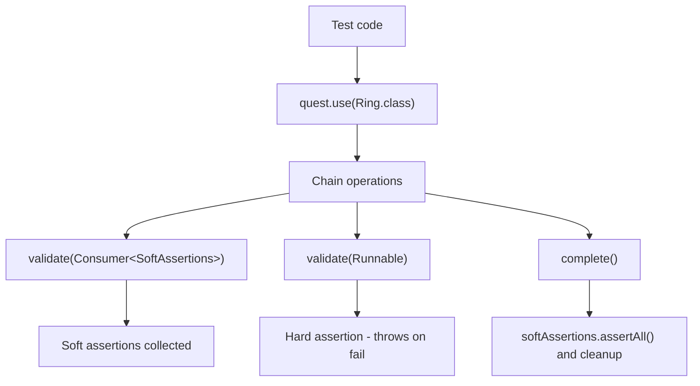

# Ring of Automation Core Test Framework

<!-- Quick jump -->
**Start here:** [Usage - Quick Start (step-by-step)](#usage)

## Table of Contents
- [Overview](#overview)
- [Module metadata](#module-metadata)
- [Features](#features)
- [Structure](#structure)
- [Architecture](#architecture)
    - [Class Diagram](#class-diagram)
    - [Execution Flow](#execution-flow)
    - [Core Execution & Integration Flows](#core-execution--integration-flows)
      - [Storage System & Data Flow](#storage-system--data-flow)
      - [Adapter Service Integration Example](#adapter-service-integration-example)
      - [Service Decoration & Extension](#service-decoration--extension)
      - [Extension Lifecylce Flow](#extension-lifecycle-flow)      
- [Usage](#usage)
    - [Step 1 - Add dependency](#step-1---add-dependency)
    - [Step 2 - Enable the framework](#step-2---enable-the-framework)
    - [Step 3 - Compose a fluent chain](#step-3---compose-a-fluent-chain)
    - [Step 4 - (Optional) Register rings with Spring](#step-4---optional-register-rings-with-spring)
    - [Step 5 - (Optional) Use retry mechanisms](#step-5---optional-use-retry-mechanisms)
    - [Step 6 - (Optional) Configure pre-quest journeys](#step-6---optional-configure-pre-quest-journeys)
- [Annotations & Hooks](#annotations--hooks)
- [Retry Helpers](#retry-helpers)
- [Allure Reporting](#allure-reporting)
- [Framework Configuration](#framework-configuration)
- [Dependencies](#dependencies)
- [Author](#author)

---

## Overview
The **test-framework** module is the ROA (Ring of Automation) core testing layer. It provides a **fluent, test-facing API** to orchestrate end-to-end flows as chains, collect soft and hard validations, perform time-bound retries, and attach rich logs/steps for observability.

At the center sits `Quest`: a lightweight execution context with data storage (`Storage`) and assertion aggregation (`CustomSoftAssertion`). Test-facing services extend `FluentService` and are registered as "rings" that a `Quest` can use to compose journeys. The framework is test-framework agnostic while offering **JUnit 5 extensions** (`Oracle`, `Initiator`, `Prologue`, `Epilogue`, `Craftsman`, `RipperMan`) and **Allure hooks** (`CustomAllureListener`) for structured reporting.

## Module metadata
- **Name:** Ring of Automation Core Test Framework
- **ArtifactId:** `test-framework`
- **Description:** Core test framework for building fluent, ring-based automation with quest context, hierarchical storage, and assertion aggregation.
- **Dependencies (from pom):**
  - `org.projectlombok:lombok`
  - `io.cyborgcode.utilities:commons:${utilities.version}`
  - `org.springframework.boot:spring-boot-starter`
  - `io.cyborgcode.roa:assertions:${project.version}`
  - `org.assertj:assertj-core`
  - `org.junit.jupiter:junit-jupiter-api`
  - `io.qameta.allure:allure-junit5`
  - `io.qameta.allure:allure-java-commons`
  - `org.aeonbits.owner:owner`
  - `org.springframework.boot:spring-boot-starter-test`
  - `com.github.spotbugs:spotbugs-annotations`

## Features
- **Fluent chain API:** `FluentChain` -> `validate(Consumer<SoftAssertions>)`, `validate(Runnable)`, `complete()`, `drop()`; services implement `FluentChain` for method chaining.
- **Execution context:** `Quest` stores:
    - Rings (services) via `use(Class<T>)` - retrieves registered `FluentService` instances
    - Artifacts via `artifact(ringType, artifactType)` - extracts specific objects from rings
    - Soft assertions via `CustomSoftAssertion` - aggregates soft validations
    - Ephemeral data in `Storage` - thread-safe key-value store with sub-storage support
- **Service base class:** `FluentService` implements `FluentChain` with:
    - `validation(List<AssertionResult>)` - processes assertion results (soft/hard)
    - `retryUntil(retryCondition, maxWait, retryInterval, service)` - polls until condition met
    - `drop()` - returns original `Quest` for ring switching
    - `postQuestSetupInitialization()` - hook for custom setup after quest wiring
- **Retry utilities:** `RetryCondition<T>` / `RetryConditionImpl<T>` combine `Function<Object, T>` and `Predicate<T>` with `RetryUtils.retryUntil(...)` for eventual consistency.
- **JUnit 5 extensions lifecycle:**
    - **`Initiator`** (InvocationInterceptor, Order=MAX) - intercepts test method, processes `@PreQuest` / `@Journey` annotations, executes `PreQuestJourney` flows, populates Storage with pre-arguments via `DataForge`.
    - **`Prologue`** (BeforeTestExecutionCallback, Order=MIN) - initializes test environment via `AllureStepHelper.initializeTestEnvironment()` (writes environment.properties, categories.json) and `setupTestContext()` (stores test name, start time).
    - **`Oracle`** (ParameterResolver) - resolves `Quest` parameter, creates via `QuestFactory`, loads `@StaticTestData`, decorates `Quest` -> `SuperQuest`, stores in `QuestHolder`.
    - **`Craftsman`** (ParameterResolver) - resolves `@Craft` parameters using `DataForge<T>` (immediate via `.dataCreator().create()` or `Late<T>` deferred via `.dataCreator()`).
    - **`RipperMan`** (AfterTestExecutionCallback) - processes `@Ripper` targets, executes `DataRipper.eliminate()` cleanup on Storage.
    - **`Epilogue`** (AfterTestExecutionCallback, Order=MAX) - logs test outcome, calculates duration, attaches filtered logs/HTML to Allure via `AllureStepHelper`, stops active steps.
- **Logging & steps:** 
    - `LogQuest` - singleton structured logger under "ROA.TEST.QUEST" namespace with methods: `info()`, `warn()`, `error()`, `debug()`, `trace()`, `step()`, `validation()`, `extended()`.
    - `CustomAllureListener` - extends `AllureJunit5`, manages thread-local step tracking with `StatusType` enum (DEFAULT, INFO, SUCCESS, WARNING, ERROR), methods: `startStep()`, `stopStep()`, `isStepActive()`.
- **Spring integration:** 
    - `QuestFactory` - creates `Quest` instances, auto-wires `FluentService` collection, registers rings via `registerRing()`, decorates with `DecoratorsFactory`.
    - `FrameworkAdapterContextCustomizer` / `FrameworkAdapterContextCustomizerFactory` - Spring TestContext customization for framework adapter integration.

## Structure
- `allure` - `CustomAllureListener` (step tracking, status types), `StepType` (enum for predefined steps)
- `annotation` - `@Ring`, `@Journey`, `@Odyssey`, `@Craft`, `@Regression`, `@Smoke`, `@Ripper`, `@PreQuest`, `@StaticTestData`, `@FrameworkAdapter`, `@JourneyData`
- `assertion` - `CustomSoftAssertion` (extends AssertJ SoftAssertions, defers failures)
- `base` - `BaseQuest`, `BaseQuestSequential`, `ClassLevelHook`, `Services`
- `chain` - `FluentChain` (interface), `FluentService` (abstract base), `FluentServiceDecorator`
- `config` - `FrameworkConfig` (Owner interface), `FrameworkConfigHolder`, `TestConfig`
- `data` - data model helpers
- `decorators` - `DecoratorsFactory` (decorator pattern support)
- `exceptions` - `HookExecutionException`, `ServiceInitializationException`, `StaticTestDataInitializationException`
- `extension` - `Initiator`, `Prologue`, `Epilogue`, `Craftsman`, `Oracle`, `RipperMan`
- `hooks` - `HookExecution` (enum: BEFORE/AFTER)
- `log` - `LogQuest` (singleton structured logger)
- `parameters` - `DataForge<T>` (data builder interface), `DataRipper<T>` (cleanup interface), `Late<T>` (deferred supplier), `PreQuestJourney<T>` (pre-execution journey interface)
- `quest` - `Quest` (core context), `SuperQuest` (decorator with Lombok @Delegate), `QuestFactory`, `QuestHolder` (ThreadLocal holder)
- `retry` - `RetryCondition<T>` (interface), `RetryConditionImpl<T>` (implementation)
- `spring` - `FrameworkAdapterContextCustomizer`, `FrameworkAdapterContextCustomizerFactory`
- `storage` - `Storage` (concurrent key-value store with sub-storage), `StoreKeys`, `StorageKeysTest`, `DataExtractor<T>`, `DataExtractorImpl<T>`, `DataExtractorsTest`
- `util` - `AllureStepHelper`, `ObjectFormatter`, `TestContextManager`, `PropertiesUtil`, `ResourceLoader`

## Architecture

### Class Diagram


### Execution Flow


### Core Execution & Integration Flows

#### Test Method Execution via JUnit Extensions


#### Fluent Chain Execution & Validation


#### Pre-Quest Journey Processing System


#### Storage System & Data Flow


#### Adapter Service Integration (example)


#### Service Decoration & Extension


#### Extension Lifecycle Flow


## Usage

> Follow these steps in your **test module**. The framework is designed for JUnit 5 with Spring DI support.

### Step 1 - Add dependency
```xml
<dependency>
  <groupId>io.cyborgcode.roa</groupId>
  <artifactId>test-framework</artifactId>
  <version>${revision}</version>
  <scope>test</scope>
</dependency>
```

### Step 2 - Enable the framework
The framework integrates via JUnit 5 extensions and Spring. Enable it by:
1. Extending `BaseQuest` (per-test instance) or `BaseQuestSequential` (PER_CLASS lifecycle) which already applies `@Odyssey` and `@SpringBootTest`.
2. Alternatively, annotate your test class with `@Odyssey` and your own Spring test configuration so the framework extensions (`Oracle`, `Prologue`, `Initiator`, `Craftsman`, `RipperMan`, `Epilogue`) are registered.
3. Expose your rings as Spring beans via `@Ring` so `QuestFactory` can wire them automatically, then accept a `Quest` parameter in your test method (resolved by the `Oracle` extension).

```java
class UserJourneyTest extends BaseQuest {

  @Test
  void userCanLoginAndViewProfile(Quest quest) {
    // Quest automatically injected, rings registered
    quest.use(AuthRing.class)
        .login("user", "pass")
        .validate(soft -> soft.assertThat(true).isTrue())
        .complete();
  }
}
```

### Step 3 - Compose a fluent chain
Create your rings (services) by extending `FluentService`:

```java
enum AuthArtifacts {
  AUTH_TOKEN
}

@Component
@Ring("Auth Service")
public class AuthRing extends FluentService {

  private final AuthClient authClient;

  public AuthRing(AuthClient authClient) {
    this.authClient = authClient;
  }

  public FluentChain login(String username, String password) {
    Response response = authClient.login(username, password);

    // Store token in Storage for later validations
    quest.getStorage().put(AuthArtifacts.AUTH_TOKEN, response.getToken());

    // Validate response
    List<AssertionResult<Object>> results = List.of(
        AssertionResult.builder()
            .target("status")
            .expected(200)
            .actual(response.getStatus())
            .passed(response.getStatus() == 200)
            .build()
    );
    validation(results);

    return this;
  }
}
```

Use the ring:
```java
void loginJourney(Quest quest) {
  quest.use(AuthRing.class)
      .login("admin", "password")
      .validate(soft -> {
          String token = QuestHolder.get().getStorage().get(AuthArtifacts.AUTH_TOKEN, String.class);
          soft.assertThat(token).isNotBlank();
      })
      .complete();
}
```

### Step 4 - (Optional) Register rings with Spring
Rings are auto-registered when they are Spring beans. `QuestFactory` collects every `FluentService` bean:

```java
@Component
@Ring("User Service")
public class UserRing extends FluentService {
  // automatically registered by QuestFactory
}
```

If your ring beans live outside the default component scan, add a `@FrameworkAdapter` with the additional packages so Spring picks them up:

```java
@FrameworkAdapter(basePackages = "com.mycompany.test.rings")
public @interface ProjectRings {}
```

Apply the adapter (directly or through your own meta-annotation) on the test class. Manual quest wiring is intentionally not exposed because `QuestFactory` manages ring registration for you.

### Step 5 - (Optional) Use retry mechanisms
Implement polling inside rings using `RetryCondition`:

```java
public FluentChain waitForUserActive(String userId) {
  RetryCondition<Boolean> condition = new RetryConditionImpl<>(
      service -> userApi.getUser(userId).isActive(),
      Boolean::booleanValue
  );
  
  retryUntil(condition, Duration.ofSeconds(30), Duration.ofSeconds(2), this);
  return this;
}
```

### Step 6 - (Optional) Configure pre-quest journeys
Use `@PreQuest` and `@Journey` to execute preconditions before tests:

```java
public enum Journeys implements PreQuestJourney<SuperQuest> {
  CREATE_USER {
    @Override
    public BiConsumer<SuperQuest, Object[]> journey() {
      return (quest, data) -> {
        quest.use(UserRing.class).createUser((UserRequest) data[0]);
      };
    }
  }
}

@PreQuest
@Journey(value = "CREATE_USER", journeyData = @JourneyData("UserData"), order = 1)
void testWithPreCreatedUser(Quest quest) {
  // User already created by journey
  quest.use(UserRing.class).verifyUserExists().complete();
}
```

## Annotations & Hooks

- **`@Ring(value)`** - Names a `FluentService` for readable logs. Used by `Quest.use(...)` to log ring usage.
- **`@Journey(value, journeyData, order)`** - Declares a pre-execution journey processed by `Initiator`. Runs before test method.
- **`@PreQuest`** - Enables `@Journey` processing on test methods.
- **`@Craft(model)`** - Marks a parameter for resolution by `Craftsman` using `DataForge`.
- **`@Ripper(targets)`** - Declares cleanup targets processed by `RipperMan` after test execution.
- **`@StaticTestData(value)`** - Loads static test data into Storage before parameter resolution.
- **`@Odyssey`** - Meta-annotation that wires the core extensions (`Oracle`, `Prologue`, `Initiator`, `Craftsman`, `RipperMan`, `Epilogue`). Applied by `BaseQuest` and reusable on custom tests.
- **`@Regression`, `@Smoke`** - Test categorization markers for Allure labels and filtering.
- **`@FrameworkAdapter`** - Enables project-level Spring customization.

Example:
```java
@PreQuest
@Journey(value = "SETUP_ENV", order = 1)
@Ripper(targets = {"CLEANUP_USER"})
void complexFlow(Quest quest, @Craft(model = "UserRequest") UserRequest user) {
  quest.use(UserRing.class)
      .createUser(user)
      .validate(soft -> soft.assertThat(user.getName()).isNotBlank())
      .complete();
}
```

## Retry Helpers

`RetryCondition<T>` and `RetryConditionImpl<T>` enable polling:

```
RetryCondition<Response> condition = new RetryConditionImpl<>(
    service -> apiClient.checkStatus(jobId),
    response -> response.getStatus().equals("COMPLETED")
);

retryUntil(condition, Duration.ofSeconds(60), Duration.ofSeconds(5), this);
```

Key methods:
- `function()` - returns `Function<Object, T>` that produces the value to test
- `condition()` - returns `Predicate<T>` that evaluates success

Used internally by `FluentService.retryUntil(...)` which delegates to `RetryUtils.retryUntil(...)`.

## Allure Reporting

### CustomAllureListener
Extends `AllureJunit5` to provide step tracking with status types.

**StatusType enum:**
- `DEFAULT` - neutral step
- `INFO` - informational (maps to SKIPPED)
- `SUCCESS` - passed (maps to PASSED)
- `WARNING` - broken (maps to BROKEN)
- `ERROR` - failed (maps to FAILED)

**Methods:**
- `startStep(String stepName)` - starts a new step
- `startStep(StepType stepType)` - starts with predefined type
- `startStepWithStatusType(String stepName, StatusType statusType)` - starts with custom status
- `stopStep()` - stops the most recent step
- `isStepActive(String stepName)` - checks if step is active

**Setup:**
Create `src/test/resources/META-INF/services/org.junit.platform.launcher.TestExecutionListener`:
```
io.cyborgcode.roa.framework.allure.CustomAllureListener
```

### AllureStepHelper
Utility methods for Allure integration:
- `setDescription(ExtensionContext)` - sets HTML description with test arguments
- `attachFilteredLogsToAllure(String testName)` - attaches filtered logs by test name
- `logTestOutcome(...)` - logs test result with duration
- `setUpTestMetadata(ExtensionContext)` - formats test metadata HTML
- `initializeTestEnvironment()` - writes environment.properties and categories.json
- `setupTestContext(ExtensionContext)` - stores test name and start time

## Framework Configuration

The framework uses the Owner library for configuration. Define these keys (via a `config.properties` referenced by `-Dframework.config.file` or by direct system properties):

**FrameworkConfig interface (required unless noted):**
- `projectPackage()` - base package scanned for your enums/adapters. Set `project.package=<your.base.package>` (no default inside the framework).
- `defaultStorage()` - enum name used as the default storage bucket when calling `Storage.sub()`. Set `default.storage=<ENUM_CONSTANT>`.
- `testEnv()` - optional label surfaced in reporting (e.g. `qa`, `staging`).

Example `config.properties`:
```
project.package=com.mycompany.automation
default.storage=DEFAULT_STORAGE
test.env=qa
```

**TestConfig interface:**
- Provides the Spring component scan for `io.cyborgcode.roa.framework` and `${project.package}`.
- Extend this configuration if you need additional Spring context customisation for tests.

Configuration loading:
```java
FrameworkConfig config = FrameworkConfigHolder.getFrameworkConfig();
String projectPkg = config.projectPackage();
```

## Dependencies

- `org.projectlombok:lombok` - code generation (@Delegate, @Getter, etc.)
- `io.cyborgcode.utilities:commons` - reflection utils, retry utils, logging
- `org.springframework.boot:spring-boot-starter` - Spring DI support
- `io.cyborgcode.roa:assertions` - assertion result models
- `org.assertj:assertj-core` - fluent assertions
- `org.junit.jupiter:junit-jupiter-api` - JUnit 5 extensions
- `io.qameta.allure:allure-junit5` - Allure JUnit 5 integration
- `io.qameta.allure:allure-java-commons` - Allure reporting
- `org.aeonbits.owner:owner` - configuration management
- `org.springframework.boot:spring-boot-starter-test` - Spring test support
- `com.github.spotbugs:spotbugs-annotations` - static analysis annotations

## Author
**Cyborg Code Syndicate 💍👨💻**
