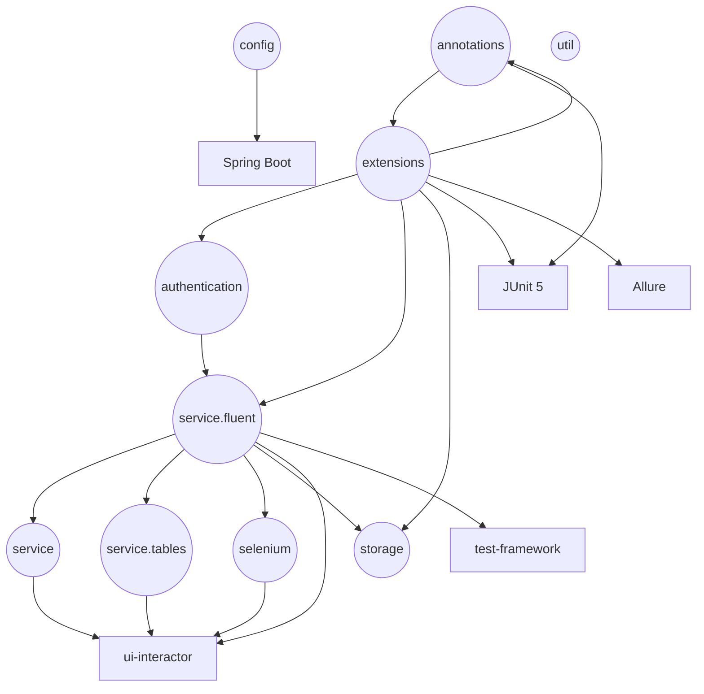
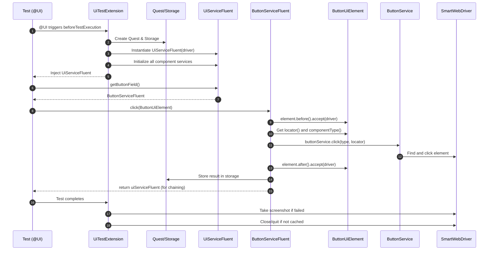

# ui-interactor-test-framework-adapter

<!-- Quick jump -->
**Start here:** [Usage - Quick Start (step-by-step)](#usage)

## Table of Contents
- [Overview](#overview)
- [Module metadata](#module-metadata)
- [Features](#features)
- [Structure](#structure)
- [Architecture](#architecture)
    - [Class Diagram](#class-diagram)
    - [Package Diagram](#package-diagram)
    - [Execution Flow](#execution-flow)
      - [Test Bootstrap & Extensions](#test-bootstrap--extensions)
      - [Fluent Service Initialization](#fluent-service-initialization)
      - [Authentication with Session Caching](#authentication-with-session-caching)
      - [Network Interception (CDP)](#network-interception-cdp)
- [Component Interaction Flow](#component-interaction-flow)
- [Usage](#usage)
    - [Step 1 - Add dependency](#step-1---add-dependency)
    - [Step 2 - Configure environment](#step-2---configure-environment)
    - [Step 3 - Enable the adapter](#step-3---enable-the-adapter)
    - [Step 4 - (Optional) AppUiService as facade and component usage](#step-4---appUiService-as-facade-and-component-usage)
    - [Step 5 - (Optional) Authenticate a test](#step-5---authentication)
    - [Step 6 - (Optional) Network interception](#step-6---network-interception)
- [Annotations & Hooks](#annotations--hooks)
- [Component Services Reference](#component-services-reference)
- [UiElement Pattern](#uielement-pattern)
- [Storage Integration](#storage-integration)
- [Adapter Configuration](#adapter-configuration)
- [Table Element Pattern](#table-element-pattern)
- [InsertionElement and InsertionService](#insertionelement-and-insertionservice)
- [Allure Reporting](#allure-reporting)
- [Troubleshooting](#troubleshooting)
- [Dependencies](#dependencies)
- [Author](#author)

---

## Overview
The **ui-interactor-test-framework-adapter** layers **test-facing ergonomics** on top of `ui-interactor`. It provides a fluent API (`UiServiceFluent`) for chaining UI operations across 17 component services with method chaining, `UiElement` pattern for type-safe element definitions, and Quest/Ring storage integration. It also ships **JUnit 5 enablement** via the `@UI` annotation and extensions, **Allure bridges** that attach screenshots, network requests, and validation data, **authentication** via `@AuthenticateViaUi` with session caching, **network interception** using Chrome DevTools Protocol (`@InterceptRequests`), and **table operations** with comprehensive CRUD, filtering, sorting, and validation. Spring **auto-configuration** wires `SmartWebDriver` and all component services so UI tests become **declarative, observable, and maintainable**.

---

## Module metadata
- **name:** Ring of Automation UI Test Framework
- **artifactId:** ui-interactor-test-framework-adapter
- **direct dependencies (from pom.xml):**
  - org.seleniumhq.selenium:selenium-java
  - io.cyborgcode.roa:test-framework
  - io.cyborgcode.roa:ui-interactor
  - com.jayway.jsonpath:json-path
  - org.projectlombok:lombok
  - org.springframework.boot:spring-boot-starter
  - org.junit.platform:junit-platform-launcher
  - io.qameta.allure:allure-java-commons
  - com.github.spotbugs:spotbugs-annotations

---

## Features
- **UI fluent chaining** via `UiServiceFluent`/`SuperUiServiceFluent`, exposing typed component services and shared navigation/validation helpers.
- **JUnit 5 bootstrap** through `@UI` and `UiTestExtension`, wiring Spring context, Quest rings, and Allure hooks automatically.
- **Authentication support** with `@AuthenticateViaUi` and `BaseLoginClient` session caching (cookies + local storage) to reuse logins.
- **Network interception** using Chrome DevTools Protocol via `@InterceptRequests`, with formatted request/response attachments.
- **UiElement pattern** for type-safe locators (before/after hooks, auto-storage) reused across fluent services.
- **Table tooling** that reuses `ui-interactor` typed models for read/filter/insert/sort plus validation assertions.
- **Allure integration** capturing steps, screenshots (failures and optional passes), and intercepted traffic for each test.
- **Storage bridge** using `StorageKeysUi` to persist UI artefacts (credentials, API responses, toggle states) during a Quest (method level) execution.

---

## Structure
- `annotations` - `@UI`, `@AuthenticateViaUi`, `@InterceptRequests`, `@InsertionElement`
- `authentication` - `LoginCredentials`, `BaseLoginClient`, `LoginClient`, `LoginKey`, `SessionInfo`
- `config` - `UiInteractionAutoConfiguration`, `UiFrameworkConfig`, `UiFrameworkConfigHolder`
- `enums` - `Features`
- `exceptions` - `AuthenticationUiException`
- `extensions` - `UiTestExtension`
- `parameters` - `DataIntercept`
- `selenium` - `UiElement` (base), `ButtonUiElement`, `InputUiElement`, `CheckboxUiElement`, `RadioUiElement`, `SelectUiElement`, `ToggleUiElement`, `AlertUiElement`, `ModalUiElement`, `LinkUiElement`, `LoaderUiElement`, `TabUiElement`, `AccordionUiElement`, `ListUiElement`
- `service.fluent` - `UiServiceFluent`, `SuperUiServiceFluent`, `ButtonServiceFluent`, `InputServiceFluent`, `CheckboxServiceFluent`, `RadioServiceFluent`, `SelectServiceFluent`, `ToggleServiceFluent`, `AlertServiceFluent`, `ModalServiceFluent`, `LinkServiceFluent`, `LoaderServiceFluent`, `TabServiceFluent`, `AccordionServiceFluent`, `ListServiceFluent`, `NavigationServiceFluent`, `ValidationServiceFluent`, `InsertionServiceFluent`, `InterceptorServiceFluent`
- `service.tables` - `TableServiceFluent`, `TableElement`
- `service` - `InsertionServiceElementImpl`
- `storage` - `StorageKeysUi`, `DataExtractorsUi`
- `util` - `ResponseFormatter`

---
## Architecture

### Class Diagram


### Package Diagram


### Execution Flow


#### Test Bootstrap & Extensions
- **@UI** applies `UiTestExtension` (JUnit 5) to manage quest lifecycle, storage, and driver.
- `beforeTestExecution()` processes annotations:
  - `@InterceptRequests` -> sets up Chrome DevTools (DevTools.createSession, Network.enable, listeners).
  - Registers assertion consumer and custom services.
  - `@AuthenticateViaUi` -> triggers login client setup.
- `afterTestExecution()` captures screenshots on failure and cleans up WebDriver (unless kept).

#### Fluent Service Initialization
- `UiServiceFluent` constructed with `SmartWebDriver` and quest storage.
- `postQuestSetupInitialization()` creates all component services and their fluent wrappers (Button, Input, Table, Navigation, Validation, Interceptor, etc.).
- `TableServiceFluent` is initialized with `TableServiceRegistry` and `UiTableValidator`.

#### Authentication with Session Caching
- `@AuthenticateViaUi(credentials, type, cacheCredentials)` handled by `UiTestExtension`.
- `BaseLoginClient.login()`:
  - Builds `LoginKey(username, password, clientClass)`.
  - If not cached -> `performLoginAndCache()` calls `loginImpl()`, waits for success element, captures cookies + localStorage, stores `SessionInfo`.
  - If cached -> restores session (inject cookies + localStorage) and optionally keeps a driver per credentials.

#### Network Interception (CDP)
- `@InterceptRequests` enables DevTools via ChromeDriver:
  - `createSession()`, `Network.enable(...)`.
  - Listeners capture request/response metadata and bodies (truncated if large).
  - Responses are stored in quest storage via `addResponseInStorage(...)` for later validation.

---

## Component Interaction Flow
Each fluent action follows the same lifecycle:
- before()  The element’s pre-action hook runs (waits, syncs, visibility).
- perform — The component service executes the Selenium/WebDriver action.
- after() — Post-action hook runs (wait for loaders, validate state).
- store — Optional data is persisted to Storage (dropdown options, table rows, last response, etc).

Concrete example from ButtonServiceFluent.isEnabled(...):
```java
public T isEnabled(final ButtonUiElement element) {
   Allure.step(String.format("[UI - Button] Checking if button is enabled with componentType: %s, locator: %s",
         element.componentType(), element.locator()));
   element.before().accept(driver);
   boolean enabled = buttonService.isEnabled(element.componentType(), element.locator());
   element.after().accept(driver);
   storage.sub(UI).put(element.enumImpl(), enabled);
   return uiServiceFluent;
}
```

What happens step-by-step:
- Allure.step(...) — logs a readable step with component type and locator for the report.
- element.before().accept(driver) — runs the element’s pre-hook (e.g., wait until visible/clickable) using SmartWebDriver.
- buttonService.isEnabled(...) — calls the underlying component service to fetch the current enabled state (boolean) for this locator.
- element.after().accept(driver) — runs the post-hook (e.g., wait for stabilization, loaders to finish).
- storage.sub(UI).put(element.enumImpl(), enabled) — persists the result in the UI storage, keyed by the element enum, so later steps/validations can read it.
- return uiServiceFluent — returns the fluent parent to continue the chain.

Usage in a test:
```java
quest
  .use(RING_OF_UI)
  .button().isEnabled(ButtonFields.NEW_ORDER_BUTTON)
  .complete();
```

---

## Usage

> Follow these steps in your **app-specific test module**. Examples avoid external DSLs; only the adapter and `ui-interactor` are required.

### Step 1 - Add dependency
```xml
<dependency>
  <groupId>io.cyborgcode.roa</groupId>
  <artifactId>ui-interactor-test-framework-adapter</artifactId>
  <version>${revision}</version>
</dependency>
```

### Step 2 - Configure environment
This adapter does not introduce new Owner keys.
It reuses `UiConfig` from `ui-interactor` and primarily needs your project package/s for reflection:

**Load order:** `classpath:system.properties` + `classpath:config.properties`

- system.properties - sets which config files to use (indirection).
```properties
project.packages=your.base.package
ui.config.file=config
framework.config.file=config
test.data.file=test_data
logFileName=logs/ui-tests.log
log4j2.scriptEnableLanguages=javascript
extended.logging=false
```

- config.properties - the actual UI config used by the adapter.
```properties
ui.base.url=https://your-ui.example.com/
browser.type=CHROME
headless=false
wait.duration.in.seconds=10
use.shadow.root=true
screenshot.on.passed.test=true
```

How it works:
- The framework reads defaults from `system.properties`. The `ui.config.file` points to `config.properties` (without extension).
- You can override any property with `-D` system properties or Maven profiles.
- Precedence: JVM -D > Maven profile defaults > system.properties > referenced files.

### Step 3 - Enable the adapter
Annotate your test class with `@UI` and inject `Quest` into test methods.

#### Understanding the `@UI` Annotation
- Applies the JUnit 5 `UiTestExtension` that manages the per-test Quest lifecycle and storage.
- Creates and wires a `SmartWebDriver`, initializes `UiServiceFluent` and all component services.
- Processes annotations before execution:
    - `@InterceptRequests` to enable Chrome DevTools interception and listeners.
    - `@AuthenticateViaUi` to run the login client and optionally cache sessions.
- Scans packages under `project.packages` from `system.properties` for components and rings.

#### Minimal class setup and usage:
```java
@UI
class MyUiTests extends BaseQuest {

  @Test
  void sample(Quest quest) {
    quest
      .use(RING_OF_UI)
      .getInputField().insert(InputFields.USERNAME_FIELD, "user")
      .getButtonField().click(ButtonFields.SIGN_IN_BUTTON)
      .complete();
  }
}
```

#### Notes:
- Use `quest.use(RING_OF_UI)` to access the UI ring.
- The ring instance is a typed façade (e.g., `AppUiService`) exposing either:
    - shorthand accessors: `input()`, `button()`, `select()`, etc.
    - or underlying getters: `getInputField()`, `getButtonField()`, etc.
- Per your requirement, the example demonstrates the `get...()` syntax.

### Step 4 - AppUiService as facade and component usage
This module provides you the ability to define an application-specific façade, `AppUiService`, extending `UiServiceFluent`. It centralizes UI component services and provides a cohesive, readable DSL. (**Note: `AppUiService` is not part of `ui-interactor-test-framework-adapter` module, it's shown here as an example pattern you can implement in your project**)

- AppUiService (example):
```java
public class AppUiService extends UiServiceFluent<AppUiService> {

  public AppUiService(SmartWebDriver driver, SuperQuest quest) {
    super(driver);
    this.quest = quest;
    postQuestSetupInitialization();
  }

  public InputServiceFluent<AppUiService> input() { return getInputField(); }
  public ButtonServiceFluent<AppUiService> button() { return getButtonField(); }
  public SelectServiceFluent<AppUiService> select() { return getSelectField(); }
  public NavigationServiceFluent<AppUiService> browser() { return getNavigation(); }
  public ValidationServiceFluent<AppUiService> validate() { return getValidation(); }
  public InsertionServiceFluent<AppUiService> insertion() { return getInsertionService(); }
  public TableServiceFluent<AppUiService> table() { return getTable(); }
}
```

- Using it in tests as a “UI ring”:
```java
@Test
void transferFunds(Quest quest) {
  quest
    .use(RING_OF_UI)
    .browser().navigate(getUiConfig().baseUrl())
    .button().click(ButtonFields.SIGN_IN_BUTTON)
    .input().insert(InputFields.USERNAME_FIELD, "username")
    .input().insert(InputFields.PASSWORD_FIELD, "password")
    .button().click(ButtonFields.SIGN_IN_FORM_BUTTON)
    .complete();
}
```
This approach cleanly separates test intent from selectors and low-level waits.

### Step 5 - Authentication
Use `@AuthenticateViaUi(credentials, type, cacheCredentials)`, on method (quest) level, to log in automatically as a precondition.
```java
@UI
class AuthenticatedTests extends BaseQuest {

   @Test
   @AuthenticateViaUi(credentials = AdminCredentials.class, type = AppUiLogin.class, cacheCredentials = true)
   void doesSomethingAfterLogin(Quest quest) {
      quest
        .use(RING_OF_UI)
        .button().click(ButtonFields.NEW_ORDER_BUTTON)
        .complete();
   }
}
```
Set `cacheCredentials = true` to reuse login between tests for the same credentials:
The framework stores cookies/local-storage and restores them against compatible drivers/sessions, reducing login overhead.

### Step 6 - Network interception
Enable interception at method level and then validate captured responses via the fluent `interceptor()` or by extracting data from storage.

- Interception targets (enum implementing `DataIntercept`):
```java
public enum RequestsInterceptor implements DataIntercept<RequestsInterceptor> {
  INTERCEPT_REQUEST_AUTH("?v-r=uidl"),
  INTERCEPT_REQUEST_LOGIN("/login");

  private final String endpointSubString;

  RequestsInterceptor(String endpointSubString) { this.endpointSubString = endpointSubString; }

  @Override public String getEndpointSubString() { return endpointSubString; }
  @Override public RequestsInterceptor enumImpl() { return this; }

  public static final class Data {
    public static final String INTERCEPT_REQUEST_AUTH = "INTERCEPT_REQUEST_AUTH";
    public static final String INTERCEPT_REQUEST_LOGIN = "INTERCEPT_REQUEST_LOGIN";
  }
}
```

- Validating the status of intercepted responses:
```java
@Test
@InterceptRequests(requestUrlSubStrings = { RequestsInterceptor.Data.INTERCEPT_REQUEST_AUTH })
@AuthenticateViaUi(credentials = AdminCredentials.class, type = AppUiLogin.class, cacheCredentials = true)
void validateInterceptedResponses(Quest quest) {
  quest
    .use(RING_OF_UI)
    .interceptor().validateResponseHaveStatus(
        RequestsInterceptor.INTERCEPT_REQUEST_AUTH.getEndpointSubString(),
        2, // expected count
        true // soft assert
    )
    .complete();
}
```

- Extracting values from intercepted bodies for assertions:
```java
@Test
@InterceptRequests(requestUrlSubStrings = { RequestsInterceptor.Data.INTERCEPT_REQUEST_AUTH })
void extractFromInterceptedResponse(Quest quest, @Craft(model = DataCreator.Data.SELLER) Seller seller) {
  quest
    .use(RING_OF_UI)
    .validate(() -> Assertions.assertEquals(
      List.of("$197.54"),
      retrieve(
        DataExtractorFunctions.responseBodyExtraction(
            RequestsInterceptor.INTERCEPT_REQUEST_AUTH.getEndpointSubString(),
            "$[0].changes[?(@.key=='totalPrice')].value",
            "for(;;);"
        ),
        List.class
      )
    ))
    .complete();
}
```

---

## Annotations & Hooks
- `@UI` - applies JUnit 5 extensions and scans the adapter packages.
- `@AuthenticateViaUi(credentials, type, cacheCredentials)` - authenticates via your `BaseLoginClient` using a `LoginCredentials` provider; supports session caching via cookies and localStorage.
- `@InterceptRequests(requestUrlSubStrings)` - enables network request interception using Chrome DevTools Protocol (CDP).
- `@InsertionElement(locatorClass, elementEnum, order)` - marks fields for dynamic data insertion; used with `InsertionServiceFluent`.

---

## Component Services Reference

| Service | Representative operations |
|---|---|
| `ButtonServiceFluent` | click (element/locator/text), isEnabled, validateIsEnabled, validateIsHidden |
| `InputServiceFluent` | insert (label/locator/container), clear, getValue, validateValue |
| `CheckboxServiceFluent` | select/deSelect, isSelected, validateIsSelected, validateAreSelected |
| `RadioServiceFluent` | select, isEnabled, validateIsEnabled, validateIsDisabled |
| `SelectServiceFluent` | selectOption(s), getSelectedOptions, getAvailableOptions, validateSelected |
| `ToggleServiceFluent` | activate/deactivate, isEnabled, validateIsEnabled, validateIsDisabled |
| `TableServiceFluent` | readTable/readRow, insertCellValue, filterTable, sortTable, validateTable |
| `ModalServiceFluent` | isOpened, validateIsOpened/validateIsClosed, clickButton, getTitle, getBodyText, close |
| `AlertServiceFluent` | getValue, validateValue, isVisible, validateIsVisible/validateIsHidden |
| `LinkServiceFluent` | click/doubleClick, isEnabled, validateIsEnabled, getHref |
| `LoaderServiceFluent` | isVisible, validateIsVisible, validateIsHidden |
| `TabServiceFluent` | selectTab, isEnabled, validateIsEnabled/validateIsDisabled, getSelectedTab |
| `AccordionServiceFluent` | expand/collapse, areEnabled, validateAreEnabled/validateAreDisabled |
| `ListServiceFluent` | select/deSelect, areSelected, validateAreSelected/validateAreNotSelected |
| `NavigationServiceFluent` | navigate, back, forward, refresh, switchToWindow/frame, alert handling |
| `ValidationServiceFluent` | validate assertions (`AssertionResult`), register table validations |
| `InsertionServiceFluent` | execute insertion pattern objects annotated with `@InsertionElement` |
| `InterceptorServiceFluent` | access intercepted requests/responses, clear/rescope data |

---

## UiElement Pattern

The adapter uses a type-safe element definition pattern via `UiElement` interfaces. This allows you to define UI elements as enums with locators and component types.

### Defining UI Elements

```java
import io.cyborgcode.roa.ui.selenium.ButtonUiElement;
import io.cyborgcode.roa.ui.selenium.InputUiElement;
import io.cyborgcode.roa.ui.components.button.ButtonComponentType;
import io.cyborgcode.roa.ui.components.input.InputComponentType;
import org.openqa.selenium.By;

public enum LoginPageElements implements ButtonUiElement, InputUiElement {
    // Button elements
    LOGIN_BUTTON(ButtonComponentType.DEFAULT_TYPE, By.id("login-btn")),
    CANCEL_BUTTON(ButtonComponentType.DEFAULT_TYPE, By.cssSelector(".cancel")),
    
    // Input elements
    USERNAME_INPUT(InputComponentType.DEFAULT_TYPE, By.id("username")),
    PASSWORD_INPUT(InputComponentType.DEFAULT_TYPE, By.name("password"));
    
    private final ComponentType componentType;
    private final By locator;
    
    LoginPageElements(ComponentType componentType, By locator) {
        this.componentType = componentType;
        this.locator = locator;
    }
    
    @Override
    public By locator() {
        return locator;
    }
    
    @Override
    public ComponentType componentType() {
        return componentType;
    }
    
    @Override
    public Enum<?> enumImpl() {
        return this;
    }
    
    // Optional: Add before/after hooks
    @Override
    public Consumer<SmartWebDriver> before() {
        return driver -> {
            // Wait for element, scroll, log, etc.
        };
    }
}
```

### Using UI Elements
Use `Quest` and the UI ring to interact with typed enums instead of raw locators:
```java
@Test
void testLogin(Quest quest) {
   quest
     .use(RING_OF_UI)
     .browser().navigate(getUiConfig().baseUrl())
     .input().insert(InputFields.USERNAME_FIELD, "username")
     .input().insert(InputFields.PASSWORD_FIELD, "password")
     .button().click(ButtonFields.SIGN_IN_FORM_BUTTON)
     .complete();
}
```

### Benefits

- **Type safety** - Compile-time checking of element types
- **Reusability** - Elements defined once, used everywhere
- **Maintainability** - Centralized element definitions
- **Hooks** - before()/after() for custom logic per element
- **Storage integration** - Automatic storage via enumImpl()

---

## Storage Integration
Storage is per-Quest (method-level), thread-local and safe for parallel execution. 

Examples:
- Using values captured during steps:
```java
quest
  .use(RING_OF_UI)
  .button().click(ButtonFields.NEW_ORDER_BUTTON)
  .select().getAvailableOptions(SelectFields.LOCATION_DDL)
  .validate(() -> Assertions.assertIterableEquals(
      List.of("Store", "Bakery"),
      DefaultStorage.retrieve(SelectFields.LOCATION_DDL, List.class)
  ))
  .complete();
```

- Using precondition data stored as pre-arguments:
```java
@Journey(value = Preconditions.Data.ORDER_PRECONDITION, journeyData = {@JourneyData(DataCreator.Data.ORDER)})
@Test
void usesPreconditionData(Quest quest) {
  quest
    .use(RING_OF_CUSTOM)
    .validateOrder(retrieve(StorageKeysTest.PRE_ARGUMENTS, DataCreator.ORDER, Order.class))
    .complete();
}
```

Best practices:
- Prefer typed keys (enums, element enums) for storage.
- Keep string keys in one place when unavoidable.
- Read immediately after write to keep flows explicit.

---

## Adapter Configuration

`@UI` already imports `UiInteractionAutoConfiguration`, which

- publishes a prototype-scoped `SmartWebDriver` by delegating to `WebDriverFactory.createDriver(...)`
  (honouring headless/remote settings from `UiConfig`).
- registers a lazy `UiTableValidator` bean used by table assertions.

Override either bean in your Spring test context if you need custom driver options or validators.

**Framework configuration (`config.properties` / `system.properties`):**
- inherits all keys from `ui-interactor` (browser.type, headless, wait.duration.in.seconds, project.package, component default types).
- adds `screenshot.on.passed.test` (boolean, default `false`) through `UiFrameworkConfig` to opt-in screenshots on successful tests.

---

## Table Element Pattern

Define a typed enum that implements `TableElement<T>` for your table, then use that enum with the fluent `table()` methods.

```java
// Row representation (typed model for each table row)
public class TransactionRow {
  private String date;
  private String description;
  private String amount;
  // getters/setters
}

// Enum binding the UI table to its row model and component type
public enum Tables implements TableElement<TransactionRow> {
  FILTERED_TRANSACTIONS(TransactionRow.class, TableComponentType.DEFAULT_TYPE);

  private final Class<TransactionRow> rowClass;
  private final ComponentType tableType;

  Tables(Class<TransactionRow> rowClass, ComponentType tableType) {
    this.rowClass = rowClass;
    this.tableType = tableType;
  }

  @Override public Class<TransactionRow> rowsRepresentationClass() { return rowClass; }
  @Override public ComponentType tableType() { return tableType; }
  @Override public Enum<?> enumImpl() { return this; }
}

// Using the enum in a test with table() methods
@Test
void readsAndValidatesTransactions(Quest quest) {
  quest
    .use(RING_OF_UI)
    .browser().navigate(getUiConfig().baseUrl())
    .button().click(ButtonFields.MORE_SERVICES_BUTTON)
    .link().click(LinkFields.ACCOUNT_ACTIVITY_LINK)
    .list().select(ListFields.ACCOUNT_ACTIVITY_TABS, Constants.AppLinks.FIND_TRANSACTIONS)
    .input().insert(InputFields.AA_DESCRIPTION_FIELD, "ONLINE")
    .button().click(ButtonFields.FIND_SUBMIT_BUTTON)
    // Read whole table into storage using the enum
    .table().readTable(Tables.FILTERED_TRANSACTIONS)
    // Validate with built-in table assertions
    .table().validate(
        Tables.FILTERED_TRANSACTIONS,
        Assertion.builder().target(UiTablesAssertionTarget.TABLE_VALUES)
          .type(TableAssertionTypes.TABLE_NOT_EMPTY).expected(true).soft(true).build()
    )
    .complete();
}
```

## @InsertionElement and InsertionService
Annotate model fields with `@InsertionElement` to map them to UI elements. The insertion service fills the form in one operation.

- Model:
```java
public class Seller {

  private String name;
  private String surname;

  @InsertionElement(locatorClass = InputFields.class, elementEnum = USERNAME_FIELD, order = 1)
  private String username;

  @InsertionElement(locatorClass = InputFields.class, elementEnum = PASSWORD_FIELD, order = 2)
  private String password;
}
```

- Flow using insertion service:
```java
public CustomService loginUsingInsertion(Seller seller) {
  quest
    .use(RING_OF_UI)
    .browser().navigate(getUiConfig().baseUrl())
    .getInsertionService().insertData(seller)
    // .insertion().insertData(seller) if it is part of the facade
    .button().click(ButtonFields.SIGN_IN_BUTTON)
    .button().validateIsVisible(ButtonFields.NEW_ORDER_BUTTON)
    .input().validateIsEnabled(InputFields.SEARCH_BAR_FIELD);
  return this;
}
```

---

## Allure Reporting
- **Screenshots:** Captured on test failure via `UiTestExtension.handleTestExecutionException()` and on soft assertion failures. Also captured on successful tests if `screenshot.on.passed.test=true` in `config.properties`.
- **Network requests:** HTML-formatted table of all intercepted requests/responses when `@InterceptRequests` is used.
- **UI operations:** All fluent service methods automatically create Allure steps with component type and locator details (e.g., `[UI - Button] Clicking button with componentType: DEFAULT_TYPE, locator: By.id: login-btn`).

---

## Troubleshooting

**Issue: UiServiceFluent not injected**
- Ensure `@UI` annotation is on the test class
- Verify Spring context is properly configured
- Ensure project.packages in system.properties includes your package for component scanning

**Issue: Network interception not working**
- Only works with ChromeDriver
- Ensure Chrome version supports DevTools Protocol
- Check that URL substrings match actual request URLs

**Issue: Authentication not cached**
- Verify `cacheCredentials = true` in `@AuthenticateViaUi`
- Ensure `LoginCredentials` implementation is consistent
- Check that `waitAfterLogin()` waits for stable element

**Issue: Screenshots not attached to Allure**
- Verify Allure listener is configured in JUnit
- Check `make.screenshot.on.passed.test` config if needed
- Ensure test failure is properly propagated

---

## Dependencies

- `io.cyborgcode.roa:test-framework` *(required)*
- `io.cyborgcode.roa:ui-interactor` *(required)*
- `org.seleniumhq.selenium:selenium-java` *(required - Selenium WebDriver)*
- `io.qameta.allure:allure-java-commons` *(optional - Allure attachments)*
- `io.qameta.allure:allure-junit5` *(optional - Allure + JUnit 5 bridge)*
- `org.springframework:spring-context` *(required if using Spring DI / auto-config)*
- `org.springframework:spring-test` *(tests - JUnit5 + SpringExtension)*
- `org.junit.jupiter:junit-jupiter` *(tests)*
- `org.assertj:assertj-core` *(tests - used by `SoftAssertions`)*
- `org.projectlombok:lombok` *(optional)*
- `com.jayway.jsonpath:json-path` *(optional - JSON extraction via DataExtractorsUi)*
- `org.aeonbits.owner:owner` *(transitive via ui-interactor; add explicitly if your BOM doesn't manage it)*

---

## Author
**Cyborg Code Syndicate 💍👨💻**
