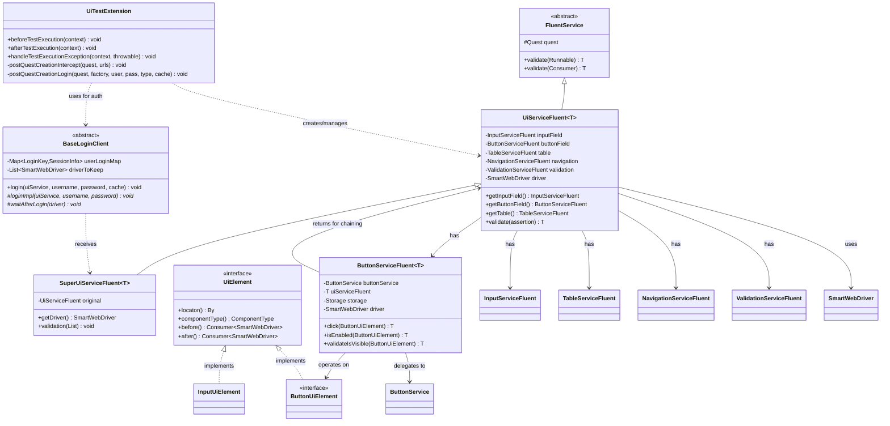
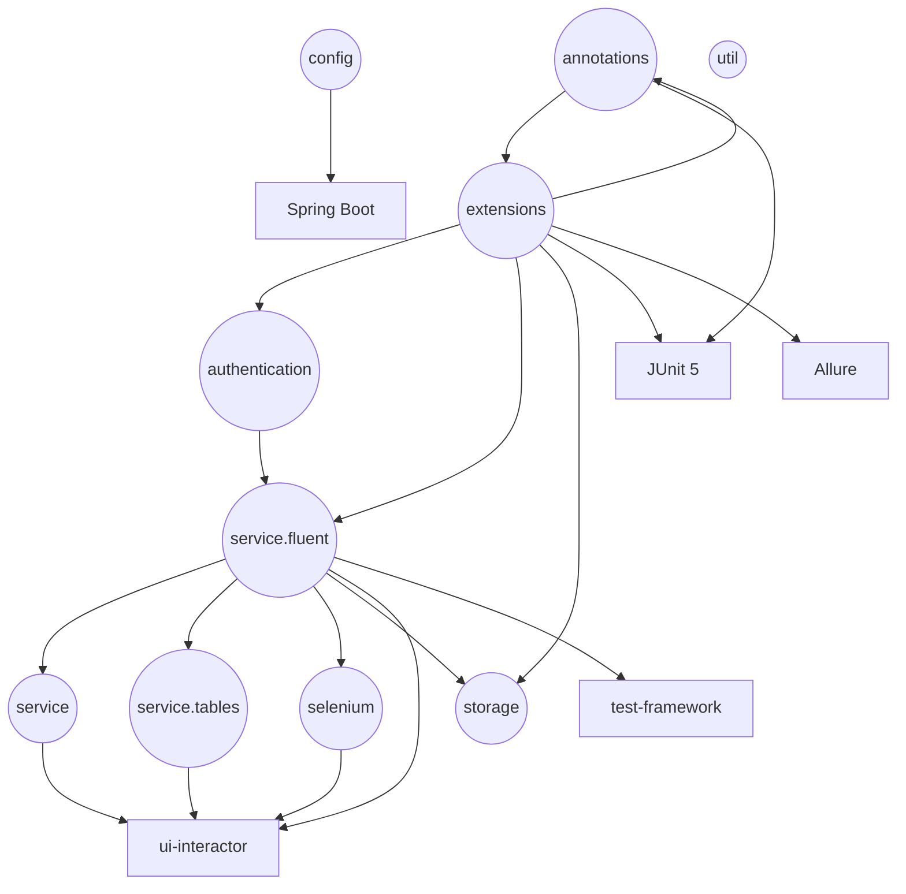
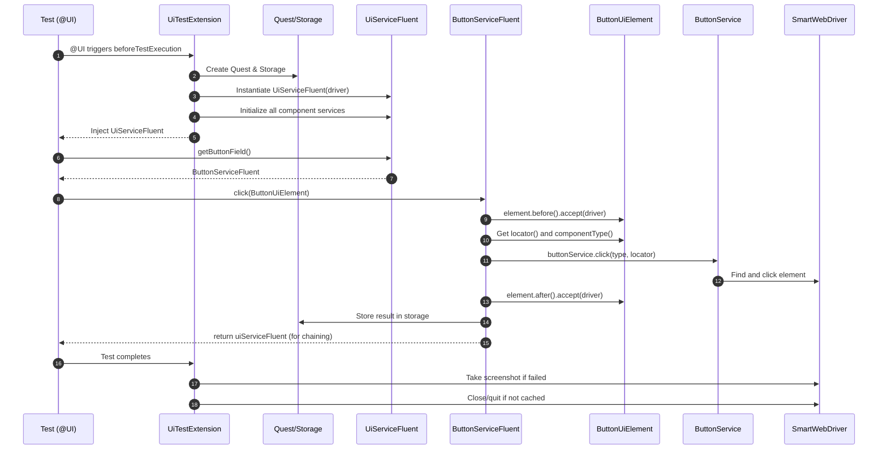

# ui-interactor-test-framework-adapter

<!-- Quick jump -->
**Start here:** [Usage — Quick Start (step-by-step)](#usage)

## Table of Contents
- [Overview](#overview)
- [Features](#features)
- [Structure](#structure)
- [Architecture](#architecture)
    - [Class Diagram](#class-diagram)
    - [Package Diagram](#package-diagram)
    - [Execution Flow](#execution-flow)
      - [Test Bootstrap & Extensions](#test-bootstrap--extensions)
      - [Fluent Service Initialization](#fluent-service-initialization)
      - [Authentication with Session Caching](#authentication-with-session-caching)
      - [Network Interception (CDP)](#network-interception-cdp)
      - [Component Interaction Flow](#component-interaction-flow)
- [Usage](#usage)
    - [Step 1 — Add dependency](#step-1--add-dependency)
    - [Step 2 — Configure environment](#step-2--configure-environment)
    - [Step 3 — Enable the adapter](#step-3--enable-the-adapter)
    - [Step 4 — Component usage examples](#step-4--component-usage-examples)
    - [Step 5 — (Optional) Authenticate a test](#step-5--authentication)
    - [Step 6 — (Optional) Network interception](#step-6--network-interception)
- [Annotations & Hooks](#annotations--hooks)
- [Component Services Reference](#component-services-reference)
- [UiElement Pattern](#uielement-pattern)
- [Storage Integration](#storage-integration)
- [Adapter Configuration](#adapter-configuration)
- [Allure Reporting](#allure-reporting)
- [Advanced Topics](#advanced-topics)
- [Troubleshooting](#troubleshooting)
- [Dependencies](#dependencies)
- [Author](#author)

---

## Overview
The **ui-interactor-test-framework-adapter** layers **test-facing ergonomics** on top of `ui-interactor`. It provides a fluent API (`UiServiceFluent`) for chaining UI operations across 17 component services with method chaining, `UiElement` pattern for type-safe element definitions, and Quest/Ring storage integration. It also ships **JUnit 5 enablement** via the `@UI` annotation and extensions, **Allure bridges** that attach screenshots, network requests, and validation data, **authentication** via `@AuthenticateViaUi` with session caching, **network interception** using Chrome DevTools Protocol (`@InterceptRequests`), and **table operations** with comprehensive CRUD, filtering, sorting, and validation. Spring **auto-configuration** wires `SmartWebDriver` and all component services so UI tests become **declarative, observable, and maintainable**.

### Module metadata
- **name:** Ring of Automation UI Test Framework
- **artifactId:** ui-interactor-test-framework-adapter
- **direct dependencies (from pom.xml):**
  - org.seleniumhq.selenium:selenium-java
  - io.cyborgcode.roa:test-framework
  - io.cyborgcode.roa:ui-interactor
  - com.jayway.jsonpath:json-path
  - org.projectlombok:lombok
  - org.springframework.boot:spring-boot-starter
  - org.junit.platform:junit-platform-launcher
  - io.qameta.allure:allure-java-commons
  - com.github.spotbugs:spotbugs-annotations

## Features
- **Fluent chaining:** `UiServiceFluent` → 17 component services (button, input, checkbox, select, radio, toggle, table, modal, alert, link, loader, tab, accordion, list, navigation, validation, insertion, interceptor); `SuperUiServiceFluent` for decorator/extension use-cases.
- **Allure integration:**
    - Screenshot attachments on test failure and soft assertion failures
    - Network request/response attachments (HTML-formatted)
    - Automatic step creation for all UI operations with component type and locator details
- **JUnit 5 bootstrap:** `@UI` applies `UiTestExtension`; scans `.ui`.
- **Authentication annotation:** `@AuthenticateViaUi(credentials, type, cacheCredentials)` + `LoginCredentials` interface with session caching via cookies and localStorage.
- **Network interception:** `@InterceptRequests` + Chrome DevTools Protocol (CDP) for capturing HTTP traffic.
- **UiElement pattern:** Type-safe element definitions with `before()`/`after()` hooks and automatic storage integration.
- **Table operations:** Comprehensive CRUD via `TableServiceFluent` with filtering, sorting, validation.
- **Spring auto-config:** `UiInteractionAutoConfiguration` wires `SmartWebDriver` as bean.

## Structure
- `annotations` — `@UI`, `@AuthenticateViaUi`, `@InterceptRequests`, `@InsertionElement`
- `authentication` — `LoginCredentials`, `BaseLoginClient`, `LoginClient`, `LoginKey`, `SessionInfo`
- `config` — `UiInteractionAutoConfiguration`, `UiFrameworkConfig`, `UiFrameworkConfigHolder`
- `enums` — `Features`
- `exceptions` — `AuthenticationUiException`
- `extensions` — `UiTestExtension`
- `parameters` — `DataIntercept`
- `selenium` — `UiElement` (base), `ButtonUiElement`, `InputUiElement`, `CheckboxUiElement`, `RadioUiElement`, `SelectUiElement`, `ToggleUiElement`, `AlertUiElement`, `ModalUiElement`, `LinkUiElement`, `LoaderUiElement`, `TabUiElement`, `AccordionUiElement`, `ListUiElement`
- `service.fluent` — `UiServiceFluent`, `SuperUiServiceFluent`, `ButtonServiceFluent`, `InputServiceFluent`, `CheckboxServiceFluent`, `RadioServiceFluent`, `SelectServiceFluent`, `ToggleServiceFluent`, `AlertServiceFluent`, `ModalServiceFluent`, `LinkServiceFluent`, `LoaderServiceFluent`, `TabServiceFluent`, `AccordionServiceFluent`, `ListServiceFluent`, `NavigationServiceFluent`, `ValidationServiceFluent`, `InsertionServiceFluent`, `InterceptorServiceFluent`
- `service.tables` — `TableServiceFluent`, `TableElement`
- `service` — `InsertionServiceElementImpl`
- `storage` — `StorageKeysUi`, `DataExtractorsUi`
- `util` — `ResponseFormatter`

## Architecture

### Class Diagram


### Package Diagram


### Execution Flow


#### Test Bootstrap & Extensions
- **@UI** applies `UiTestExtension` (JUnit 5) to manage quest lifecycle, storage, and driver.
- `beforeTestExecution()` processes annotations:
  - `@InterceptRequests` → sets up Chrome DevTools (DevTools.createSession, Network.enable, listeners).
  - Registers assertion consumer and custom services.
  - `@AuthenticateViaUi` → triggers login client setup.
- `afterTestExecution()` captures screenshots on failure and cleans up WebDriver (unless kept).

#### Fluent Service Initialization
- `UiServiceFluent` constructed with `SmartWebDriver` and quest storage.
- `postQuestSetupInitialization()` creates all component services and their fluent wrappers (Button, Input, Table, Navigation, Validation, Interceptor, etc.).
- `TableServiceFluent` is initialized with `TableServiceRegistry` and `UiTableValidator`.

#### Authentication with Session Caching
- `@AuthenticateViaUi(credentials, type, cacheCredentials)` handled by `UiTestExtension`.
- `BaseLoginClient.login()`:
  - Builds `LoginKey(username, password, clientClass)`.
  - If not cached → `performLoginAndCache()` calls `loginImpl()`, waits for success element, captures cookies + localStorage, stores `SessionInfo`.
  - If cached → restores session (inject cookies + localStorage) and optionally keeps a driver per credentials.

#### Network Interception (CDP)
- `@InterceptRequests` enables DevTools via ChromeDriver:
  - `createSession()`, `Network.enable(...)`.
  - Listeners capture request/response metadata and bodies (truncated if large).
  - Responses are stored in quest storage via `addResponseInStorage(...)` for later validation.

#### Component Interaction Flow
- `ButtonServiceFluent.click(element)` executes:
  - `element.before().accept(driver)` → pre-action hook.
  - Delegates to underlying `ButtonService.click(type, locator)`.
  - `element.after().accept(driver)` → post-action hook.
  - Stores relevant data in storage and returns parent for chaining.

## Usage

> Follow these steps in your **app-specific test module**. Examples avoid external DSLs; only the adapter and `ui-interactor` are required.

### Step 1 — Add dependency
```xml
<dependency>
  <groupId>io.cyborgcode.roa</groupId>
  <artifactId>ui-interactor-test-framework-adapter</artifactId>
  <version>${revision}</version>
  <scope>test</scope>
</dependency>
```

### Step 2 — Configure environment
This adapter does not introduce new Owner keys.
It reuses `UiConfig` from `ui-interactor` and primarily needs your project package for reflection:

**Load order:** system properties + `classpath:ui-config.properties`

```properties
# src/test/resources/ui-config.properties
ui.base.url=https://test.example.com
browser.type=CHROME
headless=false
wait.duration.in.seconds=10
project.package=com.example.tests
button.default.type=STANDARD_BUTTON
input.default.type=STANDARD_INPUT
```

### Step 3 — Enable the Adapter
```java
import io.cyborgcode.roa.ui.annotations.UI;
import io.cyborgcode.roa.ui.service.fluent.UiServiceFluent;
import io.cyborgcode.roa.framework.annotation.Prologue;
import org.junit.jupiter.api.Test;

@UI
public class LoginTest {
    private UiServiceFluent<?> ui;

    @Prologue
    void setUp(UiServiceFluent<?> uiService) {
        this.ui = uiService;
    }

    @Test
    void shouldLogin() {
        ui.getNavigation()
            .navigate("/login")
            .and()
        .getInputField()
            .insert("Email", "user@example.com")
            .insert("Password", "secret123")
            .and()
        .getButtonField()
            .click("Login")
            .and()
        .getValidation()
            .validate(() -> {
                // Assertions
            });
    }
}
```

### Step 4 — Component Usage Examples

**Button Operations:**
```
ui.getButtonField()
    .click("Submit")
    .click(By.id("cancel"))
    .and();
```

**Input Operations:**
```
ui.getInputField()
    .insert("Username", "admin")
    .insert("Email", "admin@example.com")
    .and();

String email = ui.getInputField().getValue("Email");
```

**Checkbox Operations:**
```
ui.getCheckboxField()
    .select("Terms and Conditions")
    .select("Newsletter")
    .and();
```

**Table Operations:**
```
// Read table
List<User> users = ui.getTable().readTable(User.class);

// Insert into cell
ui.getTable()
    .insertCellValue(1, User.class, nameField, "John Doe")
    .and();

// Filter table
ui.getTable()
    .filterTable(User.class, field, FilterStrategy.SELECT_ONLY, "Active")
    .and();
```

### Step 5 — Authentication
```java
@Test
@AuthenticateViaUi(
    credentials = AdminCredentials.class,
    type = StandardLoginClient.class,
    cacheCredentials = true
)
void testAdminArea() {
    // Runs with authenticated session
}
```

### Step 6 — Network Interception
```java
@Test
@InterceptRequests
void testApiCalls() {
    ui.getButtonField().click("Load Data").and();
    
    List<RequestLog> requests = ui.getInterceptor().getRequests();
    // Validate requests
}
```

## Annotations & Hooks
- `@UI` — applies JUnit 5 extensions and scans the adapter packages.
- `@AuthenticateViaUi(credentials, type, cacheCredentials)` — authenticates via your `BaseLoginClient` using a `LoginCredentials` provider; supports session caching via cookies and localStorage.
- `@InterceptRequests(requestUrlSubStrings)` — enables network request interception using Chrome DevTools Protocol (CDP).
- `@InsertionElement(locatorClass, elementEnum, order)` — marks fields for dynamic data insertion; used with `InsertionServiceFluent`.

## Component Services Reference

| Service | Key Operations |
|---|---|
| `ButtonServiceFluent` | click, isEnabled, isVisible, validateIsEnabled, validateIsHidden |
| `InputServiceFluent` | insert, getValue, clear, getErrorMessage, validateValue |
| `CheckboxServiceFluent` | select, deSelect, isSelected, getSelected, validateIsSelected |
| `RadioServiceFluent` | select, isSelected, getSelected, validateIsSelected |
| `SelectServiceFluent` | select, getSelected, getOptions, validateSelected |
| `ToggleServiceFluent` | toggle, isSelected, validateIsToggled |
| `TableServiceFluent` | readTable, readRow, insertCellValue, filterTable, sortTable, validateTable |
| `ModalServiceFluent` | isDisplayed, close, getTitle, getContent, validateIsDisplayed |
| `AlertServiceFluent` | isDisplayed, close, getText, validateIsDisplayed |
| `LinkServiceFluent` | click, getHref, isEnabled, validateIsEnabled |
| `LoaderServiceFluent` | waitUntilDisappears, isDisplayed, validateIsHidden |
| `TabServiceFluent` | selectTab, isSelected, getSelectedTab, getTabs |
| `AccordionServiceFluent` | expand, collapse, isExpanded, toggle |
| `ListServiceFluent` | getItems, selectItem, getSelectedItems, getItemCount |
| `NavigationServiceFluent` | navigate, refresh, back, forward, getCurrentUrl |
| `ValidationServiceFluent` | validate, validateSoft |
| `InsertionServiceFluent` | insertion (dynamic pattern) |
| `InterceptorServiceFluent` | getRequests, getResponses, clearResponses |

## UiElement Pattern

The adapter uses a type-safe element definition pattern via `UiElement` interfaces. This allows you to define UI elements as enums with locators and component types.

### Defining UI Elements

```java
import io.cyborgcode.roa.ui.selenium.ButtonUiElement;
import io.cyborgcode.roa.ui.selenium.InputUiElement;
import io.cyborgcode.roa.ui.components.button.ButtonComponentType;
import io.cyborgcode.roa.ui.components.input.InputComponentType;
import org.openqa.selenium.By;

public enum LoginPageElements implements ButtonUiElement, InputUiElement {
    // Button elements
    LOGIN_BUTTON(ButtonComponentType.DEFAULT_TYPE, By.id("login-btn")),
    CANCEL_BUTTON(ButtonComponentType.DEFAULT_TYPE, By.cssSelector(".cancel")),
    
    // Input elements
    USERNAME_INPUT(InputComponentType.DEFAULT_TYPE, By.id("username")),
    PASSWORD_INPUT(InputComponentType.DEFAULT_TYPE, By.name("password"));
    
    private final ComponentType componentType;
    private final By locator;
    
    LoginPageElements(ComponentType componentType, By locator) {
        this.componentType = componentType;
        this.locator = locator;
    }
    
    @Override
    public By locator() {
        return locator;
    }
    
    @Override
    public ComponentType componentType() {
        return componentType;
    }
    
    @Override
    public Enum<?> enumImpl() {
        return this;
    }
    
    // Optional: Add before/after hooks
    @Override
    public Consumer<SmartWebDriver> before() {
        return driver -> {
            // Wait for element, scroll, log, etc.
        };
    }
}
```

### Using UI Elements

```java
@Test
void testLogin() {
    ui.getInputField()
        .insert(USERNAME_INPUT, "admin")
        .insert(PASSWORD_INPUT, "secret123")
        .and()
    .getButtonField()
        .click(LOGIN_BUTTON)
        .and()
    .getButtonField()
        .validateIsVisible(CANCEL_BUTTON);
}
```

### Benefits

- **Type safety** — Compile-time checking of element types
- **Reusability** — Elements defined once, used everywhere
- **Maintainability** — Centralized element definitions
- **Hooks** — before()/after() for custom logic per element
- **Storage integration** — Automatic storage via enumImpl()

## Storage Integration

```
// Store data
ui.getQuest().getStorage().put(StorageKeysUi.UI, "email", "user@example.com");

// Retrieve data
String email = ui.getQuest().getStorage().get(StorageKeysUi.UI, "email");

// Extract using JSON path
String name = DataExtractorsUi.extract(json, "$.user.name", String.class);

// Auto-storage from UiElement operations
ui.getInputField().getValue(EMAIL_INPUT);  // Stored as EMAIL_INPUT key
String email = ui.getQuest().getStorage().get(StorageKeysUi.UI, EMAIL_INPUT);
```

## Adapter Configuration
```java
@Configuration
@ComponentScan(basePackages = "io.cyborgcode.roa.ui")
public class UiInteractionAutoConfiguration {
  @Bean
  @ConditionalOnMissingBean
  SmartWebDriver smartWebDriver() {
    // Automatically creates and configures SmartWebDriver
    return new SmartWebDriver(createWebDriver());
  }
}
```

**Framework Configuration (ui-framework-config.properties):**
- `make.screenshot.on.passed.test` (boolean, default: `false`) — Take screenshot even on passing tests

**Inherited from ui-interactor:**
All configuration from `ui-interactor` module applies (browser.type, headless, wait.duration.in.seconds, project.package, ui.base.url, use.shadow.root, component *.default.type keys).

## Allure Reporting
- **Screenshots:** Captured on test failure via `UiTestExtension.handleTestExecutionException()` and on soft assertion failures.
- **Network requests:** HTML-formatted table of all intercepted requests/responses when `@InterceptRequests` is used.
- **UI operations:** All fluent service methods automatically create Allure steps with component type and locator details (e.g., `[UI - Button] Clicking button with componentType: DEFAULT_TYPE, locator: By.id: login-btn`).

## Advanced Topics

### Custom Login Client Implementation

```java
import io.cyborgcode.roa.ui.authentication.BaseLoginClient;
import io.cyborgcode.roa.ui.service.fluent.UiServiceFluent;
import org.openqa.selenium.By;

public class CustomLoginClient extends BaseLoginClient {
    
    @Override
    protected void loginImpl(UiServiceFluent<?> uiService, String username, String password) {
        uiService.getNavigation()
            .navigate("/login")
            .and()
        .getInputField()
            .insert(USERNAME_FIELD, username)
            .insert(PASSWORD_FIELD, password)
            .and()
        .getButtonField()
            .click(LOGIN_BUTTON);
    }
    
    @Override
    protected void waitAfterLogin(SmartWebDriver driver) {
        driver.waitUntilElementIsShown(By.id("dashboard"), 10);
    }
}
```

### Custom UiServiceFluent Extension

You can extend `UiServiceFluent` to add domain-specific methods:

```java
@Ring("CustomUI")
public class CustomUiServiceFluent extends UiServiceFluent<CustomUiServiceFluent> {
    
    public CustomUiServiceFluent(SmartWebDriver driver, SuperQuest quest) {
        super(driver);
        // Custom initialization
    }
    
    // Add custom domain-specific methods
    public CustomUiServiceFluent loginAsAdmin() {
        getInputField()
            .insert(USERNAME, "admin")
            .insert(PASSWORD, "admin123")
            .and()
        .getButtonField()
            .click(LOGIN_BTN);
        return this;
    }
    
    public CustomUiServiceFluent navigateToDashboard() {
        getNavigation().navigate("/dashboard");
        return this;
    }
}
```

The extension will automatically detect and register your custom service (only 1 allowed per project).

### Network Interception with DataIntercept

Define an enum implementing `DataIntercept` to specify endpoints for interception:

```java
public enum ApiEndpoints implements DataIntercept<ApiEndpoints> {
    USERS_API("/api/users"),
    PRODUCTS_API("/api/products"),
    ORDERS_API("/api/orders");
    
    private final String endpoint;
    
    ApiEndpoints(String endpoint) {
        this.endpoint = endpoint;
    }
    
    @Override
    public String getEndpointSubString() {
        return endpoint;
    }
}

// Usage in test
@Test
@InterceptRequests(requestUrlSubStrings = {"USERS_API", "PRODUCTS_API"})
void testApiInterception() {
    ui.getButtonField().click(LOAD_DATA_BTN);
    
    List<ApiResponse> responses = ui.getInterceptor().getResponses();
    // Validate intercepted API calls
}
```

### Table Element Pattern

```java
public enum UserTableElements implements TableElement<User> {
    USER_TABLE(User.class, TableComponentType.DEFAULT_TYPE);
    
    private final Class<User> rowClass;
    private final ComponentType tableType;
    
    UserTableElements(Class<User> rowClass, ComponentType tableType) {
        this.rowClass = rowClass;
        this.tableType = tableType;
    }
    
    @Override
    public Class<User> rowsRepresentationClass() {
        return rowClass;
    }
    
    @Override
    public ComponentType tableType() {
        return tableType;
    }
    
    @Override
    public Enum<?> enumImpl() {
        return this;
    }
}

// Usage
@Test
void testTableOperations() {
    ui.getTable()
        .readTable(USER_TABLE)
        .and();
    
    List<User> users = ui.getQuest().getStorage().get(StorageKeysUi.UI, USER_TABLE);
}
```

### @InsertionElement for Dynamic Forms

```java
public class RegistrationFormData {
    @InsertionElement(locatorClass = FormElements.class, elementEnum = "FIRST_NAME", order = 1)
    private String firstName;
    
    @InsertionElement(locatorClass = FormElements.class, elementEnum = "LAST_NAME", order = 2)
    private String lastName;
    
    @InsertionElement(locatorClass = FormElements.class, elementEnum = "EMAIL", order = 3)
    private String email;
    
    // Getters and setters
}

// Usage
@Test
void testDynamicInsertion() {
    RegistrationFormData data = new RegistrationFormData();
    data.setFirstName("John");
    data.setLastName("Doe");
    data.setEmail("john@example.com");
    
    ui.getInsertionService().insertion(data);
}
```

### Session Caching

When using `@AuthenticateViaUi(cacheCredentials = true)`, the framework:
1. Performs login once and stores cookies + localStorage
2. Reuses the session for subsequent tests with same credentials
3. Keeps one driver instance alive per credential set
4. Automatically cleans up drivers at session end

This significantly speeds up test suites with multiple tests requiring authentication.

## Troubleshooting

**Issue: UiServiceFluent not injected**
- Ensure `@UI` annotation is on the test class
- Verify Spring context is properly configured
- Check that `@Prologue` method accepts `UiServiceFluent<?>`

**Issue: Network interception not working**
- Only works with ChromeDriver
- Ensure Chrome version supports DevTools Protocol
- Check that URL substrings match actual request URLs

**Issue: Authentication not cached**
- Verify `cacheCredentials = true` in `@AuthenticateViaUi`
- Ensure `LoginCredentials` implementation is consistent
- Check that `waitAfterLogin()` waits for stable element

**Issue: Screenshots not attached to Allure**
- Verify Allure listener is configured in JUnit
- Check `make.screenshot.on.passed.test` config if needed
- Ensure test failure is properly propagated

## Dependencies

- `io.cyborgcode.roa:test-framework` *(required)*
- `io.cyborgcode.roa:ui-interactor` *(required)*
- `org.seleniumhq.selenium:selenium-java` *(required — Selenium WebDriver)*
- `io.qameta.allure:allure-java-commons` *(optional — Allure attachments)*
- `io.qameta.allure:allure-junit5` *(optional — Allure + JUnit 5 bridge)*
- `org.springframework:spring-context` *(required if using Spring DI / auto-config)*
- `org.springframework:spring-test` *(tests — JUnit5 + SpringExtension)*
- `org.junit.jupiter:junit-jupiter` *(tests)*
- `org.assertj:assertj-core` *(tests — used by `SoftAssertions`)*
- `org.projectlombok:lombok` *(optional)*
- `com.jayway.jsonpath:json-path` *(optional — JSON extraction via DataExtractorsUi)*
- `org.aeonbits.owner:owner` *(transitive via ui-interactor; add explicitly if your BOM doesn't manage it)*

## Author
**Cyborg Code Syndicate 💍👨💻**
