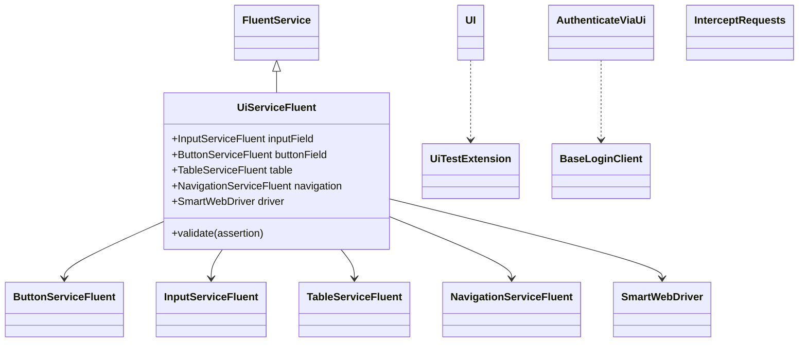
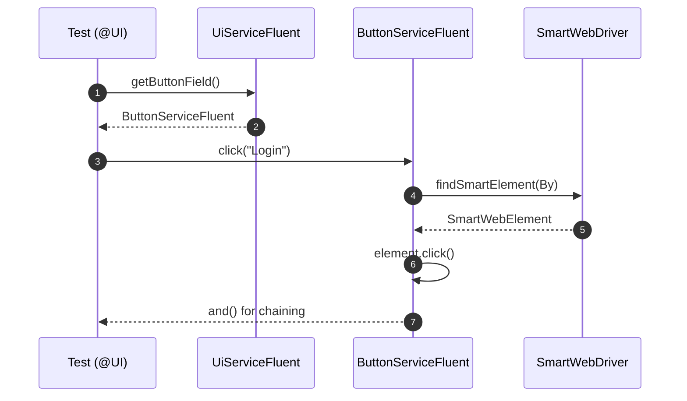

# ui-interactor-test-framework-adapter

<!-- Quick jump -->
**Start here:** [Usage — Quick Start (step-by-step)](#usage)

## Table of Contents
- [Overview](#overview)
- [Features](#features)
- [Structure](#structure)
- [Architecture](#architecture)
- [Usage](#usage)
- [Annotations & Features](#annotations--features)
- [Component Services](#component-services)
- [Storage Integration](#storage-integration)
- [Allure Reporting](#allure-reporting)
- [Dependencies](#dependencies)
- [Author](#author)

---

## Overview
The **ui-interactor-test-framework-adapter** layers **test-facing ergonomics** on top of the core **ui-interactor** module. It introduces:

- **Fluent APIs** (`UiServiceFluent` and 16+ component-specific fluent services) for chaining UI operations
- **Component fluent services** for all 17 UI components with method chaining via `and()`
- **JUnit 5 enablement** via `@UI` annotation and `UiTestExtension`
- **Authentication support** through `@AuthenticateViaUi` for declarative UI-based login
- **Network interception** via `@InterceptRequests` for capturing HTTP traffic
- **Insertion pattern** with `@InsertionElement` for dynamic element data entry
- **Table operations** with comprehensive CRUD, filtering, sorting, and validation
- **Storage integration** via `StorageKeysUi` for sharing data between test steps
- **Spring auto-configuration** that wires SmartWebDriver automatically
- **Allure integration** for rich reporting with screenshots and interaction logs

The adapter transforms UI automation into **declarative, maintainable, and observable** tests that integrate seamlessly with the Quest/Ring architecture.

## Features
- **Fluent chaining:** 16+ component-specific fluent services for natural method chaining
- **Comprehensive component coverage:** button, input, checkbox, select, radio, toggle, table, modal, alert, link, loader, tab, accordion, list
- **JUnit 5 bootstrap:** `@UI` applies `UiTestExtension`, scans `.ui` package
- **Authentication:** `@AuthenticateViaUi` + `LoginCredentials` + `BaseLoginClient`
- **Network interception:** `@InterceptRequests` captures browser network traffic with CDP
- **Insertion pattern:** `@InsertionElement` for declarative element data entry
- **Storage helpers:** `StorageKeysUi` constants, `DataExtractorsUi` utilities
- **Spring auto-config:** `UiInteractionAutoConfiguration` wires `SmartWebDriver`
- **Validation integration:** Works with `CustomSoftAssertion` framework

## Structure
**Package Organization:**
- `annotations` — `@UI`, `@AuthenticateViaUi`, `@InterceptRequests`, `@InsertionElement`
- `authentication` — `LoginCredentials`, `BaseLoginClient`, authentication utilities
- `config` — `UiInteractionAutoConfiguration`, `UiFrameworkConfig`
- `extensions` — `UiTestExtension` (JUnit 5 integration)
- `selenium` — 14 browser automation utilities (CDP, DevTools, network capture)
- `service.fluent` — All fluent service implementations (16+ classes)
- `service.tables` — `TableServiceFluent`, table-specific operations
- `storage` — `StorageKeysUi`, `DataExtractorsUi`

**Key Classes:**
- `UiServiceFluent<T>` — Main fluent orchestrator with all component services
- Component fluent services — `ButtonServiceFluent`, `InputServiceFluent`, `TableServiceFluent`, etc.
- `NavigationServiceFluent<T>` — Browser navigation operations
- `ValidationServiceFluent<T>` — UI validation with assertions
- `InsertionServiceFluent<T>` — Dynamic insertion pattern
- `InterceptorServiceFluent<T>` — Network interception

## Architecture

### Class Diagram


### Execution Flow


## Usage

### Step 1 — Add dependency
```xml
<dependency>
  <groupId>io.cyborgcode.roa</groupId>
  <artifactId>ui-interactor-test-framework-adapter</artifactId>
  <version>${revision}</version>
  <scope>test</scope>
</dependency>
```

### Step 2 — Configure environment
```properties
# config.properties
ui.base.url=https://test.example.com
browser.type=CHROME
headless=false
wait.duration.in.seconds=10
project.package=com.example.tests
```

### Step 3 — Enable the Adapter
```
import io.cyborgcode.roa.ui.annotations.UI;
import io.cyborgcode.roa.ui.service.fluent.UiServiceFluent;
import io.cyborgcode.roa.framework.annotation.Prologue;
import org.junit.jupiter.api.Test;

@UI
public class LoginTest {
    private UiServiceFluent<?> ui;

    @Prologue
    void setUp(UiServiceFluent<?> uiService) {
        this.ui = uiService;
    }

    @Test
    void shouldLogin() {
        ui.getNavigation()
            .navigate("/login")
            .and()
        .getInputField()
            .insert("Email", "user@example.com")
            .insert("Password", "secret123")
            .and()
        .getButtonField()
            .click("Login")
            .and()
        .getValidation()
            .validate(() -> {
                // Assertions
            });
    }
}
```

### Step 4 — Component Usage Examples

**Button Operations:**
```
ui.getButtonField()
    .click("Submit")
    .click(By.id("cancel"))
    .and();
```

**Input Operations:**
```
ui.getInputField()
    .insert("Username", "admin")
    .insert("Email", "admin@example.com")
    .and();

String email = ui.getInputField().getValue("Email");
```

**Checkbox Operations:**
```
ui.getCheckboxField()
    .select("Terms and Conditions")
    .select("Newsletter")
    .and();
```

**Table Operations:**
```
// Read table
List<User> users = ui.getTable().readTable(User.class);

// Insert into cell
ui.getTable()
    .insertCellValue(1, User.class, nameField, "John Doe")
    .and();

// Filter table
ui.getTable()
    .filterTable(User.class, field, FilterStrategy.SELECT_ONLY, "Active")
    .and();
```

### Step 5 — Authentication
```
@Test
@AuthenticateViaUi(
    credentials = AdminCredentials.class,
    type = StandardLoginClient.class,
    cacheCredentials = true
)
void testAdminArea() {
    // Runs with authenticated session
}
```

### Step 6 — Network Interception
```
@Test
@InterceptRequests
void testApiCalls() {
    ui.getButtonField().click("Load Data").and();
    
    List<RequestLog> requests = ui.getInterceptor().getRequests();
    // Validate requests
}
```

## Annotations & Features

**@UI** — Marks test class as UI test, applies `UiTestExtension`

**@AuthenticateViaUi** — Performs UI-based authentication
- `credentials()` — Class implementing `LoginCredentials`
- `type()` — Class extending `BaseLoginClient`
- `cacheCredentials()` — Cache session (default: false)

**@InterceptRequests** — Enables network request interception

**@InsertionElement** — Marks fields for dynamic insertion

## Component Services

| Service | Key Operations |
|---|---|
| `ButtonServiceFluent` | click, isEnabled, isVisible |
| `InputServiceFluent` | insert, getValue, clear, getErrorMessage |
| `CheckboxServiceFluent` | select, deSelect, isSelected, getSelected |
| `RadioServiceFluent` | select, isSelected, getSelected |
| `SelectServiceFluent` | select, getSelected, getOptions |
| `TableServiceFluent` | readTable, insertCellValue, filterTable, sortTable |
| `ModalServiceFluent` | isDisplayed, close, getTitle |
| `AlertServiceFluent` | isDisplayed, close, getText |
| `LinkServiceFluent` | click, getHref, isEnabled |
| `TabServiceFluent` | selectTab, isSelected, getSelectedTab |
| `AccordionServiceFluent` | expand, collapse, isExpanded |
| `NavigationServiceFluent` | navigate, refresh, back, forward |
| `ValidationServiceFluent` | validate, validateSoft |

## Storage Integration

```
// Store data
ui.getQuest().getStorage().put(StorageKeysUi.UI, "email", "user@example.com");

// Retrieve data
String email = ui.getQuest().getStorage().get(StorageKeysUi.UI, "email");

// Extract using JSON path
String name = DataExtractorsUi.extract(json, "$.user.name", String.class);
```

## Allure Reporting

Automatic attachments:
- Screenshots on failure
- Element highlights before actions
- Network requests when intercepted
- Table data on read operations
- Validation results with details

## Dependencies
- `io.cyborgcode.roa:test-framework`
- `io.cyborgcode.roa:ui-interactor`
- `org.seleniumhq.selenium:selenium-java`
- `org.springframework.boot:spring-boot-starter`
- `io.qameta.allure:allure-java-commons`
- `com.jayway.jsonpath:json-path`

## Author
**Cyborg Code Syndicate 💍👨💻**
