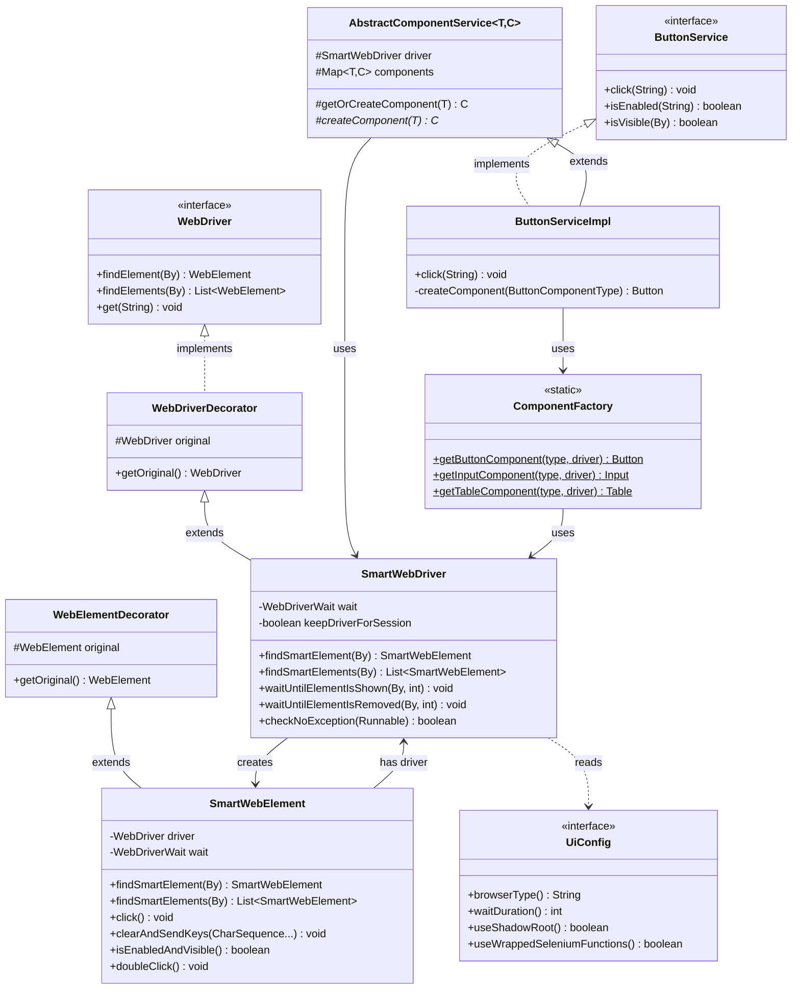
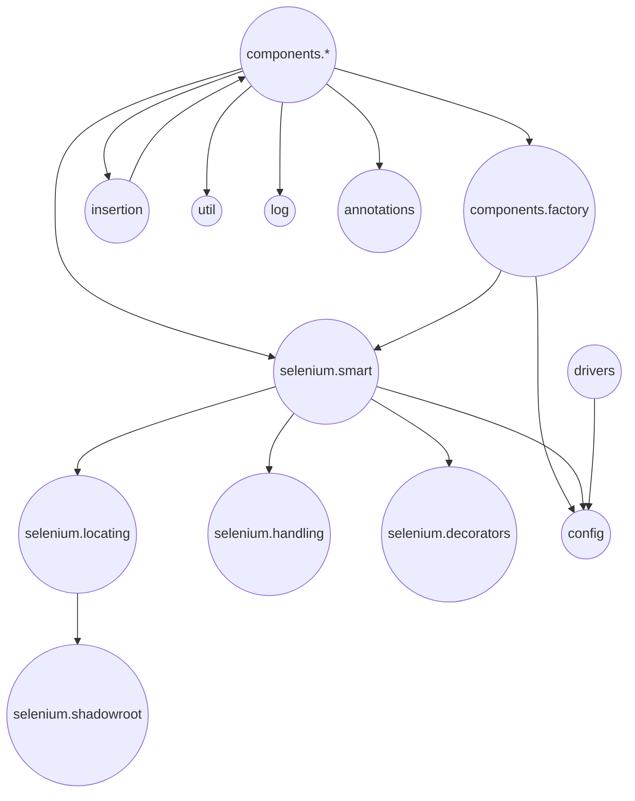
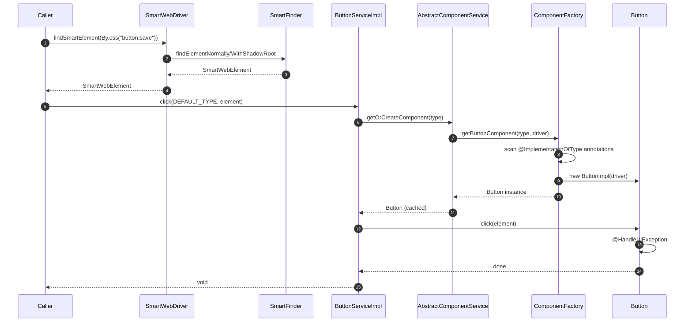
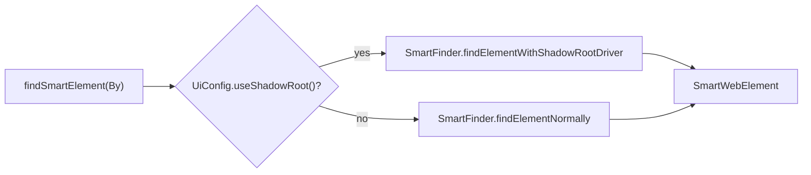
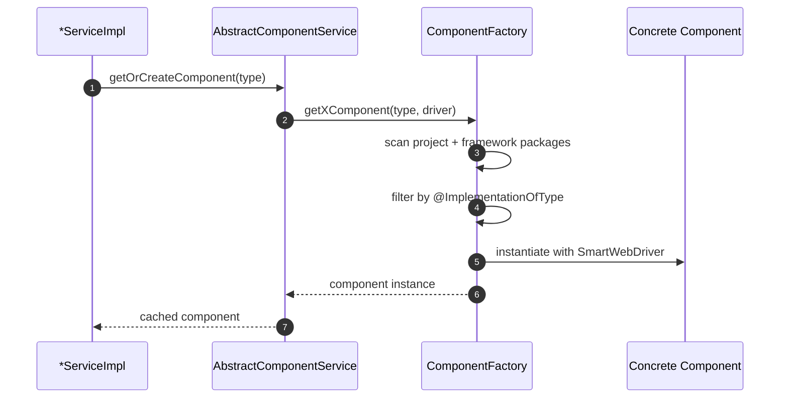

# ui-interactor

<!-- Quick jump -->
**Start here:** [Usage - Quick Start](#usage)

## Table of Contents
- [Overview](#overview)
- [Module metadata](#module-metadata)
- [Features](#features)
- [Structure](#structure)
- [Architecture](#architecture)
  - [Class Diagram](#class-diagram)
  - [Package Diagram](#package-diagram)
  - [Execution Flow](#execution-flow)
    - [Smart Element Finding (Shadow DOM aware)](#smart-element-finding-shadow-dom-aware)
    - [ComponentFactory Resolution](#componentfactory-resolution)
    - [Configuration-Driven Defaults](#configuration-driven-defaults)
    - [Table Operations with Typed Models](#table-operations-with-typed-models)
    - [Exception Recovery Strategy](#exception-recovery-strategy)
- [Usage](#usage)
  - [Prerequisites](#prerequisites)
    - [Dependencies](#dependencies)
    - [Configuration Setup](#configuration-setup)
  - [Step 1 - Driver Setup](#step-1---driver-setup)
  - [Step 2 - Component Services](#step-2---component-services)
    - [2.1 Understanding UiService](#21-understanding-uiservice)
    - [2.2 Usage Approaches](#22-usage-approaches)
    - [2.3 Component Services - Additional](#23-component-services---additional)
  - [Step 3 - Basic Usage](#step-3---basic-usage)
    - [3.1 Standalone Usage](#step-31---standalone-usage)
    - [3.2 Understanding Component Types and Implementations](#step-32---understanding-component-types-and-implementations)
  - [Step 4 - Basic UI Operations](#step-4---basic-ui-operations)
    - [4.1 Basic SmartWebDriver Usage](#step-41---basic-smartwebdriver-usage)
    - [4.2 Button Component](#step-42---button-component)
    - [4.3 Input Component](#step-43---input-component)
    - [4.4 Checkbox Component](#step-44---checkbox-component)
    - [4.5 Select Component](#step-45---select-component)
    - [4.6 Radio Component](#step-46---radio-component)
    - [4.7 Toggle Component](#step-47---toggle-component)
    - [4.8 Modal Component](#step-48---modal-component)
    - [4.9 Alert Component](#step-49---alert-component)
    - [4.10 Link Component](#step-410---link-component)
    - [4.11 Loader Component](#step-411---loader-component)
    - [4.12 Tab Component](#step-412---tab-component)
    - [4.13 Accordion Component](#step-413---accordion-component)
    - [4.14 List Component](#step-414---list-component)
    - [4.15 Table Component](#step-415---table-component)
  - [Step 5 - Insertion Pattern](#step-5---insertion-pattern)
- [Selenium Package Deep Dive](#selenium-package-deep-dive)
  - [Error Handling and Logging](#error-handling-and-logging)
  - [Exception Handling - Automatic Recovery](#exception-handling---automatic-recovery)
  - [SmartFinder and Shadow DOM Support](#smartfinder-and-shadow-dom-support)
  - [WebElement Decorator (SmartWebElement)](#webelement-decorator-smartwebelement)
  - [WebDriver Decorator (SmartWebDriver)](#webdriver-decorator-smartwebdriver)
- [Util Package - Helper Utilities](#util-package---helper-utilities)
  - [Strategy Pattern for Component Selection](#strategy-pattern-for-component-selection)
  - [Functional Interfaces](#functional-interfaces)
- [Advanced Driver Configuration](#advanced-driver-configuration)
  - [Custom Driver Options](#custom-driver-options)
  - [Remote Driver (Selenium Grid)](#remote-driver-selenium-grid)
- [Performance Optimization](#performance-optimization)
  - [Disable Wrapping for Simple Operations](#disable-wrapping-for-simple-operations)
- [Troubleshooting](#troubleshooting)
  - [Enable Debug Logging](#enable-debug-logging)
  - [Common Issues and Solutions](#common-issues-and-solutions)
- [Configuration](#configuration)
- [Extensibility](#extensibility)
- [Cross-module links](#cross-module-links)
- [Glossary](#glossary)
- [Module Dependencies](#module-dependencies)
- [Author](#author)

## Overview
The **ui-interactor** module provides a comprehensive Selenium-based UI automation framework built on Java 17+. It introduces `SmartWebDriver` and `SmartWebElement` as enhanced wrappers with configurable waits, exception handling strategies, and optional Shadow DOM support while preserving standard Selenium semantics.

UI widgets are modeled as pluggable components. Component services (e.g., `ButtonService`, `InputService`, `TableService`) delegate to concrete implementations resolved by `ComponentFactory` using configuration-driven defaults from `UiConfig`. The framework supports 14 component types including buttons, inputs, checkboxes, selects, radios, toggles, tables, modals, alerts, links, loaders, tabs, accordions, and lists.

Driver management is abstracted via `DriverProvider` implementations (Chrome, Edge) with automatic driver download via WebDriverManager. The insertion pattern provides uniform data entry across components. Structured logging via `LogUi` surfaces actions and failures for observability.

The library is test-framework agnostic and designed to be embedded in adapters or test rings.

### Module metadata
- **name:** Ring of Automation UI Library
- **artifactId:** ui-interactor
- **direct dependencies (from pom.xml):**
  - org.seleniumhq.selenium:selenium-java
  - org.projectlombok:lombok
  - org.aeonbits.owner:owner
  - io.github.bonigarcia:webdrivermanager
  - io.cyborgcode.utilities:commons
  - io.cyborgcode.roa:assertions
  - org.junit.jupiter:junit-jupiter (test)
  - org.mockito:mockito-core
  - org.mockito:mockito-junit-jupiter
  - org.assertj:assertj-core (test)

## Features
- **Smart Selenium wrappers** via SmartWebDriver and SmartWebElement, offering configurable waits, optional Shadow DOM traversal (use.shadow.root), and mapped exception recovery strategies.
- **Component services** for buttons, inputs, checkboxes, selects, radios, toggles, item lists, loaders, links, alerts, tabs, tables, accordions, and modals resolved through ComponentFactory.
- **Facade service** (UiService) that wires the core components plus insertion/table registries so tests can interact without manual plumbing.
- **Configurable defaults** using the Owner-based UiConfig interface (browser type, wait duration, component default enums, project package scanning).
- **Driver factory** with built-in Chrome and Edge providers, optional remote execution, and extension points to register additional browsers.
- **Typed table utilities** with annotations (@TableInfo, @TableCellLocator) for reading, filtering, inserting, and validating structured rows.
- **Insertion pattern** that reuses component services to populate complex forms in a consistent way.
- **Structured logging** through LogUi, producing action/validation/step logs that integrate with external reporters.


## Structure

### Key Classes
| Class | Responsibility | Key methods | Used by |
|---|---|---|---|
| `SmartWebDriver` | Decorated `WebDriver` with waits/handling | `findSmartElement(By)`, `waitUntilElementIsShown(...)` | Services |
| `SmartWebElement` | Decorated `WebElement` interactions | `click()`, `clearAndSendKeys(...)`, `isEnabledAndVisible()` | Components |
| `UiConfig` | Owner-backed UI config | `waitDuration()`, `useShadowRoot()`, `browserType()` | All |
| `DriverProvider<T>` | Driver setup and instantiation | `createDriver(options)`, `setupDriver(version)` | Driver factories |
| `ComponentFactory` | Resolve concrete components | `getButtonComponent(...)`, `getInputComponent(...)` | Service impls |
| `TableService` | Table read/filter/sort/insert | `readTable(...)`, `filterTable(...)`, `insertRow(...)` | Callers |
| `Insertion` | Uniform data entry contract | `insertion(type, locator, values)` | All component services |

### Package: `io.cyborgcode.roa.ui.selenium.smart`
| Class | Responsibility | Key methods | Used by |
|---|---|---|---|
| `SmartWebDriver` | Wraps `WebDriver` with wait/handling/shadow | `findSmartElement(By)`, `waitUntilElementIsShown(By, int)`, `checkNoException(Runnable)` | Services |
| `SmartWebElement` | Wraps `WebElement` with waits | `click()`, `clearAndSendKeys(...)`, `isEnabledAndVisible()`, `doubleClick()`, `waitUntilAttributeValueIsChanged(...)` | Components |
| `SmartWebElementInspector` | Inspect element properties | inspection helpers | Components |

### Package: `io.cyborgcode.roa.ui.selenium.decorators`
| Class | Responsibility | Key methods | Used by |
|---|---|---|---|
| `WebDriverDecorator` | Base decorator wrapping `WebDriver` | `getOriginal()`, delegates all WebDriver methods | `SmartWebDriver` extends this |
| `WebElementDecorator` | Base decorator wrapping `WebElement` | `getOriginal()`, delegates all WebElement methods | `SmartWebElement` extends this |

### Package: `io.cyborgcode.roa.ui.selenium.locating`
| Class | Responsibility | Key methods | Used by |
|---|---|---|---|
| `SmartFinder` | Static utility for element location | `findElementNormally(...)`, `findElementWithShadowRootDriver(...)`, `findElementNoWrap(...)` | `SmartWebDriver`, `SmartWebElement` |

### Package: `io.cyborgcode.roa.ui.selenium.handling`
| Class | Responsibility | Key methods | Used by |
|---|---|---|---|
| `ExceptionHandlingWebDriver` | Enum defining driver exception strategies | `getMethodName()`, `getExceptionHandlingMap()` | `SmartWebDriver` for recovery |
| `ExceptionHandlingWebElement` | Enum defining element exception strategies | `getMethodName()`, `getExceptionHandlingMap()` | `SmartWebElement` for recovery |

### Package: `io.cyborgcode.roa.ui.selenium.enums`
| Class | Responsibility | Key methods | Used by |
|---|---|---|---|
| `WebElementAction` | Enum defining element action types | `CLICK`, `CLEAR`, `SEND_KEYS`, `SUBMIT` | Exception handling |

### Package: `io.cyborgcode.roa.ui.components.*`
All component packages follow a uniform structure:
- **Service interface** (e.g., `ButtonService`): public API for component operations
- **ServiceImpl** (e.g., `ButtonServiceImpl`): delegates to component via factory
- **Component interface** (e.g., `Button`): contract for component implementations
- **ComponentType enum** (e.g., `ButtonComponentType`): type-safe variants

#### Components Summary
| Component | Service | Key operations |
|---|---|---|
| **button** | `ButtonService` | `click(...)`, `isEnabled(...)`, `isVisible(...)` |
| **input** | `InputService` | `insert(...)`, `clear(...)`, `getValue(...)`, `getErrorMessage(...)` |
| **checkbox** | `CheckboxService` | `select(...)`, `deSelect(...)`, `isSelected(...)`, `getSelected(...)` |
| **select** | `SelectService` | `select(...)`, `getSelected(...)`, `getOptions(...)` |
| **radio** | `RadioService` | `select(...)`, `isSelected(...)`, `getSelected(...)` |
| **toggle** | `ToggleService` | `toggle(...)`, `isEnabled(...)`, `isSelected(...)` |
| **table** | `TableService` | `readTable(...)`, `readRow(...)`, `insertRow(...)`, `filterTable(...)` |
| **modal** | `ModalService` | `isDisplayed(...)`, `close(...)`, `getTitle(...)` |
| **alert** | `AlertService` | `isDisplayed(...)`, `close(...)`, `getText(...)` |
| **link** | `LinkService` | `click(...)`, `getHref(...)`, `isEnabled(...)` |
| **loader** | `LoaderService` | `waitUntilLoaderDisappears(...)`, `isDisplayed(...)` |
| **tab** | `TabService` | `selectTab(...)`, `isSelected(...)`, `getSelectedTab(...)` |
| **accordion** | `AccordionService` | `expand(...)`, `collapse(...)`, `isExpanded(...)` |
| **list** | `ItemListService` | `getItems(...)`, `selectItem(...)`, `getSelectedItems(...)` |

### Package: `io.cyborgcode.roa.ui.drivers`
| Class | Responsibility | Key methods | Used by |
|---|---|---|---|
| `DriverProvider<T>` | Driver lifecycle contract | `createDriver(options)`, `setupDriver(version)` | Factories |
| `BaseDriverProvider` | Common driver logic | option application | Concrete providers |
| Chrome/Edge providers | Browser-specific setup | browser-specific options | Driver creation |

### Package: `io.cyborgcode.roa.ui.insertion`
| Class | Responsibility | Key methods | Used by |
|---|---|---|---|
| `Insertion` | Data entry contract | `insertion(type, locator, values)` | All services |
| `InsertionService` | Registration and dispatch | service resolution | Components |
| `BaseInsertionService` | Base insertion logic | field-based insertion | Impls |
| `InsertionServiceRegistry` | Service registry | `register(...)`, `resolve(...)` | Factory |

### Package: `io.cyborgcode.roa.ui.config`
| Class | Responsibility | Key methods                                                                                                                             | Used by |
|---|---|-----------------------------------------------------------------------------------------------------------------------------------------|---|
| `UiConfig` | Owner-backed configuration interface | `browserType()`, `waitDuration()`, `useShadowRoot()`, `useWrappedSeleniumFunctions()`, `projectPackages()`, all component default types | All classes |
| `UiConfigHolder` | Singleton holder for UiConfig | `getUiConfig()` returns cached Owner instance                                                                                           | All classes needing config |

### Other packages
- `io.cyborgcode.roa.ui.annotations` - `@HandleUiException`, `@InsertionField`, `@ImplementationOfType`
- `io.cyborgcode.roa.ui.selenium.*` - locating, handling, decorators, logging, listeners, shadowroot support
- `io.cyborgcode.roa.ui.components.table.*` - table annotations, filters, insertion, sorting, model, registry
- `io.cyborgcode.roa.ui.log` - `LogUi` for structured logging (namespace: "ROA.UI")
- `io.cyborgcode.roa.ui.util` - helpers and strategies
- `io.cyborgcode.roa.ui.validator` - validation helpers

### Annotations Reference
| Annotation | Target | Purpose | Example |
|---|---|---|---|
| `@HandleUiException` | Method | Enables automatic exception handling for Selenium operations | Applied to `SmartWebDriver.findSmartElement()`, `SmartWebElement.click()` |
| `@ImplementationOfType(value)` | Class | Marks component implementation with matching enum name | `@ImplementationOfType("STANDARD_BUTTON")` on `StandardButton` class |
| `@InsertionField` | Field | Marks field for table insertion operations | Used in table model classes for cell insertion |

## Architecture

### Class Diagram


### Package Diagram


### Execution Flow


#### Smart Element Finding (Shadow DOM aware)


#### ComponentFactory Resolution


#### Configuration-Driven Defaults
- `UiConfig.buttonDefaultType` supplies the enum name.
- `ButtonService.DEFAULT_TYPE` resolves via reflection at startup.
- Default service methods delegate to the resolved type.

#### Table Operations with Typed Models
- Class-level `@TableInfo` defines table structure.
- Field-level `@TableCellLocator` maps columns; optional `@CellInsertion`, `@CellFilter`, sorting annotations.
- `TableService.readTable(...)` builds typed rows via reflection and SmartWebDriver.
- `insertCellValue(...)` applies insertion annotations in declared order.

#### Exception Recovery Strategy
- `@HandleUiException` on critical methods.
- Failure path extracts root cause and matches `ExceptionHandlingWebDriver` strategy by method name and exception type.
- Applies mapped recovery function; rethrows if no strategy matches.

## Usage

### Prerequisites

### Dependencies

To use *`ui-interactor`*, you need to add the following dependency to your project.

**Maven:**

```xml
<dependency>
    <groupId>io.cyborgcode.roa</groupId>
    <artifactId>ui-interactor</artifactId>
    <version>${roa.version}</version>
</dependency>
```

---

### Configuration Setup

Before using the *`ui-interactor`* module, you need to configure the framework via `ui-config.properties` file or system properties.

**Minimum Required Configuration:**

Create a `ui-config.properties` file in your `src/main/resources` or `src/test/resources` directory:

```properties
# Required properties
wait.duration.in.seconds=10
project.packages=your.project.package

# Optional browser configuration
# If browser.type and headless are missing, then browser.type defaults to 'CHROME' and headless defaults to false
browser.type=CHROME
browser.version=
headless=false
remote.driver.url=

# Optional component defaults (required only if using specific components)
button.default.type=YOUR_BUTTON_TYPE
input.default.type=YOUR_INPUT_TYPE
# ... other component types as needed
```

**Accessing Configuration:**

The `UiConfigHolder` provides singleton access to the configuration throughout your application:

```java
import io.cyborgcode.roa.ui.config.UiConfigHolder;
import io.cyborgcode.roa.ui.config.UiConfig;

// Get configuration instance
UiConfig config = UiConfigHolder.getUiConfig();

// Access configuration values
String browserType = config.browserType();
int waitDuration = config.waitDuration();
boolean headless = config.headless();
```

**Configuration Priority:**
- System properties override properties file values
- Example: `-Dbrowser.type=EDGE` overrides `browser.type=CHROME` in properties file

For complete configuration options, see the [Configuration](#configuration) section.

---

### Step 1 - Driver Setup

**Understanding Driver Creation:**

The **`ui-interactor`** uses three key components to create WebDriver instances:
- **`WebDriverFactory`**: Central factory for creating drivers based on browser type
- **`WebDriverConfig`**: Builder pattern configuration object for driver settings
- **`DriverCreator`**: Internal class that handles the actual driver instantiation (used by factory)

```java
import io.cyborgcode.roa.ui.config.UiConfigHolder;
import io.cyborgcode.roa.ui.drivers.config.WebDriverConfig;
import io.cyborgcode.roa.ui.drivers.factory.WebDriverFactory;
import io.cyborgcode.roa.ui.selenium.smart.SmartWebDriver;
import org.openqa.selenium.WebDriver;

var uiConfig = UiConfigHolder.getUiConfig();

WebDriver webDriver = WebDriverFactory.createDriver(
    uiConfig.browserType(),
    WebDriverConfig.builder()
        .version(uiConfig.browserVersion())
        .headless(uiConfig.headless())
        .remote(uiConfig.remoteDriverUrl() != null && !uiConfig.remoteDriverUrl().isBlank())
        .remoteUrl(uiConfig.remoteDriverUrl())
        .build()
);

SmartWebDriver driver = new SmartWebDriver(webDriver);
```

---

### Step 2 - Component Services

#### 2.1 Understanding UiService

`UiService` is a centralized facade that provides access to all UI component services. It serves as a single entry point for interacting with different UI components and manages their lifecycle. When you instantiate `UiService`, it automatically initializes all component services and registers them with internal registries for insertion and table operations.

**Benefits of UiService:**
- **Single initialization**: All component services are created once and reused
- **Service registry**: Automatically registers components for dynamic operations
- **Consistent access**: Provides getter methods for all managed services
- **Memory efficient**: Components are cached and shared across operations
```java
import io.cyborgcode.roa.ui.service.facade.UiService;

UiService ui = new UiService(driver);

// Example: Accessing all core services 
var button = ui.getButtonField();
var input = ui.getInputField();
var radio = ui.getRadioField();
var checkbox = ui.getCheckboxField();
var toggle = ui.getToggleField();
var select = ui.getSelectField();
var list = ui.getListField();
var loader = ui.getLoaderField();
var link = ui.getLinkField();
var alert = ui.getAlertField();
var tab = ui.getTabField();
var table = ui.getTableService();
var modal = ui.getModalService();
var accordion = ui.getAccordionService();
var insertion = ui.getInsertionService();
```

#### 2.2 Usage Approaches

The framework supports multiple ways to interact with UI components. Choose the approach that best fits your project structure and coding style.

##### Example 1: Direct UiService Usage
- Initialize UiServices class by passing SmartWebDriver driver object as an argument: Initialization will be made for all the components.
- Get hold of the ui object and call the desired method for given component in chained call
```java
import io.cyborgcode.roa.ui.service.facade.UiService;

UiService ui = new UiService(driver);
// Using DEFAULT_TYPE from configuration
// If button.default.type=MD_BUTTON is configured in ui-config.properties,
// the framework automatically uses MD_BUTTON component implementation
ui.getButtonField().click(By.cssSelector("button.save"));

// Explicitly specifying component type (overrides DEFAULT_TYPE)
ui.getButtonField().click(ButtonComponentType.MD_BUTTON, By.cssSelector("button.save"));
```

##### Example 2: Component Service Usage
- Initialize InputService class by passing `SmartWebDriver` driver object as an argument: Initialization will be made for all the components.
- Get hold of the component service object and call the desired method for given component type.
```java
SmartWebDriver driver = new SmartWebDriver(webDriver);

ButtonService buttonService = new ButtonServiceImpl(driver);
SmartWebElement loginForm = driver.findSmartElement(By.id("login-form"));
buttonService.click(ButtonComponentType.MD_BUTTON, By.cssSelector("button.login"));
```

#### Example 3: Component Factory for Component-Level Control

**Understanding ComponentFactory:**

`ComponentFactory` is the core mechanism for creating UI component instances. It uses reflection to find implementations annotated with `@ImplementationOfType` that match the requested component type. The factory scans both your project packages (configured in `project.packages`) and framework packages to locate implementations.

**How ComponentFactory Works:**
1. You request a component by type (e.g., `ButtonComponentType.MD_BUTTON`)
2. Factory searches for classes implementing `Button` interface
3. Finds classes annotated with `@ImplementationOfType("MD_BUTTON")`
4. Instantiates the matching implementation with your `SmartWebDriver`
5. Returns the component instance ready to use

**Use Case:** Creating reusable component wrappers
- Initialize the desired UI component by creating a new instance of the respective component service from **`ComponentFactory`** by passing the desired component type.
- Get hold of the component object and call the desired method with required argumets.
```java
// Resolve custom component implementations at runtime
SmartWebDriver driver = new SmartWebDriver(webDriver);

Button button = ComponentFactory.getButtonComponent(ButtonComponentType.MD_BUTTON, driver);
button.click(By.cssSelector("button.login"));
```

#### 2.3 Component Services - Additional

**Creating Custom Service Facade**

You can extend `UiService` to create your own custom facade with convenient shorthand methods. This approach provides a cleaner API tailored to your project's needs. Here's an example of a custom service (**Note: `AppUiService` is not part of `ui-interactor` module, it's shown here as an example pattern you can implement in your project**):

```java
package your.project.services;

import io.cyborgcode.roa.ui.service.facade.UiService;
import io.cyborgcode.roa.ui.components.button.ButtonService;
import io.cyborgcode.roa.ui.components.input.InputService;
import io.cyborgcode.roa.ui.selenium.smart.SmartWebDriver;

public class AppUiService extends UiService {
    
    public AppUiService(SmartWebDriver driver) {
        super(driver);  // Initializes all component services
    }
    
    // Shorthand methods for cleaner API
    public InputService input() {
        return getInputField();
    }
    
    public ButtonService button() {
        return getButtonField();
    }
    
    // Add more shorthand methods as needed
}
```
**Custom AppUiService Usage**
- Create a custom `AppUiService` class that extends UiService where the service exposes shorthand methods for all UI component types you need.
- Initialize `AppUiService` class by passing `SmartWebDriver` driver object as an argument: Initialization will be made for all the components.
- Get hold of the service object and call the desired method for given component in chained call
```java
import io.cyborgcode.roa.ui.service.facade.AppUiService;

SmartWebDriver driver = new SmartWebDriver(webDriver);

AppUiService service = new AppUiService(driver);
// Cleaner API with shorthand methods
service.button().click(By.cssSelector("button.login"));  // Uses DEFAULT_TYPE from config
service.input().insert("Email", "user@example.com");

// Explicit component type (overrides DEFAULT_TYPE)
service.button().click(ButtonComponentType.MD_BUTTON, By.cssSelector("button.login"));
```

---

### Step 3 - Basic Usage

#### Step 3.1 - Standalone Usage

**Example 1: Using UiService**

```java
package your.project.test.framework;

import io.cyborgcode.roa.ui.service.facade.UiService;
import io.cyborgcode.roa.ui.selenium.smart.SmartWebDriver;
import io.cyborgcode.roa.ui.selenium.smart.SmartWebElement;
import org.openqa.selenium.By;
import org.junit.jupiter.api.Test;

public class UiServiceExample {
    
    @Test
    void LoginUsingUiService() {
        // Create driver, refer to: Step 1 - Driver Setup
        SmartWebDriver driver = new SmartWebDriver(webDriver);
        
        // Navigate
        driver.get("https://example.com/login");
        
        // All services are initialized through UiService constructor
        UiService ui = new UiService(driver);
        
        // Find login form container
        SmartWebElement loginForm = driver.findSmartElement(By.id("login-form"));
        
        // 
        ui.getInputField().insert(InputComponentType.MD_INPUT, loginForm, "Username", "john.doe");
        ui.getInputField().insert(InputComponentType.MD_INPUT, loginForm, "Password", "secret123");
        ui.getButtonField().click(ButtonComponentType.MD_BUTTON, By.cssSelector("button.login"));
        
        driver.quit();
    }
}
```

**Example 2: Direct Service Instantiation**

```java
package your.project.test.framework;

import io.cyborgcode.roa.ui.components.input.InputService;
import io.cyborgcode.roa.ui.components.input.InputServiceImpl;
import io.cyborgcode.roa.ui.components.button.ButtonService;
import io.cyborgcode.roa.ui.components.button.ButtonServiceImpl;
import io.cyborgcode.roa.ui.selenium.smart.SmartWebDriver;
import io.cyborgcode.roa.ui.selenium.smart.SmartWebElement;
import org.openqa.selenium.By;
import org.junit.jupiter.api.Test;

public class DirectServiceExample {
    
    @Test
    void LoginUsingDirectService() {
        // Create driver, refer to: Step 1 - Driver Setup
        SmartWebDriver driver = new SmartWebDriver(webDriver);
        
        // Navigate
        driver.get("https://example.com/login");
        
        // Instantiate services manually
        // This approach gives you control over which services to create
        // Useful when you only need specific services and want minimal overhead
        InputService inputService = new InputServiceImpl(driver);
        ButtonService buttonService = new ButtonServiceImpl(driver);
        
        // Find login form container
        SmartWebElement loginForm = driver.findSmartElement(By.id("login-form"));
        
        // Perform UI actions using explicit component types
        inputService.insert(InputComponentType.MD_INPUT, loginForm, "Username", "john.doe");
        inputService.insert(InputComponentType.MD_INPUT, loginForm, "Password", "secret123");
        buttonService.click(ButtonComponentType.MD_BUTTON, By.cssSelector("button.login"));
        
        driver.quit();
    }
}
```

**Example 3: ComponentFactory Usage**

```java
package your.project.test.framework;

import io.cyborgcode.roa.ui.components.factory.ComponentFactory;
import io.cyborgcode.roa.ui.selenium.smart.SmartWebDriver;
import io.cyborgcode.roa.ui.selenium.smart.SmartWebElement;
import org.openqa.selenium.By;
import org.junit.jupiter.api.Test;

public class ComponentFactoryExample {
    
    @Test
    void LoginUsingComponentFactory() {
        // Create driver, refer to: Step 1 - Driver Setup
        SmartWebDriver driver = new SmartWebDriver(webDriver);
        
        // Navigate
        driver.get("https://example.com/login");

        //Direct Component Instantiation
        Input input = ComponentFactory.getInputComponent(InputComponentType.MD_INPUT, driver);
        Button button = ComponentFactory.getButtonComponent(ButtonComponentType.MD_BUTTON, driver);
        
        // Find login form container
        SmartWebElement loginForm = driver.findSmartElement(By.id("login-form"));
        
        input.insert(loginForm, "Username", "john.doe");
        input.insert(loginForm, "Password", "secret123");
        button.click(By.cssSelector("button.login"));
        
        driver.quit();
    }
}
```


#### Step 3.2 - Understanding Component Types and Implementations

To use specific component types (like `MD_INPUT`, `BOOTSTRAP_BUTTON`), you need to create implementations in your project:

**1. Create Component Type Enums:**

```java
package your.project.components.types;

import io.cyborgcode.roa.ui.components.button.ButtonComponentType;

public enum ButtonFieldTypes implements ButtonComponentType {

   MD_BUTTON,          // Material Design Button
   BOOTSTRAP_BUTTON,   // Bootstrap Button
   VA_BUTTON;          // Vaadin Button

   @Override
   public Enum getType() {
       return this;
   }
}
```

**2. Create Component Implementations:**

```java
package your.project.components.button;

import io.cyborgcode.roa.ui.components.button.Button;
import io.cyborgcode.roa.ui.components.base.BaseComponent;
import io.cyborgcode.roa.ui.annotations.ImplementationOfType;
import io.cyborgcode.roa.ui.selenium.smart.SmartWebDriver;

@ImplementationOfType(ButtonFieldTypes.MD_BUTTON)
public class ButtonMdImpl extends BaseComponent implements Button {
    
    public ButtonMdImpl(SmartWebDriver driver) {
        super(driver);
    }
    
    // Implement Material Design specific button interactions
    // Override methods as needed for your UI framework
    @Override
    public void click(String buttonText) {
        // Implementation depends on your UI framework
    }
}
```

**3. Configure in ui-config.properties**

```properties
project.packages=your.project.components
button.default.type=MD_BUTTON
input.default.type=MD_INPUT
```

---

### Step 4 - Basic UI Operations
#### Step 4.1 - Basic SmartWebDriver Usage

```java
import io.cyborgcode.roa.ui.selenium.smart.SmartWebDriver;
import io.cyborgcode.roa.ui.selenium.smart.SmartWebElement;
import org.openqa.selenium.By;

// Create driver, refer to: Step 1 - Driver Setup
SmartWebDriver driver = new SmartWebDriver(webDriver);

// Navigate
driver.get("https://app.example.com/login");

// Find single element
SmartWebElement loginBtn = driver.findSmartElement(By.id("login-btn"));

// Find multiple elements
List<SmartWebElement> rows = driver.findSmartElements(By.cssSelector("table tr"));

// Element actions
loginBtn.click();
loginBtn.doubleClick();
loginBtn.isEnabledAndVisible();

// Waits
driver.waitUntilElementIsShown(By.id("toast"), 5);
driver.waitUntilElementIsRemoved(By.id("loader"), 10);

// Check without exception
boolean ok = driver.checkNoException(() -> driver.findSmartElement(By.id("optional")));
```

#### Step 4.2 - Button Component
```java
UiService ui = new UiService(driver);
var button = ui.getButtonField();

// Click by text
button.click("Save");
button.click("Submit");

// Click by locator
button.click(By.id("submit-btn"));

// Click inside container
SmartWebElement form = driver.findSmartElement(By.id("user-form"));
button.click(form, "Save");

// Check state
boolean enabled = button.isEnabled("Save");
boolean visible = button.isVisible(By.id("save-btn"));
```

#### Step 4.3 - Input Component
```java
UiService ui = new UiService(driver);
var input = ui.getInputField();

// Insert value by label
input.insert("Email", "user@example.com");
input.insert("Password", "secret123");

// Insert with container
SmartWebElement form = driver.findSmartElement(By.id("registration"));
input.insert(form, "First Name", "John");

// Insert by locator
input.insert(By.id("email-input"), "user@test.com");

// Get value
String email = input.getValue("Email");
String pwd = input.getValue(By.id("password"));

// Clear field
input.clear("Email");
input.clear(By.id("notes"));

// Check state
boolean enabled = input.isEnabled("Email");

// Get error message
String error = input.getErrorMessage("Email");
String error2 = input.getErrorMessage(form, "Password");
```

#### Step 4.4 - Checkbox Component
```java
UiService ui = new UiService(driver);
var checkbox = ui.getCheckboxField();

// Select single checkbox
checkbox.select("Remember me");

// Select multiple
checkbox.select("Terms", "Privacy Policy");

// Select with container
SmartWebElement form = driver.findSmartElement(By.id("preferences"));
checkbox.select(form, "Email notifications", "SMS alerts");

// Select by locator
checkbox.select(By.id("terms-checkbox"));

// Deselect
checkbox.deSelect("Remember me");
checkbox.deSelect(form, "Email notifications");

// Check state
boolean selected = checkbox.isSelected("Remember me");
boolean allSelected = checkbox.areSelected("Terms", "Privacy Policy");
boolean enabled = checkbox.isEnabled("Remember me");

// Get selected items
List<String> selected = checkbox.getSelected(form);

// Get all checkboxes
List<String> all = checkbox.getAll(By.id("filter-container"));

// Select with strategy
import io.cyborgcode.roa.ui.util.strategy.Strategy;
checkbox.select(form, Strategy.ALL);
checkbox.select(form, Strategy.FIRST);
checkbox.deSelect(form, Strategy.ALL);
```

#### Step 4.5 - Select Component
```java
UiService ui = new UiService(driver);
var select = ui.getSelectField();

// Select by visible text
select.selectOptions("Country", "United States");

// Select by value
select.selectByValue("country-select", "US");

// Select by index
select.selectByIndex(By.id("country"), 2);

// Select with container
SmartWebElement form = driver.findSmartElement(By.id("address-form"));
select.selectOptions(form, "State", "California");

// Get selected option
String selected = select.getSelectedOptions("Country");
String selected2 = select.getSelectedOptions(By.id("country"));

// Get all options
List<String> options = select.getAvailableOptions("Country");
List<String> options2 = select.getAvailableOptions(form, "State");

// Check state
boolean enabled = select.isOptionEnabled("Country");
```

#### Step 4.6 - Radio Component
```java
UiService ui = new UiService(driver);
var radios = ui.getRadioField();

// Select radio button
radio.select("Male");
radio.select("Credit Card");

// Select with container
SmartWebElement form = driver.findSmartElement(By.id("payment-form"));
radio.select(form, "PayPal");

// Select by locator
radio.select(By.id("payment-credit"));

// Check state
boolean selected = radio.isSelected("Male");
boolean enabled = radio.isEnabled(form, "PayPal");

// Get selected radio
String selected = radio.getSelected(form);
String selected2 = radio.getSelected(By.cssSelector(".payment-options"));
```

#### Step 4.7 - Toggle Component
```java
UiService ui = new UiService(driver);
var toggle = ui.getToggleField();

// Toggle on/off
toggle.activate("Dark Mode");
toggle.deactivate(By.id("notifications-toggle"));

// Toggle with container
SmartWebElement settings = driver.findSmartElement(By.id("settings"));
toggle.activate(settings, "Auto-save");

// Check state
boolean enabled = toggle.isEnabled("Dark Mode");
boolean selected = toggle.isActivated("Auto-save");
```

#### Step 4.8 - Modal Component
```java
UiService ui = new UiService(driver);
var modal = ui.getModalField();

// Check if modal is opened
boolean visible = modal.isOpened("Confirmation");

// Get modal title
String title = modal.getTitle("Confirmation");

// Get modal content title
String content = modal.getContentTitle(By.id("alert-modal"));

//Get modal body text
String content = modal.getBodyText(By.id("alert-modal"));

// Close modal
modal.close(By.cssSelector(".modal.active"));

// Click button in modal
modal.clickButton("Confirm");
```

#### Step 4.9 - Alert Component
```java
UiService ui = new UiService(driver);
var alert = ui.getAlertField();

// Check if alert is visible
boolean visible = alert.isVisible("Success");
boolean visible2 = alert.isVisible(By.cssSelector(".alert.success"));

// Get alert text
String text = alert.getValue("Error");
String text2 = alert.getValue(By.id("validation-alert"));
```

#### Step 4.10 - Link Component
```java
UiService ui = new UiService(driver);
var link = ui.getLinkField();

// Click link by text
link.click("Privacy Policy");

// Click by locator
link.click(By.id("help-link"));

// Click with container
SmartWebElement footer = driver.findSmartElement(By.tagName("footer"));
link.doubleClick(footer, "Contact Us");

// Check state
boolean enabled = link.isEnabled("Privacy Policy");
boolean visible = link.isVisible(footer, "Contact Us");
```

#### Step 4.11 - Loader Component
```java
UiService ui = new UiService(driver);
var loader = ui.getLoaderField();

// Wait until loader to be shown/removed
loader.waitToBeShown(10);
loader.waitToBeRemoved(By.id("spinner"), 15);

// Check if loader is visible
boolean loading = loader.isVisible();
boolean loading2 = loader.isVisible(By.cssSelector(".loading-spinner"));
```

#### Step 4.12 - Tab Component
```java
UiService ui = new UiService(driver);
var tab = ui.getTabField();

// Select tab by name
tab.click("Profile");

// Select with container
SmartWebElement tabContainer = driver.findSmartElement(By.id("main-tabs"));
tab.click(tabContainer, "Notifications");

// Select by locator
tab.selectTab(By.id("tab-profile"));

// Check if tab is selected
boolean selected = tab.isSelected("Profile");
boolean selected2 = tab.isSelected(tabContainer, "Settings");
```

#### Step 4.13 - Accordion Component
```java
UiService ui = new UiService(driver);
var accordion = ui.getAccordionField();

// Expand accordion section
accordion.expand("Personal Information");
accordion.expand(By.id("section-payment"));

// Expand with container
SmartWebElement container = driver.findSmartElement(By.id("faq"));
accordion.expand(container, "Shipping");

// Collapse section
accordion.collapse("Personal Information");
accordion.areEnabled(container, "Shipping");

// Get expanded
boolean expanded = accordion.getExpanded("Personal Information");
boolean expanded2 = accordion.getCollapsed(By.id("section-payment"));

// Get all
accordion.getAll("Billing");

// Get title
accordion.getTitle(By.id("section-payment"));

// Get text
accordion.getText(By.id("section-payment"));
```

#### Step 4.14 - List Component
```java
UiService ui = new UiService(driver);
var list = ui.getListField();

// Get all items
List<String> items = list.getItems(By.id("product-list"));

// Get items with container
SmartWebElement container = driver.findSmartElement(By.id("sidebar"));
List<String> navItems = list.getItems(container);

// Select item
list.select("Dashboard");
list.select(container, "Reports");
list.deSelect(By.cssSelector(".menu-item[data-id='3']"));

// Get selected items
List<String> selected = list.getSelected(By.id("selected-filters"));
```

#### Step 4.15 - Table Component
The table component provides comprehensive operations for reading, filtering, sorting, validating, and inserting data into HTML tables using typed row models.

#### Table Model Definition
```java
import io.cyborgcode.roa.ui.components.table.annotations.*;
import org.openqa.selenium.support.FindBy;

// Define table structure with @TableInfo
@TableInfo(
    tableContainerLocator = @FindBy(id = "users-table"),
    rowsLocator = @FindBy(css = "tbody tr"),
    headerRowLocator = @FindBy(css = "thead tr")
)
public class User {
    
    @TableCellLocator(findBy = @FindBy(css = "td:nth-child(1)"))
    private String id;
    
    @TableCellLocator(findBy = @FindBy(css = "td:nth-child(2)"))
    @CellInsertion(type = InputComponentType.class, componentType = "TEXT_INPUT", order = 1)
    @CellFilter(type = InputComponentType.class, componentType = "TEXT_INPUT")
    private String name;
    
    @TableCellLocator(findBy = @FindBy(css = "td:nth-child(3)"))
    @CellInsertion(type = InputComponentType.class, componentType = "EMAIL_INPUT", order = 2)
    @CellFilter(type = InputComponentType.class, componentType = "TEXT_INPUT")
    private String email;
    
    @TableCellLocator(findBy = @FindBy(css = "td:nth-child(4)"))
    @CellInsertion(type = SelectComponentType.class, componentType = "DROPDOWN", order = 3)
    @CellFilter(type = SelectComponentType.class, componentType = "DROPDOWN")
    private String status;
    
    @TableCellLocator(findBy = @FindBy(css = "td:nth-child(5) input[type='checkbox']"))
    @CellInsertion(type = CheckboxComponentType.class, componentType = "STANDARD_CHECKBOX", order = 4)
    private Boolean active;
    
    @TableCellLocator(findBy = @FindBy(css = "td:nth-child(6) button.edit"))
    @CellInsertion(type = ButtonComponentType.class, componentType = "ACTION_BUTTON", order = 5)
    private String actions;
    
    // Constructor, getters, setters
    public User() {}
    
    public User(String id, String name, String email, String status, Boolean active) {
        this.id = id;
        this.name = name;
        this.email = email;
        this.status = status;
        this.active = active;
    }
    
    // Getters and setters...
}
```

#### Reading Table Data
```java
// Read entire table
List<User> allUsers = tables.readTable(User.class);

// Read specific row range (1-indexed)
List<User> page1 = tables.readTable(1, 10, User.class);  // rows 1-10
List<User> page2 = tables.readTable(11, 20, User.class); // rows 11-20

// Read single row by index
User fifthUser = tables.readRow(5, User.class);

// Read row by search criteria (matches any column)
User found = tables.readRow(Arrays.asList("john@example.com"), User.class);

// Read with specific fields only using TableField
TableField<User> nameField = TableField.of(User::setName);
TableField<User> emailField = TableField.of(User::setEmail);
TableField<User> statusField = TableField.of(User::setStatus);

List<User> partial = tables.readTable(User.class, nameField, emailField, statusField);

// Read specific row with selected fields
User partialUser = tables.readRow(5, User.class, nameField, emailField);

// Read by search with selected fields
User foundPartial = tables.readRow(
    Arrays.asList("john@example.com"), 
    User.class, 
    nameField, 
    statusField
);
```

#### Inserting Data into Tables
```java
// Insert into entire row (uses @CellInsertion annotations)
User newUser = new User(null, "Jane Doe", "jane@example.com", "Active", true);
tables.insertCellValue(1, User.class, newUser);

// Insert into specific cell by field
TableField<User> nameField = TableField.of(User::setName);
tables.insertCellValue(1, User.class, nameField, "John Smith");

// Insert into cell with index (for repeated fields)
TableField<User> actionsField = TableField.of(User::setActions);
tables.insertCellValue(1, User.class, actionsField, 2, "Edit");

// Insert by search criteria
tables.insertCellValue(
    Arrays.asList("jane@example.com"), 
    User.class, 
    nameField, 
    "Jane Updated"
);

// Insert entire row by search
User updatedUser = new User(null, "Jane Smith", "jane.smith@example.com", "Inactive", false);
tables.insertCellValue(Arrays.asList("jane@example.com"), User.class, updatedUser);
```

#### Filtering Tables
```java
// Filter using TableField
TableField<User> statusField = TableField.of(User::setStatus);
tables.filterTable(User.class, statusField, FilterStrategy.SELECT_ONLY, "Active", "Pending");

// Multiple filters
tables.filterTable(User.class, statusField, FilterStrategy.SELECT_ONLY, "Active");
TableField<User> nameField = TableField.of(User::setName);
tables.filterTable(User.class, nameField, FilterStrategy.SELECT_ONLY, "John", "Jane");

// Unselect all
tables.filterTable(User.class, statusField, FilterStrategy.UNSELECT_ALL);
```

#### Sorting Tables
```java
import io.cyborgcode.roa.ui.components.table.sort.SortingStrategy;

// Sort ascending
TableField<User> nameField = TableField.of(User::setName);
tables.sortTable(User.class, nameField, SortingStrategy.ASCENDING);

// Sort descending
TableField<User> emailField = TableField.of(User::setEmail);
tables.sortTable(User.class, emailField, SortingStrategy.DESCENDING);
```

#### Validating Tables
```java
import io.cyborgcode.roa.validator.core.Assertion;
import io.cyborgcode.roa.validator.core.AssertionResult;
import io.cyborgcode.roa.validator.enums.AssertionType;
import io.cyborgcode.roa.validator.enums.Target;

// Read table and validate
List<User> users = tables.readTable(User.class);

Assertion[] assertions = new Assertion[] {
    Assertion.builder()
        .target(Target.COLLECTION)
        .type(AssertionType.SIZE_GREATER_THAN)
        .expected(0)
        .build(),
    Assertion.builder()
        .target(Target.OBJECT)
        .key("status")
        .type(AssertionType.EQUALS)
        .expected("Active")
        .build()
};

List<AssertionResult<?>> results = tables.validate(users, assertions);

// Check validation results
boolean allPassed = results.stream().allMatch(AssertionResult::isPassed);
results.forEach(result -> {
    if (!result.isPassed()) {
        System.out.println("Validation failed: " + result.getMessage());
    }
});
```

#### Table Annotations Reference

**@TableInfo** (Class-level)
- Defines table structure with container, rows, and header locators
- Required for all table models

**@TableCellLocator** (Field-level)
- Specifies how to locate a cell within a row
- Uses Selenium `@FindBy` annotation

**@CellInsertion** (Field-level)
- Enables automatic insertion into cells
- Attributes: `type()`, `componentType()`, `order()`
- Order determines execution sequence for multiple insertions

**@CellFilter** (Field-level)
- Enables filtering on a column
- Attributes: `type()`, `componentType()`

**@CustomCellInsertion** / **@CustomCellFilter** (Field-level)
- For custom component implementations

---

### Step 5 - Insertion Pattern
Use `InsertionService` from `UiService` to populate forms from an annotated model. `UiService` wires all component services and the insertion registry for you.

#### Define a form model with @InsertionElement
```java
import io.cyborgcode.roa.ui.annotations.InsertionElement;

// Example form model. Each field maps to a UI element via locatorClass + elementEnum
public class RegistrationForm {
   @InsertionElement(locatorClass = MySelects.class, elementEnum = MySelects.Data.COUNTRY, order = 1)
   private String country;

   @InsertionElement(locatorClass = MyInputs.class, elementEnum = MyInputs.Data.EMAIL, order = 2)
   private String email;

   @InsertionElement(locatorClass = MyRadios.class, elementEnum = MyRadios.Data.ACCEPT_TERMS, order = 3)
   private boolean acceptTerms;

   // getters/setters or builder
}
```

The `locatorClass` and `elementEnum` refer to your own enum classes that describe how to find elements in your UI. The `order` controls the insertion sequence.

#### Use InsertionService via UiService
```java
import io.cyborgcode.roa.ui.service.facade.UiService;
import io.cyborgcode.roa.ui.insertion.InsertionService;

UiService ui = new UiService(driver);
InsertionService insertionService = ui.getInsertionService();

RegistrationForm data = new RegistrationForm();
data.setCountry("United States");
data.setEmail("user@example.com");
data.setAcceptTerms(true);

insertionService.insertData(data);
```

This will process the annotated fields in ascending `order`, resolve the appropriate component services, and perform the insertions.

---

## Selenium Package Deep Dive

### Error Handling and Logging
```java
import io.cyborgcode.roa.ui.log.LogUi;

// All component operations are automatically logged via LogUi
// Example log output:
// [UI] Clicking button: Save
// [UI] Inserting value into input: Email
// [UI] Selecting checkbox: Terms

// Exception handling is automatic for known Selenium errors
// Custom handlers can be registered via @HandleUiException annotation

// Manual logging
LogUi.info("Starting user registration flow");
LogUi.step("Filling registration form");
LogUi.warn("Optional field left empty: Middle Name");
LogUi.error("Validation failed for email field");
```


### Exception Handling - Automatic Recovery
The framework provides automatic exception handling for common Selenium failures.

**Handled Exceptions:**
- `StaleElementReferenceException` - Re-locates element and retries operation
- `ElementClickInterceptedException` - Scrolls to element and retries
- `ElementNotInteractableException` - Waits for element to become interactable
- `NoSuchElementException` - Logs detailed error with locator information

```java
import io.cyborgcode.roa.ui.selenium.handling.ExceptionHandlingWebElement;
import io.cyborgcode.roa.ui.selenium.handling.ExceptionHandlingWebDriver;

// Exception handling is automatic in SmartWebElement/SmartWebDriver
// Custom handlers can be added by extending ExceptionHandlingWebElementFunctions

// Example: Custom stale element handling
public class CustomExceptionHandler {
    public static SmartWebElement handleStaleElement(
        WebDriver driver,
        SmartWebElement staleElement,
        WebElementAction action,
        Object... params
    ) {
        // Custom recovery logic
        LogUi.warn("Handling stale element for action: " + action);
        // Re-locate and return fresh element
        return driver.findSmartElement((By) params[0]);
    }
}
```

### SmartFinder and Shadow DOM Support
The `SmartFinder` utility provides unified element location with automatic Shadow DOM handling.

```java
import io.cyborgcode.roa.ui.selenium.locating.SmartFinder;

// Enable Shadow DOM in configuration
// Set use.shadow.root=true in ui-config.properties

// Find without wrapping (no waits)
SmartWebElement element = SmartFinder.findElementNoWrap(driver, By.id("btn"));

// Find with standard waits
SmartWebElement element = SmartFinder.findElementNormally(
    driver, 
    By.id("btn"),
    wait -> wait.accept(ExpectedConditions.presenceOfElementLocated(By.id("btn")))
);

// Find in Shadow DOM (automatic when use.shadow.root=true)
SmartWebElement shadowElement = SmartFinder.findElementWithShadowRootDriver(
    smartDriver,
    By.cssSelector("custom-element"),
    waitFunction,
    5000L // optional wait in millis
);

// Find nested shadow elements
SmartWebElement nested = SmartFinder.findElementWithShadowRootElement(
    parentElement,
    By.cssSelector(".nested"),
    waitFunction
);

// Find multiple elements
List<SmartWebElement> elements = SmartFinder.findElementsNormally(
    driver,
    By.cssSelector(".item"),
    waitFunction
);
```

#### Shadow Root Utilities
```java
import io.cyborgcode.roa.ui.selenium.shadowroot.ShadowDomUtils;

// Shadow DOM utilities (used internally by SmartFinder)
// Manual shadow root access
WebElement shadowHost = driver.findElement(By.cssSelector("custom-component"));
SearchContext shadowRoot = ShadowDomUtils.getShadowRoot(driver, shadowHost);
WebElement shadowChild = shadowRoot.findElement(By.cssSelector(".inner-element"));
```

### WebElement Decorator (SmartWebElement)
```java
import io.cyborgcode.roa.ui.selenium.decorators.WebElementDecorator;
import io.cyborgcode.roa.ui.selenium.decorators.WebDriverDecorator;

// SmartWebElement extends WebElementDecorator
// All standard WebElement methods are available plus enhanced ones

SmartWebElement element = driver.findSmartElement(By.id("input"));

// Standard Selenium methods (enhanced with waits)
element.click();
element.sendKeys("text");
element.clear();
element.submit();
element.getText();
element.getAttribute("value");
element.isDisplayed();
element.isEnabled();
element.isSelected();

// Enhanced methods
element.clearAndSendKeys("new text"); // Clear then type
element.doubleClick(); // Double-click action
element.isEnabledAndVisible(); // Combined state check
element.waitUntilAttributeValueIsChanged("class", "old-class"); // Wait for attribute change

// Access original WebElement if needed
WebElement original = element.getOriginal();
```

### WebDriver Decorator (SmartWebDriver)
```java
import io.cyborgcode.roa.ui.selenium.decorators.WebDriverDecorator;
import io.cyborgcode.roa.ui.selenium.smart.SmartWebDriver;
import io.cyborgcode.roa.ui.selenium.smart.SmartWebElement;
import org.openqa.selenium.By;
import org.openqa.selenium.WebDriver;

// SmartWebDriver extends WebDriverDecorator
// All standard WebDriver methods are available plus enhanced ones

SmartWebDriver driver = new SmartWebDriver(webDriver);

// Element finding methods enhanced with waits
SmartWebElement el = driver.findSmartElement(By.id("input"));
java.util.List<SmartWebElement> rows = driver.findSmartElements(By.cssSelector("table tr"));

// Wait helpers
driver.waitUntilElementIsShown(By.id("toast"), 5);
driver.waitUntilElementIsRemoved(By.id("loader"), 10);

// Safe checks
boolean ok = driver.checkNoException(() -> driver.findSmartElement(By.id("optional")));

// Access original WebDriver if needed
WebDriver originalDriver = driver.getOriginal();
```
---

## Util Package - Helper Utilities

### Strategy Pattern for Component Selection
```java
import io.cyborgcode.roa.ui.util.strategy.Strategy;

// Use Strategy enum for dynamic selection in checkboxes, lists, etc.

// Select random checkbox
checkboxes.select(container, Strategy.RANDOM);

// Select first item
lists.selectItem(container, Strategy.FIRST);

// Select last radio button
radios.select(container, Strategy.LAST);

// Select all checkboxes
checkboxes.select(container, Strategy.ALL);
```

### Functional Interfaces
```java
import io.cyborgcode.roa.ui.util.BiConsumer;
import io.cyborgcode.roa.ui.util.BiFunction;
import io.cyborgcode.roa.ui.util.TriConsumer;
import io.cyborgcode.roa.ui.util.TriFunction;
import io.cyborgcode.roa.ui.util.FourConsumer;
import io.cyborgcode.roa.ui.util.FourFunction;

// These functional interfaces support multiple parameters for complex operations
// Used internally for field mapping

// BiConsumer<T, U> - 2 parameters, no return
BiConsumer<User, String> nameSetter = (user, name) -> user.setName(name);

// TriFunction<T, U, V, R> - 3 parameters, returns R
TriFunction<String, Integer, Boolean, User> userFactory = 
    (name, age, active) -> new User(name, age, active);

// FourFunction<T, U, V, W, R> - 4 parameters, returns R
// Used for complex exception handling
FourFunction<WebDriver, SmartWebElement, Exception, Object[], SmartWebElement> handler =
    (driver, element, ex, params) -> handleException(driver, element, ex, params);
```

---

## Advanced Driver Configuration

### Custom Driver Options
```java
import io.cyborgcode.roa.ui.drivers.base.DriverProvider;
import io.cyborgcode.roa.ui.drivers.providers.ChromeDriverProvider;
import org.openqa.selenium.chrome.ChromeOptions;

DriverProvider<ChromeOptions> provider = new ChromeDriverProvider();

// Create custom options
ChromeOptions options = provider.createOptions();

// Apply default arguments (window size, disable notifications, etc.)
provider.applyDefaultArguments(options);

// Add custom arguments
options.addArguments("--start-maximized");
options.addArguments("--disable-gpu");
options.addArguments("--no-sandbox");
options.addArguments("--disable-dev-shm-usage");

// Set capabilities
options.setCapability("acceptInsecureCerts", true);

// Set preferences
Map<String, Object> prefs = new HashMap<>();
prefs.put("download.default_directory", "/path/to/downloads");
prefs.put("profile.default_content_settings.popups", 0);
options.setExperimentalOption("prefs", prefs);

// Enable headless mode if needed
if (getUiConfig().headless()) {
    provider.applyHeadlessArguments(options);
}

// Create driver with custom options
WebDriver webDriver = provider.createDriver(options);
SmartWebDriver driver = new SmartWebDriver(webDriver);
```

### Remote Driver (Selenium Grid)
```java
// Configure remote driver URL in ui-config.properties
// remote.driver.url=http://localhost:4444/wd/hub

import org.openqa.selenium.remote.RemoteWebDriver;

if (!getUiConfig().remoteDriverUrl().isEmpty()) {
    ChromeOptions options = new ChromeOptions();
    provider.applyDefaultArguments(options);
    
    WebDriver remoteDriver = new RemoteWebDriver(
        new URL(getUiConfig().remoteDriverUrl()),
        options
    );
    
    SmartWebDriver driver = new SmartWebDriver(remoteDriver);
}
```

---

## Performance Optimization

### Disable Wrapping for Simple Operations

```java
import io.cyborgcode.roa.ui.selenium.smart.SmartWebDriver;

// For simple, non-critical operations, disable wrapping (using SmartWebDriver and SmartWebElement decorators)
// Set use.wrap.selenium.function=false in config

// Or use NoWrap methods directly
SmartWebDriver driver = new SmartWebDriver(webDriver);
SmartWebElement element = SmartFinder.findElementNoWrap(driver, By.id("simple-btn"));

// Or use Direct original WebElement instance, with no waits
element.getOriginal().click();

// Or use Direct original WebDriver instance, with no waits
driver.getOriginal().findElement(By.id("simple-btn"));
```

---

## Troubleshooting

### Enable Debug Logging
```java
import io.cyborgcode.roa.ui.log.LogUi;

// Set logging level in configuration or programmatically
LogUi.setDebugMode(true);

// Detailed logs will show:
// - Element location strategies
// - Wait conditions applied
// - Exception recovery attempts
// - Shadow DOM traversal paths
```

### Common Issues and Solutions

**Issue: StaleElementReferenceException persists**
```java
// Solution: Increase wait duration
// Set wait.duration.in.seconds=15 in config

// Or use element re-location
By locator = By.id("dynamic-element");
SmartWebElement element = driver.findSmartElement(locator);
// If stale, framework auto re-locates using the same By locator
```

**Issue: Element not interactable**
```java
// Solution: Explicit wait for element state
driver.waitUntilElementIsShown(By.id("element"), 10);
SmartWebElement element = driver.findSmartElement(By.id("element"));
element.isEnabledAndVisible(); // Verify state before action
element.click();
```

**Issue: Shadow DOM elements not found**
```java
// Solution: Enable Shadow DOM support
// Set use.shadow.root=true in ui-config.properties

// Verify shadow host and child selectors
SmartWebElement shadowHost = driver.findSmartElement(By.cssSelector("custom-component"));
SmartWebElement shadowChild = shadowHost.findSmartElement(By.cssSelector(".inner"));
```

**Issue: Slow table operations**
```java
// Solution: Read with specific fields only
TableField<User> nameField = TableField.of(User::setName);
TableField<User> emailField = TableField.of(User::setEmail);
List<User> users = tables.readTable(User.class, nameField, emailField);
// Faster than reading all fields
```

---

## Configuration
| Key | Source (Owner) | Default        | Required | Example |
|---|---|----------------|---|---|
| `browser.type` | Owner | `CHROME`       | No | `-Dbrowser.type=FIREFOX` |
| `browser.version` | Owner | (latest)    | No | `-Dbrowser.version=114.0` |
| `headless` | Owner | `false`        | No | `-Dheadless=true` |
| `remote.driver.url` | Owner | (local)     | No | `-Dremote.driver.url=http://localhost:4444/wd/hub` |
| `wait.duration.in.seconds` | Owner | **NO DEFAULT** | **Yes** | `-Dwait.duration.in.seconds=10` |
| `project.package` | Owner | **NO DEFAULT** | **Yes** | `-Dproject.package=io.cyborgcode` |
| `input.default.type` | Owner | **NO DEFAULT** | If using input | class name of enum constant |
| `button.default.type` | Owner | **NO DEFAULT** | If using button | class name of enum constant |
| `checkbox.default.type` | Owner | **NO DEFAULT** | If using checkbox | class name of enum constant |
| `toggle.default.type` | Owner | **NO DEFAULT** | If using toggle | class name of enum constant |
| `radio.default.type` | Owner | **NO DEFAULT** | If using radio | class name of enum constant |
| `select.default.type` | Owner | **NO DEFAULT** | If using select | class name of enum constant |
| `list.default.type` | Owner | **NO DEFAULT** | If using list | class name of enum constant |
| `loader.default.type` | Owner | **NO DEFAULT** | If using loader | class name of enum constant |
| `link.default.type` | Owner | **NO DEFAULT** | If using link | class name of enum constant |
| `alert.default.type` | Owner | **NO DEFAULT** | If using alert | class name of enum constant |
| `tab.default.type` | Owner | **NO DEFAULT** | If using tab | class name of enum constant |
| `modal.default.type` | Owner | **NO DEFAULT** | If using modal | class name of enum constant |
| `accordion.default.type` | Owner | **NO DEFAULT** | If using accordion | class name of enum constant |
| `ui.base.url` | Owner | `` (empty)     | No | `-Dui.base.url=https://app.example.com` |
| `table.default.type` | Owner | **NO DEFAULT** | If using table | class name of enum constant |
| `use.wrap.selenium.function` | Owner | `true`         | No | `-Duse.wrap.selenium.function=false` |
| `use.shadow.root` | Owner | `false`        | No | `-Duse.shadow.root=true` |

**Configuration Notes:**
- Keys marked as **Required** will throw exceptions if not set
- If browser.type and headless properties are missing, then browser.type defaults to 'CHROME' and headless defaults to false
- Component `*.default.type` keys are required only when using that component type
- All configurations can be set via system properties or `ui-config.properties` file
- Load order: system properties override properties file values

---

## Extensibility
- Add a new component type: create an enum implementing `ComponentType` and a component class
  with the contract used by the service (e.g., `Button`). Register resolution in `ComponentFactory`.
- Create a new service: extend `AbstractComponentService<T,C>`, implement `createComponent(T)` and
  expose a minimal API interface similar to `ButtonService`.
- Customize Selenium behavior: toggle `UiConfig.useShadowRoot()` or `UiConfig.useWrappedSeleniumFunctions()`.

---

## Cross-module links
- Used by `ui-interactor-test-framework-adapter/` to expose fluent UI rings for `test-framework`.
  See `ui-interactor-test-framework-adapter/README.md` and `test-framework/README.md`.

---

## Glossary
- **SmartWebDriver**: Decorated `WebDriver` with built-in waits, exception strategies, and Shadow DOM support.
- **SmartWebElement**: Decorated `WebElement` adding robust actions and element discovery helpers.
- **Component Service**: A service that delegates to UI component implementations resolved by `ComponentFactory`.

---

## Module Dependencies
- `org.seleniumhq.selenium:selenium-java`
- `org.projectlombok:lombok`
- `org.aeonbits.owner:owner`
- `io.github.bonigarcia:webdrivermanager`
- `io.cyborgcode.utilities:commons`
- `io.cyborgcode.roa:assertions`
- `org.mockito:mockito-core`
- `com.github.spotbugs:spotbugs-annotations`
- `org.junit.jupiter:junit-jupiter` (tests)

---

## Author
**Cyborg Code Syndicate 💍👨💻**
