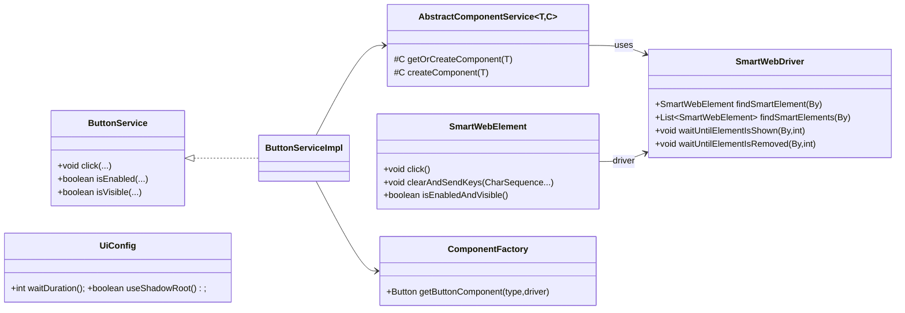
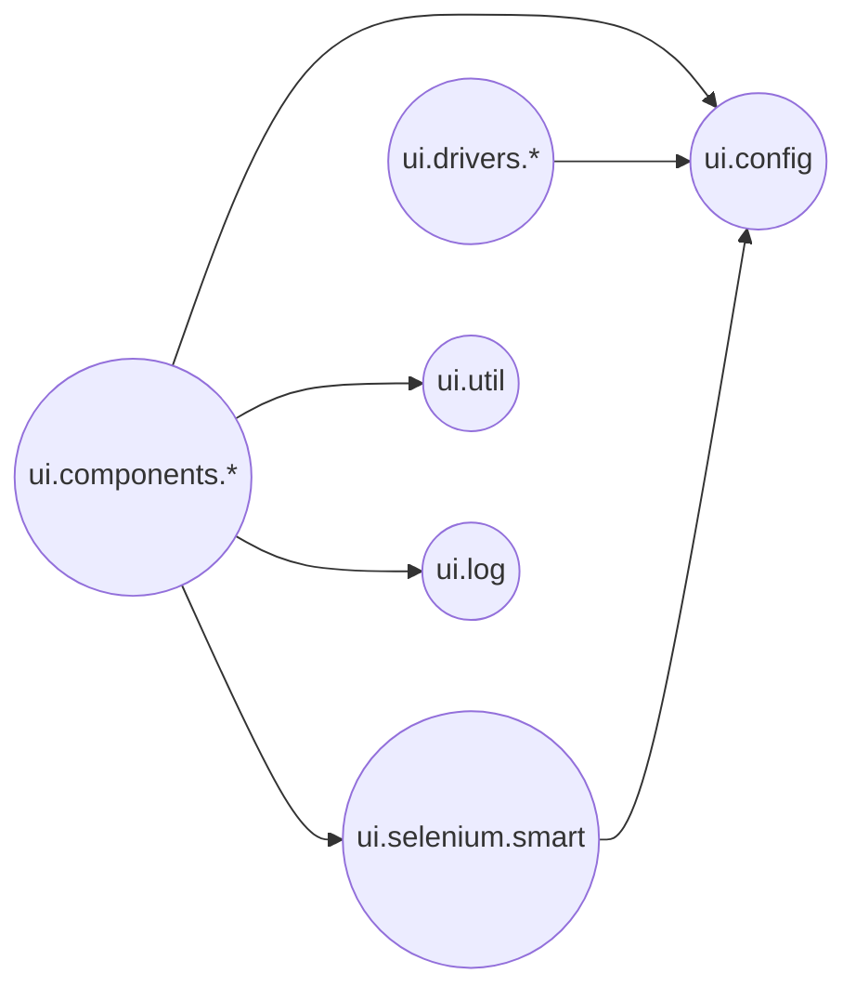
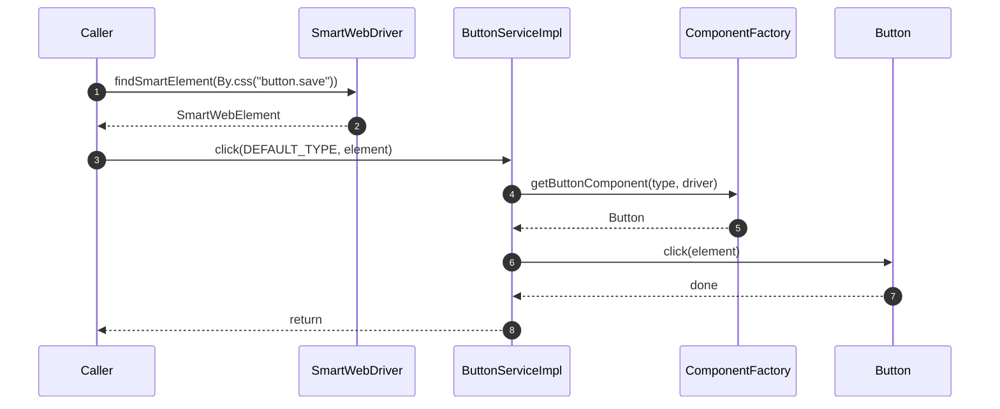

# ui-interactor

<!-- Quick jump -->
**Start here:** [Usage — Quick Start](#usage)

## Table of Contents
- [Overview](#overview)
- [Features](#features)
- [Structure](#structure)
  - [Key Classes](#key-classes)
  - [Package: `io.cyborgcode.roa.ui.selenium.smart`](#package-iocyborgcoderoauiseleniumsmart)
  - [Package: `io.cyborgcode.roa.ui.components.*`](#package-iocyborgcoderoauicomponents)
  - [Package: `io.cyborgcode.roa.ui.drivers`](#package-iocyborgcoderoauidrivers)
  - [Package: `io.cyborgcode.roa.ui.insertion`](#package-iocyborgcoderoauiinsertion)
  - [Package: `io.cyborgcode.roa.ui.config`](#package-iocyborgcoderoauiconfig)
- [Architecture](#architecture)
  - [Class Diagram](#class-diagram)
  - [Package Diagram](#package-diagram)
  - [Execution Flow](#execution-flow)
- [Usage](#usage)
  - [Step 1 — Driver Setup](#step-1--driver-setup)
  - [Step 2 — Component Services](#step-2--component-services)
  - [Step 3 — Basic UI Operations](#step-3--basic-ui-operations)
  - [Step 4 — Button Component](#step-4--button-component)
  - [Step 5 — Input Component](#step-5--input-component)
  - [Step 6 — Checkbox Component](#step-6--checkbox-component)
  - [Step 7 — Select Component](#step-7--select-component)
  - [Step 8 — Radio Component](#step-8--radio-component)
  - [Step 9 — Toggle Component](#step-9--toggle-component)
  - [Step 10 — Table Component](#step-10--table-component)
  - [Step 11 — Modal Component](#step-11--modal-component)
  - [Step 12 — Alert Component](#step-12--alert-component)
  - [Step 13 — Link Component](#step-13--link-component)
  - [Step 14 — Loader Component](#step-14--loader-component)
  - [Step 15 — Tab Component](#step-15--tab-component)
  - [Step 16 — Accordion Component](#step-16--accordion-component)
  - [Step 17 — List Component](#step-17--list-component)
  - [Step 18 — Insertion Pattern](#step-18--insertion-pattern)
- [Configuration](#configuration)
- [Extensibility](#extensibility)
- [Cross-module links](#cross-module-links)
- [Glossary](#glossary)
- [Dependencies](#dependencies)
- [Author](#author)

## Overview
The **ui-interactor** module provides a comprehensive Selenium-based UI automation framework built on Java 17+. It introduces `SmartWebDriver` and `SmartWebElement` as enhanced wrappers with configurable waits, exception handling strategies, and optional Shadow DOM support while preserving standard Selenium semantics.

UI widgets are modeled as pluggable components. Component services (e.g., `ButtonService`, `InputService`, `TableService`) delegate to concrete implementations resolved by `ComponentFactory` using configuration-driven defaults from `UiConfig`. The framework supports 17 component types including buttons, inputs, checkboxes, selects, radios, toggles, tables, modals, alerts, links, loaders, tabs, accordions, and lists.

Driver management is abstracted via `DriverProvider` implementations (Chrome, Firefox, Edge, Safari) with automatic driver download via WebDriverManager. The insertion pattern provides uniform data entry across components. Structured logging via `LogUi` surfaces actions and failures for observability.

The library is test-framework agnostic and designed to be embedded in adapters or test rings.

## Features
- **Smart Selenium wrappers** with automatic waits and exception recovery strategies
- **17 component types** with uniform service APIs and pluggable implementations
- **Table operations**: read rows, filter, sort, insert, validate with typed field mapping
- **Driver management**: abstracted via `DriverProvider` with automatic setup
- **Insertion pattern**: uniform data entry contract across all input components
- **Shadow DOM support** for modern web components
- **Owner-based configuration** via `UiConfig`/`UiConfigHolder` for all settings
- **Structured logging** via `LogUi` with step and error tracking
- **Extensible architecture**: add custom component types, drivers, or insertion strategies

## Structure

### Key Classes
| Class | Responsibility | Key methods | Used by |
|---|---|---|---|
| `SmartWebDriver` | Decorated `WebDriver` with waits/handling | `findSmartElement(By)`, `waitUntilElementIsShown(...)` | Services |
| `SmartWebElement` | Decorated `WebElement` interactions | `click()`, `clearAndSendKeys(...)`, `isEnabledAndVisible()` | Components |
| `UiConfig` | Owner-backed UI config | `waitDuration()`, `useShadowRoot()`, `browserType()` | All |
| `DriverProvider<T>` | Driver setup and instantiation | `createDriver(options)`, `setupDriver(version)` | Driver factories |
| `ComponentFactory` | Resolve concrete components | `getButtonComponent(...)`, `getInputComponent(...)` | Service impls |
| `TableService` | Table read/filter/sort/insert | `readTable(...)`, `filterTable(...)`, `insertRow(...)` | Callers |
| `Insertion` | Uniform data entry contract | `insertion(type, locator, values)` | All component services |

### Package: `io.cyborgcode.roa.ui.selenium.smart`
| Class | Responsibility | Key methods | Used by |
|---|---|---|---|
| `SmartWebDriver` | Wraps `WebDriver` with wait/handling/shadow | `findSmartElement(By)`, `waitUntilElementIsShown(By, int)` | Services |
| `SmartWebElement` | Wraps `WebElement` with waits | `click()`, `clearAndSendKeys(...)`, `isEnabledAndVisible()` | Components |
| `SmartWebElementInspector` | Inspect element properties | inspection helpers | Components |

### Package: `io.cyborgcode.roa.ui.components.*`
All component packages follow a uniform structure:
- **Service interface** (e.g., `ButtonService`): public API for component operations
- **ServiceImpl** (e.g., `ButtonServiceImpl`): delegates to component via factory
- **Component interface** (e.g., `Button`): contract for component implementations
- **ComponentType enum** (e.g., `ButtonComponentType`): type-safe variants

#### Components Summary
| Component | Service | Key operations |
|---|---|---|
| **button** | `ButtonService` | `click(...)`, `isEnabled(...)`, `isVisible(...)` |
| **input** | `InputService` | `insert(...)`, `clear(...)`, `getValue(...)`, `getErrorMessage(...)` |
| **checkbox** | `CheckboxService` | `select(...)`, `deSelect(...)`, `isSelected(...)`, `getSelected(...)` |
| **select** | `SelectService` | `select(...)`, `getSelected(...)`, `getOptions(...)` |
| **radio** | `RadioService` | `select(...)`, `isSelected(...)`, `getSelected(...)` |
| **toggle** | `ToggleService` | `toggle(...)`, `isEnabled(...)`, `isSelected(...)` |
| **table** | `TableService` | `readTable(...)`, `readRow(...)`, `insertRow(...)`, `filterTable(...)` |
| **modal** | `ModalService` | `isDisplayed(...)`, `close(...)`, `getTitle(...)` |
| **alert** | `AlertService` | `isDisplayed(...)`, `close(...)`, `getText(...)` |
| **link** | `LinkService` | `click(...)`, `getHref(...)`, `isEnabled(...)` |
| **loader** | `LoaderService` | `waitUntilLoaderDisappears(...)`, `isDisplayed(...)` |
| **tab** | `TabService` | `selectTab(...)`, `isSelected(...)`, `getSelectedTab(...)` |
| **accordion** | `AccordionService` | `expand(...)`, `collapse(...)`, `isExpanded(...)` |
| **list** | `ItemListService` | `getItems(...)`, `selectItem(...)`, `getSelectedItems(...)` |

### Package: `io.cyborgcode.roa.ui.drivers`
| Class | Responsibility | Key methods | Used by |
|---|---|---|---|
| `DriverProvider<T>` | Driver lifecycle contract | `createDriver(options)`, `setupDriver(version)` | Factories |
| `BaseDriverProvider` | Common driver logic | option application | Concrete providers |
| Chrome/Firefox/Edge/Safari providers | Browser-specific setup | browser-specific options | Driver creation |

### Package: `io.cyborgcode.roa.ui.insertion`
| Class | Responsibility | Key methods | Used by |
|---|---|---|---|
| `Insertion` | Data entry contract | `insertion(type, locator, values)` | All services |
| `InsertionService` | Registration and dispatch | service resolution | Components |
| `BaseInsertionService` | Base insertion logic | field-based insertion | Impls |
| `InsertionServiceRegistry` | Service registry | `register(...)`, `resolve(...)` | Factory |

### Package: `io.cyborgcode.roa.ui.config`
| Class | Responsibility | Key methods | Used by |
|---|---|---|---|
| `UiConfig` | Owner-backed configuration | All config keys with `@DefaultValue` | All |
| `UiConfigHolder` | Singleton config access | `getUiConfig()` | All |

### Other packages
- `io.cyborgcode.roa.ui.annotations` — `@HandleUiException`, `@InsertionField`, `@ImplementationOfType`
- `io.cyborgcode.roa.ui.selenium.*` — locating, handling, decorators, logging, listeners, shadowroot support
- `io.cyborgcode.roa.ui.components.table.*` — table annotations, filters, insertion, sorting, model, registry
- `io.cyborgcode.roa.ui.log` — `LogUi` for structured logging
- `io.cyborgcode.roa.ui.util` — helpers and strategies
- `io.cyborgcode.roa.ui.validator` — validation helpers

## Architecture

### Class Diagram


### Package Diagram


### Execution Flow


## Usage

### Step 1 — Driver Setup
```java
import io.cyborgcode.roa.ui.drivers.base.DriverProvider;
import io.cyborgcode.roa.ui.drivers.providers.ChromeDriverProvider;
import io.cyborgcode.roa.ui.selenium.smart.SmartWebDriver;
import org.openqa.selenium.WebDriver;
import org.openqa.selenium.chrome.ChromeOptions;

// Option A: Using DriverProvider (recommended)
DriverProvider<ChromeOptions> provider = new ChromeDriverProvider();
provider.setupDriver(""); // auto-download latest
ChromeOptions options = provider.createOptions();
provider.applyDefaultArguments(options);
if (getUiConfig().headless()) {
    provider.applyHeadlessArguments(options);
}
WebDriver webDriver = provider.createDriver(options);

// Option B: Direct WebDriver creation
WebDriver webDriver = new ChromeDriver();

// Wrap with SmartWebDriver
SmartWebDriver driver = new SmartWebDriver(webDriver);
```

### Step 2 — Component Services
```java
import io.cyborgcode.roa.ui.components.button.ButtonServiceImpl;
import io.cyborgcode.roa.ui.components.input.InputServiceImpl;
import io.cyborgcode.roa.ui.components.checkbox.CheckboxServiceImpl;
import io.cyborgcode.roa.ui.components.select.SelectServiceImpl;
import io.cyborgcode.roa.ui.components.table.service.TableServiceImpl;

// Initialize all component services
ButtonService buttons = new ButtonServiceImpl(driver);
InputService inputs = new InputServiceImpl(driver);
CheckboxService checkboxes = new CheckboxServiceImpl(driver);
SelectService selects = new SelectServiceImpl(driver);
RadioService radios = new RadioServiceImpl(driver);
ToggleService toggles = new ToggleServiceImpl(driver);
TableService tables = new TableServiceImpl(driver);
ModalService modals = new ModalServiceImpl(driver);
AlertService alerts = new AlertServiceImpl(driver);
LinkService links = new LinkServiceImpl(driver);
LoaderService loaders = new LoaderServiceImpl(driver);
TabService tabs = new TabServiceImpl(driver);
AccordionService accordions = new AccordionServiceImpl(driver);
ItemListService lists = new ItemListServiceImpl(driver);
```

### Step 3 — Basic UI Operations
```java
import org.openqa.selenium.By;

// Navigate
driver.get("https://app.example.com/login");

// Find single element
SmartWebElement loginBtn = driver.findSmartElement(By.id("login-btn"));

// Find multiple elements
List<SmartWebElement> rows = driver.findSmartElements(By.cssSelector("table tr"));

// Element actions
loginBtn.click();
loginBtn.doubleClick();
loginBtn.isEnabledAndVisible();

// Waits
driver.waitUntilElementIsShown(By.id("toast"), 5);
driver.waitUntilElementIsRemoved(By.id("loader"), 10);

// Check without exception
boolean ok = driver.checkNoException(() -> driver.findSmartElement(By.id("optional")));
```

### Step 4 — Button Component
```java
// Click by text
buttons.click("Save");
buttons.click("Submit");

// Click by locator
buttons.click(By.id("submit-btn"));

// Click inside container
SmartWebElement form = driver.findSmartElement(By.id("user-form"));
buttons.click(form, "Save");

// Check state
boolean enabled = buttons.isEnabled("Save");
boolean visible = buttons.isVisible(By.id("save-btn"));
```

### Step 5 — Input Component
```java
// Insert value by label
inputs.insert("Email", "user@example.com");
inputs.insert("Password", "secret123");

// Insert with container
SmartWebElement form = driver.findSmartElement(By.id("registration"));
inputs.insert(form, "First Name", "John");

// Insert by locator
inputs.insert(By.id("email-input"), "user@test.com");

// Get value
String email = inputs.getValue("Email");
String pwd = inputs.getValue(By.id("password"));

// Clear field
inputs.clear("Email");
inputs.clear(By.id("notes"));

// Check state
boolean enabled = inputs.isEnabled("Email");

// Get error message
String error = inputs.getErrorMessage("Email");
String error2 = inputs.getErrorMessage(form, "Password");
```

### Step 6 — Checkbox Component
```java
// Select single checkbox
checkboxes.select("Remember me");

// Select multiple
checkboxes.select("Terms", "Privacy Policy");

// Select with container
SmartWebElement form = driver.findSmartElement(By.id("preferences"));
checkboxes.select(form, "Email notifications", "SMS alerts");

// Select by locator
checkboxes.select(By.id("terms-checkbox"));

// Deselect
checkboxes.deSelect("Remember me");
checkboxes.deSelect(form, "Email notifications");

// Check state
boolean selected = checkboxes.isSelected("Remember me");
boolean allSelected = checkboxes.areSelected("Terms", "Privacy Policy");
boolean enabled = checkboxes.isEnabled("Remember me");

// Get selected items
List<String> selected = checkboxes.getSelected(form);

// Get all checkboxes
List<String> all = checkboxes.getAll(By.id("filter-container"));

// Select with strategy
import io.cyborgcode.roa.ui.util.strategy.Strategy;
checkboxes.select(form, Strategy.ALL);
checkboxes.select(form, Strategy.FIRST);
checkboxes.deSelect(form, Strategy.ALL);
```

### Step 7 — Select Component
```java
// Select by visible text
selects.select("Country", "United States");

// Select by value
selects.selectByValue("country-select", "US");

// Select by index
selects.selectByIndex(By.id("country"), 2);

// Select with container
SmartWebElement form = driver.findSmartElement(By.id("address-form"));
selects.select(form, "State", "California");

// Get selected option
String selected = selects.getSelected("Country");
String selected2 = selects.getSelected(By.id("country"));

// Get all options
List<String> options = selects.getOptions("Country");
List<String> options2 = selects.getOptions(form, "State");

// Check state
boolean enabled = selects.isEnabled("Country");
```

### Step 8 — Radio Component
```java
// Select radio button
radios.select("Male");
radios.select("Credit Card");

// Select with container
SmartWebElement form = driver.findSmartElement(By.id("payment-form"));
radios.select(form, "PayPal");

// Select by locator
radios.select(By.id("payment-credit"));

// Check state
boolean selected = radios.isSelected("Male");
boolean enabled = radios.isEnabled(form, "PayPal");

// Get selected radio
String selected = radios.getSelected(form);
String selected2 = radios.getSelected(By.cssSelector(".payment-options"));
```

### Step 9 — Toggle Component
```java
// Toggle on/off
toggles.toggle("Dark Mode");
toggles.toggle(By.id("notifications-toggle"));

// Toggle with container
SmartWebElement settings = driver.findSmartElement(By.id("settings"));
toggles.toggle(settings, "Auto-save");

// Check state
boolean enabled = toggles.isEnabled("Dark Mode");
boolean selected = toggles.isSelected("Auto-save");
```

### Step 10 — Table Component (Overview)
The table component provides comprehensive operations for reading, filtering, sorting, validating, and inserting data into HTML tables using typed row models.

#### Table Model Definition
```java
import io.cyborgcode.roa.ui.components.table.annotations.*;
import org.openqa.selenium.support.FindBy;

// Define table structure with @TableInfo
@TableInfo(
    tableContainerLocator = @FindBy(id = "users-table"),
    rowsLocator = @FindBy(css = "tbody tr"),
    headerRowLocator = @FindBy(css = "thead tr")
)
public class User {
    
    @TableCellLocator(findBy = @FindBy(css = "td:nth-child(1)"))
    private String id;
    
    @TableCellLocator(findBy = @FindBy(css = "td:nth-child(2)"))
    @CellInsertion(type = InputComponentType.class, componentType = "TEXT_INPUT", order = 1)
    @CellFilter(type = InputComponentType.class, componentType = "TEXT_INPUT")
    private String name;
    
    @TableCellLocator(findBy = @FindBy(css = "td:nth-child(3)"))
    @CellInsertion(type = InputComponentType.class, componentType = "EMAIL_INPUT", order = 2)
    @CellFilter(type = InputComponentType.class, componentType = "TEXT_INPUT")
    private String email;
    
    @TableCellLocator(findBy = @FindBy(css = "td:nth-child(4)"))
    @CellInsertion(type = SelectComponentType.class, componentType = "DROPDOWN", order = 3)
    @CellFilter(type = SelectComponentType.class, componentType = "DROPDOWN")
    private String status;
    
    @TableCellLocator(findBy = @FindBy(css = "td:nth-child(5) input[type='checkbox']"))
    @CellInsertion(type = CheckboxComponentType.class, componentType = "STANDARD_CHECKBOX", order = 4)
    private Boolean active;
    
    @TableCellLocator(findBy = @FindBy(css = "td:nth-child(6) button.edit"))
    @CellInsertion(type = ButtonComponentType.class, componentType = "ACTION_BUTTON", order = 5)
    private String actions;
    
    // Constructor, getters, setters
    public User() {}
    
    public User(String id, String name, String email, String status, Boolean active) {
        this.id = id;
        this.name = name;
        this.email = email;
        this.status = status;
        this.active = active;
    }
    
    // Getters and setters...
}
```

#### Reading Table Data
```java
// Read entire table
List<User> allUsers = tables.readTable(User.class);

// Read specific row range (1-indexed)
List<User> page1 = tables.readTable(1, 10, User.class);  // rows 1-10
List<User> page2 = tables.readTable(11, 20, User.class); // rows 11-20

// Read single row by index
User fifthUser = tables.readRow(5, User.class);

// Read row by search criteria (matches any column)
User found = tables.readRow(Arrays.asList("john@example.com"), User.class);

// Read with specific fields only using TableField
TableField<User> nameField = TableField.of(User::setName);
TableField<User> emailField = TableField.of(User::setEmail);
TableField<User> statusField = TableField.of(User::setStatus);

List<User> partial = tables.readTable(User.class, nameField, emailField, statusField);

// Read specific row with selected fields
User partialUser = tables.readRow(5, User.class, nameField, emailField);

// Read by search with selected fields
User foundPartial = tables.readRow(
    Arrays.asList("john@example.com"), 
    User.class, 
    nameField, 
    statusField
);
```

#### Inserting Data into Tables
```java
// Insert into entire row (uses @CellInsertion annotations)
User newUser = new User(null, "Jane Doe", "jane@example.com", "Active", true);
tables.insertCellValue(1, User.class, newUser);

// Insert into specific cell by field
TableField<User> nameField = TableField.of(User::setName);
tables.insertCellValue(1, User.class, nameField, "John Smith");

// Insert into cell with index (for repeated fields)
TableField<User> actionsField = TableField.of(User::setActions);
tables.insertCellValue(1, User.class, actionsField, 2, "Edit");

// Insert by search criteria
tables.insertCellValue(
    Arrays.asList("jane@example.com"), 
    User.class, 
    nameField, 
    "Jane Updated"
);

// Insert entire row by search
User updatedUser = new User(null, "Jane Smith", "jane.smith@example.com", "Inactive", false);
tables.insertCellValue(Arrays.asList("jane@example.com"), User.class, updatedUser);
```

#### Filtering Tables
```java
// Filter using TableField
TableField<User> statusField = TableField.of(User::setStatus);
tables.filterTable(User.class, statusField, FilterStrategy.SELECT_ONLY, "Active", "Pending");

// Multiple filters
tables.filterTable(User.class, statusField, FilterStrategy.SELECT_ONLY, "Active");
TableField<User> nameField = TableField.of(User::setName);
tables.filterTable(User.class, nameField, FilterStrategy.SELECT_ONLY, "John", "Jane");

// Unselect all
tables.filterTable(User.class, statusField, FilterStrategy.UNSELECT_ALL);
```

#### Sorting Tables
```java
import io.cyborgcode.roa.ui.components.table.sort.SortingStrategy;

// Sort ascending
TableField<User> nameField = TableField.of(User::setName);
tables.sortTable(User.class, nameField, SortingStrategy.ASCENDING);

// Sort descending
TableField<User> emailField = TableField.of(User::setEmail);
tables.sortTable(User.class, emailField, SortingStrategy.DESCENDING);
```

#### Validating Tables
```java
import io.cyborgcode.roa.validator.core.Assertion;
import io.cyborgcode.roa.validator.core.AssertionResult;
import io.cyborgcode.roa.validator.enums.AssertionType;
import io.cyborgcode.roa.validator.enums.Target;

// Read table and validate
List<User> users = tables.readTable(User.class);

Assertion[] assertions = new Assertion[] {
    Assertion.builder()
        .target(Target.COLLECTION)
        .type(AssertionType.SIZE_GREATER_THAN)
        .expected(0)
        .build(),
    Assertion.builder()
        .target(Target.OBJECT)
        .key("status")
        .type(AssertionType.EQUALS)
        .expected("Active")
        .build()
};

List<AssertionResult<?>> results = tables.validate(users, assertions);

// Check validation results
boolean allPassed = results.stream().allMatch(AssertionResult::isPassed);
results.forEach(result -> {
    if (!result.isPassed()) {
        System.out.println("Validation failed: " + result.getMessage());
    }
});
```

#### Table Annotations Reference

**@TableInfo** (Class-level)
- Defines table structure with container, rows, and header locators
- Required for all table models

**@TableCellLocator** (Field-level)
- Specifies how to locate a cell within a row
- Uses Selenium `@FindBy` annotation

**@CellInsertion** (Field-level)
- Enables automatic insertion into cells
- Attributes: `type()`, `componentType()`, `order()`
- Order determines execution sequence for multiple insertions

**@CellFilter** (Field-level)
- Enables filtering on a column
- Attributes: `type()`, `componentType()`

**@CustomCellInsertion** / **@CustomCellFilter** (Field-level)
- For custom component implementations

### Step 11 — Modal Component
```java
// Check if modal is displayed
boolean visible = modals.isDisplayed("Confirmation");
boolean visible2 = modals.isDisplayed(By.id("delete-modal"));

// Get modal title
String title = modals.getTitle("Confirmation");

// Get modal content
String content = modals.getContent(By.id("alert-modal"));

// Close modal
modals.close("Confirmation");
modals.close(By.cssSelector(".modal.active"));

// Click button in modal
SmartWebElement modal = driver.findSmartElement(By.id("confirm-modal"));
buttons.click(modal, "Confirm");
```

### Step 12 — Alert Component
```java
// Check if alert is displayed
boolean visible = alerts.isDisplayed("Success");
boolean visible2 = alerts.isDisplayed(By.cssSelector(".alert.success"));

// Get alert text
String text = alerts.getText("Error");
String text2 = alerts.getText(By.id("validation-alert"));

// Close alert
alerts.close("Success");
alerts.close(By.cssSelector(".alert.closable"));

// Wait for alert to appear
alerts.waitUntilDisplayed("Processing", 10);
```

### Step 13 — Link Component
```java
// Click link by text
links.click("Privacy Policy");
links.click("Terms of Service");

// Click by locator
links.click(By.id("help-link"));

// Click with container
SmartWebElement footer = driver.findSmartElement(By.tagName("footer"));
links.click(footer, "Contact Us");

// Get href
String href = links.getHref("Privacy Policy");
String href2 = links.getHref(By.id("help-link"));

// Check state
boolean enabled = links.isEnabled("Privacy Policy");
boolean visible = links.isVisible(footer, "Contact Us");
```

### Step 14 — Loader Component
```java
// Wait until loader disappears
loaders.waitUntilLoaderDisappears(10);
loaders.waitUntilLoaderDisappears(By.id("spinner"), 15);

// Check if loader is displayed
boolean loading = loaders.isDisplayed();
boolean loading2 = loaders.isDisplayed(By.cssSelector(".loading-spinner"));
```

### Step 15 — Tab Component
```java
// Select tab by name
tabs.selectTab("Profile");
tabs.selectTab("Settings");

// Select with container
SmartWebElement tabContainer = driver.findSmartElement(By.id("main-tabs"));
tabs.selectTab(tabContainer, "Notifications");

// Select by locator
tabs.selectTab(By.id("tab-profile"));

// Check if tab is selected
boolean selected = tabs.isSelected("Profile");
boolean selected2 = tabs.isSelected(tabContainer, "Settings");

// Get selected tab
String activeTab = tabs.getSelectedTab(tabContainer);

// Get all tabs
List<String> allTabs = tabs.getTabs(By.id("main-tabs"));
```

### Step 16 — Accordion Component
```java
// Expand accordion section
accordions.expand("Personal Information");
accordions.expand(By.id("section-payment"));

// Expand with container
SmartWebElement container = driver.findSmartElement(By.id("faq"));
accordions.expand(container, "Shipping");

// Collapse section
accordions.collapse("Personal Information");
accordions.collapse(container, "Shipping");

// Check if expanded
boolean expanded = accordions.isExpanded("Personal Information");
boolean expanded2 = accordions.isExpanded(By.id("section-payment"));

// Toggle section
accordions.toggle("Billing");
```

### Step 17 — List Component
```java
// Get all items
List<String> items = lists.getItems(By.id("product-list"));

// Get items with container
SmartWebElement container = driver.findSmartElement(By.id("sidebar"));
List<String> navItems = lists.getItems(container);

// Select item
lists.selectItem("Dashboard");
lists.selectItem(container, "Reports");
lists.selectItem(By.cssSelector(".menu-item[data-id='3']"));

// Get selected items
List<String> selected = lists.getSelectedItems(By.id("selected-filters"));

// Get item count
int count = lists.getItemCount(container);
```

### Step 18 — Insertion Pattern
```java
import io.cyborgcode.roa.ui.insertion.Insertion;
import io.cyborgcode.roa.ui.components.base.ComponentType;

// All component services implement Insertion interface
// Use insertion() for dynamic component interactions

// Insert into input field
inputs.insertion(InputComponentType.DEFAULT_TYPE, By.id("email"), "user@test.com");

// Select checkbox via insertion
checkboxes.insertion(CheckboxComponentType.DEFAULT_TYPE, By.id("terms"), true);

// Select dropdown via insertion
selects.insertion(SelectComponentType.DEFAULT_TYPE, By.id("country"), "United States");

// Custom insertion service registration
InsertionService customService = new MyCustomInsertionService(driver);
InsertionServiceRegistry.register(MyComponentType.class, customService);

// Table insertion (insert values into table cells)
buttons.tableInsertion(cellElement, ButtonComponentType.DEFAULT_TYPE);
inputs.tableInsertion(cellElement, InputComponentType.DEFAULT_TYPE, "New Value");
checkboxes.tableInsertion(cellElement, CheckboxComponentType.DEFAULT_TYPE, "true");
```

### Error Handling and Logging
```java
import io.cyborgcode.roa.ui.log.LogUi;

// All component operations are automatically logged via LogUi
// Example log output:
// [UI] Clicking button: Save
// [UI] Inserting value into input: Email
// [UI] Selecting checkbox: Terms

// Exception handling is automatic for known Selenium errors
// Custom handlers can be registered via @HandleUiException annotation

// Manual logging
LogUi.info("Starting user registration flow");
LogUi.step("Filling registration form");
LogUi.warn("Optional field left empty: Middle Name");
LogUi.error("Validation failed for email field");
```

### Shadow DOM Support
```java
// Enable Shadow DOM in configuration
// Set use.shadow.root=true in ui-config.properties

// All find operations automatically support Shadow DOM when enabled
SmartWebElement shadowElement = driver.findSmartElement(By.cssSelector("custom-component"));
SmartWebElement nestedElement = shadowElement.findSmartElement(By.cssSelector(".inner"));

// Component services work transparently with Shadow DOM
buttons.click("Save"); // Works inside shadow roots
inputs.insert("Email", "user@test.com"); // Works inside shadow roots
```

---

## Advanced Topics

### Selenium Package Deep Dive

#### SmartFinder — Element Location Strategies
The `SmartFinder` utility provides unified element location with automatic Shadow DOM handling.

```java
import io.cyborgcode.roa.ui.selenium.locating.SmartFinder;

// Find without wrapping (no waits)
SmartWebElement element = SmartFinder.findElementNoWrap(driver, By.id("btn"));

// Find with standard waits
SmartWebElement element = SmartFinder.findElementNormally(
    driver, 
    By.id("btn"),
    wait -> wait.accept(ExpectedConditions.presenceOfElementLocated(By.id("btn")))
);

// Find in Shadow DOM (automatic when use.shadow.root=true)
SmartWebElement shadowElement = SmartFinder.findElementWithShadowRootDriver(
    smartDriver,
    By.cssSelector("custom-element"),
    waitFunction,
    5000L // optional wait in millis
);

// Find nested shadow elements
SmartWebElement nested = SmartFinder.findElementWithShadowRootElement(
    parentElement,
    By.cssSelector(".nested"),
    waitFunction
);

// Find multiple elements
List<SmartWebElement> elements = SmartFinder.findElementsNormally(
    driver,
    By.cssSelector(".item"),
    waitFunction
);
```

#### Exception Handling — Automatic Recovery
The framework provides automatic exception handling for common Selenium failures.

**Handled Exceptions:**
- `StaleElementReferenceException` — Re-locates element and retries operation
- `ElementClickInterceptedException` — Scrolls to element and retries
- `ElementNotInteractableException` — Waits for element to become interactable
- `NoSuchElementException` — Logs detailed error with locator information

```java
import io.cyborgcode.roa.ui.selenium.handling.ExceptionHandlingWebElement;
import io.cyborgcode.roa.ui.selenium.handling.ExceptionHandlingWebDriver;

// Exception handling is automatic in SmartWebElement/SmartWebDriver
// Custom handlers can be added by extending ExceptionHandlingWebElementFunctions

// Example: Custom stale element handling
public class CustomExceptionHandler {
    public static SmartWebElement handleStaleElement(
        WebDriver driver,
        SmartWebElement staleElement,
        WebElementAction action,
        Object... params
    ) {
        // Custom recovery logic
        LogUi.warn("Handling stale element for action: " + action);
        // Re-locate and return fresh element
        return driver.findSmartElement((By) params[0]);
    }
}
```

#### WebElement Decorators
```java
import io.cyborgcode.roa.ui.selenium.decorators.WebElementDecorator;
import io.cyborgcode.roa.ui.selenium.decorators.WebDriverDecorator;

// SmartWebElement extends WebElementDecorator
// All standard WebElement methods are available plus enhanced ones

SmartWebElement element = driver.findSmartElement(By.id("input"));

// Standard Selenium methods (enhanced with waits)
element.click();
element.sendKeys("text");
element.clear();
element.submit();
element.getText();
element.getAttribute("value");
element.isDisplayed();
element.isEnabled();
element.isSelected();

// Enhanced methods
element.clearAndSendKeys("new text"); // Clear then type
element.doubleClick(); // Double-click action
element.isEnabledAndVisible(); // Combined state check
element.waitUntilAttributeValueIsChanged("class", "old-class"); // Wait for attribute change

// Access original WebElement if needed
WebElement original = element.getOriginal();
```

#### Selenium Logging
```java
import io.cyborgcode.roa.ui.selenium.logging.SeleniumLogger;

// All SmartWebDriver/SmartWebElement operations are automatically logged
// Example log output:
// [UI] Finding element: By.id: login-btn
// [UI] Clicking element: By.id: login-btn
// [UI] Sending keys to element: By.id: email-input
// [UI] Element not found after 10 seconds: By.id: missing-element

// Selenium event listeners can be registered
import io.cyborgcode.roa.ui.selenium.listeners.CustomEventListener;
// Listeners are automatically registered in SmartWebDriver
```

#### Shadow Root Utilities
```java
import io.cyborgcode.roa.ui.selenium.shadowroot.ShadowDomUtils;

// Shadow DOM utilities (used internally by SmartFinder)
// Manual shadow root access
WebElement shadowHost = driver.findElement(By.cssSelector("custom-component"));
SearchContext shadowRoot = ShadowDomUtils.getShadowRoot(driver, shadowHost);
WebElement shadowChild = shadowRoot.findElement(By.cssSelector(".inner-element"));

// Deep shadow piercing (multiple levels)
SmartWebElement deepElement = driver.findSmartElement(
    By.cssSelector("outer-component::shadow inner-component::shadow button")
);
```

### Util Package — Helper Utilities

#### Strategy Pattern for Component Selection
```java
import io.cyborgcode.roa.ui.util.strategy.Strategy;

// Use Strategy enum for dynamic selection in checkboxes, lists, etc.

// Select random checkbox
checkboxes.select(container, Strategy.RANDOM);

// Select first item
lists.selectItem(container, Strategy.FIRST);

// Select last radio button
radios.select(container, Strategy.LAST);

// Select all checkboxes
checkboxes.select(container, Strategy.ALL);
```

#### Functional Interfaces for Table Operations
```java
import io.cyborgcode.roa.ui.util.BiConsumer;
import io.cyborgcode.roa.ui.util.BiFunction;
import io.cyborgcode.roa.ui.util.TriConsumer;
import io.cyborgcode.roa.ui.util.TriFunction;
import io.cyborgcode.roa.ui.util.FourConsumer;
import io.cyborgcode.roa.ui.util.FourFunction;

// These functional interfaces support multiple parameters for complex operations
// Used internally by table component for field mapping

// BiConsumer<T, U> - 2 parameters, no return
BiConsumer<User, String> nameSetter = (user, name) -> user.setName(name);

// TriFunction<T, U, V, R> - 3 parameters, returns R
TriFunction<String, Integer, Boolean, User> userFactory = 
    (name, age, active) -> new User(name, age, active);

// FourFunction<T, U, V, W, R> - 4 parameters, returns R
// Used for complex exception handling
FourFunction<WebDriver, SmartWebElement, Exception, Object[], SmartWebElement> handler =
    (driver, element, ex, params) -> handleException(driver, element, ex, params);
```

#### Table Utilities
```java
import io.cyborgcode.roa.ui.util.table.TableUtils;

// Utility methods for table operations (used internally)
// Available for custom table implementations

// Extract cell locator from field annotation
FindBy cellLocator = TableUtils.getCellLocator(field);

// Get insertion order for field
int order = TableUtils.getInsertionOrder(field);

// Check if field has filter annotation
boolean filterable = TableUtils.isFilterable(field);

// Get component type for field
ComponentType type = TableUtils.getComponentType(field);
```

### Advanced Driver Configuration

#### Custom Driver Options
```java
import io.cyborgcode.roa.ui.drivers.base.DriverProvider;
import io.cyborgcode.roa.ui.drivers.providers.ChromeDriverProvider;
import org.openqa.selenium.chrome.ChromeOptions;

DriverProvider<ChromeOptions> provider = new ChromeDriverProvider();

// Create custom options
ChromeOptions options = provider.createOptions();

// Apply default arguments (window size, disable notifications, etc.)
provider.applyDefaultArguments(options);

// Add custom arguments
options.addArguments("--start-maximized");
options.addArguments("--disable-gpu");
options.addArguments("--no-sandbox");
options.addArguments("--disable-dev-shm-usage");

// Set capabilities
options.setCapability("acceptInsecureCerts", true);

// Set preferences
Map<String, Object> prefs = new HashMap<>();
prefs.put("download.default_directory", "/path/to/downloads");
prefs.put("profile.default_content_settings.popups", 0);
options.setExperimentalOption("prefs", prefs);

// Enable headless mode if needed
if (getUiConfig().headless()) {
    provider.applyHeadlessArguments(options);
}

// Create driver with custom options
WebDriver webDriver = provider.createDriver(options);
SmartWebDriver driver = new SmartWebDriver(webDriver);
```

#### Remote Driver (Selenium Grid)
```java
// Configure remote driver URL in ui-config.properties
// remote.driver.url=http://localhost:4444/wd/hub

import org.openqa.selenium.remote.RemoteWebDriver;

if (!getUiConfig().remoteDriverUrl().isEmpty()) {
    ChromeOptions options = new ChromeOptions();
    provider.applyDefaultArguments(options);
    
    WebDriver remoteDriver = new RemoteWebDriver(
        new URL(getUiConfig().remoteDriverUrl()),
        options
    );
    
    SmartWebDriver driver = new SmartWebDriver(remoteDriver);
}
```

#### Driver Session Management
```java
// Keep driver for entire session
driver.setKeepDriverForSession(true);

// Close after test
if (!driver.isKeepDriverForSession()) {
    driver.quit();
}

// Driver lifecycle with try-with-resources
try (SmartWebDriver driver = new SmartWebDriver(webDriver)) {
    // Test operations
    driver.get("https://example.com");
    // Driver automatically closed
}
```

### Performance Optimization

#### Minimize Element Lookups
```java
// Bad: Multiple lookups
driver.findSmartElement(By.id("form")).findSmartElement(By.id("name")).sendKeys("John");
driver.findSmartElement(By.id("form")).findSmartElement(By.id("email")).sendKeys("john@example.com");

// Good: Cache container
SmartWebElement form = driver.findSmartElement(By.id("form"));
form.findSmartElement(By.id("name")).sendKeys("John");
form.findSmartElement(By.id("email")).sendKeys("john@example.com");
```

#### Disable Wrapping for Simple Operations
```java
// For simple, non-critical operations, disable wrapping
// Set use.wrap.selenium.function=false in config

// Or use NoWrap methods directly
SmartWebElement element = SmartFinder.findElementNoWrap(driver, By.id("simple-btn"));
element.getOriginal().click(); // Direct Selenium call, no waits
```

#### Batch Element Operations
```java
// Read multiple elements at once
List<SmartWebElement> rows = driver.findSmartElements(By.cssSelector("table tr"));

// Process in parallel if operations are independent
rows.parallelStream().forEach(row -> {
    String text = row.getText();
    // Process row
});
```

### Troubleshooting

#### Enable Debug Logging
```java
import io.cyborgcode.roa.ui.log.LogUi;

// Set logging level in configuration or programmatically
LogUi.setDebugMode(true);

// Detailed logs will show:
// - Element location strategies
// - Wait conditions applied
// - Exception recovery attempts
// - Shadow DOM traversal paths
```

#### Common Issues and Solutions

**Issue: StaleElementReferenceException persists**
```java
// Solution: Increase wait duration
// Set wait.duration.in.seconds=15 in config

// Or use element re-location
By locator = By.id("dynamic-element");
SmartWebElement element = driver.findSmartElement(locator);
// If stale, framework auto re-locates using the same By locator
```

**Issue: Element not interactable**
```java
// Solution: Explicit wait for element state
driver.waitUntilElementIsShown(By.id("element"), 10);
SmartWebElement element = driver.findSmartElement(By.id("element"));
element.isEnabledAndVisible(); // Verify state before action
element.click();
```

**Issue: Shadow DOM elements not found**
```java
// Solution: Enable Shadow DOM support
// Set use.shadow.root=true in ui-config.properties

// Verify shadow host and child selectors
SmartWebElement shadowHost = driver.findSmartElement(By.cssSelector("custom-component"));
SmartWebElement shadowChild = shadowHost.findSmartElement(By.cssSelector(".inner"));
```

**Issue: Slow table operations**
```java
// Solution: Read with specific fields only
TableField<User> nameField = TableField.of(User::setName);
TableField<User> emailField = TableField.of(User::setEmail);
List<User> users = tables.readTable(User.class, nameField, emailField);
// Faster than reading all fields
```

## Configuration
| Key | Source (Owner) | Default | Example |
|---|---|---|---|
| `browser.type` | Owner | `CHROME` | `-Dbrowser.type=FIREFOX` |
| `browser.version` | Owner | `` (empty) | `-Dbrowser.version=114.0` |
| `headless` | Owner | `false` | `-Dheadless=true` |
| `remote.driver.url` | Owner | `` (empty) | `-Dremote.driver.url=http://localhost:4444/wd/hub` |
| `wait.duration.in.seconds` | Owner | — | `-Dwait.duration.in.seconds=10` |
| `project.package` | Owner | — | `-Dproject.package=io.cyborgcode` |
| `input.default.type` | Owner | — | class name of enum constant |
| `button.default.type` | Owner | — | class name of enum constant |
| `checkbox.default.type` | Owner | — | class name of enum constant |
| `toggle.default.type` | Owner | — | class name of enum constant |
| `radio.default.type` | Owner | — | class name of enum constant |
| `select.default.type` | Owner | — | class name of enum constant |
| `list.default.type` | Owner | — | class name of enum constant |
| `loader.default.type` | Owner | — | class name of enum constant |
| `link.default.type` | Owner | — | class name of enum constant |
| `alert.default.type` | Owner | — | class name of enum constant |
| `tab.default.type` | Owner | — | class name of enum constant |
| `modal.default.type` | Owner | — | class name of enum constant |
| `accordion.default.type` | Owner | — | class name of enum constant |
| `ui.base.url` | Owner | — | `-Dui.base.url=https://app.example.com` |
| `table.default.type` | Owner | — | class name of enum constant |
| `use.wrap.selenium.function` | Owner | `true` | `-Duse.wrap.selenium.function=false` |
| `use.shadow.root` | Owner | `false` | `-Duse.shadow.root=true` |

## Extensibility
- Add a new component type: create an enum implementing `ComponentType` and a component class
  with the contract used by the service (e.g., `Button`). Register resolution in `ComponentFactory`.
- Create a new service: extend `AbstractComponentService<T,C>`, implement `createComponent(T)` and
  expose a minimal API interface similar to `ButtonService`.
- Customize Selenium behavior: toggle `UiConfig.useShadowRoot()` or `UiConfig.useWrappedSeleniumFunctions()`.

## Cross-module links
- Used by `ui-interactor-test-framework-adapter/` to expose fluent UI rings for `test-framework`.
  See `ui-interactor-test-framework-adapter/README.md` and `test-framework/README.md`.

## Glossary
- **SmartWebDriver**: Decorated `WebDriver` with built-in waits, exception strategies, and Shadow DOM support.
- **SmartWebElement**: Decorated `WebElement` adding robust actions and element discovery helpers.
- **Component Service**: A service that delegates to UI component implementations resolved by `ComponentFactory`.

## Dependencies
- `org.seleniumhq.selenium:selenium-java`
- `org.projectlombok:lombok`
- `org.aeonbits.owner:owner`
- `io.github.bonigarcia:webdrivermanager`
- `io.cyborgcode.utilities:commons`
- `io.cyborgcode.roa:assertions`
- `org.mockito:mockito-core`
- `com.github.spotbugs:spotbugs-annotations`
- `org.junit.jupiter:junit-jupiter` (tests)

## Author
**Cyborg Code Syndicate 💍👨💻**
